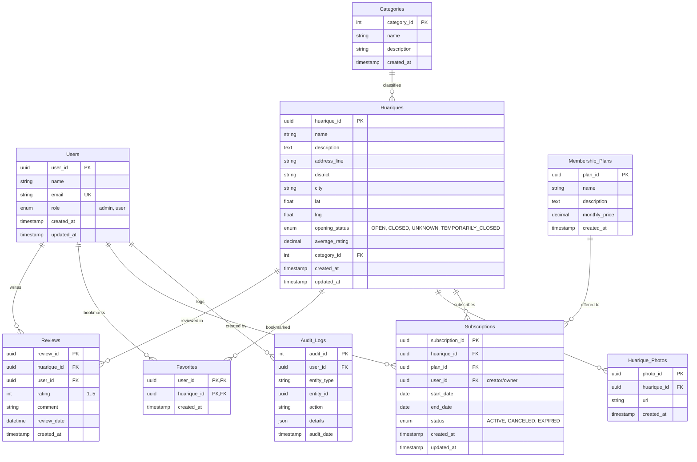
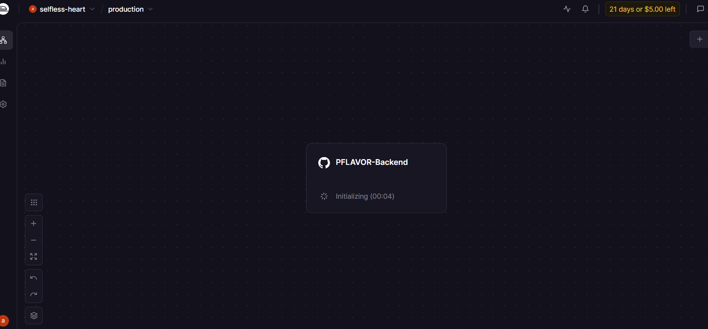

    </img>  
    <strong>Universidad Peruana de Ciencias Aplicadas</strong>  
    <strong>Ingeniería de Software</strong>  
    <strong>Ciclo 202610</strong>  
    <strong>Diseño de Experimentos de Ingeniería de Software</strong>  
    <strong>NRC: 17821</strong>  
    <strong>Sección: 1ASI0732</strong>  
    <strong>Profesor: Lennin Percy Cenas Vasquez</strong>  
    <strong>Informe de Trabajo Final</strong>  
    <strong>Startup: Point Flavor</strong>  
    <strong>Producto: PuntoSabor</strong>  

<table align="center" border="1" cellpadding="6" cellspacing="0" style="border-collapse:collapse; width:60%; margin:auto; font-size:11px;">
  <thead>
    <tr>
      <th style="text-align:center;">Código</th>
      <th style="text-align:center;">Apellidos y Nombres</th>
    </tr>
  </thead>
  <tbody>
    <tr>
      <td style="text-align:center;">U202318049</td>
      <td>Goñe Araccata, Esther Abigail</td>
    </tr>
    <tr>
      <td style="text-align:center;">U20221C726</td>
      <td>Hancco Poma, Keyner Iván</td>
    </tr>
    <tr>
      <td style="text-align:center;">U202317362</td>
      <td>Santiago Peña, Andreow Jomark</td>
    </tr>
    <tr>
      <td style="text-align:center;">U202224602</td>
      <td>Sulca Silva, Melisa Geraldine</td>
    </tr>
    <tr>
      <td style="text-align:center;">U20241C134</td>
      <td>Tumi Oliden, Manuel Ignacio</td>
    </tr>
  </tbody>
</table>

     <strong>Abril 2026</strong>

---

# Registro de Versiones del Informe

<table border="1" cellpadding="6" cellspacing="0" style="border-collapse:collapse; width:100%; font-size:11px;">
  <thead>
    <tr>
      <th>Versión</th>
      <th>Fecha</th>
      <th>Autor(es)</th>
      <th>Descripción de modificación</th>
    </tr>
  </thead>
  <tbody>
    <tr>
      <td>1.0 (AV1)</td>
      <td>22/04/2026</td>
      <td>
        Goñe Araccata, Esther Abigail  
        Hancco Poma, Keyner Iván  
        Santiago Peña, Andreow Jomark  
        Sulca Silva, Melisa Geraldine  
        Tumi Oliden, Manuel Ignacio
      </td>
      <td>Capítulo I: Startup Profile (Descripción de la Startup y perfiles del equipo), Solution Profile (Perfil de la solución), Lean UX Problem Statements (Definición de problemas), Lean UX Assumptions (Identificación de suposiciones), Lean UX Hypothesis Statements (Formulación de hipótesis), Lean UX Canvas (Canvas del proceso Lean UX), Segmentos Objetivo (Definición del público meta).</td>
    </tr>
    <tr>
      <td>1.1 (AV1)</td>
      <td>24/04/2026</td>
      <td>
        Goñe Araccata, Esther Abigail  
        Hancco Poma, Keyner Iván  
        Santiago Peña, Andreow Jomark  
        Sulca Silva, Melisa Geraldine  
        Tumi Oliden, Manuel Ignacio
      </td>
      <td>Capítulo II: Análisis Competitivo (Estudio del mercado y competidores), Estrategias frente a Competidores (Diferenciación y posicionamiento), Diseño de Entrevistas (Guía de preguntas por segmento), Registro de Entrevistas (Documentación de entrevistas realizadas), Análisis de Entrevistas (Hallazgos por segmento), User Personas (Perfiles representativos), User Task Matrix (Matriz de tareas por perfil), User Journey Mapping (Recorrido del usuario), Empathy Mapping (Mapa de empatía), As-is Scenario Mapping (Escenario actual), Ubiquitous Language (Glosario del dominio).</td>
    </tr>
    <tr>
      <td>1.2 (AV1)</td>
      <td>26/04/2026</td>
      <td>
        Goñe Araccata, Esther Abigail  
        Hancco Poma, Keyner Iván  
        Santiago Peña, Andreow Jomark  
        Sulca Silva, Melisa Geraldine  
        Tumi Oliden, Manuel Ignacio
      </td>
      <td>Capítulo III: To-Be Scenario Mapping (Escenario deseado), User Stories (Historias de usuario), Product Backlog (Backlog priorizado), Impact Mapping (Mapa de impacto). Capítulo IV: Style Guidelines (Lineamientos de diseño), Information Architecture (Arquitectura de información), Landing Page UI Design (Diseño de la landing page), Web Applications UX/UI Design (Diseño de la aplicación web), Web Applications Prototyping (Prototipo de la aplicación web), Domain-Driven Software Architecture (Arquitectura de software), Software Object-Oriented Design (Diseño orientado a objetos), Database Design (Diseño de base de datos).</td>
    </tr>
    <tr>
      <td>1.3 (AV1)</td>
      <td>29/04/2026</td>
      <td>
        Goñe Araccata, Esther Abigail  
        Hancco Poma, Keyner Iván  
        Santiago Peña, Andreow Jomark  
        Sulca Silva, Melisa Geraldine  
        Tumi Oliden, Manuel Ignacio
      </td>
      <td>Capítulo V: Software Configuration Management (Gestión de configuración), Sprint Backlogs (Backlogs por sprint), Implemented Landing Page Evidence (Evidencia del landing page), Implemented Frontend-Web Application Evidence (Evidencia del frontend), Acuerdo de Servicio SaaS (Modelo de servicio), Implemented RESTful API Evidence (Evidencia del backend), RESTful API Documentation (Documentación de la API), Team Collaboration Insights (Métricas de colaboración).</td>
    </tr>
    <tr>
      <td>1.4 (AV1)</td>
      <td>01/05/2026</td>
      <td>
        Goñe Araccata, Esther Abigail  
        Hancco Poma, Keyner Iván  
        Santiago Peña, Andreow Jomark  
        Sulca Silva, Melisa Geraldine  
        Tumi Oliden, Manuel Ignacio
      </td>
      <td>Correcciones y mejoras generales sobre todos los capítulos anteriores, Video About-the-Product (Video del producto).</td>
    </tr>
  </tbody>
</table>

---

# Project Report Collaboration Insights

Repositorio donde se encuentra el **Project Report**: [https://github.com/UPC-1ASI0732-2610-17821-PointFlavor/PFLAVOR-Report.git](https://github.com/UPC-1ASI0732-2610-17821-PointFlavor/PFLAVOR-Report.git)

FOTO

Utilizamos Google Docs como herramienta colaborativa para redactar el informe y luego trasladamos la información al archivo README.md de nuestro repositorio.

---

# Contenido

- [Registro de Versiones del Informe](#registro-de-versiones-del-informe)
- [Project Report Collaboration Insights](#project-report-collaboration-insights)
- [Contenido](#contenido)
- [Student Outcome](#student-outcome)
- [Part I: As-Is Software Project](#part-i-as-is-software-project)
  - [Capítulo I: Introducción](#capítulo-i-introducción)
    - [1.1. Startup Profile](#11-startup-profile)
      - [1.1.1. Descripción de la Startup](#111-descripción-de-la-startup)
      - [1.1.2. Perfiles de integrantes del equipo](#112-perfiles-de-integrantes-del-equipo)
    - [1.2. Solution Profile](#12-solution-profile)
      - [1.2.1. Antecedentes y problemática](#121-antecedentes-y-problemática)
      - [1.2.2. Lean UX Process](#122-lean-ux-process)
        - [1.2.2.1. Lean UX Problem Statements](#1221-lean-ux-problem-statements)
        - [1.2.2.2. Lean UX Assumptions](#1222-lean-ux-assumptions)
        - [1.2.2.3. Lean UX Hypothesis Statements](#1223-lean-ux-hypothesis-statements)
        - [1.2.2.4. Lean UX Canvas](#1224-lean-ux-canvas)
    - [1.3. Segmentos objetivo](#13-segmentos-objetivo)
  - [Capítulo II: Requirements Elicitation \& Analysis](#capítulo-ii-requirements-elicitation--analysis)
    - [2.1. Competidores](#21-competidores)
      - [2.1.1. Análisis competitivo](#211-análisis-competitivo)
      - [2.1.2. Estrategias y tácticas frente a competidores](#212-estrategias-y-tácticas-frente-a-competidores)
    - [2.2. Entrevistas](#22-entrevistas)
      - [2.2.1. Diseño de entrevistas](#221-diseño-de-entrevistas)
      - [2.2.2. Registro de entrevistas](#222-registro-de-entrevistas)
      - [2.2.3. Análisis de entrevistas](#223-análisis-de-entrevistas)
    - [2.3. Needfinding](#23-needfinding)
      - [2.3.1. User Personas](#231-user-personas)
      - [2.3.2. User Task Matrix](#232-user-task-matrix)
      - [2.3.3. User Journey Mapping](#233-user-journey-mapping)
      - [2.3.4. Empathy Mapping](#234-empathy-mapping)
      - [2.3.5. As-is Scenario Mapping](#235-as-is-scenario-mapping)
    - [2.4. Ubiquitous Language](#24-ubiquitous-language)
  - [Capítulo III: Requirements Specification](#capítulo-iii-requirements-specification)
    - [3.1. To-Be Scenario Mapping](#31-to-be-scenario-mapping)
    - [3.2. User Stories](#32-user-stories)
    - [3.3. Product Backlog](#33-product-backlog)
    - [3.4. Impact Mapping](#34-impact-mapping)
  - [Capítulo IV: Product Design](#capítulo-iv-product-design)
    - [4.1. Style Guidelines](#41-style-guidelines)
      - [4.1.1. General Style Guidelines](#411-general-style-guidelines)
      - [4.1.2. Web Style Guidelines](#412-web-style-guidelines)
      - [4.1.3. Mobile Style Guidelines](#413-mobile-style-guidelines)
        - [4.1.3.1. iOS Mobile Style Guidelines](#4131-ios-mobile-style-guidelines)
        - [4.1.3.2. Android Mobile Style Guidelines](#4132-android-mobile-style-guidelines)
    - [4.2. Information Architecture](#42-information-architecture)
      - [4.2.1. Organization Systems](#421-organization-systems)
      - [4.2.2. Labeling Systems](#422-labeling-systems)
      - [4.2.3. SEO Tags and Meta Tags](#423-seo-tags-and-meta-tags)
      - [4.2.4. Searching Systems](#424-searching-systems)
      - [4.2.5. Navigation Systems](#425-navigation-systems)
    - [4.3. Landing Page UI Design](#43-landing-page-ui-design)
      - [4.3.1. Landing Page Wireframe](#431-landing-page-wireframe)
      - [4.3.2. Landing Page Mock-up](#432-landing-page-mock-up)
    - [4.4. Mobile Applications UX/UI Design](#44-mobile-applications-uxui-design)
      - [4.4.1. Mobile Applications Wireframes](#441-mobile-applications-wireframes)
      - [4.4.2. Mobile Applications Wireflow Diagrams](#442-mobile-applications-wireflow-diagrams)
      - [4.4.3. Mobile Applications Mock-ups](#443-mobile-applications-mock-ups)
      - [4.4.4. Mobile Applications User Flow Diagrams](#444-mobile-applications-user-flow-diagrams)
    - [4.5. Mobile Applications Prototyping](#45-mobile-applications-prototyping)
      - [4.5.1. Android Mobile Applications Prototyping](#451-android-mobile-applications-prototyping)
      - [4.5.2. iOS Mobile Applications Prototyping](#452-ios-mobile-applications-prototyping)
    - [4.6. Web Applications UX/UI Design](#46-web-applications-uxui-design)
      - [4.6.1. Web Applications Wireframes](#461-web-applications-wireframes)
      - [4.6.2. Web Applications Wireflow Diagrams](#462-web-applications-wireflow-diagrams)
      - [4.6.3. Web Applications Mock-ups](#463-web-applications-mock-ups)
      - [4.6.4. Web Applications User Flow Diagrams](#464-web-applications-user-flow-diagrams)
    - [4.7. Web Applications Prototyping](#47-web-applications-prototyping)
    - [4.8. Domain-Driven Software Architecture](#48-domain-driven-software-architecture)
      - [4.8.1. Software Architecture Context Diagram](#481-software-architecture-context-diagram)
      - [4.8.2. Software Architecture Container Diagrams](#482-software-architecture-container-diagrams)
      - [4.8.3. Software Architecture Components Diagrams](#483-software-architecture-components-diagrams)
    - [4.9. Software Object-Oriented Design](#49-software-object-oriented-design)
      - [4.9.1. Class Diagrams](#491-class-diagrams)
      - [4.9.2. Class Dictionary](#492-class-dictionary)
    - [4.10. Database Design](#410-database-design)
      - [4.10.1. Relational/Non-Relational Database Diagram](#4101-relationalnon-relational-database-diagram)
  - [Capítulo V: Product Implementation](#capítulo-v-product-implementation)
    - [5.1. Software Configuration Management](#51-software-configuration-management)
      - [5.1.1. Software Development Environment Configuration](#511-software-development-environment-configuration)
      - [5.1.2. Source Code Management](#512-source-code-management)
      - [5.1.3. Source Code Style Guide \& Conventions](#513-source-code-style-guide--conventions)
      - [5.1.4. Software Deployment Configuration](#514-software-deployment-configuration)
    - [5.2. Product Implementation \& Deployment](#52-product-implementation--deployment)
      - [5.2.1. Sprint Backlogs](#521-sprint-backlogs)
      - [5.2.2. Implemented Landing Page Evidence](#522-implemented-landing-page-evidence)
      - [5.2.3. Implemented Frontend-Web Application Evidence](#523-implemented-frontend-web-application-evidence)
      - [5.2.4. Acuerdo de Servicio - SaaS](#524-acuerdo-de-servicio---saas)
      - [5.2.6. Implemented RESTful API and/or Serverless Backend Evidence](#526-implemented-restful-api-andor-serverless-backend-evidence)
      - [5.2.7. RESTful API documentation](#527-restful-api-documentation)
      - [5.2.8. Team Collaboration Insights](#528-team-collaboration-insights)
    - [5.3. Video About-the-Product](#53-video-about-the-product)
- [Part II: Verification, Validation \& Pipeline](#part-ii-verification-validation--pipeline)
  - [Capítulo VI: Product Verification \& Validation](#capítulo-vi-product-verification--validation)
    - [6.1. Testing Suites \& Validation](#61-testing-suites--validation)
      - [6.1.1. Core Entities Unit Tests](#611-core-entities-unit-tests)
      - [6.1.2. Core Integration Tests](#612-core-integration-tests)
      - [6.1.3. Core Behavior-Driven Development](#613-core-behavior-driven-development)
      - [6.1.4. Core System Tests](#614-core-system-tests)
    - [6.2. Static testing \& Verification](#62-static-testing--verification)
      - [6.2.1. Static Code Analysis](#621-static-code-analysis)
        - [6.2.1.1. Coding standard \& Code conventions](#6211-coding-standard--code-conventions)
        - [6.2.1.2. Code Quality \& Code Security](#6212-code-quality--code-security)
      - [6.2.2. Reviews](#622-reviews)
    - [6.3. Validation Interviews](#63-validation-interviews)
      - [6.3.1. Diseño de Entrevistas](#631-diseño-de-entrevistas)
      - [6.3.2. Registro de Entrevistas](#632-registro-de-entrevistas)
      - [6.3.3. Evaluaciones según heurísticas](#633-evaluaciones-según-heurísticas)
    - [6.4. Auditoría de Experiencias de Usuario](#64-auditoría-de-experiencias-de-usuario)
      - [6.4.1. Auditoría realizada](#641-auditoría-realizada)
        - [6.4.1.1. Información del grupo auditado](#6411-información-del-grupo-auditado)
        - [6.4.1.2. Cronograma de auditoría realizada](#6412-cronograma-de-auditoría-realizada)
        - [6.4.1.3. Contenido de auditoría realizada](#6413-contenido-de-auditoría-realizada)
      - [6.4.2. Auditoría recibida](#642-auditoría-recibida)
        - [6.4.2.1. Información del grupo auditor](#6421-información-del-grupo-auditor)
        - [6.4.2.2. Cronograma de auditoría recibida](#6422-cronograma-de-auditoría-recibida)
        - [6.4.2.3. Contenido de auditoría recibida](#6423-contenido-de-auditoría-recibida)
        - [6.4.2.4. Resumen de modificaciones para subsanar hallazgos](#6424-resumen-de-modificaciones-para-subsanar-hallazgos)
  - [Capítulo VII: DevOps Practices](#capítulo-vii-devops-practices)
    - [7.1. Continuous Integration](#71-continuous-integration)
      - [7.1.1. Tools and Practices](#711-tools-and-practices)
      - [7.1.2. Build \& Test Suite Pipeline Components](#712-build--test-suite-pipeline-components)
    - [7.2. Continuous Delivery](#72-continuous-delivery)
      - [7.2.1. Tools and Practices](#721-tools-and-practices)
      - [7.2.2. Stages Deployment Pipeline Components](#722-stages-deployment-pipeline-components)
    - [7.3. Continuous deployment](#73-continuous-deployment)
      - [7.3.1. Tools and Practices](#731-tools-and-practices)
      - [7.3.2. Production Deployment Pipeline Components](#732-production-deployment-pipeline-components)
    - [7.4. Continuous Monitoring](#74-continuous-monitoring)
      - [7.4.1. Tools and Practices](#741-tools-and-practices)
      - [7.4.2. Monitoring Pipeline Components](#742-monitoring-pipeline-components)
      - [7.4.3. Alerting Pipeline Components](#743-alerting-pipeline-components)
      - [7.4.4. Notification Pipeline Components](#744-notification-pipeline-components)
- [Part III: Experiment-Driven Lifecycle](#part-iii-experiment-driven-lifecycle)
  - [Capítulo VIII: Experiment-Driven Development](#capítulo-viii-experiment-driven-development)
    - [8.1. Experiment Planning](#81-experiment-planning)
      - [8.1.1. As-Is Summary](#811-as-is-summary)
      - [8.1.2. Raw Material: Assumptions, Knowledge Gaps, Ideas, Claims](#812-raw-material-assumptions-knowledge-gaps-ideas-claims)
      - [8.1.3. Experiment-Ready Questions](#813-experiment-ready-questions)
      - [8.1.4. Question Backlog](#814-question-backlog)
      - [8.1.5. Experiment Cards](#815-experiment-cards)
    - [8.2. Experiment Design](#82-experiment-design)
      - [8.2.1. Hypotheses](#821-hypotheses)
      - [8.2.2. Domain Business Metrics](#822-domain-business-metrics)
      - [8.2.3. Measures](#823-measures)
      - [8.2.4. Conditions](#824-conditions)
      - [8.2.5. Scale Calculations and Decisions](#825-scale-calculations-and-decisions)
      - [8.2.6. Methods Selection](#826-methods-selection)
      - [8.2.7. Data Analytics: Goals, KPIs and Metrics Selection](#827-data-analytics-goals-kpis-and-metrics-selection)
      - [8.2.8. Web and Mobile Tracking Plan](#828-web-and-mobile-tracking-plan)
    - [8.3. Experimentation](#83-experimentation)
      - [8.3.1. To-Be User Stories](#831-to-be-user-stories)
      - [8.3.2. To-Be Product Backlog](#832-to-be-product-backlog)
      - [8.3.3. Pipeline-supported, Experiment-Driven To-Be Software Platform Lifecycle](#833-pipeline-supported-experiment-driven-to-be-software-platform-lifecycle)
        - [8.3.3.1. To-Be Sprint Backlogs](#8331-to-be-sprint-backlogs)
        - [8.3.3.2. Implemented To-Be Landing Page Evidence](#8332-implemented-to-be-landing-page-evidence)
        - [8.3.3.3. Implemented To-Be Frontend-Web Application Evidence](#8333-implemented-to-be-frontend-web-application-evidence)
        - [8.3.3.4. Implemented To-Be Native-Mobile Application Evidence](#8334-implemented-to-be-native-mobile-application-evidence)
        - [8.3.3.5. Implemented To-Be RESTful API and/or Serverless Backend Evidence](#8335-implemented-to-be-restful-api-andor-serverless-backend-evidence)
        - [8.3.3.6. Team Collaboration Insights](#8336-team-collaboration-insights)
      - [8.3.4. To-Be Validation Interviews](#834-to-be-validation-interviews)
        - [8.3.4.1. Diseño de Entrevistas](#8341-diseño-de-entrevistas)
        - [8.3.4.2. Registro de Entrevistas](#8342-registro-de-entrevistas)
    - [8.4. Experiment Aftermath \& Analysis](#84-experiment-aftermath--analysis)
      - [8.4.1. Analysis and Interpretation of Results](#841-analysis-and-interpretation-of-results)
      - [8.4.2. Re-scored and Re-prioritized Question Backlog](#842-re-scored-and-re-prioritized-question-backlog)
    - [8.5. Continuous Learning](#85-continuous-learning)
      - [8.5.1. Shareback Session Artifacts: Learning Workflow](#851-shareback-session-artifacts-learning-workflow)
    - [8.6. To-Be Software Platform Pre-launch](#86-to-be-software-platform-pre-launch)
      - [8.6.1. About-the-Product Intro Video](#861-about-the-product-intro-video)
- [Conclusiones y recomendaciones](#conclusiones-y-recomendaciones)
- [Conclusiones](#conclusiones)
  - [Recomendaciones](#recomendaciones)
  - [Video App Validation](#video-app-validation)
  - [Video About-the-Team](#video-about-the-team)
- [Bibliografía](#bibliografía)
- [Anexos](#anexos)

# Student Outcome

El curso aporta al cumplimiento del criterio ABET: **ABET – EAC \- Student Outcome 7:** **Aprendizaje Continuo y Autónomo**

**Criterio:** *La capacidad de adquirir y aplicar nuevos conocimientos según sea necesario, utilizando estrategias de aprendizaje apropiadas.*

En el cuadro siguiente se detallan las actividades llevadas a cabo y las conclusiones formuladas por el equipo, las cuales sirven como evidencia del logro alcanzado en el ABET – EAC \- Student Outcome.

<table border="1" cellpadding="6" cellspacing="0" style="border-collapse:collapse; width:100%; font-size:11px;">
  <thead>
    <tr>
      <th>Criterio específico</th>
      <th>Nombre</th>
      <th>Conclusiones</th>
    </tr>
  </thead>
  <tbody>
    <tr>
      <td>Actualiza conceptos y conocimientos necesarios para su desarrollo profesional y en especial para su proyecto en soluciones de software.</td>
      <td>
        Goñe Araccata, Esther Abigail <em>AV1:</em>  
        Hancco Poma, Keyner Iván <em>AV1:</em>  
        Santiago Peña, Andreow Jomark <em>AV1:</em>  
        Sulca Silva, Melisa Geraldine <em>AV1:</em>  
        Tumi Oliden, Manuel Ignacio <em>AV1:</em>
      </td>
      <td><strong>AV1:</strong></td>
    </tr>
    <tr>
      <td>Reconoce la necesidad del aprendizaje permanente para el desempeño profesional y el desarrollo de proyectos en soluciones de software.</td>
      <td>
        Goñe Araccata, Esther Abigail <em>AV1:</em>  
        Hancco Poma, Keyner Iván <em>AV1:</em>  
        Santiago Peña, Andreow Jomark <em>AV1:</em>  
        Sulca Silva, Melisa Geraldine <em>AV1:</em>  
        Tumi Oliden, Manuel Ignacio <em>AV1:</em>
      </td>
      <td><strong>AV1:</strong></td>
    </tr>
  </tbody>
</table>

---

# Part I: As-Is Software Project

## Capítulo I: Introducción
### 1.1. Startup Profile
#### 1.1.1. Descripción de la Startup

**Point Flavor** es una startup orientada al desarrollo de soluciones tecnológicas innovadoras que potencian la visibilidad y el crecimiento de pequeños negocios locales, especialmente en el sector gastronómico. Nació con el propósito de cerrar la brecha digital que afecta a los pequeños emprendedores, ofreciéndoles herramientas accesibles para conectar con su comunidad y expandir su presencia en el entorno digital.

**Misión**  
Desarrollar soluciones tecnológicas accesibles que conecten a los usuarios con los pequeños negocios gastronómicos locales, promoviendo su crecimiento y visibilidad en el entorno digital, y contribuyendo a preservar la cultura culinaria tradicional.

**Visión**  
Ser la plataforma de referencia en Latinoamérica para el descubrimiento y promoción de la gastronomía local, reconocida por empoderar a los pequeños emprendedores y acercar a las comunidades con su patrimonio culinario auténtico.

#### 1.1.2. Perfiles de integrantes del equipo

En esta sección se presentan los integrantes de la startup, detallando sus perfiles, así como sus principales habilidades y conocimientos.

<table border="1" cellpadding="6" cellspacing="0" style="border-collapse:collapse; width:100%; font-size:11px;">
  <tbody>
    <tr>
      <td style="text-align:center; width:20%;">
        
      </td>
      <td style="vertical-align:top;">
        <strong>Goñe Araccata, Esther Abigail</strong> 
        Mi nombre es Abigail Goñe, tengo 20 años y actualmente me encuentro en el séptimo ciclo de la carrera de Ingeniería de Software. Soy una persona responsable, amigable y me gusta poder ayudar a los demás en todo lo que pueda.
      </td>
    </tr>
    <tr>
      <td style="text-align:center; width:20%;">
        
      </td>
      <td style="vertical-align:top;">
        <strong>Hancco Poma, Keyner Iván</strong> 
        Soy estudiante de la carrera de Ingeniería de Software, considero que tengo dominio en tecnologías como C++, Python, CSS, HTML, Figma, SQL, JS. También considero que tengo habilidades en comunicación, organización y en el idioma inglés avanzado.
      </td>
    </tr>
    <tr>
      <td style="text-align:center; width:20%;">
        
      </td>
      <td style="vertical-align:top;">
        <strong>Santiago Peña, Andreow Jomark</strong> 
        Soy estudiante de Ingeniería de Software en la Universidad Peruana de Ciencias Aplicadas, con una gran pasión por el desarrollo de aplicaciones móviles y backend.
      </td>
    </tr>
    <tr>
      <td style="text-align:center; width:20%;">
        
      </td>
      <td style="vertical-align:top;">
        <strong>Sulca Silva, Melisa Geraldine</strong> 
        Estudio la carrera de Ingeniería de Software y me interesa la tecnología y los videojuegos. Me motiva mucho aprender nuevos lenguajes de programación. Suelo trabajar bien en equipo, nuestro compromiso, perseverancia y liderazgo.
      </td>
    </tr>
    <tr>
      <td style="text-align:center; width:20%;">
        
      </td>
      <td style="vertical-align:top;">
        <strong>Tumi Oliden, Manuel Ignacio</strong> 
        Soy estudiante de sexto ciclo de Ingeniería de Software. Me apasiona desarrollar soluciones prácticas y creativas, tanto en proyectos académicos como personales. Me defino como una persona innovadora, con fuerte orientación al trabajo en equipo y comunicación constante.
      </td>
    </tr>
  </tbody>
</table>

### 1.2. Solution Profile

**PuntoSabor** es una plataforma web diseñada para cerrar la brecha digital que existe entre los exploradores gastronómicos y los pequeños huariques tradicionales peruanos. Centraliza en un solo espacio el descubrimiento, la promoción y la gestión digital de estos negocios, ofreciendo a los usuarios herramientas como búsqueda con filtros avanzados, mapas interactivos, reseñas verificadas y favoritos, mientras que los dueños de huariques cuentan con un panel de gestión sencillo para registrar y mantener actualizado su negocio, complementado con planes de membresía accesibles que les permiten escalar su visibilidad sin necesidad de conocimientos técnicos ni grandes inversiones.

#### 1.2.1. Antecedentes y problemática

De acuerdo con Álvarez (2020), la metodología de las 5W's y 2H's permite estructurar y desarrollar un plan de acción o estrategia detallada, constituyendo una herramienta clave para comprender a fondo las necesidades de los usuarios. Por esta razón, se utilizó para recopilar y clasificar la información del mercado, la cual se presentará a continuación.

**What?:**  
Los huariques, pequeños negocios de comida tradicional peruana, carecen de presencia en el ecosistema digital actual. Esto hace que los consumidores interesados en opciones gastronómicas auténticas y económicas no puedan encontrarlos fácilmente.

**Why?:**  
Las plataformas digitales de comida tienden a favorecer a establecimientos con mayor capacidad de inversión publicitaria, lo que relega a los huariques a un segundo plano y les impide atraer nuevos clientes mediante canales digitales.

**Where?:**  
Esta brecha se manifiesta principalmente en entornos urbanos donde los huariques son parte importante de la oferta gastronómica local, pero permanecen desconectados del mundo digital, especialmente en mercados de habla hispana con una rica tradición culinaria.

**When?:**  
La problemática es constante, aunque se ha intensificado con la acelerada digitalización del sector gastronómico en los últimos años.

**Who?:**  
Existen dos grupos afectados: **los dueños de huariques**, que luchan por competir en un mercado dominado por grandes cadenas y restaurantes con mayor presupuesto; y **los usuarios que buscan comida local, sabrosa y accesible** pero no cuentan con canales especializados donde encontrarla.

**How?:**  
El problema se manifiesta a través de la ausencia de promoción digital, la escasa o nula presencia en mapas y aplicaciones de comida, la falta de interacción con potenciales clientes y la inexistencia de una comunidad que recomiende estos lugares.

**How Much?:**  
Esta situación representa una oportunidad económica desaprovechada para miles de pequeños negocios y una pérdida cultural para el público general. A nivel de mercado, millones de usuarios y una gran cantidad de emprendimientos gastronómicos quedan fuera del ecosistema digital.

#### 1.2.2. Lean UX Process
##### 1.2.2.1. Lean UX Problem Statements

* Actualmente, los pequeños huariques no cuentan con una plataforma digital accesible y especializada que les permita promocionar sus negocios de forma efectiva. Esto limita su capacidad para atraer nuevos clientes y crecer en un mercado cada vez más digitalizado. Nuestra solución debe brindar a estos emprendedores un espacio donde puedan gestionar su presencia digital sin complicaciones técnicas ni costos elevados.

* Los usuarios interesados en descubrir comida local auténtica y económica no encuentran opciones adecuadas en las grandes aplicaciones convencionales, donde los huariques rara vez tienen visibilidad. Nuestra solución debe ofrecer un canal especializado que conecte a estos usuarios con negocios gastronómicos locales de manera sencilla y confiable.

* En el ecosistema digital gastronómico actual, no existe un sistema confiable de reseñas y calificaciones orientado específicamente a huariques, lo que dificulta generar confianza entre usuarios y dueños de estos negocios. Nuestra solución debe incorporar mecanismos que permitan a la comunidad compartir experiencias y valoraciones de forma transparente.

* Las grandes plataformas de comida priorizan restaurantes y cadenas consolidadas con mayor capacidad de inversión publicitaria, dejando una brecha significativa en términos de visibilidad para los huariques. Nuestra solución debe nivelar ese campo, dando protagonismo a los pequeños negocios gastronómicos locales.

* La mayoría de dueños de huariques opera con recursos limitados y escasa experiencia digital, sin acceso a herramientas prácticas y asequibles para administrar su presencia en línea. Nuestra solución debe ser lo suficientemente intuitiva para que cualquier emprendedor pueda usarla sin necesidad de conocimientos técnicos avanzados.

##### 1.2.2.2. Lean UX Assumptions

**User Assumptions (Necesidades y comportamientos)**

* **Exploradores gastronómicos:** Los usuarios que buscan opciones de comida local auténtica y económica no encuentran canales especializados donde los huariques tengan protagonismo. Están dispuestos a usar una plataforma dedicada siempre que les ofrezca información confiable, fotos reales, reseñas verificadas y herramientas como mapas y filtros que faciliten su decisión.

* **Dueños de huariques:** Los pequeños emprendedores gastronómicos necesitan aumentar su visibilidad digital pero carecen de presupuesto y conocimientos técnicos para hacerlo por cuenta propia. Están dispuestos a registrar y mantener actualizado su negocio en una plataforma si el proceso es sencillo, accesible y les representa un retorno tangible en clientes.  

**User Outcome Assumptions (Beneficios esperados)**

* Los exploradores gastronómicos experimentarán una mejora significativa en su experiencia de búsqueda al acceder a opciones locales auténticas y económicas que no aparecen en las grandes apps convencionales, tomando decisiones más informadas gracias a reseñas, fotos y calificaciones reales.

* Los dueños de huariques verán un incremento directo en el flujo de clientes y en la visibilidad de su negocio al contar con un perfil digital completo y actualizado, reduciendo su dependencia del boca a boca o de redes sociales sin estructura.

* El sistema de reseñas, calificaciones y favoritos fomentará la confianza y lealtad entre ambos segmentos, generando una comunidad activa que impulse el crecimiento orgánico de la plataforma.  

**Business Assumptions (Modelo de negocio y mercado)**

* Un modelo de monetización basado en membresías y planes promocionales escalonados es viable para los dueños de huariques, ya que les permite elegir el nivel de inversión según su capacidad económica y los beneficios que esperan obtener.

* Existe un mercado desatendido en áreas urbanas hispanohablantes donde los huariques forman parte importante de la cultura gastronómica local pero permanecen invisibles en el ecosistema digital, representando una oportunidad clara de negocio.

* Los pequeños emprendedores gastronómicos adoptarán la plataforma como su herramienta principal de gestión digital al comprobar que les permite competir en visibilidad con establecimientos de mayor tamaño sin requerir grandes inversiones.

* Una comunidad activa de usuarios y dueños será el factor que impulse el crecimiento orgánico y la retención, reduciendo la necesidad de inversión publicitaria constante.  

**Business Outcome Assumptions (Impactos positivos en el negocio)**

* Se espera un incremento sostenido en el registro de huariques a medida que los dueños comprueben que la plataforma les genera visibilidad real y clientes recurrentes.

* La plataforma logrará una tasa de retención de usuarios activos superior al 60% durante el primer año, sustentada en la confianza generada por reseñas verificadas y contenido actualizado.

* La consolidación de funcionalidades como búsqueda avanzada, mapa interactivo, favoritos y reseñas en un solo lugar reducirá la tasa de abandono al ofrecer valor continuo para ambos segmentos.

* La marca se posicionará como el referente en descubrimiento y promoción de gastronomía local auténtica en el mercado peruano durante los primeros 24 meses de operación.  

**Feature Assumptions (Funcionalidades y resolución)**

* Un proceso de registro intuitivo permitirá que el 80% de los dueños de huariques configure su perfil sin requerir asistencia técnica.

* Un sistema de filtros avanzado por tipo de comida, precio y ubicación permitirá a los usuarios encontrar un huarique de su interés en menos de tres minutos.

* Al menos el 50% de los huariques registrados mantendrá su información actualizada dentro de los primeros tres meses gracias a incentivos como mayor visibilidad y respuesta a reseñas.

* La visualización clara de perfiles con fotos, especialidades, calificaciones y ubicación será el factor determinante para que los usuarios visiten un huarique descubierto en la plataforma.

**Priorización de Suposiciones (Assumptions Priority)**  

Una vez identificados los supuestos, el equipo ha evaluado cada uno en función de su nivel de incertidumbre y riesgo potencial para el negocio, priorizando aquellos que, de resultar falsos, pondrían en riesgo la viabilidad completa del proyecto.

**La Suposición más Riesgosa (Riskiest Assumption)**

La suposición más crítica que el equipo debe validar primero es:

**"*Los dueños de huariques están dispuestos a registrar y mantener activo su negocio en una plataforma digital, confiando en que un sistema de perfiles, reseñas y planes de membresía es suficiente para justificar su tiempo e inversión, aun cuando tienen experiencia limitada con herramientas tecnológicas.*"**

**Justificación:** Esta declaración es el pilar de toda la propuesta. Sin una oferta suficiente de huariques registrados y activos, la plataforma no tendrá contenido de valor para los exploradores gastronómicos, lo que provocaría el fracaso del modelo independientemente de la calidad técnica del producto. Por ello, este supuesto será el foco del primer experimento de validación.

##### 1.2.2.3. Lean UX Hypothesis Statements

**Descubrimiento y accesibilidad gastronómica**
 
**Creemos que** ofrecer una plataforma intuitiva y especializada para descubrir huariques auténticos y económicos **logrará** aumentar la cantidad de usuarios que visitan estos negocios, al contar con un canal dedicado que las grandes apps no ofrecen.

**Sabremos que esto es cierto** **cuando veamos** que al menos el 60% de los usuarios activos reportan haber visitado un huarique recomendado en la plataforma durante su primer mes de uso.

**Gestión digital para dueños de huariques**

**Creemos que** permitir a los dueños registrar y gestionar su negocio con fotos, especialidades y precios de forma sencilla **logrará** incentivar su participación activa y mejorar la calidad del contenido disponible para los usuarios.

**Sabremos que esto es cierto cuando veamos** que al menos el 50% de los huariques registrados actualizan su información o responden reseñas dentro de los primeros tres meses tras su registro.

**Geolocalización y uso recurrente**

**Creemos que** la integración de mapas y funciones de geolocalización **logrará** facilitar a los usuarios el descubrimiento de huariques cercanos, incrementando la interacción y el uso recurrente de la plataforma.

**Sabremos que esto es cierto cuando veamos** que al menos el 70% de los accesos diarios incluyen el uso del mapa durante el primer mes de lanzamiento.

**Confianza a través de reseñas y calificaciones**

**Creemos que** implementar un sistema confiable de reseñas y calificaciones enfocado en huariques **logrará** consolidar la confianza de los usuarios y posicionar la plataforma como su referencia principal para descubrir gastronomía local auténtica.

**Sabremos que esto es cierto cuando veamos** que el 80% de los huariques registrados cuentan con al menos cinco reseñas activas y una valoración promedio superior a 4 estrellas durante los primeros tres meses de operación.

**Monetización y sostenibilidad del modelo**

**Creemos que** ofrecer planes de membresía y publicidad escalonados y accesibles para los dueños de huariques **logrará** generar ingresos recurrentes sostenibles para la plataforma al demostrarles un retorno tangible en visibilidad y clientes.

**Sabremos que esto es cierto cuando veamos** que el 30% de los huariques registrados contratan al menos un plan pago durante los primeros seis meses de operación.

##### 1.2.2.4. Lean UX Canvas

### 1.3. Segmentos objetivo

Para garantizar que la solución responda de manera efectiva a las necesidades del mercado gastronómico local, se identificaron y analizaron los segmentos clave que enfrentan retos en el ecosistema de descubrimiento y promoción de huariques. A continuación se detallan sus perfiles estratégicos, profundizando en las características demográficas, geográficas y psicográficas que sustentan su relevancia dentro del dominio del problema.

<u><strong>Segmento Objetivo #1: Exploradores Gastronómicos</strong></u>

Representa a personas activas y curiosas que buscan descubrir opciones de comida local auténtica y económica fuera de los canales convencionales, y que no encuentran en las grandes plataformas gastronómicas un espacio dedicado a huariques.

**Aspectos demográficos**

* **Sexo:** Masculino y femenino

* **Rango de edad:** 18 a 40 años

* **Nivel socioeconómico:** Sectores B y C (estudiantes universitarios, jóvenes profesionales y adultos con hábitos de consumo gastronómico frecuente)

**Aspectos geográficos**

* **Nacionalidad:** Peruana

* **Zona geográfica:** Áreas urbanas con alta densidad gastronómica y cultura culinaria local activa, con foco en Lima Metropolitana y sus distritos con mayor presencia de huariques.

**Aspectos psicográficos**

* Dolor principal: No cuentan con un canal especializado donde los huariques tengan visibilidad real. Las grandes aplicaciones priorizan restaurantes con mayor capacidad de inversión publicitaria, dejando fuera opciones auténticas y económicas que solo se descubren por recomendación informal o redes sociales.

* Intereses: Descubrir experiencias gastronómicas locales únicas, acceder a recomendaciones confiables basadas en reseñas reales y encontrar opciones de comida cercanas y accesibles sin depender del boca a boca.

* Actitudes: Estilo de vida activo y digitalmente conectado; toman decisiones de consumo sobre la marcha y priorizan la autenticidad, el precio y la confianza por encima de la popularidad del establecimiento. Están dispuestos a adoptar nuevas plataformas si estas les ofrecen información verificada y una experiencia de navegación ágil e intuitiva.

* Necesidades clave: Acceso a un buscador con filtros por tipo de comida, precio y ubicación; mapas interactivos con huariques cercanos; sistema de reseñas y calificaciones confiable; posibilidad de guardar favoritos y recibir recomendaciones personalizadas.

 

<u><strong>Segmento Objetivo #2: Dueños y Administradores de Huariques</strong></u>

Representa a emprendedores y pequeños negocios de comida tradicional o casera que necesitan aumentar su visibilidad digital y atraer nuevos clientes, pero carecen de presupuesto y conocimientos técnicos para hacerlo por cuenta propia.

**Aspectos demográficos**

* **Sexo:** Masculino y femenino

* **Rango de edad:** 25 a 60 años

* **Nivel socioeconómico:** Sectores B, C y D (microempresarios, emprendedores gastronómicos y administradores de negocios familiares de comida tradicional)

**Aspectos geográficos**

* **Nacionalidad:** Peruana  
* **Zona geográfica:** Áreas urbanas y periurbanas de Lima Metropolitana donde los huariques forman parte activa de la oferta gastronómica local pero cuentan con escasa o nula presencia digital.

**Aspectos psicográficos**

* **Dolor principal:** Dependen casi exclusivamente del tráfico físico y el boca a boca para atraer clientes, sin contar con herramientas digitales accesibles que les permitan competir en visibilidad con restaurantes de mayor tamaño. Las plataformas existentes les resultan costosas, complejas o simplemente no están orientadas a su tipo de negocio.

* **Intereses:** Promocionar su negocio de forma sencilla y rentable, aumentar el flujo de clientes presenciales, recibir retroalimentación directa de sus visitantes y contar con una presencia digital que refleje la autenticidad y propuesta de valor de su huarique.

* **Actitudes:** Proactivos en la búsqueda de soluciones que les permitan crecer sin incurrir en grandes inversiones. Valoran la simplicidad, el soporte y los resultados concretos en términos de clientes reales, por encima de métricas abstractas de visibilidad.

* **Necesidades clave:** Una herramienta intuitiva para registrar y actualizar la información de su negocio, incluyendo fotos, especialidades, horarios y precios; un sistema que les permita responder reseñas e interactuar con su comunidad; y planes de membresía o publicidad escalonados que se adapten a su capacidad de inversión.

## Capítulo II: Requirements Elicitation & Analysis
### 2.1. Competidores
#### 2.1.1. Análisis competitivo

Para obtener una comprensión más profunda del entorno competitivo y evaluar a los principales rivales del sector gastronómico digital, se desarrolló el siguiente Competitive Analysis Landscape. El objetivo es determinar las ventajas competitivas de la plataforma mediante su enfoque exclusivo en huariques auténticos, identificando oportunidades en un mercado local desatendido y posicionándose como la primera solución peruana especializada en descubrimiento y promoción de gastronomía tradicional frente a plataformas generalistas de mayor escala.

<table border="1" cellpadding="6" cellspacing="0" style="border-collapse:collapse; width:100%; font-size:11px;">
  <thead>
    <tr>
      <th colspan="6" style="text-align:center;">Competitive Analysis Landscape</th>
    </tr>
    <tr>
      <th colspan="2">¿Por qué llevar a cabo este análisis?</th>
      <th colspan="4">Determinar las ventajas competitivas de PuntoSabor mediante su enfoque exclusivo en huariques auténticos, identificando oportunidades en un mercado local desatendido y posicionándose como la primera solución peruana especializada en descubrimiento y promoción de gastronomía tradicional frente a plataformas generalistas de mayor escala.</th>
    </tr>
    <tr>
      <th colspan="2"></th>
      <th style="text-align:center;">PuntoSabor  </th>
      <th style="text-align:center;">Uber Eats  </th>
      <th style="text-align:center;">Rappi  </th>
      <th style="text-align:center;">Google  </th>
    </tr>
  </thead>
  <tbody>
    <tr>
      <td rowspan="2"><strong>Perfil</strong></td>
      <td><strong>Overview</strong></td>
      <td>Plataforma especializada en búsqueda mediante recomendación y geolocalización de huariques, enfocada en autenticidad y cultura local.</td>
      <td>Plataforma global de delivery de comida con fuerte presencia en Perú, reconocida por su rapidez y variedad de opciones.</td>
      <td>Super app latinoamericana popular en Perú que ofrece además de delivery, supermercado y más.</td>
      <td>Integra búsqueda, mapas, reseñas y localización para negocios y servicios en Perú.</td>
    </tr>
    <tr>
      <td><strong>Ventaja competitiva ¿Qué valor ofrece a los clientes?</strong></td>
      <td>Enfoque en huariques auténticos con recomendaciones locales y filtros especializados.</td>
      <td>Entrega rápida, variedad extensa de restaurantes y múltiples métodos de pago.</td>
      <td>Ecosistema integral multiservicio que centraliza múltiples compras, ofreciendo alta conveniencia.</td>
      <td>Gran base de usuarios y múltiples productos integrados que facilitan información local rápida y precisa.</td>
    </tr>
    <tr>
      <td rowspan="2"><strong>Perfil de Marketing</strong></td>
      <td><strong>Mercado objetivo</strong></td>
      <td>Jóvenes foodies, exploradores gastronómicos y pequeños dueños de negocios tradicionales.</td>
      <td>Usuarios urbanos de todas las edades que buscan comodidad en sus pedidos de comida diaria.</td>
      <td>Usuarios jóvenes y familias que valoran usar una sola plataforma para diversas necesidades.</td>
      <td>Usuarios generales que buscan información local y mapas para diversos servicios.</td>
    </tr>
    <tr>
      <td><strong>Estrategias de marketing</strong></td>
      <td>Enfoque en redes sociales, colaboraciones con huariques, marketing de contenidos y eventos locales.</td>
      <td>Frecuentes promociones y descuentos, alianzas con grandes cadenas y fuerte publicidad digital.</td>
      <td>Campañas virales, alianzas con influencers y promoción intensiva en redes sociales.</td>
      <td>SEO robusto y publicidad programática integrada en productos Google.</td>
    </tr>
    <tr>
      <td rowspan="3"><strong>Perfil de Producto</strong></td>
      <td><strong>Productos & Servicios</strong></td>
      <td>Portal web con búsqueda y registro de huariques, mapas, reseñas y comunidad foodie.</td>
      <td>App móvil intuitiva que ofrece delivery de restaurantes con seguimiento en tiempo real.</td>
      <td>App multiservicio que incluye delivery de comidas y más.</td>
      <td>Mapas interactivos, perfiles de negocio con reseñas y ubicación.</td>
    </tr>
    <tr>
      <td><strong>Precios & Costos</strong></td>
      <td>Modelo gratuito para usuarios, planes de membresía para dueños de huariques.</td>
      <td>Comisiones variables aplicadas a restaurantes y cargos a usuarios basados en distancia y demanda.</td>
      <td>Comisiones a comercios, con precios competitivos para usuarios y constantes ofertas.</td>
      <td>Gratuito para usuarios, monetiza en publicidad y servicios premium empresarial.</td>
    </tr>
    <tr>
      <td><strong>Canales de distribución (Web y/o Móvil)</strong></td>
      <td>Web app y presencia en redes sociales, colaboración con blogs especializados y foodies.</td>
      <td>App móvil, sitio web responsivo, presencia en redes sociales y marketing digital agresivo.</td>
      <td>App móvil, sitio web, redes sociales con estrategia omnicanal.</td>
      <td>Buscador web, Google Maps, apps y otras plataformas Google.</td>
    </tr>
    <tr>
      <td rowspan="4"><strong>Análisis SWOT</strong></td>
      <td><strong>Fortalezas</strong></td>
      <td>Especialización en huariques locales y auténticos. Comunidad foodie y contenido cultural.</td>
      <td>Amplia cobertura y alta velocidad en entregas. Marca reconocida a nivel global.</td>
      <td>Amplia oferta multiservicio, alta conveniencia para usuarios.</td>
      <td>Integración con múltiples productos Google y gran base de usuarios global.</td>
    </tr>
    <tr>
      <td><strong>Debilidades</strong></td>
      <td>Menor alcance y base de usuarios comparado con grandes plataformas.</td>
      <td>Dependencia de restaurantes y repartidores terceros.</td>
      <td>Competencia interna entre servicios, posible dispersión en enfoque.</td>
      <td>No es plataforma directa de discovery gastronómico, enfoque general en información.</td>
    </tr>
    <tr>
      <td><strong>Oportunidades</strong></td>
      <td>Creciente interés por cocina local auténtica y experiencias culturales.</td>
      <td>Expansión a mercados emergentes y mejora continua en logística.</td>
      <td>Potenciar su ecosistema multiservicio con alianzas locales.</td>
      <td>Mayor demanda de información local y mapas post-pandemia.</td>
    </tr>
    <tr>
      <td><strong>Amenazas</strong></td>
      <td>Competencia directa con grandes apps consolidadas.</td>
      <td>Regulaciones y presión sobre comisiones y modelos de negocio.</td>
      <td>Competencia alta y saturación del mercado de apps multiservicio.</td>
      <td>Regulaciones en privacidad y posibles competidores especializados.</td>
    </tr>
  </tbody>
</table>

  

La plataforma se diferencia de competidores como UberEats, Rappi y Google Maps al enfocarse exclusivamente en huariques, ofreciendo un espacio especializado para pequeños negocios de comida tradicional que generalmente no aparecen destacados en otras plataformas. Mientras los competidores priorizan restaurantes con mayor capacidad de inversión publicitaria, la propuesta centra su valor en la autenticidad, la comunidad y la visibilidad accesible para emprendedores gastronómicos locales. 

#### 2.1.2. Estrategias y tácticas frente a competidores

La plataforma se diferenciará de competidores como UberEats, Rappi y Google Maps al posicionarse como la primera solución peruana que unifica el descubrimiento, la promoción y la gestión digital de huariques en un solo canal especializado. A diferencia de las plataformas generalistas que operan con grandes catálogos dominados por cadenas y restaurantes consolidados, la propuesta permite que los propios dueños registren y gestionen su negocio, generando una oferta auténtica y orgánica que los competidores establecidos no pueden replicar con facilidad.

Para contrarrestar la falta de reconocimiento inicial como nueva marca, se aplicarán las siguientes estrategias y tácticas:

**Estrategias**   
Enfocar la plataforma exclusivamente en pequeños negocios de comida local poco conocidos, ofreciendo una experiencia de descubrimiento auténtica que las grandes apps convencionales no cubren, al priorizar siempre a los establecimientos con mayor capacidad publicitaria.

Fomentar la participación activa de usuarios y dueños mediante reseñas, recomendaciones y contenido generado por la comunidad, construyendo un sentido de pertenencia y confianza que actúe como barrera de entrada difícil de imitar por plataformas que operan únicamente como directorios o buscadores de terceros.

Desarrollar un esquema de monetización basado en membresías y publicidad accesible y escalonada para dueños de huariques, equilibrando la sostenibilidad del negocio con el crecimiento orgánico de la plataforma.

 

**Tácticas**   
Ejecutar campañas de marketing digital en redes sociales como TikTok e Instagram, orientadas a comunidades de foodies y exploradores gastronómicos en zonas urbanas con alta densidad de huariques, donde la necesidad de descubrimiento local es más frecuente e inmediata.

Establecer alianzas con ferias gastronómicas, mercados locales y eventos de comida tradicional para incorporar huariques relevantes a la plataforma y validar el modelo ante usuarios y dueños más escépticos.

Garantizar que la plataforma web sea intuitiva, rápida y accesible, con funciones de mapa, filtros avanzados y un proceso de registro de huariques sencillo que no requiera conocimientos técnicos por parte del dueño.

Crear incentivos por participación activa, como mayor visibilidad en los listados, reconocimientos dentro de la comunidad o beneficios en planes de membresía, para motivar tanto la fidelización de usuarios como el compromiso de los dueños con mantener su perfil actualizado.

Implementar un sistema ágil de atención a sugerencias y reportes de los usuarios para mejorar continuamente la calidad de la información disponible, aprovechando la debilidad que representa la escasa atención al cliente identificada en algunos competidores directos.

### 2.2. Entrevistas
#### 2.2.1. Diseño de entrevistas

Con el objetivo de validar las suposiciones planteadas en el proceso Lean UX y comprender en profundidad las necesidades, motivaciones y comportamientos de los usuarios clave, se diseñaron entrevistas semiestructuradas dirigidas a los dos segmentos objetivo identificados. Cada conjunto de preguntas fue elaborado para explorar los puntos de dolor, expectativas y criterios de decisión más relevantes dentro del dominio del problema.

<u><strong>Segmento Objetivo #1: Exploradores Gastronómicos</strong></u>

**Objetivo:** Entender sus motivaciones, comportamientos y expectativas al usar una app web para descubrir comida local auténtica.

Este segmento representa a personas activas y curiosas que buscan opciones gastronómicas locales fuera de los canales convencionales. Las preguntas están orientadas a identificar sus hábitos de búsqueda, los factores que influyen en su decisión de visitar un lugar y las barreras que enfrentan al no contar con una plataforma especializada.

**Preguntas**

* ¿Con qué frecuencia usas aplicaciones web para buscar lugares para comer fuera de lo común?

* ¿Cómo sueles descubrir huariques o lugares de comida poco conocidos en la web?

* ¿Qué aspectos valoras más al elegir un lugar para comer usando una app web (precio, ubicación, reseñas, fotos, etc.)?

* ¿Qué dificultades has tenido al usar apps web para buscar lugares de comida local?

* ¿Qué te motivaría a usar una app web dedicada exclusivamente a huariques?

* ¿Qué funcionalidades en la app web considerarías imprescindibles para usarla con regularidad?

* ¿Qué preocupaciones o barreras tendrías al usar una app web para descubrir huariques?

 

<u><strong>Segmento Objetivo #2: Dueños y Administradores de Huariques</strong></u>

**Objetivo:** Comprender sus necesidades y expectativas al usar la app web para administrar y promocionar sus huariques.

Este segmento representa a pequeños emprendedores gastronómicos que buscan aumentar su visibilidad digital y atraer nuevos clientes sin incurrir en costos elevados ni requerir conocimientos técnicos avanzados. Las preguntas están orientadas a identificar su nivel de adopción tecnológica actual, los retos que enfrentan en la gestión digital de su negocio y las condiciones bajo las cuales estarían dispuestos a adoptar una nueva plataforma. 

**Preguntas**

* ¿Actualmente usas alguna plataforma web o digital para promocionar tu huarique? ¿Cuál?

* ¿Qué retos has enfrentado al tratar de gestionar tu negocio a través de plataformas digitales?

* ¿Qué tan cómodo te sientes usando aplicaciones web para actualizar la información de tu negocio?

* ¿Qué características te harían decidirte a usar una app web especializada para huariques?

* ¿Qué tipo de soporte o facilidades esperarías al usar esta app web para gestionar tu perfil o negocio?

* ¿Qué modelo de tarifas o membresías considerarías justo para usar esta plataforma?

* ¿Qué resultados te gustaría ver después de usar esta aplicación web para promocionar tu huarique?

#### 2.2.2. Registro de entrevistas

<u><strong>Segmento Objetivo #1: Exploradores Gastronómicos</strong></u>

<table border="1" cellpadding="6" cellspacing="0" style="border-collapse:collapse; width:100%; font-size:11px;">
  <thead>
    <tr>
      <th style="text-align:center; width:5%;">Número de entrevista</th>
      <th>Datos del entrevistado</th>
      <th style="width:25%;">Evidencia de entrevista</th>
    </tr>
  </thead>
  <tbody>
    <tr>
      <td style="text-align:center; vertical-align:middle;"><strong>1</strong></td>
      <td style="vertical-align:top;">
        <strong>Nombre:</strong> Luis Montañez 
        <strong>Edad:</strong> 25 
        <strong>Distrito:</strong> Cercado de Lima  
        <strong>Resumen:</strong> Luis es un estudiante de 25 años que utiliza aplicaciones web de comida casi todos los fines de semana para salir con su pareja o amigos y descubrir lugares nuevos. La mayoría de los huariques los encuentra en TikTok e Instagram, donde sigue a distintos foodies, además de investigar en Google Maps las ubicaciones. Su principal prioridad al elegir un lugar para comer es el precio, ya que tiene un presupuesto ajustado como estudiante. Luego valora las fotos y los comentarios confiables, ya que esto le ayuda a evitar sitios de mala calidad. Sin embargo, ha enfrentado dificultades, como llegar a lugares que aparecen como abiertos en las apps pero están cerrados, además de que muchos huariques pequeños no están listados en ellas. Le gustaría usar una app exclusiva para huariques si tiene reseñas sinceras de usuarios similares a él. Para que la app sea útil y la use regularmente, considera esenciales los filtros por precio y tipo de comida, un mapa intuitivo y rápido, y recomendaciones personalizadas. Sus principales preocupaciones incluyen que la app se llene de publicidad, que la información sea poco confiable o que tenga pocos lugares en su ciudad, lo que haría que pierda valor.
      </td>
      <td style="text-align:center; vertical-align:middle;">
         
        <a href="https://upcedupe-my.sharepoint.com/:v:/g/personal/u202224602_upc_edu_pe/IQD12r8RXyRYS4r7cUAyYGceAe4hWtwg7ykHYFboUUqDzHs?nav=eyJyZWZlcnJhbEluZm8iOnsicmVmZXJyYWxBcHAiOiJPbmVEcml2ZUZvckJ1c2luZXNzIiwicmVmZXJyYWxBcHBQbGF0Zm9ybSI6IldlYiIsInJlZmVycmFsTW9kZSI6InZpZXciLCJyZWZlcnJhbFZpZXciOiJNeUZpbGVzTGlua0NvcHkifX0&e=3dUJ0H">📂 Ver entrevista</a> 
        <strong>Inicio:</strong> 00:01
      </td>
    </tr>
  </tbody>
</table>

 

<table border="1" cellpadding="6" cellspacing="0" style="border-collapse:collapse; width:100%; font-size:11px;">
  <thead>
    <tr>
      <th style="text-align:center; width:5%;">Número de entrevista</th>
      <th>Datos del entrevistado</th>
      <th style="width:25%;">Evidencia de entrevista</th>
    </tr>
  </thead>
  <tbody>
    <tr>
      <td style="text-align:center; vertical-align:middle;"><strong>2</strong></td>
      <td style="vertical-align:top;">
        <strong>Nombre:</strong> Joaquín Cuentas 
        <strong>Edad:</strong> 23 
        <strong>Distrito:</strong> San Miguel  
        <strong>Resumen:</strong> Joaquín es un estudiante de 23 años que no suele utilizar aplicaciones web con frecuencia para buscar huariques, solo una o dos veces al mes cuando busca salir con amigos o experimentar algo diferente. La mayoría de los lugares los descubre por recomendaciones en TikTok e Instagram, y ocasionalmente en Google Maps. Al elegir un sitio, lo que más valora son las fotos y las reseñas auténticas de otros usuarios, además del precio y la cercanía. Su principal dificultad es que los huariques rara vez aparecen en las aplicaciones, predominando los restaurantes populares, y a menudo la información está incompleta o las fotos son de mala calidad. Estaría dispuesto a usar una app que muestre lugares auténticos y confiables, siempre que sea fácil de usar. Cree que las funciones esenciales deben ser fotos auténticas, reseñas sinceras, un mapa con ubicación, filtros de precio y la opción de guardar favoritos. Sus mayores preocupaciones son que la información no sea confiable, que lo envíen a lugares cerrados o de baja calidad, o que la app sea compleja y lenta.
      </td>
      <td style="text-align:center; vertical-align:middle;">
         
        <a href="https://upcedupe-my.sharepoint.com/:v:/g/personal/u202224602_upc_edu_pe/IQACREpwkoEKQ6KXPk0KxGbnAe-5f8JinAaeA622kb6J0o8?nav=eyJyZWZlcnJhbEluZm8iOnsicmVmZXJyYWxBcHAiOiJPbmVEcml2ZUZvckJ1c2luZXNzIiwicmVmZXJyYWxBcHBQbGF0Zm9ybSI6IldlYiIsInJlZmVycmFsTW9kZSI6InZpZXciLCJyZWZlcnJhbFZpZXciOiJNeUZpbGVzTGlua0NvcHkifX0&e=DaY8NP">📂 Ver entrevista</a> 
        <strong>Inicio:</strong> 00:02
      </td>
    </tr>
  </tbody>
</table>

 

<table border="1" cellpadding="6" cellspacing="0" style="border-collapse:collapse; width:100%; font-size:11px;">
  <thead>
    <tr>
      <th style="text-align:center; width:5%;">Número de entrevista</th>
      <th>Datos del entrevistado</th>
      <th style="width:25%;">Evidencia de entrevista</th>
    </tr>
  </thead>
  <tbody>
    <tr>
      <td style="text-align:center; vertical-align:middle;"><strong>3</strong></td>
      <td style="vertical-align:top;">
        <strong>Nombre:</strong> Alexis Encalada 
        <strong>Edad:</strong> 22 
        <strong>Distrito:</strong> Jesús María  
        <strong>Resumen:</strong> Alexis es un estudiante de 22 años que utiliza frecuentemente aplicaciones y redes sociales como TikTok, Instagram y Google Maps para descubrir nuevos lugares donde comer, especialmente los fines de semana. Valora principalmente el precio, junto con la experiencia completa del lugar, incluyendo reseñas, atención y fotos. Entre sus principales dificultades destaca la información desactualizada y la poca visibilidad de huariques en plataformas tradicionales. Se motivaría a usar una app especializada que ofrezca reseñas confiables, filtros, mapa interactivo y recomendaciones, aunque le preocupa la veracidad de la información y la publicidad excesiva.
      </td>
      <td style="text-align:center; vertical-align:middle;">
         
        <a href="https://upcedupe-my.sharepoint.com/:v:/g/personal/u202318049_upc_edu_pe/IQA37G8T4AKwT5DB6lzX6gHjAWnKqVd6lHAKwtLCwiGegGU?nav=eyJyZWZlcnJhbEluZm8iOnsicmVmZXJyYWxBcHAiOiJTdHJlYW1XZWJBcHAiLCJyZWZlcnJhbFZpZXciOiJTaGFyZURpYWxvZy1MaW5rIiwicmVmZXJyYWxBcHBQbGF0Zm9ybSI6IldlYiIsInJlZmVycmFsTW9kZSI6InZpZXcifX0%3D&e=6W6rlK">📂 Ver entrevista</a> 
        <strong>Inicio:</strong> 00:00
      </td>
    </tr>
  </tbody>
</table>

 

<u><strong>Segmento Objetivo #2: Dueños y Administradores de Huariques</strong></u>

<table border="1" cellpadding="6" cellspacing="0" style="border-collapse:collapse; width:100%; font-size:11px;">
  <thead>
    <tr>
      <th style="text-align:center; width:5%;">Número de entrevista</th>
      <th>Datos del entrevistado</th>
      <th style="width:25%;">Evidencia de entrevista</th>
    </tr>
  </thead>
  <tbody>
    <tr>
      <td style="text-align:center;"><strong>1</strong></td>
      <td>
        <strong>Nombre:</strong> Wildor Villalobos 
        <strong>Edad:</strong> 28 
        <strong>Distrito:</strong> Jesús María  
        <strong>Resumen:</strong> Wildor es propietario de un huarique especializado en pan con chicharrón. Actualmente utiliza Instagram y TikTok para promocionar su negocio, destacando que los reels generan mayor alcance que las publicaciones estáticas. Entre sus principales dificultades señala la alta competencia en el sector y la dependencia del algoritmo de las redes sociales, que lo obliga a invertir dinero para llegar a más personas. Respecto a la plataforma, espera contar con un espacio donde pueda destacar su negocio y acceder a métricas claras sobre cuántos usuarios lo encuentran y qué tan efectiva es la plataforma para atraer clientes, todo mediante un panel sencillo con gráficos directos. Estaría dispuesto a pagar entre S/ 20 y S/ 50 mensuales, siempre que los resultados sean equivalentes o superiores a los que obtiene actualmente en redes sociales. Su objetivo principal es incrementar sus ventas.
      </td>
      <td style="text-align:center; vertical-align:middle;">
         
        <a href="https://drive.google.com/file/d/15Qma_86tWBnnfWBWlx28-MLKOQJRCrI2/view?usp=drive_link">📂 Ver entrevista</a> 
        <strong>Inicio:</strong> 00:00
      </td>
    </tr>
  </tbody>
</table>

 

<table border="1" cellpadding="6" cellspacing="0" style="border-collapse:collapse; width:100%; font-size:11px;">
  <thead>
    <tr>
      <th style="text-align:center; width:5%;">Número de entrevista</th>
      <th>Datos del entrevistado</th>
      <th style="width:25%;">Evidencia de entrevista</th>
    </tr>
  </thead>
  <tbody>
    <tr>
      <td style="text-align:center;"><strong>2</strong></td>
      <td>
        <strong>Nombre:</strong> Piero Tapia 
        <strong>Edad:</strong> 26 
        <strong>Distrito:</strong> Jesús María  
        <strong>Resumen:</strong> Piero es dueño de una sandwichería que actualmente depende del flujo de clientes que transitan por la zona, ya que no cuenta con presupuesto suficiente para invertir en marketing digital ni con experiencia en el manejo de redes sociales o pagos en línea. Comenta que las plataformas de delivery o afiliación le resultan poco intuitivas como negocio, aunque las utiliza como consumidor. Para él, es fundamental que la plataforma sea fácil de aprender y manejar, con comisiones bajas que no encarezcan sus productos ni reduzcan su demanda. Además de visibilidad, valora contar con soporte y orientación para aprender a utilizar la herramienta de manera progresiva. Propone un modelo de tarifas escalonado que se adapte a negocios en distintas etapas de crecimiento. Su expectativa principal es que la plataforma le genere más clientes presenciales y ventas reales, más allá de simples métricas de visualización.
      </td>
      <td style="text-align:center; vertical-align:middle;">
         
        <a href="https://drive.google.com/file/d/15Qma_86tWBnnfWBWlx28-MLKOQJRCrI2/view?usp=drive_link">📂 Ver entrevista</a> 
        <strong>Inicio:</strong> 03:15
      </td>
    </tr>
  </tbody>
</table>

 

<table border="1" cellpadding="6" cellspacing="0" style="border-collapse:collapse; width:100%; font-size:11px;">
  <thead>
    <tr>
      <th style="text-align:center; width:5%;">Número de entrevista</th>
      <th>Datos del entrevistado</th>
      <th style="width:25%;">Evidencia de entrevista</th>
    </tr>
  </thead>
  <tbody>
    <tr>
      <td style="text-align:center; "><strong>3</strong></td>
      <td>
        <strong>Nombre:</strong> Gabriela Vasquez 
        <strong>Edad:</strong> 23 
        <strong>Distrito:</strong> Pueblo Libre  
        <strong>Resumen:</strong> Gabriela es propietaria de una juguería artesanal que opera principalmente gracias al tránsito de clientes por la zona, dado que cuenta con un presupuesto reducido y escasa experiencia en plataformas digitales o redes sociales. Señala que los procesos de afiliación a apps de delivery o pagos en línea le resultan confusos y poco accesibles. Para ella, la plataforma ideal debe ser intuitiva, con costos de comisión bajos y un proceso de incorporación sencillo que le permita promocionar sus productos sin complicaciones técnicas. Además, considera importante contar con tutoriales o asesoría integrada que la guíe en el uso progresivo de la herramienta. Propone un sistema de niveles de uso que le permita avanzar gradualmente según sus capacidades y necesidades. Su expectativa principal es que la plataforma le ayude a incrementar el flujo de clientes en su local, priorizando resultados concretos por encima de la visibilidad digital.
      </td>
      <td style="text-align:center; vertical-align:middle;">
         
        <a href="https://drive.google.com/file/d/15Qma_86tWBnnfWBWlx28-MLKOQJRCrI2/view?usp=drive_link">📂 Ver entrevista</a> 
        <strong>Inicio:</strong> 05:07
      </td>
    </tr>
  </tbody>
</table>

#### 2.2.3. Análisis de entrevistas

<u><strong>Segmento Objetivo #1: Exploradores Gastronómicos</strong></u>

**Luis Montañez (25 años)**

Casi todos los fines de semana, utiliza aplicaciones web para salir a descubrir nuevos lugares con amigos o su pareja. La mayoría de los huariques los encuentra en TikTok, Instagram y Google Maps, siguiendo a foodies y explorando por su cuenta. El precio es su principal criterio al elegir un lugar para comer, ya que su presupuesto es ajustado, seguido por fotos y reseñas confiables para evitar malas experiencias. Ha tenido problemas con locales que aparecen como abiertos pero en realidad están cerrados, y con la falta de huariques pequeños en las apps. Se sentiría motivado a usar una aplicación dedicada exclusivamente a huariques si tiene reseñas sinceras de usuarios como él. Considera imprescindibles los filtros de precio, un mapa intuitivo y rápido, y recomendaciones personalizadas. Sus mayores preocupaciones son que la app esté llena de publicidad intrusiva y que tenga información poco confiable o poca cobertura en su ciudad.

**Puntos clave:**
- Ha enfrentado problemas con **información desactualizada** y huariques que no están en las apps.
- Usa aplicaciones gastronómicas con frecuencia, principalmente los **fines de semana**.
- Considera **imprescindibles** los **mapas interactivos, filtros y recomendaciones personalizadas**.
- Descubre huariques en **Instagram**, **Google Maps** y **TikTok**.
- Lo que más valora es el **precio**, seguido de **reseñas confiables y fotos**.
- Se preocupa por la **poca cobertura local** y la **publicidad excesiva**.
- Se motiva por una app exclusiva con **reseñas sinceras** de usuarios similares.

 

**Joaquín Cuentas (23 años)**

No suele utilizar aplicaciones para buscar huariques de manera frecuente, solo entre una o dos veces al mes cuando quiere salir con amigos o probar algo diferente. Principalmente, descubre lugares en TikTok e Instagram, y ocasionalmente en Google Maps. Al elegir un sitio, lo que más valora son las fotos reales y las reseñas genuinas, junto con el precio y la cercanía. Una de las dificultades que ha encontrado es que los huariques casi nunca aparecen en las apps, predominando los restaurantes conocidos, y la información muchas veces es incompleta o las fotos no son de calidad. Se sentiría motivado a usar una app que presente sitios auténticos y confiables, siempre que sea sencilla de usar. Considera imprescindibles fotos reales, reseñas honestas, un mapa interactivo, filtros de precio y la opción de guardar favoritos. Sus preocupaciones principales son que la información no sea fiable, que la app lo envíe a lugares cerrados o de mala calidad, y que la app sea lenta o difícil de usar.

**Puntos clave:**
- **Uso esporádico** de apps (1-2 veces al mes).
- Descubre huariques principalmente en **Google Maps** y **redes sociales**.
- Valora **precio**, **reseñas reales**, **fotos**, y **cercanía del huarique**.
- **Problemas**: huariques invisibles, **fotos deficientes** y **información incompleta**.
- Se siente motivado por una app **confiable** y **auténtica**.
- **Funcionalidades imprescindibles**: reseñas honestas, fotos reales, filtros, **mapa interactivo** y favoritos.
- **Preocupaciones**: **lugares cerrados**, **información falsa**,**complicada la usabilidad** o **app lenta**.

 

**Alexis Encalada (22 años)**

Alexis es un estudiante que busca nuevos lugares para comer con frecuencia, principalmente los fines de semana. Descubre opciones gastronómicas a través de TikTok, Instagram y Google Maps, plataformas que consulta de manera habitual antes de decidir a dónde ir. Para él, el precio es el factor más determinante, aunque también valora la experiencia completa del lugar, considerando la calidad de la atención, las fotos de los platos y las reseñas de otros usuarios. Entre sus principales dificultades señala encontrar información desactualizada en las apps, lo que en ocasiones lo lleva a llegar a locales cerrados, y la escasa visibilidad que tienen los huariques en las plataformas convencionales. Se motivaría a usar una app especializada si esta le ofrece reseñas confiables, filtros por tipo de comida, precio y ubicación, un mapa interactivo y recomendaciones personalizadas. Sus principales preocupaciones son que la información no sea veraz y que la plataforma esté saturada de publicidad o cuente con pocas opciones locales.

**Puntos clave:**
- Usa apps **frecuentemente**, casi cada semana.
- Descubre lugares en **TikTok, Instagram y Google Maps**.
- Valora **precio, experiencia completa, fotos y reseñas** sobre atención y comida.
- Problemas: **información desactualizada, poca visibilidad de huariques pequeños**.
- Se motiva por una app **confiable y especializada en huariques**.
- Imprescindibles: **filtros por comida, precio y ubicación, mapa interactivo, recomendaciones**.
- Preocupaciones: **información falsa, publicidad excesiva, pocas opciones locales**.

 

<u><strong>Segmento Objetivo #2: Dueños y Administradores de Huariques
</strong></u>

**Wildor Villalobos (28 años)**

Wildor es propietario de un huarique especializado en pan con chicharrón que utiliza Instagram y TikTok como sus principales canales de promoción, destacando que los reels generan un alcance significativamente mayor que las publicaciones estáticas. Sus mayores dificultades son la alta competencia en el sector, la complejidad del algoritmo de las redes sociales y la necesidad de invertir constantemente en publicidad para mantener visibilidad. Valora especialmente contar con métricas claras que le indiquen cuántos usuarios encuentran su negocio y qué tan efectiva es la plataforma para atraer clientes, todo a través de una interfaz simple con gráficos directos. Actualmente invierte entre S/ 20 y S/ 50 mensuales en publicidad en redes, por lo que estaría dispuesto a destinar ese mismo presupuesto en una plataforma especializada, siempre que los resultados sean equivalentes o superiores. Su objetivo principal es incrementar sus ventas de forma tangible.

**Puntos clave:**
- Usa **Instagram y TikTok** como canales principales de promoción.
- Problemas: **alta competencia, algoritmos complejos, inversión constante en publicidad**.
- Valora **métricas claras y directas** sobre alcance e impacto real en clientes.
- Prefiere **interfaz simple con gráficos directos**.
- Dispuesto a pagar **S/ 20–50 mensuales** si rinde igual o mejor que sus redes actuales.
- Expectativa: que la plataforma **genere más clientes y aumente sus ventas**.

 

**Piero Tapia (26 años)**

Piero es dueño de una sandwichería cuya clientela proviene principalmente del tráfico físico de la zona, ya que no cuenta con presupuesto para marketing digital ni con experiencia suficiente en redes sociales o pagos en línea. Aunque utiliza apps de comida como consumidor, como negocio no se siente capaz de afiliarse a ellas porque las percibe como poco intuitivas. Sus principales retos son la falta de conocimientos digitales, la dificultad para captar al público adecuado y la complejidad de los procesos de afiliación. Para él es fundamental que la plataforma sea fácil de aprender y manejar, con comisiones bajas que no afecten el precio de sus productos ni reduzcan su demanda. Además, espera contar con soporte y orientación progresiva para mejorar su gestión digital. Propone un modelo de tarifas escalonado que se adapte a negocios en distintas etapas de crecimiento. Su expectativa principal es generar más clientes presenciales y ventas reales, no solo visibilidad sin conversión.

**Puntos clave:**
- No usa plataformas digitales; depende del **tráfico físico** en su local.
- Problemas: **falta de presupuesto, poco conocimiento digital, dificultad con afiliaciones y pagos en línea**.
- Valora: **facilidad de uso, comisiones bajas y soporte práctico para aprender**.
- Sugiere un **modelo de tarifas escalonado** para negocios en distintas etapas.
- Expectativa: **atraer más clientes reales y aumentar ventas**, más allá de la visibilidad.

 

**Gabriela Vasquez (23 años)**

Gabriela es propietaria de una juguería artesanal que opera principalmente gracias al tránsito local y el boca a boca, sin utilizar redes sociales ni plataformas digitales para promocionar su negocio. Los procesos de afiliación a apps de delivery o pagos digitales le resultan poco intuitivos y confusos. Su principal reto es ganar visibilidad sin perder la sencillez que caracteriza a su negocio, buscando atraer nuevos clientes sin invertir grandes sumas ni enfrentarse a procesos tecnológicos complejos. Valora que la plataforma sea fácil de usar, visualmente atractiva y accesible para personas sin experiencia en marketing digital, y considera importante contar con tutoriales o asesoría integrada que la guíe paso a paso. Propone un sistema de planes por niveles que se adapte al crecimiento progresivo del negocio sin exigir grandes pagos iniciales. Su expectativa principal es incrementar el flujo de clientes presenciales en su juguería, priorizando resultados concretos por encima de la presencia digital.

**Puntos clave:**
- No usa redes ni apps para promoción; depende del **tránsito local y el boca a boca**.
- Problemas: **poca experiencia digital, dificultad con afiliaciones y pagos en línea**.
- Valora: **facilidad de uso, diseño atractivo y orientación paso a paso**.
- Busca **visibilidad real sin altos costos publicitarios**.
- Prefiere un **modelo de membresía escalonado** (básico, intermedio, avanzado).
- Expectativa: **aumentar la clientela presencial y fortalecer la identidad de su juguería**.

### 2.3. Needfinding
#### 2.3.1. User Personas

Para comprender en profundidad las necesidades, motivaciones y comportamientos de los usuarios clave, se desarrollaron dos perfiles representativos que sintetizan las características, objetivos y puntos de dolor de cada segmento objetivo. Estos perfiles fueron construidos a partir de los hallazgos obtenidos durante las entrevistas y el proceso de needfinding, y sirven como referencia central para la toma de decisiones de diseño y desarrollo a lo largo del proyecto.

**Persona 1: Carla, la Exploradora Gastronómica**

Carla representa a los usuarios jóvenes y activos interesados en descubrir opciones gastronómicas auténticas y económicas que escapan de las ofertas convencionales. Es una usuaria frecuente de aplicaciones digitales, descubre nuevos lugares principalmente a través de redes sociales y valora especialmente la confiabilidad de las reseñas, la facilidad de navegación y el acceso a información clara sobre precios y ubicación. Su principal frustración es que las grandes plataformas no visibilizan los huariques que realmente busca, obligándola a depender del boca a boca o de contenido informal en redes sociales.

 

**Persona 2: Don Luis, Dueño de Huarique Tradicional**

Don Luis encarna a los pequeños emprendedores gastronómicos que necesitan herramientas accesibles y prácticas para promocionar su negocio y aumentar su clientela. Con experiencia limitada en tecnología digital, depende principalmente del tráfico físico y el boca a boca para atraer clientes. Busca una solución sencilla que le permita gestionar su presencia en línea sin complicaciones técnicas ni costos elevados, y que le genere resultados concretos en términos de nuevos clientes y visibilidad real de su negocio.

#### 2.3.2. User Task Matrix

A continuación se presenta la matriz de tareas de usuario para los dos perfiles principales de PuntoSabor. Esta herramienta permite identificar qué actividades realiza cada perfil dentro de la plataforma, con qué frecuencia las ejecuta y qué nivel de importancia les asigna, facilitando la priorización de funcionalidades durante el desarrollo.

<table border="1" cellpadding="6" cellspacing="0" style="border-collapse:collapse; width:100%; font-size:11px;">
  <thead>
    <tr>
      <th rowspan="2">Tarea</th>
      <th colspan="2" style="text-align:center;">Carla Dipes</th>
      <th colspan="2" style="text-align:center;">Don Luis Pérez</th>
    </tr>
    <tr>
      <th style="text-align:center;">Frecuencia</th>
      <th style="text-align:center;">Importancia</th>
      <th style="text-align:center;">Frecuencia</th>
      <th style="text-align:center;">Importancia</th>
    </tr>
  </thead>
  <tbody>
    <tr>
      <td>Buscar huariques en la app web</td>
      <td style="text-align:center;">Siempre</td>
      <td style="text-align:center;">Muy Alta</td>
      <td style="text-align:center;">Raramente</td>
      <td style="text-align:center;">Muy Alta</td>
    </tr>
    <tr>
      <td>Consultar reseñas y calificaciones</td>
      <td style="text-align:center;">Casi Siempre</td>
      <td style="text-align:center;">Muy Alta</td>
      <td style="text-align:center;">Aveces</td>
      <td style="text-align:center;">Media</td>
    </tr>
    <tr>
      <td>Visualizar mapas con geolocalización</td>
      <td style="text-align:center;">Siempre</td>
      <td style="text-align:center;">Alta</td>
      <td style="text-align:center;">Raramente</td>
      <td style="text-align:center;">Baja</td>
    </tr>
    <tr>
      <td>Actualizar información del huarique</td>
      <td style="text-align:center;">Nunca</td>
      <td style="text-align:center;">Nunca</td>
      <td style="text-align:center;">Casi Siempre</td>
      <td style="text-align:center;">Alta</td>
    </tr>
    <tr>
      <td>Responder a reseñas</td>
      <td style="text-align:center;">Aveces</td>
      <td style="text-align:center;">Media</td>
      <td style="text-align:center;">Aveces</td>
      <td style="text-align:center;">Media</td>
    </tr>
    <tr>
      <td>Compartir opiniones y fotos</td>
      <td style="text-align:center;">Aveces</td>
      <td style="text-align:center;">Media</td>
      <td style="text-align:center;">Baja</td>
      <td style="text-align:center;">Media</td>
    </tr>
  </tbody>
</table>

 

Las tareas más frecuentes para cada perfil muestran diferencias claras según el rol y las necesidades de cada uno. Carla Dipes, como exploradora gastronómica, utiliza la plataforma de forma activa y constante para buscar huariques, consultar reseñas y utilizar la función de mapas con geolocalización, considerándolas cruciales para su experiencia de descubrimiento. En contraste, Don Luis Pérez, como dueño de huarique, raramente usa la plataforma para buscar o visualizar mapas, enfocándose principalmente en actualizar la información de su negocio, actividad que realiza con regularidad y considera de alta importancia para atraer nuevos clientes.

**Coincidencias**  
Ambos perfiles interactúan ocasionalmente con la funcionalidad de responder reseñas, asignándole una importancia media dentro de su experiencia en la plataforma. De igual forma, compartir opiniones y fotos representa una tarea de frecuencia e importancia similar para ambos, aunque Carla la ejecuta con mayor regularidad que Don Luis. En términos generales, las funciones relacionadas con la interacción social y la construcción de comunidad tienen un valor medio pero constante para los dos segmentos.

**Diferencias**  
Carla es una usuaria frecuente de las funciones de búsqueda, consulta de reseñas y mapas, ya que su objetivo principal es descubrir huariques nuevos de forma ágil y confiable. Don Luis, en cambio, tiene una frecuencia significativamente menor en estas tareas porque su rol dentro de la plataforma es esencialmente de gestión y no de exploración. La actualización de la información del huarique es la tarea de mayor frecuencia e importancia para Don Luis, mientras que Carla nunca la realiza al no ser propietaria de un negocio. Finalmente, el uso de mapas y geolocalización es determinante para la experiencia de Carla pero prácticamente irrelevante para Don Luis, dado que sus objetivos y motivaciones dentro de la plataforma son fundamentalmente distintos.

#### 2.3.3. User Journey Mapping

El User Journey Mapping permite visualizar de forma detallada el recorrido que realiza cada perfil de usuario a lo largo de su interacción con la plataforma, desde el primer contacto hasta la etapa de fidelización o abandono. Este artefacto facilita identificar los puntos de dolor, las emociones y las oportunidades de mejora en cada etapa del proceso, orientando las decisiones de diseño hacia una experiencia más satisfactoria y coherente para ambos segmentos.

<u><strong>Segmento Objetivo #1: Exploradores Gastronómicos</strong></u>

El siguiente mapa representa el recorrido de Carla Dipes, exploradora gastronómica que busca descubrir huariques auténticos y económicos a través de la plataforma. Su journey abarca desde el momento en que toma conciencia de la existencia de la solución, pasando por el registro, la exploración activa de huariques y la construcción de su experiencia como usuaria recurrente, hasta la etapa en que evalúa si continúa usando la plataforma en función del valor que le genera.

A lo largo de este recorrido se identifican fricciones importantes como la dificultad para diferenciar la plataforma de otras apps generalistas, la presencia de reseñas poco confiables o fotos de baja calidad, y la posible desconfianza generada por la escasez de contenido en las etapas iniciales. Las oportunidades detectadas apuntan hacia un marketing más diferenciado, un proceso de onboarding simplificado y un sistema de validación de reseñas y fotos que refuerce la credibilidad del contenido disponible.

<u><strong>Segmento Objetivo #2: Dueños y Administradores de Huariques
</strong></u>

El siguiente mapa representa el recorrido de Don Luis Pérez, dueño de un huarique tradicional que busca aumentar su visibilidad digital y atraer nuevos clientes sin necesidad de contar con conocimientos técnicos avanzados. Su journey abarca desde el momento en que conoce la plataforma a través de otros dueños, pasando por el registro de su negocio, la gestión de su perfil y la respuesta a reseñas, hasta la etapa en que evalúa si los resultados obtenidos justifican continuar o escalar su participación en la plataforma.

A lo largo de este recorrido se identifican fricciones relevantes como la desconfianza inicial hacia las plataformas digitales, la falta de conocimientos para gestionar métricas o estadísticas, la frustración ante la ausencia de resultados inmediatos en términos de nuevos clientes, y la complejidad percibida en los procesos de baja o modificación del perfil. Las oportunidades detectadas apuntan hacia un asistente de registro paso a paso con tutoriales visuales, un dashboard simplificado con gráficas claras y planes de membresía con estadísticas de impacto visibles que demuestren el valor concreto de la plataforma.

#### 2.3.4. Empathy Mapping

A continuación se presentan los mapas de empatía elaborados para los dos perfiles principales de usuarios. Esta herramienta permite comprender en profundidad las necesidades, pensamientos, sentimientos y comportamientos de cada segmento, yendo más allá de lo que declaran explícitamente en las entrevistas para capturar también lo que piensan, sienten, escuchan y observan en su entorno. Los hallazgos obtenidos sirven como insumo clave para tomar decisiones de diseño centradas en el usuario real y no en suposiciones del equipo.

<u><strong>Segmento Objetivo #1: Exploradores Gastronómicos</strong></u>

El mapa de empatía de Carla Dipes revela a una usuaria joven y activa que busca autenticidad y conexión con la cultura gastronómica local. Piensa y siente que las opciones que encuentra en las plataformas convencionales son genéricas y poco confiables, y se frustra cuando no logra encontrar huariques reales con información verificada. Ve un ecosistema saturado de apps que priorizan grandes cadenas y contenido disperso sobre negocios pequeños. Escucha principalmente las recomendaciones de amigos foodies, influencers locales y comunidades en redes sociales, que son su principal fuente de descubrimiento gastronómico. Sus acciones concretas incluyen buscar y filtrar opciones, guardar favoritos y dejar reseñas para ayudar a otros usuarios. Sus principales dolores son la saturación de opciones genéricas, el poco contenido confiable y las apps difíciles de usar, mientras que sus ganancias esperadas apuntan hacia una plataforma especializada, con información clara, comunidad activa y navegación sencilla.

 

<u><strong>Segmento Objetivo #2: Dueños y Administradores de Huariques
</strong></u>

El mapa de empatía de Don Luis Pérez refleja a un emprendedor motivado a crecer pero limitado por barreras tecnológicas y recursos escasos. Piensa y siente que la tecnología lo supera, pero tiene genuinas ganas de mejorar y desea que su esfuerzo sea reconocido y recompensado con más clientes. Ve plataformas digitales que le resultan complejas o costosas, y percibe una competencia desigual frente a grandes cadenas y apps masivas que no le dan espacio. Escucha consejos de otros emprendedores y familiares, comentarios de sus clientes habituales y sugerencias sobre cómo mejorar su presencia en línea. Sus acciones actuales se limitan al uso de WhatsApp y Facebook para promoción básica, el apoyo de familiares para actualizar información y la atención personalizada para fomentar el boca a boca. Sus principales dolores son las barreras tecnológicas, los costos elevados y la baja visibilidad online, mientras que sus ganancias esperadas se concentran en una plataforma fácil, económica, con soporte técnico y resultados concretos en aumento de clientes y ventas.

#### 2.3.5. As-is Scenario Mapping

El As-is Scenario Mapping permite documentar la situación actual de cada segmento objetivo, describiendo cómo realizan sus actividades hoy en día, sin contar con la solución propuesta. Este artefacto evidencia los pasos que siguen, lo que piensan y sienten en cada etapa, y los puntos de dolor que experimentan a lo largo del proceso, proporcionando una base sólida para identificar oportunidades de mejora y validar la necesidad real de la plataforma.

<u><strong>Segmento Objetivo #1: Exploradores Gastronómicos</strong></u>
 
El siguiente escenario refleja cómo Carla Dipes, representante del segmento de exploradores gastronómicos, enfrenta actualmente el proceso de descubrir y elegir un huarique para visitar. Su recorrido inicia con una búsqueda dispersa en Google Maps, redes sociales y recomendaciones de amigos, sin contar con un canal especializado. Al seleccionar una opción, se enfrenta a reseñas de dudosa confiabilidad y fotos poco representativas que generan desconfianza. Durante la visita, mantiene una expectativa positiva pero con incertidumbre, y al finalizar su experiencia, solo regresa o recomienda el lugar si la visita superó sus expectativas. A lo largo de todo este recorrido predominan emociones de frustración, confusión y decepción ante la ausencia de una plataforma confiable y especializada en huariques auténticos.

 

<u><strong>Segmento Objetivo #2: Dueños y Administradores de Huariques
</strong></u>

El siguiente escenario describe cómo Don Luis Pérez, representante del segmento de dueños de huariques, gestiona actualmente la promoción y visibilidad de su negocio sin herramientas digitales adecuadas. Su proceso comienza dependiendo exclusivamente del boca a boca y del tráfico físico de la zona para atraer clientes, llevando su información de manera manual en cuadernos u hojas de cálculo. Al intentar ganar presencia en línea, recurre a redes sociales sin obtener resultados significativos, y su relación con los clientes se limita a la atención presencial sin ningún mecanismo de interacción digital. En cada etapa de este recorrido predominan emociones de limitación, estrés por los procesos manuales, frustración ante la falta de herramientas accesibles e impotencia frente a la competencia desigual con grandes cadenas que sí cuentan con presencia digital consolidada.

### 2.4. Ubiquitous Language

En esta sección se presenta el glosario de términos esenciales del dominio de PuntoSabor. Cada definición busca eliminar ambigüedades y garantizar una comunicación clara y coherente entre todos los miembros del equipo y stakeholders, alineando el lenguaje técnico con el lenguaje del negocio.

<table border="1" cellpadding="6" cellspacing="0" style="border-collapse:collapse; width:100%; font-size:11px;">
  <thead>
    <tr>
      <th>Término (inglés)</th>
      <th>Término (español)</th>
      <th>Definición</th>
    </tr>
  </thead>
  <tbody>
    <tr>
      <td><strong>Huarique</strong></td>
      <td><strong>Huarique</strong></td>
      <td>Pequeño restaurante tradicional peruano, generalmente familiar o local, conocido por su comida casera, auténtica y accesible. Representa el eje central de la propuesta.</td>
    </tr>
    <tr>
      <td><strong>Gastronomic Explorer</strong></td>
      <td><strong>Explorador Gastronómico</strong></td>
      <td>Persona que busca descubrir nuevos huariques auténticos, económicos y poco conocidos, motivada por la experiencia cultural y culinaria.</td>
    </tr>
    <tr>
      <td><strong>Huarique Owner</strong></td>
      <td><strong>Dueño de Huarique</strong></td>
      <td>Persona responsable de la gestión de un huarique, incluyendo la preparación de los platos, la atención al cliente y la administración general del negocio.</td>
    </tr>
    <tr>
      <td><strong>Review</strong></td>
      <td><strong>Reseña</strong></td>
      <td>Opinión o evaluación escrita por un cliente sobre su experiencia en un huarique, que incluye comentarios sobre el servicio, el ambiente y la calidad de los platos.</td>
    </tr>
    <tr>
      <td><strong>Recommendation</strong></td>
      <td><strong>Recomendación</strong></td>
      <td>Sugerencia realizada por un cliente para que otros visitantes conozcan o prueben un huarique en particular.</td>
    </tr>
    <tr>
      <td><strong>Favorite</strong></td>
      <td><strong>Favorito</strong></td>
      <td>Huarique que un cliente destaca como preferido por la calidad de su experiencia, y al cual desea regresar o recomendar.</td>
    </tr>
    <tr>
      <td><strong>Culinary Tradition</strong></td>
      <td><strong>Tradición Culinaria</strong></td>
      <td>Conjunto de prácticas, recetas y costumbres gastronómicas propias de los huariques, que aportan valor cultural a la experiencia gastronómica.</td>
    </tr>
    <tr>
      <td><strong>Community Interaction</strong></td>
      <td><strong>Interacción Comunitaria</strong></td>
      <td>Relación entre clientes y dueños de huariques mediante el intercambio de experiencias, reseñas y recomendaciones que fortalecen la confianza y visibilidad de los negocios.</td>
    </tr>
    <tr>
      <td><strong>Membership</strong></td>
      <td><strong>Membresía</strong></td>
      <td>Acuerdo económico mediante el cual un dueño de huarique accede a beneficios adicionales de promoción y visibilidad dentro del ecosistema de la plataforma.</td>
    </tr>
  </tbody>
</table>

## Capítulo III: Requirements Specification
### 3.1. To-Be Scenario Mapping
### Segmento 1

### Segmento 2

### 3.2. User Stories
En esta sección se presentan los requisitos definidos para PuntoSabor, expresados mediante User Stories y Epics. Cada User Story incluye criterios de aceptación claros y comprobables, redactados en tiempo presente y tercera persona, siguiendo la estructura Gherkin (Given-When-Then). Se considera tanto la experiencia del usuario en la app web como aspectos técnicos del desarrollo, incluyendo historias técnicas para el RESTful API.

A continuación, se muestra un cuadro resumen con los Epics y User Stories definidos, sus descripciones, criterios de aceptación y relaciones entre ellos 

| Epic | Título | Descripción |
|------|--------|-------------|
| EP01 | Descubrimiento de Huariques | Como explorador gastronómico, quiero buscar y descubrir huariques locales para elegir dónde comer. |
| EP02 | Gestión de Huariques | Como dueño, quiero registrar y actualizar la información de mi huarique para mantenerlo visible. |
| EP03 | Interacción Comunitaria | Como usuario, quiero dejar reseñas y calificaciones para compartir mi opinión. |
| EP04 | Información del Sitio Web Estático | Como visitante, quiero acceder a una landing page con información clara sobre PuntoSabor y sus servicios. |
| EP05 | Notificaciones y Alertas | Como usuario, quiero recibir notificaciones sobre novedades, promociones o actualizaciones. |
| EP06 | Servicios Técnicos y API | Como developer, necesito APIs RESTful para gestionar huariques, usuarios y búsquedas. |
| EP07 | Seguridad y Autenticación | Como usuario, quiero que mis datos estén protegidos y acceder con autenticación segura. |
| EP08 | Personalización y Recomendador | Como usuario, quiero recibir sugerencias ajustadas a mis preferencias y búsquedas previas, para descubrir huariques relevantes a mis gustos y presupuesto. |
| EP09 | Calidad de Datos y Verificación | Como usuario, quiero que la plataforma valide horarios, estado abierto/cerrado y datos clave de los huariques para no perder tiempo en información desactualizada. |
| EP10 | Monetización y Facturación | Como dueño de huarique, quiero acceder a planes de membresía claros y a facturación transparente para mejorar la visibilidad de mi negocio. |

|Story ID | Título | Descripción | Criterios de Aceptación | Relacionado con (Epic ID) |
|-----------------|--------|-------------|-------------------------|---------------------------|
| US01 | Búsqueda avanzada | Como usuario, puedo filtrar huariques por ubicación, tipo de comida y precio para una búsqueda eficiente. | Escenario 1: Filtrado con resultados. Dado que el usuario aplica filtros válidos, Cuando realiza la búsqueda, Entonces la app muestra huariques que cumplen esos filtros. Escenario 2: Filtrado sin resultados Dado que el usuario aplica filtros estrictos sin coincidencias, Cuando realiza la búsqueda, Entonces aparece un mensaje de "No se encontraron huariques con esos filtros". Escenario 3: Búsqueda sin filtros Dado que el usuario no aplica filtros, Cuando realiza la búsqueda, Entonces la app muestra todos los huariques disponibles. | EP01 |
| US02 | Visualización en mapa | Como usuario, quiero ver la ubicación de los huariques en un mapa para facilitar la visita. | Escenario 1: Mostrar mapa con marcadores Dado que el usuario accede a la vista de mapa, Cuando se carga la página, Entonces el mapa muestra marcadores para cada huarique visible según la búsqueda. Escenario 2: Selección de marcador Dado que el usuario selecciona un marcador en el mapa, Cuando hace clic en el marcador, Entonces se muestra un resumen con el nombre, dirección y calificación del huarique. | EP01 |
| US03 | Guardar favoritos | Como usuario, puedo guardar huariques para acceder fácilmente después. | Escenario 1: Guardar huarique como favorito Dado que el usuario marca un huarique como favorito, Cuando confirma la acción, Entonces se guarda en su lista personal. Escenario 2: Acceder lista de favoritos Dado que el usuario accede a su lista de favoritos, Cuando la abre, Entonces puede ver y seleccionar huariques guardados. | EP01|
| US04 | Registro de nuevo huarique | Como dueño, puedo registrar un nuevo huarique con información básica para aparecer en la plataforma. | Escenario 1: Registro exitoso Dado que el dueño completa los campos requeridos, Cuando envía el formulario, Entonces el huarique se registra y aparece en la app. Escenario 2: Campos obligatorios faltantes Dado que el dueño no completa todos los campos obligatorios, Cuando intenta registrar, Entonces la app muestra errores indicando campos faltantes. | EP02 |
| US05 | Actualización de información | Como dueño, puedo modificar los datos de mi huarique para mantenerlos actualizados. | Escenario 1: Actualización exitosa Dado que el dueño edita la información, Cuando hace clic en guardar, Entonces los datos se actualizan correctamente. Escenario 2: Error en datos incompletos Dado que el dueño deja un campo obligatorio vacío, Cuando intenta guardar, Entonces la app muestra un error indicando llenar el campo. | EP02 |
| US06 | Gestión multimedia | Como dueño, puedo subir fotos y videos para mostrar mi huarique. | Escenario 1: Subida exitosa Dado que el dueño selecciona archivo válido, Cuando lo sube, Entonces se añade multimedia al perfil del huarique. Escenario 2: Archivo inválido Dado que el archivo no es compatible, Cuando intenta subirlo, Entonces la app muestra un error indicando tipos permitidos. | EP02 |
| US07 | Envío de reseñas | Como usuario, puedo dejar una reseña y calificación en un huarique. | Escenario 1: Envío exitoso Dado que el usuario completa la reseña y la calificación, Cuando confirma el envío, Entonces la reseña aparece visible para todos los usuarios. Escenario 2: Restricción de una reseña por huarique Dado que el usuario ya dejó una reseña en el huarique, Cuando intenta dejar otra, Entonces la app impide la acción con mensaje informativo. | EP03 |
| US08 | Moderación automática | Como sistema, debo detectar reseñas inapropiadas y bloquearlas. | Escenario 1: Detección de contenido inapropiado Dado que la reseña contiene lenguaje ofensivo, Cuando se intenta publicar, Entonces el sistema bloquea o marca la reseña para revisión. | EP03 |
| US09 | Presentación de beneficios | Como visitante, puedo ver las ventajas de PuntoSabor en la landing page. | Escenario 1: Carga de landing page Dado que el visitante entra al sitio, Cuando se carga la página, Entonces se muestran claramente los beneficios para usuarios y dueños. | EP04 |
| US10 | Formulario de contacto | Como visitante, puedo enviar consultas a través de un formulario. | Escenario 1: Envío exitoso Dado que el visitante completa el formulario correctamente, Cuando lo envía, Entonces el equipo recibe la consulta y confirma recepción. Escenario 2: Campos obligatorios Dado que el visitante no completa datos requeridos, Cuando intenta enviar, Entonces la app muestra errores indicando los campos faltantes. | EP04 |
| US11 | Configuración de notificaciones | Como usuario, puedo activar o desactivar notificaciones a mi preferencia. | Escenario 1: Guardar preferencias Dado que el usuario cambia su configuración, Cuando guarda, Entonces las preferencias se aplican correctamente. | EP05 |
| US12 | Notificación de nuevas reseñas | Como dueño, recibo alertas cuando hay reseñas nuevas en mi huarique. | Escenario 1: Alerta por nueva reseña Dado que un usuario publica una reseña, Cuando ésta es aprobada, Entonces el dueño recibe una notificación inmediata. | EP05 |
| US13 | API de búsqueda | Como developer, puedo consultar huariques filtrando por parámetros vía API. | Escenario 1: Consulta con filtros Dado que la petición API incluye criterios, Cuando se procesa, Entonces devuelve resultados acordes a los filtros. Escenario 2: Consulta sin horarios válidos Dado que la petición API tiene parámetros inválidos, Cuando se procesa, Entonces devuelve error o mensaje claro. | EP06 |
| US14 | API de registro y actualización | Como developer, puedo crear y actualizar huariques a través de la API. | Escenario 1: Creación exitosa Dado que la petición contiene datos válidos, Cuando se procesa, Entonces se crea un nuevo huarique y responde con éxito. Escenario 2: Actualización exitosa Dado que se envían datos para modificar un huarique existente, Cuando se procesa, Entonces se actualizan los datos y responde con éxito. | EP06 |
| US15 | Registro y login seguro | Como usuario, puedo crear cuenta y acceder con credenciales seguras. | Escenario 1: Registro exitoso Dado que el usuario completa datos válidos, Cuando envía el formulario, Entonces la cuenta se crea y puede iniciar sesión. Escenario 2: Login con credenciales incorrectas Dado que el usuario ingresa datos erróneos, Cuando intenta iniciar sesión, Entonces recibe mensaje de error y no accede. | EP07 |
| US16 | Recuperación de contraseña | Como usuario, puedo recuperar mi contraseña en caso de olvido. | Escenario 1: Solicitud de recuperación Dado que usuario solicita recuperación, Cuando facilita su correo válido, Entonces recibe instrucciones para restablecer contraseña. | EP07 |
| US17 | Configuración de preferencias | Como usuario, puedo guardar mis preferencias de tipo de cocina, presupuesto y ubicación para recibir recomendaciones personalizadas. | Escenario 1: Guardar preferencias. Dado que ingreso mis preferencias, Cuando confirmo, Entonces se almacenan en mi perfil. Escenario 2: Recomendaciones aplicadas. Dado que tengo preferencias guardadas, Cuando entro a “Recomendados”, Entonces aparecen huariques que cumplen esos criterios. | EP08 |
| US18 | Recomendador automático | Como usuario, quiero que la app me sugiera huariques basados en mi historial de búsquedas y favoritos. | Escenario 1: Con historial. Dado que ya busqué huariques, Cuando accedo a “Recomendados”, Entonces aparecen opciones similares. Escenario 2: Sin historial. Dado que no tengo historial, Cuando accedo a “Recomendados”, Entonces aparecen sugerencias populares de la zona. | EP08 |
| US19 | Sugerencias por ubicación | Como usuario, quiero recibir recomendaciones de huariques cercanos a mi ubicación actual. | Escenario 1: Geolocalización activada. Dado que otorgo permiso de ubicación, Cuando accedo a “Cerca de mí”, Entonces se muestran huariques dentro del radio definido. Escenario 2: Sin permisos. Dado que no otorgo acceso a ubicación, Cuando accedo a “Cerca de mí”, Entonces la app solicita permisos o permite búsqueda manual. | EP08 |
| US20 | Verificación de horarios | Como usuario, quiero que la app me muestre si el horario de un huarique ha sido confirmado recientemente. | Escenario 1: Confirmado. Dado que un dueño actualiza su horario, Cuando entro al perfil, Entonces aparece la etiqueta “Horario verificado”. Escenario 2: Sin confirmar. Dado que no hay actualizaciones recientes, Cuando entro al perfil, Entonces aparece la etiqueta “Horario no verificado”. | EP09 |
| US21 | Reporte de información incorrecta | Como usuario, puedo reportar si un huarique tiene datos erróneos (dirección, horario, estado). | Escenario 1: Reporte enviado. Dado que detecto un error, Cuando envío el reporte, Entonces queda registrado en el sistema. Escenario 2: Corrección aplicada. Dado que la información fue revisada, Cuando el administrador actualiza, Entonces el huarique refleja el cambio. | EP09 |
| US22 | Validación automática de estado | Como sistema, quiero mostrar si un huarique está abierto o cerrado en tiempo real mediante verificación cruzada con reseñas recientes o interacción del dueño. | Escenario 1: Estado confirmado. Dado que el sistema valida apertura con datos recientes, Cuando el usuario accede al perfil, Entonces se muestra “Abierto ahora” o “Cerrado”. Escenario 2: Datos inciertos. Dado que no hay datos suficientes, Cuando accede al perfil, Entonces aparece la alerta “Estado no confirmado”. | EP09 |
| US23 | Planes de membresía | Como dueño, quiero poder elegir entre planes de membresía con distintos beneficios (básico, pro) para dar mayor visibilidad a mi huarique. | Escenario 1: Selección de plan. Dado que elijo un plan, Cuando confirmo, Entonces la suscripción queda activa. Escenario 2: Cambio de plan. Dado que deseo cambiar de plan, Cuando lo solicito, Entonces la app actualiza la suscripción al finalizar el periodo vigente. | EP10 |
| US24 | Pago de suscripción | Como dueño, quiero pagar mi membresía mediante tarjeta o billetera digital de forma segura. | Escenario 1: Pago válido. Dado que ingreso datos de tarjeta válidos, Cuando confirmo, Entonces la suscripción se activa y recibo comprobante. Escenario 2: Pago inválido. Dado que ingreso datos erróneos, Cuando confirmo, Entonces la app muestra un mensaje de error. | EP10 |
| US25 | Facturación y comprobantes | Como dueño, quiero descargar facturas mensuales de mis pagos para llevar un control contable. | Escenario 1: Descarga exitosa. Dado que accedo a facturación, Cuando selecciono un mes, Entonces puedo descargar el PDF. Escenario 2: Pago fallido. Dado que hubo un problema de cobro, Cuando reviso facturación, Entonces aparece un aviso de “Pago pendiente”. | EP10 |
| US26 | Promociones destacadas | Como dueño Pro, quiero publicar promociones que aparezcan destacadas en los listados de huariques. | Escenario 1: Crear promoción. Dado que configuro fechas y cupos, Cuando publico, Entonces la promoción aparece destacada. Escenario 2: Fin de promoción. Dado que expira la fecha límite, Cuando reviso el listado, Entonces la promoción deja de mostrarse. | EP10 |

### 3.3. Product Backlog
| # Orden | User Story ID | Título                          | Descripción                                                                 | Story Points (1 / 2 / 3 / 5 / 8) |
|---------|---------------|----------------------------------|-----------------------------------------------------------------------------|----------------------------------|
| 1       | US01          | Búsqueda avanzada               | Como usuario, puedo filtrar huariques por ubicación, tipo de comida y precio para una búsqueda eficiente. | 5 |
| 2       | US02          | Visualización en mapa           | Como usuario, quiero ver la ubicación de los huariques en un mapa para facilitar la visita. | 3 |
| 3       | US03          | Guardar favoritos               | Como usuario, puedo guardar huariques para acceder fácilmente después. | 3 |
| 4       | US04          | Registro de nuevo huarique      | Como dueño, puedo registrar un nuevo huarique con información básica para aparecer en la plataforma. | 5 |
| 5       | US05          | Actualización de información    | Como dueño, puedo modificar los datos de mi huarique para mantenerlos actualizados. | 3 |
| 6       | US06          | Gestión multimedia              | Como dueño, puedo subir fotos y videos para mostrar mi huarique. | 3 |
| 7       | US07          | Envío de reseñas                | Como usuario, puedo dejar una reseña y calificación en un huarique. | 3 |
| 8       | US08          | Moderación automática           | Como sistema, debo detectar reseñas inapropiadas y bloquearlas. | 5 |
| 9       | US09          | Presentación de beneficios      | Como visitante, puedo ver las ventajas de PuntoSabor en la landing page. | 2 |
| 10      | US10          | Formulario de contacto          | Como visitante, puedo enviar consultas a través de un formulario. | 2 |
| 11      | US11          | Configuración de notificaciones | Como usuario, puedo activar o desactivar notificaciones a mi preferencia. | 2 |
| 12      | US12          | Notificación de nuevas reseñas  | Como dueño, recibo alertas cuando hay reseñas nuevas en mi huarique. | 2 |
| 13      | US13          | API de búsqueda                 | Como developer, puedo consultar huariques filtrando por parámetros vía API. | 5 |
| 14      | US14          | API de registro y actualización | Como developer, puedo crear y actualizar huariques a través de la API. | 5 |
| 15      | US15          | Registro y login seguro         | Como usuario, puedo crear cuenta y acceder con credenciales seguras. | 5 |
| 16      | US16          | Recuperación de contraseña      | Como usuario, puedo recuperar mi contraseña en caso de olvido. | 2 |
| 17      | US17          | Configuración de preferencias   | Como usuario, puedo guardar mis preferencias de tipo de cocina, presupuesto y ubicación para recibir recomendaciones personalizadas. | 3 |
| 18      | US18          | Recomendador automático         | Como usuario, quiero que la app me sugiera huariques basados en mi historial de búsquedas y favoritos. | 5 |
| 19      | US19          | Sugerencias por ubicación       | Como usuario, quiero recibir recomendaciones de huariques cercanos a mi ubicación actual. | 3 |
| 20      | US20          | Verificación de horarios        | Como usuario, quiero que la app muestre si el horario de un huarique ha sido confirmado recientemente. | 3 |
| 21      | US21          | Reporte de información incorrecta | Como usuario, puedo reportar si un huarique tiene datos erróneos (dirección, horario, estado). | 2 |
| 22      | US22          | Validación automática de estado | Como sistema, quiero mostrar si un huarique está abierto o cerrado en tiempo real mediante verificación cruzada. | 5 |
| 23      | US23          | Planes de membresía             | Como dueño, quiero poder elegir entre planes de membresía con distintos beneficios (básico, pro). | 3 |
| 24      | US24          | Pago de suscripción             | Como dueño, quiero pagar mi membresía mediante tarjeta o billetera digital de forma segura. | 5 |
| 25      | US25          | Facturación y comprobantes      | Como dueño, quiero descargar facturas mensuales de mis pagos para control contable. | 3 |
| 26      | US26          | Promociones destacadas          | Como dueño Pro, quiero publicar promociones que aparezcan destacadas en listados. | 3 |
### 3.4. Impact Mapping

## Capítulo IV: Product Design
### 4.1. Style Guidelines
Un “Style Guideline” es un conjunto de directrices y normas que establecen los estándares y criterios a seguir en la redacción, diseño y presentación de documentos, contenido web, software y otros productos creativos. A continuación, se presentan las especificaciones detalladas de los parámetros implementados en la estructura del proyecto.
#### 4.1.1. General Style Guidelines
Branding

Para el desarrollo de la identidad de PuntoSabor, se ha diseñado un estilo que encapsula la esencia de la aplicación y su propuesta de valor. La marca busca transmitir cercanía, autenticidad y confianza, resaltando la importancia de los huariques en la cultura gastronómica local.

El logotipo de PuntoSabor está compuesto por un ícono que evoca un marcador de ubicación gastronómica (pin), fusionado con elementos culinarios, reforzando la idea de descubrimiento y autenticidad. La elección cromática, con tonos cálidos y frescos, proyecta energía, sabor y dinamismo, generando una conexión emocional con el usuario. La integración de estos elementos comunica visualmente el compromiso de PuntoSabor con la promoción de pequeños negocios, la innovación tecnológica y la experiencia de usuario accesible.

Typography:

Para la tipografía de PuntoSabor, se ha seleccionado una combinación que equilibra modernidad, legibilidad y calidez. La tipografía principal Poppins se utiliza en los encabezados, aportando un estilo fresco y amigable, ideal para captar la atención del usuario en títulos y mensajes clave. Para los textos de párrafo y componentes de interfaz, se emplea Inter, reconocida por su alta legibilidad en entornos digitales, favoreciendo una experiencia clara y ordenada.

Esta combinación tipográfica refuerza el carácter accesible y confiable de la marca, al mismo tiempo que permite destacar información importante y mantener un diseño coherente en toda la aplicación web.

A continuación, se detallan las tipografías adoptadas para PuntoSabor siguiendo los parámetros de color, peso, tamaño, interlineado y alineación:

Colors:

La paleta de colores de PuntoSabor fue seleccionada para reflejar los valores de autenticidad, cercanía y dinamismo que definen a nuestra plataforma. Los tonos predominantes, rojo, verde y amarillo, evocan energía, sabor y frescura, transmitiendo la esencia de los huariques y la cultura gastronómica local.

La combinación de colores busca generar confianza en los usuarios, a la vez que mantiene un carácter amigable y moderno, reforzando la identidad visual del producto como una solución innovadora para descubrir pequeños negocios de comida.

Spacing:

El espaciado en PuntoSabor está cuidadosamente definido para garantizar una interfaz limpia, legible y organizada. Se emplea una separación uniforme entre elementos, lo que mejora la jerarquía visual, facilita la navegación y aporta equilibrio al diseño.

El sistema de espaciado se basa en una escala modular de 8px, adaptada para mantener consistencia en todas las vistas de la aplicación.

#### 4.1.2. Web Style Guidelines

PuntoSabor cuenta con un diseño web adaptable y responsivo, que garantiza una experiencia fluida y accesible en cualquier dispositivo, desde computadoras de escritorio hasta teléfonos móviles.

El patrón de diseño principal sigue la forma de “F” y “Z”, ya que son los más efectivos para dirigir la atención del usuario en interfaces web modernas. Este enfoque permite destacar funciones clave como la barra de búsqueda, los listados de huariques y las promociones destacadas, asegurando que el contenido más relevante esté siempre visible en los primeros segundos de navegación.

En la estructura visual:

El logo de PuntoSabor se ubica en la esquina superior izquierda como ancla de marca.

La barra de navegación con secciones principales (Explorar, Mejor valorados, Promos, Contacto) se encuentra en la parte superior derecha, permitiendo un acceso rápido e intuitivo.

El llamado a la acción (CTA) principal —Buscar huariques o Registrarse— está resaltado con el color primario rojo , lo que atrae la mirada del usuario de inmediato.

El hero section incluye un buscador interactivo con filtros de comida y ubicación, optimizando la experiencia de exploración.

Secciones como “Cerca de ti” y “Mejor valorados” utilizan un sistema de tarjetas modulares que mantienen consistencia y escalabilidad.

Se incluyen chips y badges de colores para resaltar promociones, precios y distancias, mejorando la jerarquía visual.

El footer minimalista refuerza la identidad de marca y proporciona enlaces clave sin sobrecargar la interfaz.

La interfaz en su conjunto transmite autenticidad, simplicidad y dinamismo, reflejando los valores de la marca y favoreciendo la interacción constante entre exploradores gastronómicos y dueños de huariques.

### 4.2. Information Architecture

La arquitectura de la información en PuntoSabor se ha diseñado para garantizar que tanto visitantes como usuarios puedan encontrar con facilidad el contenido y las funciones más relevantes, minimizando la carga cognitiva y generando una experiencia intuitiva. Las decisiones adoptadas buscan reflejar autenticidad, cercanía y dinamismo, alineándose con la identidad de la marca y con los valores de los huariques como espacios gastronómicos locales.

#### 4.2.1. Organization Systems

En PuntoSabor se aplican distintos sistemas de organización según el tipo de contenido y la plataforma:

- **Organización jerárquica (Visual Hierarchy):** en la landing page se estructura la información en niveles: primero se presenta la propuesta de valor y el buscador principal, seguido de secciones de beneficios, exploración de huariques mejor valorados, promociones y finalmente el contacto.  

- **Organización secuencial (Step-by-step):** en la aplicación web, procesos como el registro de huariques o la actualización de información siguen un flujo paso a paso que guía al usuario de manera clara.  

- **Organización por tópicos:** el catálogo de huariques se categoriza según criterios como tipo de comida (criolla, marina, postres, etc.), ubicación, y estado de promociones (activas, destacadas).  

- **Organización según audiencia:** la landing page presenta bloques diferenciados: exploradores gastronómicos (jóvenes y adultos que buscan comida auténtica) y dueños de huariques (emprendedores locales). Cada segmento recibe mensajes y beneficios específicos.

#### 4.2.2. Labeling Systems

El etiquetado en PuntoSabor prioriza la claridad y simplicidad, usando palabras cortas, directas y consistentes en todas las interfaces:

- **Landing Page:** Inicio, Explorar, Beneficios, Promos, Contacto.  
- **Aplicación Web:** Huariques, Favoritos, Reseñas, Promociones, Perfil.  

Además, los CTAs refuerzan la acción con verbos imperativos como “Buscar Huariques”, “Registra tu negocio”, “Explora promociones” o “Deja tu reseña”, que facilitan la interacción y mantienen coherencia con los objetivos de la plataforma.

#### 4.2.3. SEO Tags and Meta Tags

Se han definido meta elementos para mejorar el posicionamiento SEO tanto en la landing page como en la aplicación web:

- **Title (Landing Page):** PuntoSabor | Descubre huariques auténticos cerca de ti.  
- **Meta Description:** PuntoSabor conecta a exploradores gastronómicos con huariques auténticos y económicos, ofreciendo reseñas confiables, mapas interactivos y promociones exclusivas.  
- **Meta Keywords:** huariques, comida peruana, gastronomía local, reseñas, recomendaciones, restaurantes pequeños, comida auténtica.  
- **Author:** Equipo FijasDev – Startup PuntoSabor.  

Estos elementos aseguran coherencia en motores de búsqueda y fortalecen la estrategia de atracción de usuarios.

#### 4.2.4. Searching Systems

La aplicación web de PuntoSabor ofrece sistemas de búsqueda diseñados para que el usuario encuentre lo que necesita sin esfuerzo:

- **Búsqueda en catálogo:** localización de huariques por nombre, tipo de comida o distrito.  
- **Filtros avanzados:** por rango de precios, valoración de usuarios, ubicación geográfica y promociones activas.  
- **Mapa interactivo:** permite aplicar filtros visuales y seleccionar huariques desde su ubicación exacta.  
- **Búsqueda en reseñas:** posibilidad de filtrar comentarios por calificación (positivas/negativas) o por temas (precio, atención, sabor).  

De esta manera se evita que el usuario se sienta perdido entre la cantidad de opciones disponibles y se mejora la eficiencia en la exploración.

#### 4.2.5. Navigation Systems

La navegación de PuntoSabor combina claridad, consistencia y adaptabilidad:

- **Landing Page (Desktop):** menú superior con navegación horizontal que permite acceder rápidamente a Inicio, Explorar, Beneficios, Promos y Contacto.  
- **Landing Page (Móvil):** menú tipo hamburguesa con navegación vertical, optimizado para pantallas pequeñas.  
- **Aplicación Web:** navegación lateral (sidebar) con accesos directos a Huariques, Favoritos, Promociones, Perfil y Configuración.  
- **CTAs estratégicos:** botones visibles en rojo primario (#E63946) para guiar al usuario a acciones críticas como buscar huariques, registrar un negocio o activar una promoción.  

En conjunto, estos sistemas garantizan que los usuarios puedan recorrer
la plataforma de forma intuitiva, cumpliendo sus metas sin obstáculos.

### 4.3. Landing Page UI Design

La interfaz de la landing page es clave para el proyecto, pues constituye la primera impresión del producto. Debe ofrecer una experiencia estética y funcional que atraiga de inmediato a los visitantes y los impulse a seguir explorando.

#### 4.3.1. Landing Page Wireframe

**Landing Page para Desktop Web Browser**

**Landing Page para Mobile Web Browse**

#### 4.3.2. Landing Page Mock-up

Esta sección presenta y explica los Mock-ups del Landing Page, tanto en su versión para Desktop Web Browser como Mobile Web Browser. En la propuesta y la 
explicación debe evidenciarse la aplicación de los principios, elementos de diseño, diseño inclusivo y arquitectura de información, así como el Design System establecido para los productos digitales.

### 4.6. Web Applications UX/UI Design

El diseño de experiencia de usuario (UX) y de interfaz de usuario (UI) en aplicaciones web consiste en construir una experiencia digital que resulte clara, práctica y agradable para las personas que la utilizan. La UX se enfoca en identificar las necesidades y expectativas de los usuarios, diseñando flujos de navegación y estructuras de información que hagan más sencilla la interacción. En cambio, la UI aborda la parte visual de la aplicación, como el estilo de los botones, menús y la organización del contenido en pantalla. Cuando ambos enfoques se integran de forma adecuada, se logra un equilibrio entre estética y usabilidad, generando así una experiencia atractiva, funcional y memorable para los usuarios.

#### 4.6.1. Web Applications Wireframes

**Web applications wireframes desktop**

**Web applications wireframes mobile**

#### 4.6.2. Web Applications Wireflow Diagrams

Los diagramas de wireflow para aplicaciones web son representaciones visuales que muestran tanto la navegación como la estructura de una aplicación. Estos combinan características de los wireframes y de los diagramas de flujo, ofreciendo una visión clara de cómo los usuarios se desplazan por la plataforma y de qué manera interactúan con sus diferentes funciones. Su utilidad radica en detectar posibles dificultades de usabilidad y en asegurar que la experiencia del usuario sea consistente y eficiente.
En el caso de PuntoSabor, el diagrama de wireflow ilustra los recorridos principales de sus dos tipos de usuarios: el descubridor gastronómico y el dueño de restaurante. Incluye procesos clave como la autenticación, la exploración de categorías de comida, la búsqueda de huariques cercanos, el acceso a promociones, la gestión de planes de membresía, así como funciones para editar el perfil y acceder al soporte.

#### 4.6.3. Web Applications Mock-ups

**Web applications Mock-ups desktop**

**Web applications Mock-ups mobile**

#### 4.6.4. Web Applications User Flow Diagrams

El User Flow Diagram es una representación gráfica del recorrido que sigue un usuario al interactuar con una aplicación o sitio web. En él se detalla la secuencia de acciones necesarias para cumplir una tarea concreta, lo que permite detectar posibles dificultades en el proceso y mejorar la experiencia del usuario.

Leyenda:

Flujo de usuario:
Empieza con el usuario ingresando la página de inicio de PuntoSabor. Aqui determina  si es "Explorador Gastronómico" o "Dueño de Restaurante"

Flujo de Explorador Gastronómico:
El usuario con rol de Explorador Gastronómico puede acceder a un buscador para obtener información sobre huariques. En caso de no realizar una búsqueda, podrá visualizar sugerencias.

Flujo de Dueño de Restaurante: 
El usuario con rol de Dueño de Restaurante puede acceder a su perfil, consultar y modificar su plan, así como gestionar la lista de huariques, productos y promociones. Además, tiene la opción de actualizar su perfil añadiendo o editando un huarique: cambiar el nombre, actualizar la foto, modificar la ubicación y gestionar los productos y promociones. También podrá programar una sesión de retroalimentación en una fecha determinada.

Vista general del flujo de usuario:

### 4.7. Web Applications Prototyping

Prototipo de la aplicación web PuntoSabor en figma:
**https://www.figma.com/design/lT88eEZFP7G86QwYXq59Lc/PuntoSabor?node-id=0-1&p=f&t=NTWZ6fdPzB6mKTpe-0**

### 4.8. Domain-Driven Software Architecture

La arquitectura de software orientada al dominio es una metodología de diseño que organiza la estructura del sistema a partir de los conceptos y procesos esenciales de un área específica. Este enfoque permite construir aplicaciones alineadas con las necesidades reales y la lógica del negocio, facilitando tanto la incorporación de funcionalidades concretas como la adaptación ante cambios en el entorno. En PuntoSabor, aplicamos esta arquitectura para estructurar la plataforma de manera clara y escalable, lo que garantiza el desarrollo de una aplicación robusta, flexible y sencilla de mantener.

#### 4.8.1. Software Architecture Context Diagram

**Elementos:**
- PuntoSabor: Principal para los usuarios
- Usurio - Descubridor gastronómico: Encuentra huariques poco conocidos 
- Usuario - Dueño de restaurante: Publica su huarique y más cosas según su plan de membresía 

#### 4.8.2. Software Architecture Container Diagrams

**Elementos:**
- Aplicación web: Frontend donde los usuarios interactúan con la aplicación 
Se usará tecnología: Vue.js
- Servidor de aplicaciones: Backend que maneja los planes de membresía de los usuarios.
Se usará tecnología: C#
- Base de datos: Almacena los datos de los usuarios, sus planes y cosas que realizan en la aplicación.
Se usara tecnología: SQL  server 

#### 4.8.3. Software Architecture Components Diagrams

API Service — Components

Categories Service — Components

Zones Service — Components

Promotions Service — Components

Plans Service — Components

Profile Service — Components

Auth Service — Components

Contact Service — Components

### 4.9. Software Object-Oriented Design
#### 4.9.1. Class Diagrams

#### 4.9.2. Class Dictionary

| Class                         | Definition                                                                                                                |
| ----------------------------- | ------------------------------------------------------------------------------------------------------------------------- |
| `User`                        | Entity representing the platform user (name, email) who creates reviews and manages favorites.                            |
| `Huarique`                    | Aggregate root: a food venue with name, `Description`, `Address`, `Coordinates`, average rating, and `OpeningStatus`. |
| `Category`                    | Lightweight entity that classifies huariques by type/style.                                                               |
| `Review`                      | Entity that models a review on a huarique, with a `Rating` (1..5), comment, and date.                                     |
| `Favorite`                    | User–huarique relationship to bookmark huariques.                                                                         |
| `MembershipPlan`              | Commercial plan available to a huarique (name, benefits, monthly price).                                                  |
| `Subscription`                | Link between huarique and plan; stores dates and `SubscriptionStatus`.                                                    |
| `Description`                 | Value Object encapsulating the huarique’s validated description.                                                      |
| `Address`                     | Value Object with line, district, and city; prevents invalid addresses.                                               |
| `Coordinates`                 | Value Object with valid latitude/longitude for geolocation.                                                           |
| `Rating`                      | Value Object (integer 1..5) ensuring valid ratings.                                                                   |
| `OpeningStatus`               | VO / Enumeration representing the venue’s operating status (`OPEN`, `CLOSED`, `UNKNOWN`, `TEMPORARILY_CLOSED`).       |
| `SubscriptionStatus`          | VO / Enumeration for subscription lifecycle (`ACTIVE`, `CANCELED`, `EXPIRED`).                                        |
| `IHuariqueRepository`         | Port for `Huarique` persistence (get by id, search by filters, save).                                                 |
| `IReviewRepository`           | Port for `Review` persistence (list by huarique, save).                                                               |
| `ISubscriptionRepository`     | Port for `Subscription` persistence (get, save).                                                                      |
| `HuariqueRepositorySQL`       | Adapter implementing `IHuariqueRepository` using SQL storage.                                                         |
| `SearchService`               | Domain service to find huariques by filters.                                                                          |
| `ReviewService`               | Domain service to publish/moderate reviews applying business rules.                                                   |
| `MembershipService`           | Domain service that manages subscription lifecycle.                                                                   |
| `HuariquesApplicationService` | Application service that orchestrates use cases (get huarique, create review) and coordinates repositories/services.  |

### 4.10. Database Design
#### 4.10.1. Relational/Non-Relational Database Diagram

## Capítulo V: Product Implementation

### 5.1. Software Configuration Management

A lo largo del desarrollo del proyecto, aplicaremos las siguientes normas con el fin de garantizar la coherencia y uniformidad en todas las etapas:

| Contexto | Convención |
|----------|------------|
| Nombre de archivos | Todos los archivos se nombrarán en minúsculas, utilizando guiones o puntos para separar componentes (ej. `user-service.cs`, `config.json`). |
| Nomenclatura de código | Las propiedades de un objeto se nombrarán en `PascalCase`, las funciones y variables en `lowerCamelCase`, y las clases también en `PascalCase`. |
| Estructura de código | Se organizará el proyecto en carpetas lógicas por módulos (ej. `Models/`, `Services/`) para facilitar la navegación y el mantenimiento. |
| Estilos de codificación | Seguir las convenciones de codificación de Microsoft C#: espacios en blanco para legibilidad, convenciones de nombre para clases, funciones y constantes, y nombres claros para variables. |
| Documentación | Todo el código relevante —especialmente funciones complejas, clases y APIs— debe estar documentado con comentarios claros y concisos. Los comentarios deben explicar el "por qué", no solo el "qué". |
| Control de versiones | Se utilizará **Git Flow** junto con **Conventional Commits**. Todos los mensajes de commit estarán en inglés con el formato: `<type>(<scope>): <description>`. Ejemplos: `feat(auth): add email validation`, `fix(login): resolve session timeout bug`. Las ramas se organizarán como: `main`, `develop`, `feature/`, `bugfix/` y `hotfix/`. |
| Gestión de dependencias | Para C# se utilizará el administrador de paquetes NuGet. Para el frontend con Vue y Vite se usará npm o yarn. |
| Pruebas | Utilizar comentarios descriptivos para explicar el propósito de cada test. |
| Seguridad | Encriptar contraseñas de usuarios. Implementar sistema de autenticación seguro. Validar la información ingresada en formularios mediante librerías especializadas. |
| Colaboración | Se utilizará **Discord** como plataforma principal para reuniones. Se realizarán reuniones semanales sincrónicas para revisar avances y resolver bloqueos. |

#### 5.1.1. Software Development Environment Configuration

En esta sección se especifican los productos de software utilizados para el desarrollo de la solución Point Flavor.

| Nombre de Producto | Descripción | Propósito de Uso | Categoría | Ruta de Descarga o Link |
|---|---|---|---|---|
| Vue 3 | Framework progresivo de JavaScript para construir interfaces de usuario modernas y reactivas. | Desarrollo de interfaces frontend dinámicas y modulares, aprovechando Vue Router, Pinia y Vite para un ciclo de desarrollo ágil. | Software Development | https://vuejs.org/ |
| Vite | Herramienta de construcción rápida y servidor de desarrollo moderno. | Empaquetado y servido del entorno de desarrollo del frontend de manera extremadamente rápida. | Software Development | https://vitejs.dev/ |
| Microsoft .NET | Plataforma de desarrollo gratuita, multiplataforma y de código abierto para construir APIs y servicios web. | Construir servicios backend robustos y escalables utilizando .NET con Entity Framework Core. | Software Development | https://dotnet.microsoft.com/download |
| C# | Lenguaje de programación moderno, orientado a objetos y tipado estático, desarrollado por Microsoft. | Implementar la lógica de negocio de los servicios backend, aprovechando async/await, pattern matching y record types. | Software Development | Incluido en .NET SDK |
| JetBrains Rider / Visual Studio | IDE especializado para desarrollo con .NET y C#, con soporte para depuración y análisis estático. | Desarrollar y depurar el backend de Point Flavor con soporte completo para C# y ASP.NET Core. | Software Development | https://www.jetbrains.com/rider/ |
| Visual Studio Code | Editor de código fuente ligero pero poderoso. | Desarrollar interfaces frontend con Vue 3, Vite y TypeScript. | Software Development | https://code.visualstudio.com/ |
| Postman | Plataforma colaborativa para diseñar, probar y documentar APIs. | Validar endpoints del backend, crear colecciones compartidas y automatizar pruebas de integración. | Software Development | https://www.postman.com/ |
| Figma | Herramienta de diseño colaborativo para crear wireframes y prototipos. | Diseñar la interfaz de usuario del Landing Page y la aplicación web. | Product UX/UI Design | https://www.figma.com/ |
| GitHub | Plataforma de desarrollo colaborativo basada en Git. | Centralizar el código, facilitar la revisión colaborativa y gestionar ramas de desarrollo siguiendo GitFlow. | Software Development | https://github.com/ |
| Vercel | Plataforma en la nube para sitios estáticos y frameworks frontend. | Despliegue continuo (CI/CD) de la aplicación frontend desarrollada en Vue con Vite. | Software Deployment | https://vercel.com/ |
| Railway | Plataforma de infraestructura en la nube. | Despliegue continuo y hosting del backend desarrollado en C# .NET. | Software Deployment | https://railway.app/ |

#### 5.1.2. Source Code Management

En esta sección se describe el esquema de control de versiones adoptado para el seguimiento y gestión del código fuente del proyecto Point Flavor, utilizando GitHub como plataforma centralizada de colaboración.

Los repositorios del proyecto se encuentran en la organización de GitHub del equipo:

- **Reporte:** https://github.com/UPC-1ASI0732-2610-17821-PointFlavor/PFLAVOR-Report
- **Landing Page:** https://github.com/UPC-1ASI0732-2610-17821-PointFlavor/PFLAVOR-Landing-Page
- **Frontend Web Application (Vue + Vite):** https://github.com/UPC-1ASI0732-2610-17821-PointFlavor/PFLAVOR-Frontend
- **RESTful API / Backend (C# .NET):** https://github.com/UPC-1ASI0732-2610-17821-PointFlavor/PFLAVOR-Backend

**Estructura de Ramas (GitFlow)**
- **`main`**: Rama estable y productiva. Contiene solo código desplegable y verificado.
- **`develop`**: Rama de integración principal. Todas las funcionalidades se fusionan aquí antes de ser liberadas a `main`.
- **`feature/`**: Ramas temporales para el desarrollo de nuevas funcionalidades (ej. `feature/hero-section`).
- **`hotfix/`**: Ramas para corregir errores críticos en producción.

#### 5.1.3. Source Code Style Guide & Conventions

El equipo adopta las siguientes convenciones de codificación para garantizar coherencia, legibilidad y mantenibilidad. Todas las identificaciones se realizan en **inglés**.

| Lenguaje | Referencia Adoptada | Convenciones Aplicadas |
|----------|---------------------|------------------------|
| **HTML/CSS** | Google HTML/CSS Style Guide | Minúsculas, indentación de 2 espacios, atributos entre comillas dobles, elementos semánticos, nombres de clases en `kebab-case`. |
| **JavaScript / TypeScript** | Google TypeScript Style Guide | Uso de `const` y `let`, funciones flecha, módulos ES6. Nombres en `lowerCamelCase`. |
| **Vue 3** | Vue 3 Style Guide | Componentes en `PascalCase`, archivos en `kebab-case`, Single File Components (SFC) con `<script setup>`. |
| **C#** | Microsoft C# Coding Conventions | Clases y métodos en `PascalCase`, variables en `lowerCamelCase`, uso de `async/await`, comentarios XML para documentación pública. |

#### 5.1.4. Software Deployment Configuration

**Landing Page y Frontend Web Application — Vercel**
1. Conectar el repositorio de GitHub (Frontend/Landing Page) a un nuevo proyecto en Vercel.
2. Vercel detectará automáticamente que es un proyecto de Vite/Vue.
3. El comando de build se configura como `npm run build` o `vite build`.
4. El directorio de salida (Output Directory) se establece en `dist`.
5. Se configuran las variables de entorno necesarias (ej. `VITE_API_BASE_URL`).
6. Cualquier push a la rama `main` disparará automáticamente un nuevo build y despliegue en Vercel, generando una URL pública segura (HTTPS).

**Backend / RESTful API — Railway**
1. Crear un nuevo servicio en Railway y conectarlo al repositorio del backend (C# .NET) en GitHub.
2. Railway detectará automáticamente el archivo `.csproj` o `Dockerfile` para la construcción.
3. Se configuran las variables de entorno necesarias en el panel de Railway (ej. `ConnectionStrings__DefaultConnection`, `ASPNETCORE_ENVIRONMENT=Production`).
4. Se expone el puerto público y se genera un dominio proporcionado por Railway.
5. El Swagger se habilita para el entorno de producción (o staging) para permitir la visualización interactiva de la documentación de los endpoints desplegados.

### 5.2. Product Implementation & Deployment

#### 5.2.1. Sprint Backlogs

**Sprint 1**

| Sprint # | Sprint 1 |
|----------|----------|
| **Sprint Planning Background** | |
| Date | 2026-04-24 |
| Time | 10:00 AM |
| Location | Reunión virtual por Discord |
| Prepared By | Goñe Araccata, Esther Abigail |
| Attendees | Goñe Araccata, Esther Abigail / Hancco Poma, Keyner Ivan / Santiago Peña, Andreow Jomark / Sulca Silva, Melisa Geraldine / Tumi Oliden, Manuel Ignacio |
| Sprint n–1 Review Summary | No aplica. Este es el primer sprint del proyecto. |
| Sprint n–1 Retrospective Summary | No aplica. Este es el primer sprint del proyecto. |
| **Sprint Goal & User Stories** | |
| Sprint 1 Goal | Our focus is on delivering a professional, responsive Landing Page and setting up the base architecture for the Frontend (Vue+Vite) and Backend (.NET). We believe it delivers a strong first impression to potential users and allows the team to start feature development. This will be confirmed when the Landing Page is deployed on Vercel and the base API is running on Railway. |
| Sprint 1 Velocity | 25 |
| Sum of Story Points | 25 |

**Aspect Leaders and Collaborators — Sprint 1**

| Team Member (Last Name, First Name) | GitHub Username | Landing Page | Frontend Setup | Backend Setup | Deployment |
|-------------------------------------|-----------------|:---:|:---:|:---:|:---:|
| Goñe Araccata, Esther Abigail | abigoe02 | L | C | C | C |
| Hancco Poma, Keyner Ivan | 1Kanan2 | C | L | C | C |
| Santiago Peña, Andreow Jomark | andrew65411 | C | C | L | C |
| Sulca Silva, Melisa Geraldine | MSS02204 | C | C | C | L |
| Tumi Oliden, Manuel Ignacio | ManuelTumi2224 | C | C | C | C |

**Sprint Backlog 1**

| User Story ID | Title | Work-Item ID | Title | Description | Estimation (Hours) | Assigned To | Status |
|---|---|---|---|---|---|---|---|
| US01 | Visualizar Landing Page | T01 | Maquetado Base | Configurar Vite y Tailwind CSS / estilos base | 4 | Keyner Hancco | Done |
| US01 | Visualizar Landing Page | T02 | Hero Section | Diseñar y programar sección principal (Hero) | 5 | Abigail Goñe | Done |
| US02 | Ver Beneficios | T03 | Componente Beneficios | Programar sección explicativa de beneficios del SaaS | 4 | Manuel Tumi | Done |
| US03 | Inicializar API Backend | T04 | Setup .NET Core | Crear proyecto C# .NET y configurar arquitectura N-Capas | 6 | Andreow Santiago | Done |
| US04 | Despliegue Continuo | T05 | CI/CD Frontend & Backend | Configurar Vercel para Vue y Railway para .NET | 6 | Melisa Sulca | Done |

#### 5.2.2. Implemented Landing Page Evidence

La implementación y despliegue de la landing page es un paso crucial para hacerla accesible a los usuarios finales. En esta sección, se detallan los procesos y herramientas utilizados para asegurar que la página estuviera correctamente desplegada y funcional en el entorno de producción.

**URL de Despliegue (Landing Page):** [https://upc-1asi0732-2610-17821-pointflavor.github.io/PFLAVOR-Landing-Page/](https://upc-1asi0732-2610-17821-pointflavor.github.io/PFLAVOR-Landing-Page/)

- Crear nuevo repositorio y subir el proyecto de la landing page.

  

- Ir a la sección de Settings del repositorio y luego dirigirse a la sección Pages.

  

- En "Source" (Build and deployment) elegir la opción "Deploy from a branch" y luego en "Branch" elegir la rama y la ruta correspondiente, luego dar al botón de "Save" para guardar cambios 

  

- Esperar unos minutos para obtener el link del deploy en GitHub Pages.

  

- Dirigirte al link de la landing page.

  

#### 5.2.3. Implemented Frontend-Web Application Evidence

Durante este sprint, se sentaron las bases de la aplicación Frontend utilizando **Vue 3** y **Vite**. La elección de Vite permite tiempos de carga y reemplazo de módulos en caliente (HMR) casi instantáneos, mejorando la experiencia de desarrollo.

**URL de Despliegue (Frontend):** [https://pflavor-frontend.vercel.app/](https://pflavor-frontend.vercel.app/)

- **Paso 1:** Vinculación del repositorio Frontend a la plataforma de Vercel.

  

- **Paso 2:** Vercel detecta automáticamente el framework (Vite/Vue) y configura el directorio raíz.

  

- **Paso 3:** Configuración de los comandos de compilación (`npm run build`) y el directorio de salida (`dist`).

  

- **Paso 4:** Ejecución del despliegue (Deploy) donde Vercel comienza a construir la aplicación.

  

- **Paso 5:** Esperar a que el proceso termine, obteniendo la confirmación visual de éxito y la asignación del dominio.

- **Paso 6:** Acceder al enlace generado por Vercel para visualizar la aplicación Frontend web ya desplegada.

  

#### 5.2.4. Acuerdo de Servicio - SaaS

El presente Acuerdo de Servicio establece los términos y condiciones bajo los cuales Point Flavor ofrece su plataforma como servicio (SaaS) a los usuarios y dueños de huariques registrados.

**1. Descripción del Servicio**
Point Flavor es una plataforma web que conecta a exploradores gastronómicos con huariques auténticos y económicos. El servicio incluye funcionalidades de búsqueda, reseñas, mapas interactivos, gestión de perfiles de huarique y planes de membresía.

**2. Derechos y Obligaciones del Usuario**
- El usuario se compromete a proporcionar información veraz al registrarse y al publicar contenido en la plataforma.
- Queda prohibido el uso de la plataforma para publicar contenido falso, ofensivo o que viole derechos de terceros.
- El usuario es responsable de mantener la confidencialidad de sus credenciales de acceso.

**3. Derechos y Obligaciones de Point Flavor**
- Point Flavor se compromete a mantener el servicio disponible con una disponibilidad objetivo del 99% mensual.
- La plataforma puede realizar mantenimientos programados, notificando a los usuarios con al menos 24 horas de anticipación.
- Point Flavor no se hace responsable de la veracidad de la información publicada por los dueños de huariques.

**4. Planes de Membresía**
- Los dueños de huariques pueden acceder a planes gratuitos y planes de pago con beneficios adicionales de visibilidad y promoción.
- Los pagos son no reembolsables salvo que Point Flavor no haya podido prestar el servicio por causas atribuibles a la plataforma.

**5. Privacidad y Protección de Datos**
- Point Flavor recopila y procesa datos personales conforme a su Política de Privacidad, disponible en el footer de la plataforma.
- Los datos no serán vendidos ni compartidos con terceros sin consentimiento explícito del usuario.

**6. Modificaciones al Servicio**
Point Flavor se reserva el derecho de modificar, suspender o descontinuar funcionalidades del servicio, notificando a los usuarios con anticipación razonable.

**7. Ley Aplicable**
Este acuerdo se rige por las leyes vigentes de la República del Perú.

> Este acuerdo está disponible públicamente en el footer de la Landing Page y de la aplicación web bajo la sección "Términos y Condiciones".

#### 5.2.6. Implemented RESTful API and/or Serverless Backend Evidence

La arquitectura de la solución backend se fundamentó en **C# y .NET Core**. Se estructuró siguiendo el patrón de diseño Domain-Driven Design (DDD) con separación de responsabilidades. Para su despliegue se utilizó Railway.

**URL de Documentación (Swagger API):** [https://pflavor-backend-production.up.railway.app/swagger/index.html](https://pflavor-backend-production.up.railway.app/swagger/index.html)

- **Paso 1:** Conectar el repositorio de GitHub que contiene el backend en .NET a un nuevo proyecto en Railway.

  

- **Paso 2:** Railway detecta el tipo de proyecto y comienza a crear el servicio.

  

- **Paso 3:** Esperar a que Railway finalice el proceso de construcción y levante el contenedor (Deploying).

  

- **Paso 4:** Generar y configurar un dominio público gratuito en la sección de Settings de Railway para acceder a la API.

  

#### 5.2.7. RESTful API documentation

Para asegurar una correcta integración entre el Frontend y el Backend, se implementó la documentación interactiva de la API utilizando **Swagger (OpenAPI)** de forma nativa en el proyecto de ASP.NET Core.

Esta documentación interactiva se encuentra desplegada y accesible a través del dominio público de Railway en la ruta: `https://pflavor-backend-production.up.railway.app/swagger/index.html`.

  

A continuación, se detalla la documentación de los endpoints principales (relacionados a **Huariques**) expuestos en la especificación OAS3:

| Endpoint | Método HTTP | Descripción | Parámetros (Query / Path) | Request Body (JSON) | Response (Éxito) |
|---|---|---|---|---|---|
| `/huariques` | **GET** | Search Huariques: Busca huariques por texto o filtrando por cercanía. | `q` (string), `near` (boolean) | Ninguno | `200 OK`: Arreglo de objetos `HuariqueResource` encontrados. |
| `/huariques` | **POST** | Create Huarique: Crea un nuevo registro de huarique. | Ninguno | `CreateHuariqueResource` (name, category, price, district, etc.) | `201 Created`: El objeto `HuariqueResource` recién creado. |
| `/huariques/{id}` | **GET** | Get Huarique by Id: Obtiene los detalles de un huarique específico mediante su ID único. | `id` (integer) en Path | Ninguno | `200 OK`: El objeto `HuariqueResource` correspondiente al ID. |
| `/huariques/{id}` | **PATCH** | Patch Huarique: Actualiza campos específicos de un huarique existente. | `id` (integer) en Path | Objeto JSON con los campos a actualizar. | `200 OK`: El objeto `HuariqueResource` con la información actualizada. |

**Otros Controladores y Endpoints expuestos:**
Además de los endpoints de Huariques, la API expone información a través de los siguientes recursos base (GET):
*   `/users`: Gestión y consulta de usuarios.
*   `/categories`: Listado de categorías gastronómicas.
*   `/plans`: Información sobre los planes de suscripción (SaaS).
*   `/promos`: Promociones vigentes.
*   `/reviews`: Reseñas de los huariques (`GET` para listar, `POST` para crear).
  
#### 5.2.8. Team Collaboration Insights

### 5.3. Video About-the-Product

En esta sección, se presenta una introducción de la plataforma PointFlavor, destacando sus características clave y cómo la app web conecta a los usuarios con huariques locales, ofreciendo una experiencia única para descubrir y apoyar pequeños negocios de comida tradicional. A través de este video, se busca mostrar de manera visual y atractiva cómo la aplicación facilita tanto a usuarios como a dueños de huariques la interacción y gestión de este valioso ecosistema gastronómico.

  

Link del video: [VideoAbout-the-Product](https://upcedupe-my.sharepoint.com/:v:/g/personal/u202224602_upc_edu_pe/IQB0jX1Jm76wQIXVW8UiLbLVAWrqCzfy3-izqTy8BW7jTGw?nav=eyJyZWZlcnJhbEluZm8iOnsicmVmZXJyYWxBcHAiOiJPbmVEcml2ZUZvckJ1c2luZXNzIiwicmVmZXJyYWxBcHBQbGF0Zm9ybSI6IldlYiIsInJlZmVycmFsTW9kZSI6InZpZXciLCJyZWZlcnJhbFZpZXciOiJNeUZpbGVzTGlua0NvcHkifX0&e=cDKJni)

# Part II: Verification, Validation & Pipeline

## Capítulo VI: Product Verification & Validation
### 6.1. Testing Suites & Validation
#### 6.1.1. Core Entities Unit Tests
#### 6.1.2. Core Integration Tests
#### 6.1.3. Core Behavior-Driven Development
#### 6.1.4. Core System Tests
### 6.2. Static testing & Verification
#### 6.2.1. Static Code Analysis
##### 6.2.1.1. Coding standard & Code conventions
##### 6.2.1.2. Code Quality & Code Security
#### 6.2.2. Reviews
### 6.3. Validation Interviews
#### 6.3.1. Diseño de Entrevistas
#### 6.3.2. Registro de Entrevistas
#### 6.3.3. Evaluaciones según heurísticas
### 6.4. Auditoría de Experiencias de Usuario
#### 6.4.1. Auditoría realizada
##### 6.4.1.1. Información del grupo auditado
##### 6.4.1.2. Cronograma de auditoría realizada
##### 6.4.1.3. Contenido de auditoría realizada
#### 6.4.2. Auditoría recibida
##### 6.4.2.1. Información del grupo auditor
##### 6.4.2.2. Cronograma de auditoría recibida
##### 6.4.2.3. Contenido de auditoría recibida
##### 6.4.2.4. Resumen de modificaciones para subsanar hallazgos

## Capítulo VII: DevOps Practices
### 7.1. Continuous Integration
#### 7.1.1. Tools and Practices
#### 7.1.2. Build & Test Suite Pipeline Components
### 7.2. Continuous Delivery
#### 7.2.1. Tools and Practices
#### 7.2.2. Stages Deployment Pipeline Components
### 7.3. Continuous deployment
#### 7.3.1. Tools and Practices
#### 7.3.2. Production Deployment Pipeline Components
### 7.4. Continuous Monitoring
#### 7.4.1. Tools and Practices
#### 7.4.2. Monitoring Pipeline Components
#### 7.4.3. Alerting Pipeline Components
#### 7.4.4. Notification Pipeline Components

# Part III: Experiment-Driven Lifecycle

## Capítulo VIII: Experiment-Driven Development
### 8.1. Experiment Planning
#### 8.1.1. As-Is Summary
#### 8.1.2. Raw Material: Assumptions, Knowledge Gaps, Ideas, Claims
#### 8.1.3. Experiment-Ready Questions
#### 8.1.4. Question Backlog
#### 8.1.5. Experiment Cards
### 8.2. Experiment Design
#### 8.2.1. Hypotheses
#### 8.2.2. Domain Business Metrics
#### 8.2.3. Measures
#### 8.2.4. Conditions
#### 8.2.5. Scale Calculations and Decisions
#### 8.2.6. Methods Selection
#### 8.2.7. Data Analytics: Goals, KPIs and Metrics Selection
#### 8.2.8. Web and Mobile Tracking Plan
### 8.3. Experimentation
#### 8.3.1. To-Be User Stories
#### 8.3.2. To-Be Product Backlog
#### 8.3.3. Pipeline-supported, Experiment-Driven To-Be Software Platform Lifecycle
##### 8.3.3.1. To-Be Sprint Backlogs
##### 8.3.3.2. Implemented To-Be Landing Page Evidence
##### 8.3.3.3. Implemented To-Be Frontend-Web Application Evidence
##### 8.3.3.4. Implemented To-Be Native-Mobile Application Evidence
##### 8.3.3.5. Implemented To-Be RESTful API and/or Serverless Backend Evidence
##### 8.3.3.6. Team Collaboration Insights
#### 8.3.4. To-Be Validation Interviews
##### 8.3.4.1. Diseño de Entrevistas
##### 8.3.4.2. Registro de Entrevistas
### 8.4. Experiment Aftermath & Analysis
#### 8.4.1. Analysis and Interpretation of Results
#### 8.4.2. Re-scored and Re-prioritized Question Backlog
### 8.5. Continuous Learning
#### 8.5.1. Shareback Session Artifacts: Learning Workflow
### 8.6. To-Be Software Platform Pre-launch
#### 8.6.1. About-the-Product Intro Video

# Conclusiones y recomendaciones
# Conclusiones

- Tras culminar el ciclo de desarrollo y ejecutar las entrevistas de validación con los usuarios, se concluye que las hipótesis iniciales planteadas en el proceso de Lean UX eran correctas. Los exploradores gastronómicos valoran enormemente contar con una plataforma centralizada y confiable para descubrir *huariques* locales mediante mapas interactivos y filtros. Por su parte, los dueños de estos establecimientos confirmaron la necesidad de una herramienta digital intuitiva que mejore su visibilidad sin requerir conocimientos técnicos avanzados.
- La adopción del enfoque Domain-Driven Design (DDD) junto con una arquitectura separada (Frontend en Vue 3 con Vite y Backend en C# .NET Core) resultó ser una decisión acertada para garantizar la escalabilidad y mantenibilidad de **PointFlavor**. La automatización de los despliegues (CI/CD) utilizando Vercel y Railway optimizó los tiempos de entrega en cada sprint, permitiendo un entorno de Entrega Continua fluido y profesional.
- La aplicación de Scrum a través de 4 sprints, combinada con la estrategia de versionado GitFlow y Conventional Commits, permitió al equipo mantener un control riguroso sobre el código fuente y las nuevas funcionalidades. Las métricas de colaboración demuestran que el trabajo distribuido y la revisión de código por pares (Pull Requests) redujeron significativamente los errores de integración en la rama principal.
- El diseño centrado en el usuario, guiado por la creación de User Personas y Journey Maps, se tradujo en una interfaz que resuelve directamente los puntos de dolor de ambos segmentos. Las evaluaciones heurísticas demostraron que el sistema de navegación y la presentación de tarjetas e información son altamente usables y cumplen con los estándares de diseño web responsivo.

## Recomendaciones

- Se recomienda expandir el ecosistema de PuntoSabor desarrollando una aplicación móvil nativa (por ejemplo, utilizando Flutter o React Native). Esto permitirá aprovechar al máximo las capacidades de geolocalización en tiempo real del dispositivo y enviar notificaciones push a los comensales cuando estén cerca de un *huarique* promocionado.
- Para el módulo de suscripciones y membresías de los dueños de huariques, el siguiente paso debe ser la integración de una pasarela de pagos real (como Stripe, Culqi o MercadoPago) que permita procesar tarjetas de crédito/débito y automatizar la facturación mensual directamente dentro de la plataforma.
- Se sugiere implementar un dashboard de métricas más profundo para los usuarios del Segmento 2 (Dueños). Proporcionar datos estadísticos sobre cuántas personas vieron su perfil, cuántas hicieron clic en la dirección o cuántas guardaron su local en favoritos justificará el pago de los planes *Premium* o *Pro*.
- Para seguir la filosofía del desarrollo guiado por experimentos (Experiment-Driven Development), se recomienda implementar herramientas de A/B testing en la Landing Page y en el flujo de registro. Esto permitirá medir con datos estadísticos reales qué llamados a la acción (CTAs) o distribuciones visuales generan una mayor tasa de conversión.

## Video App Validation
## Video About-the-Team

# Bibliografía

# Anexos

---

