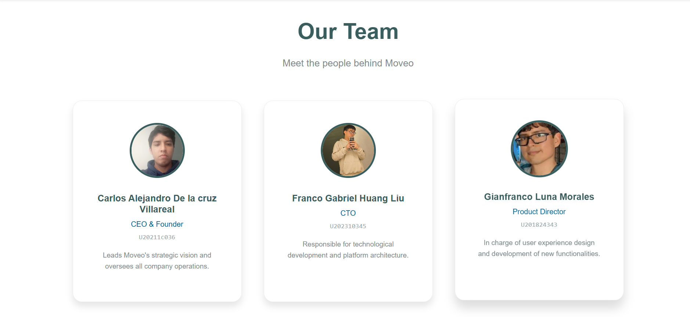

<p align="center">
    </img><br><br>
    <strong>Universidad Peruana de Ciencias Aplicadas</strong><br><br>
    <strong>Ingeniería de Software</strong><br><br>
    <strong>Ciclo 202610</strong><br><br>
    <strong>Diseño de Experimentos de Ingeniería de Software</strong><br><br>
    <strong>NRC: 17821</strong><br><br>
    <strong>Sección: 1ASI0732</strong><br><br>
    <strong>Profesor: Lennin Percy Cenas Vasquez</strong><br><br>
    <strong>Informe de Trabajo Final</strong><br><br>
    <strong>Startup: Point Flavor</strong><br><br>
    <strong>Producto: PuntoSabor</strong><br><br>
</p>


<table align="center" border="1" cellpadding="6" cellspacing="0" style="border-collapse:collapse; width:60%; margin:auto; font-size:11px;">
  <thead>
    <tr>
      <th style="text-align:center;">Código</th>
      <th style="text-align:center;">Apellidos y Nombres</th>
    </tr>
  </thead>
  <tbody>
    <tr>
      <td style="text-align:center;">U202318049</td>
      <td>Goñe Araccata, Esther Abigail</td>
    </tr>
    <tr>
      <td style="text-align:center;">U20221C726</td>
      <td>Hancco Poma, Keyner Iván</td>
    </tr>
    <tr>
      <td style="text-align:center;">U202317362</td>
      <td>Santiago Peña, Andreow Jomark</td>
    </tr>
    <tr>
      <td style="text-align:center;">U202224602</td>
      <td>Sulca Silva, Melisa Geraldine</td>
    </tr>
    <tr>
      <td style="text-align:center;">U20241C134</td>
      <td>Tumi Oliden, Manuel Ignacio</td>
    </tr>
  </tbody>
</table>

<p align="center">
    <br><strong>Abril 2026</strong>
</p>

---

# Registro de Versiones del Informe

<table border="1" cellpadding="6" cellspacing="0" style="border-collapse:collapse; width:100%; font-size:11px;">
  <thead>
    <tr>
      <th>Versión</th>
      <th>Fecha</th>
      <th>Autor(es)</th>
      <th>Descripción de modificación</th>
    </tr>
  </thead>
  <tbody>
    <tr>
      <td>1.0 (AV1)</td>
      <td>12/04/2026</td>
      <td>Goñe Araccata, Esther Abigail</td>
      <td>Creación del documento base. Redacción de las secciones Startup Profile, Lean UX Process, Segmentos objetivo y Análisis competitivo.</td>
    </tr>
    <tr>
      <td>1.1 (AV1)</td>
      <td>15/04/2026</td>
      <td>Goñe Araccata, Esther Abigail</td>
      <td>Adición de las secciones de diseño de Entrevistas y técnicas de Needfinding.</td>
    </tr>
    <tr>
      <td>1.2 (AV1)</td>
      <td>18/04/2026</td>
      <td>Sulca Silva, Melisa Geraldine</td>
      <td>Registro detallado de las entrevistas realizadas al Segmento 1 y elaboración del análisis de los hallazgos de dichas entrevistas.</td>
    </tr>
    <tr>
      <td>1.3 (AV1)</td>
      <td>20/04/2026</td>
      <td>Tumi Oliden, Manuel Ignacio</td>
      <td>Elaboración y adición del To-Be Scenario Mapping, User Stories, Impact Mapping y la estructuración del Product Backlog.</td>
    </tr>
    <tr>
      <td>1.4 (AV1)</td>
      <td>23/04/2026</td>
      <td>Hancco Poma, Keyner Iván</td>
      <td>Desarrollo del diseño de producto: inclusión de Web Application wireframe, wireflow, UX/UI y el landing page wireframe & UI Design.</td>
    </tr>
    <tr>
      <td>1.5 (AV1)</td>
      <td>26/04/2026</td>
      <td>Santiago Peña, Andreow Jomark</td>
      <td>Creación de la documentación de la API (RESTful API documentation) e inclusión de evidencias del Implemented RESTful API y Frontend-Web.</td>
    </tr>
    <tr>
      <td>1.6 (AV1)</td>
      <td>28/04/2026</td>
      <td>Sulca Silva, Melisa Geraldine</td>
      <td>Inclusión de las evidencias de la Landing Page implementada (Implemented Landing Page Evidence) y adición del Video About The Product.</td>
    </tr>
    <tr>
      <td>1.7 (AV1)</td>
      <td>01/05/2026</td>
      <td>Santiago Peña, Andreow Jomark</td>
      <td>Redacción de las Conclusiones y Recomendaciones finales del proyecto para el cierre de la entrega del AV1.</td>
    </tr>
  </tbody>
</table>

---

# Project Report Collaboration Insights

Repositorio donde se encuentra el **Project Report**: [https://github.com/UPC-1ASI0732-2610-17821-PointFlavor/PFLAVOR-Report.git](https://github.com/UPC-1ASI0732-2610-17821-PointFlavor/PFLAVOR-Report.git)

Utilizamos Google Docs como herramienta colaborativa para redactar el informe y luego trasladamos la información al archivo README.md de nuestro repositorio. 

A continuación, se adjuntan las evidencias del trabajo colaborativo, incluyendo el registro de los *commits* realizados por el equipo y el gráfico de contribuciones extraído de los *Insights* del repositorio:

<p align="center">
    <strong>Registro de Commits del Equipo</strong><br><br>
    <br><br>
    <br><br>
    <strong>Gráfico de Contribuciones</strong><br><br>
    
</p>

---

# Contenido

- [Registro de Versiones del Informe](#registro-de-versiones-del-informe)
- [Project Report Collaboration Insights](#project-report-collaboration-insights)
- [Contenido](#contenido)
- [Student Outcome](#student-outcome)
- [Part I: As-Is Software Project](#part-i-as-is-software-project)
  - [Capítulo I: Introducción](#capítulo-i-introducción)
    - [1.1. Startup Profile](#11-startup-profile)
      - [1.1.1. Descripción de la Startup](#111-descripción-de-la-startup)
      - [1.1.2. Perfiles de integrantes del equipo](#112-perfiles-de-integrantes-del-equipo)
    - [1.2. Solution Profile](#12-solution-profile)
      - [1.2.1. Antecedentes y problemática](#121-antecedentes-y-problemática)
      - [1.2.2. Lean UX Process](#122-lean-ux-process)
        - [1.2.2.1. Lean UX Problem Statements](#1221-lean-ux-problem-statements)
        - [1.2.2.2. Lean UX Assumptions](#1222-lean-ux-assumptions)
        - [1.2.2.3. Lean UX Hypothesis Statements](#1223-lean-ux-hypothesis-statements)
        - [1.2.2.4. Lean UX Canvas](#1224-lean-ux-canvas)
    - [1.3. Segmentos objetivo](#13-segmentos-objetivo)
  - [Capítulo II: Requirements Elicitation \& Analysis](#capítulo-ii-requirements-elicitation--analysis)
    - [2.1. Competidores](#21-competidores)
      - [2.1.1. Análisis competitivo](#211-análisis-competitivo)
      - [2.1.2. Estrategias y tácticas frente a competidores](#212-estrategias-y-tácticas-frente-a-competidores)
    - [2.2. Entrevistas](#22-entrevistas)
      - [2.2.1. Diseño de entrevistas](#221-diseño-de-entrevistas)
      - [2.2.2. Registro de entrevistas](#222-registro-de-entrevistas)
      - [2.2.3. Análisis de entrevistas](#223-análisis-de-entrevistas)
    - [2.3. Needfinding](#23-needfinding)
      - [2.3.1. User Personas](#231-user-personas)
      - [2.3.2. User Task Matrix](#232-user-task-matrix)
      - [2.3.3. User Journey Mapping](#233-user-journey-mapping)
      - [2.3.4. Empathy Mapping](#234-empathy-mapping)
      - [2.3.5. As-is Scenario Mapping](#235-as-is-scenario-mapping)
    - [2.4. Ubiquitous Language](#24-ubiquitous-language)
  - [Capítulo III: Requirements Specification](#capítulo-iii-requirements-specification)
    - [3.1. To-Be Scenario Mapping](#31-to-be-scenario-mapping)
    - [Segmento 1](#segmento-1)
    - [Segmento 2](#segmento-2)
    - [3.2. User Stories](#32-user-stories)
    - [3.3. Product Backlog](#33-product-backlog)
    - [3.4. Impact Mapping](#34-impact-mapping)
  - [Capítulo IV: Product Design](#capítulo-iv-product-design)
    - [4.1. Style Guidelines](#41-style-guidelines)
      - [4.1.1. General Style Guidelines](#411-general-style-guidelines)
      - [4.1.2. Web Style Guidelines](#412-web-style-guidelines)
    - [4.2. Information Architecture](#42-information-architecture)
      - [4.2.1. Organization Systems](#421-organization-systems)
      - [4.2.2. Labeling Systems](#422-labeling-systems)
      - [4.2.3. SEO Tags and Meta Tags](#423-seo-tags-and-meta-tags)
      - [4.2.4. Searching Systems](#424-searching-systems)
      - [4.2.5. Navigation Systems](#425-navigation-systems)
    - [4.3. Landing Page UI Design](#43-landing-page-ui-design)
      - [4.3.1. Landing Page Wireframe](#431-landing-page-wireframe)
      - [4.3.2. Landing Page Mock-up](#432-landing-page-mock-up)
    - [4.6. Web Applications UX/UI Design](#46-web-applications-uxui-design)
      - [4.6.1. Web Applications Wireframes](#461-web-applications-wireframes)
      - [4.6.2. Web Applications Wireflow Diagrams](#462-web-applications-wireflow-diagrams)
      - [4.6.3. Web Applications Mock-ups](#463-web-applications-mock-ups)
      - [4.6.4. Web Applications User Flow Diagrams](#464-web-applications-user-flow-diagrams)
    - [4.7. Web Applications Prototyping](#47-web-applications-prototyping)
    - [4.8. Domain-Driven Software Architecture](#48-domain-driven-software-architecture)
      - [4.8.1. Software Architecture Context Diagram](#481-software-architecture-context-diagram)
      - [4.8.2. Software Architecture Container Diagrams](#482-software-architecture-container-diagrams)
      - [4.8.3. Software Architecture Components Diagrams](#483-software-architecture-components-diagrams)
    - [4.9. Software Object-Oriented Design](#49-software-object-oriented-design)
      - [4.9.1. Class Diagrams](#491-class-diagrams)
      - [4.9.2. Class Dictionary](#492-class-dictionary)
    - [4.10. Database Design](#410-database-design)
      - [4.10.1. Relational/Non-Relational Database Diagram](#4101-relationalnon-relational-database-diagram)
  - [Capítulo V: Product Implementation](#capítulo-v-product-implementation)
    - [5.1. Software Configuration Management](#51-software-configuration-management)
      - [5.1.1. Software Development Environment Configuration](#511-software-development-environment-configuration)
      - [5.1.2. Source Code Management](#512-source-code-management)
      - [5.1.3. Source Code Style Guide \& Conventions](#513-source-code-style-guide--conventions)
      - [5.1.4. Software Deployment Configuration](#514-software-deployment-configuration)
    - [5.2. Product Implementation \& Deployment](#52-product-implementation--deployment)
      - [5.2.1. Sprint Backlogs](#521-sprint-backlogs)
      - [5.2.2. Implemented Landing Page Evidence](#522-implemented-landing-page-evidence)
      - [5.2.3. Implemented Frontend-Web Application Evidence](#523-implemented-frontend-web-application-evidence)
      - [5.2.4. Acuerdo de Servicio - SaaS](#524-acuerdo-de-servicio---saas)
      - [5.2.6. Implemented RESTful API and/or Serverless Backend Evidence](#526-implemented-restful-api-andor-serverless-backend-evidence)
      - [5.2.7. RESTful API documentation](#527-restful-api-documentation)
      - [5.2.8. Team Collaboration Insights](#528-team-collaboration-insights)
    - [5.3. Video About-the-Product](#53-video-about-the-product)
- [Conclusiones y recomendaciones](#conclusiones-y-recomendaciones)
- [Conclusiones](#conclusiones)
  - [Recomendaciones](#recomendaciones)
- [Bibliografía](#bibliografía)
- [Anexos](#anexos)

# Student Outcome

El curso aporta al cumplimiento del criterio ABET: **ABET – EAC - Student Outcome 7:** **Aprendizaje Continuo y Autónomo**

**Criterio:** *La capacidad de adquirir y aplicar nuevos conocimientos según sea necesario, utilizando estrategias de aprendizaje apropiadas.*

En el cuadro siguiente se detallan las actividades llevadas a cabo y las conclusiones formuladas por el equipo, las cuales sirven como evidencia del logro alcanzado en el ABET – EAC - Student Outcome.

<table border="1" cellpadding="6" cellspacing="0" style="border-collapse:collapse; width:100%; font-size:11px;">
  <thead>
    <tr>
      <th>Criterio específico</th>
      <th>Nombre</th>
      <th>Conclusiones</th>
    </tr>
  </thead>
  <tbody>
    <tr>
      <td>Actualiza conceptos y conocimientos necesarios para su desarrollo profesional y en especial para su proyecto en soluciones de software.</td>
      <td>
        <strong>Goñe Araccata, Esther Abigail</strong><br><em>AV1:</em> Investigó y aplicó conceptos de la metodología Lean UX y Needfinding para estructurar adecuadamente el perfil de la startup y entender a la competencia.<br><br>
        <strong>Hancco Poma, Keyner Iván</strong><br><em>AV1:</em> Adquirió conocimientos técnicos en herramientas de diseño de interfaces y principios de experiencia de usuario (UX/UI) para la aplicación web y landing page.<br><br>
        <strong>Santiago Peña, Andreow Jomark</strong><br><em>AV1:</em> Se instruyó autónomamente en la lectura de documentación técnica de frameworks para implementar el Frontend-Web y estructurar la documentación de la API RESTful.<br><br>
        <strong>Sulca Silva, Melisa Geraldine</strong><br><em>AV1:</em> Aprendió técnicas cualitativas para ejecutar entrevistas a usuarios y adquirió destrezas en despliegue web y edición audiovisual para evidenciar el producto.<br><br>
        <strong>Tumi Oliden, Manuel Ignacio</strong><br><em>AV1:</em> Profundizó en prácticas de gestión de requerimientos ágiles, redactando eficazmente Historias de Usuario, Mapas de Impacto y gestionando el Product Backlog.
      </td>
      <td><strong>AV1:</strong> Durante esta primera entrega, el equipo ha demostrado una alta capacidad para investigar de forma autónoma. Desde metodologías de ideación (Lean UX) y diseño de interfaces (UX/UI), hasta la aplicación de tecnologías de programación (RESTful APIs) e investigación de mercado (entrevistas). Cada integrante adquirió el conocimiento técnico o metodológico exacto que su módulo requería y lo aplicó con éxito en el desarrollo del producto de software.</td>
    </tr>
    <tr>
      <td>Reconoce la necesidad del aprendizaje permanente para el desempeño profesional y el desarrollo de proyectos en soluciones de software.</td>
      <td>
        <strong>Goñe Araccata, Esther Abigail</strong><br><em>AV1:</em> Reconoce que el comportamiento del mercado cambia, por lo que es necesario aprender constantemente nuevas formas de identificar oportunidades de negocio.<br><br>
        <strong>Hancco Poma, Keyner Iván</strong><br><em>AV1:</em> Entiende que las tendencias visuales y patrones de interacción en software evolucionan rápidamente, haciendo obligatoria la actualización en diseño web.<br><br>
        <strong>Santiago Peña, Andreow Jomark</strong><br><em>AV1:</em> Comprende que los frameworks de desarrollo y arquitecturas de backend cambian año a año, siendo vital cultivar una cultura de autoformación técnica.<br><br>
        <strong>Sulca Silva, Melisa Geraldine</strong><br><em>AV1:</em> Valora la necesidad de explorar de manera continua nuevas técnicas de validación con clientes y métodos de marketing para presentar soluciones de valor.<br><br>
        <strong>Tumi Oliden, Manuel Ignacio</strong><br><em>AV1:</em> Asimila que la correcta planificación de software exige adaptar permanentemente los marcos de trabajo ágiles a escenarios del mundo real.
      </td>
      <td><strong>AV1:</strong> El equipo concluye unánimemente que en la industria del desarrollo de software es indispensable cultivar una mentalidad de aprendizaje permanente (Lifelong Learning). La acelerada evolución de los estándares de desarrollo, las herramientas de diseño, las metodologías ágiles de gestión y las expectativas de los usuarios exigen que los ingenieros de software actualicen sus habilidades técnicas y blandas de manera constante para mantener su competitividad profesional.</td>
    </tr>
  </tbody>
</table>

---

# Part I: As-Is Software Project

## Capítulo I: Introducción
### 1.1. Startup Profile
#### 1.1.1. Descripción de la Startup

Nuestro proyecto consiste en un servicio digital diseñado para conectar a personas que poseen un vehículo con quienes necesitan uno por un tiempo determinado. A diferencia de una compañía de alquiler tradicional, nuestra propuesta no requiere contar con un parque automotor propio, lo que reduce significativamente los costos iniciales. En lugar de ello, los autos registrados por los mismos usuarios son los que conforman la oferta disponible en la plataforma, generando así una red colaborativa similar a una flota virtual. El modelo se centra en la intermediación: los dueños obtienen ingresos únicamente cuando su vehículo es efectivamente arrendado, mientras que los arrendatarios acceden a precios más accesibles que en el mercado convencional. De esta manera, se construye un sistema rentable, flexible y equitativo para ambas partes.

**Misión**: Ofrecer una solución moderna y segura que simplifique el acceso a un vehículo de alquiler, generando confianza y beneficios tanto para el propietario como para el arrendatario. Buscamos que nuestra plataforma sea percibida como una alternativa práctica, clara y orientada a las necesidades reales de los usuarios.

**Visión**: Aspiramos a consolidarnos como la plataforma más reconocida en el Perú para la renta de automóviles entre particulares. Queremos ser identificados por la innovación de nuestro modelo, la seguridad de nuestras operaciones y la facilidad de uso del sistema. Nuestra meta es que, al pensar en alquiler de autos sin trámites complicados, las personas recurran primero a nosotros.


#### 1.1.2. Perfiles de integrantes del equipo

En esta sección se presentan los integrantes de la startup, detallando sus perfiles, así como sus principales habilidades y conocimientos.

<table border="1" cellpadding="6" cellspacing="0" style="border-collapse:collapse; width:100%; font-size:11px;">
  <tbody>
    <tr>
      <td style="text-align:center; width:20%;">
        
      </td>
      <td style="vertical-align:top;">
        <strong>Goñe Araccata, Esther Abigail</strong><br>
        Mi nombre es Abigail Goñe, tengo 20 años y actualmente me encuentro en el séptimo ciclo de la carrera de Ingeniería de Software. Soy una persona responsable, amigable y me gusta poder ayudar a los demás en todo lo que pueda.
      </td>
    </tr>
    <tr>
      <td style="text-align:center; width:20%;">
        
      </td>
      <td style="vertical-align:top;">
        <strong>Hancco Poma, Keyner Iván</strong><br>
        Soy estudiante de la carrera de Ingeniería de Software, considero que tengo dominio en tecnologías como C++, Python, CSS, HTML, Figma, SQL, JS. También considero que tengo habilidades en comunicación, organización y en el idioma inglés avanzado.
      </td>
    </tr>
    <tr>
      <td style="text-align:center; width:20%;">
        
      </td>
      <td style="vertical-align:top;">
        <strong>Santiago Peña, Andreow Jomark</strong><br>
        Soy estudiante de Ingeniería de Software en la Universidad Peruana de Ciencias Aplicadas, con una gran pasión por el desarrollo de aplicaciones móviles y backend.
      </td>
    </tr>
    <tr>
      <td style="text-align:center; width:20%;">
        
      </td>
      <td style="vertical-align:top;">
        <strong>Sulca Silva, Melisa Geraldine</strong><br>
        Estudio la carrera de Ingeniería de Software y me interesa la tecnología y los videojuegos. Me motiva mucho aprender nuevos lenguajes de programación. Suelo trabajar bien en equipo, nuestro compromiso, perseverancia y liderazgo.
      </td>
    </tr>
    <tr>
      <td style="text-align:center; width:20%;">
        
      </td>
      <td style="vertical-align:top;">
        <strong>Tumi Oliden, Manuel Ignacio</strong><br>
        Soy estudiante de sexto ciclo de Ingeniería de Software. Me apasiona desarrollar soluciones prácticas y creativas, tanto en proyectos académicos como personales. Me defino como una persona innovadora, con fuerte orientación al trabajo en equipo y comunicación constante.
      </td>
    </tr>
  </tbody>
</table>

### 1.2. Solution Profile
#### 1.2.1. Antecedentes y problemática

Para explicar los fundamentos de nuestra startup utilizaremos una adaptación de la técnica de análisis 5W + 2H, que permite organizar la información respondiendo a las preguntas clave de cualquier iniciativa.

**Antecedentes**

- En los últimos años la necesidad de soluciones de movilidad temporal ha crecido considerablemente, especialmente en zonas urbanas donde adquirir un vehículo propio no siempre es viable. Ante ello surge la oportunidad de una plataforma digital que facilite el contacto directo entre propietarios de automóviles y personas interesadas en alquilarlos, optimizando el proceso a través de un aplicativo accesible.

**Problemática**

- La ausencia de servicios que ofrezcan un alquiler directo entre dueños y arrendatarios dificulta satisfacer la demanda de transporte temporal. Esto genera dos consecuencias principales: los usuarios que requieren un vehículo de manera inmediata encuentran limitaciones, y los propietarios pierden la posibilidad de generar ingresos adicionales con sus autos.

Aplicación del método 5W + 2H

**¿Qué?**

El proyecto busca responder a la falta de un sistema eficiente que conecte a quienes desean rentabilizar sus vehículos con quienes necesitan arrendarlos. La iniciativa está directamente relacionada con dos tipos de clientes: propietarios con autos disponibles y arrendatarios que requieren alternativas accesibles y confiables.

**¿Cuándo?**

La problemática se presenta en el momento en que un propietario desea alquilar su vehículo, pero no cuenta con un canal formal ni seguro para hacerlo. A su vez, los arrendatarios se ven afectados cuando requieren un vehículo por un tiempo limitado —sea por un viaje, una urgencia o una necesidad puntual— y no encuentran opciones adecuadas.
El uso de la plataforma se da justamente en esos escenarios: el dueño publica su vehículo y el arrendatario selecciona la opción que mejor se adapta a su situación.

**¿Dónde?**

El servicio puede utilizarse en cualquier lugar con acceso a internet, ya sea desde casa, el trabajo o en desplazamiento.
La propuesta está dirigida principalmente a contextos urbanos donde la demanda de movilidad es más alta y, paradójicamente, la oferta de plataformas colaborativas de alquiler es todavía reducida.

**¿Quiénes?**

Participan dos grupos principales: los propietarios que desean ofrecer su auto en alquiler y los arrendatarios que buscan una solución práctica sin trámites extensos.
El problema afecta sobre todo a los dueños que no logran monetizar sus vehículos y a las personas que necesitan movilidad temporal pero no encuentran opciones seguras y confiables.
En consecuencia, el público objetivo que hará uso del servicio corresponde a ambos segmentos, integrados en una misma plataforma.

**¿Por qué?**

La raíz del problema se encuentra en la falta de un canal especializado y confiable que asegure la interacción entre dueños y arrendatarios. Esta ausencia limita la rentabilidad de los primeros y restringe la variedad de opciones para los segundos.

**¿Cómo?**

El servicio se utiliza cuando los dueños desean generar ingresos con su vehículo o cuando un arrendatario necesita resolver rápidamente una necesidad de transporte.
Los usuarios llegan a la plataforma a través de campañas digitales, publicidad segmentada en redes sociales y recomendaciones de otros clientes.
En general, el detonante es la búsqueda de una alternativa segura, flexible y accesible frente a los servicios tradicionales de alquiler.

**¿Cuánto cuesta?**

Para los propietarios no existen costos de inscripción ni inversión inicial; únicamente se descuenta una comisión en caso de concretarse el alquiler.
Los arrendatarios, en cambio, acceden a tarifas variables y flexibles, con opciones que resultan más económicas en comparación con las agencias de renta tradicionales.

## 1.2.2. Lean UX Process

### 1.2.2.1. Lean UX Problem Statement

MOVEO tiene como objetivo ofrecer un servicio de alquiler de vehículos accesible, flexible y rentable, conectando de manera segura y eficiente a propietarios y arrendatarios a través de una plataforma digital. Sin embargo, el mercado actual se caracteriza por la falta de innovación, modelos de negocio rígidos, altos costos para los usuarios y una fuerte dependencia de flotas propias, lo que limita la escalabilidad y reduce la diversidad de la oferta. Ante esta situación, se plantea la necesidad de mejorar el modelo de servicio mediante un sistema más adaptable e inclusivo, que permita ampliar la participación de propietarios particulares y optimizar la experiencia de alquiler sin requerir una inversión directa en vehículos.

Consideramos que habremos alcanzado un avance significativo cuando logremos que el número de propietarios inscritos crezca de forma constante y que la oferta de vehículos disponibles se adapte a la demanda real del mercado.

### 1.2.2.2. Lean UX Assumptions

**Segmento de Usuarios:**

**¿Quién es el usuario?**

Nuestros principales usuarios son dos: los dueños de vehículos que desean generar ingresos pasivos sin tener que involucrarse en la gestión diaria de sus autos, y las personas que buscan alternativas de alquiler de vehiculos seguras, cómodas y accesibles.

**¿Dónde se integra el servicio en su vida?**

Para los propietarios, el servicio se convierte en un medio para obtener ingresos extra sin esfuerzo operativo. Para los inquilinos, representa la posibilidad de acceder a un vehículo en el momento en que lo necesitan, sin asumir compromisos de propiedad ni altos costos.

**¿Cuándo y cómo se utiliza el servicio?**

Los dueños lo usan al registrar su vehículo y seguir sus ganancias, mientras que los inquilinos lo emplean cuando requieren transporte para viajes, mudanzas, diligencias o necesidades puntuales de movilidad.

**¿Qué problemas enfrenta el servicio?**

El mayor reto es garantizar la seguridad y confianza de los propietarios respecto al uso de sus vehículos, al mismo tiempo que se asegura que los inquilinos disfruten de una experiencia rápida, sencilla y sin complicaciones.

**Resultados de Negocio (Business Outcomes):**

- Anticipamos que los propietarios valorarán una plataforma que les permita alquilar sin preocuparse de la gestión operativa.
- Creemos que los arrendatarios encontrarán en nuestro servicio una alternativa más económica y variada que las opciones tradicionales.
- Reconocemos que existen competidores en el sector, pero nuestro modelo —sin flota propia— nos permitirá mantener precios atractivos y una mejor experiencia de usuario.
- Sabemos que para mantener la confianza, debemos reforzar la calidad del servicio con pruebas constantes, mejoras continuas y canales abiertos de comunicación con nuestros clientes.

### 1.2.2.3. Lean UX Hypothesis Statements

1. Consideramos que los propietarios interesados en generar ingresos pasivos, sin realizar grandes inversiones ni dedicar demasiado tiempo a la gestión, verán en MOVEO una alternativa confiable para monetizar sus vehículos. Consideraremos que hemos alcanzado el éxito cuando estos propietarios incrementen el uso de la plataforma y obtengan ingresos recurrentes mediante el alquiler de sus autos, evidenciando confianza y satisfacción en el servicio.

2. Creemos que los arrendatarios que buscan opciones de alquiler más flexibles, asequibles y seguras optarán por MOVEO gracias a su facilidad de uso, precios competitivos y garantías de protección. Consideraremos que hemos alcanzado el éxito cuando la frecuencia de alquiler y la tasa de retención de usuarios aumenten, junto con una mejora perceptible en los niveles de satisfacción reportados.

3. Suponemos que al implementar un modelo operativo sin una flota propia de vehículos, podremos destinar mayores recursos a la innovación tecnológica y a la optimización de la experiencia de usuario. Consideraremos que hemos alcanzado el éxito cuando los indicadores de eficiencia operativa y de experiencia del cliente reflejen una reducción de costos, estabilidad en las tarifas y un incremento sostenido en el número de transacciones exitosas.

#### 1.2.2.4. Lean UX Canvas.
En el apartado de Lean UX Canvas se desarrolló una estructuración completa y académica de las principales hipótesis estratégicas que sustentan la propuesta de valor y la arquitectura de la plataforma Moveo

Cada hipótesis fue traducida en un Lean UX Canvas formal, siguiendo un enfoque científico-experimental que articula: el problema de negocio detectado (Business Problem ), las soluciones propuestas a nivel funcional y técnico (Solutions ), los resultados esperados a nivel organizacional (Business Outcomes ), la caracterización de los usuarios objetivos (Users ), los beneficios esperados para estos usuarios (User Outcomes & Benefits ), la formulación de hipótesis de aprendizaje (Hypotheses ), y el diseño de experimentos estratégicos para validar o refutar dichas hipótesis (What's the most important thing we need to learn first? y What's the least amount of work we need to do to learn the next most important thing? ).

Este trabajo metodológico permitió no solo establecer un marco claro de experimentación y validación temprana de las decisiones de diseño y tecnología, sino también alinear todos los esfuerzos de desarrollo a métricas de éxito específicas y medibles. Así, el apartado de Lean UX Canvas representa una pieza fundamental dentro del enfoque de construcción iterativa, ágil y centrada en el usuario de Moveo, asegurando que cada funcionalidad propuesta responde a necesidades reales, riesgos priorizados y oportunidades de negocio tangibles.

##### 1.2.2.4. Lean UX Canvas


### 1.3. Segmentos objetivo

**Segmento 1: Propietarios de vehículos**

Datos demográficos:
- Género: hombres y mujeres.
- Rango etario: de 18 a 70 años.
- Condición socioeconómica: sectores A, B y C (clase media o clase alta).

Datos geográficos:
- Nacionalidad: peruana.
- Área de residencia: zonas urbanas.
- Ubicación principal: Lima Metropolitana.

Datos psicográficos:
- Individuos (naturales o jurídicos) que poseen un vehículo que permanece sin uso la mayor parte del tiempo.
- Personas interesadas en generar ingresos adicionales a través de un recurso que ya poseen, sin necesidad de destinar grandes cantidades de tiempo a la gestión.
- Propietarios que aún no cuentan con un mecanismo práctico, seguro y rápido para ofrecer sus autos en alquiler.

**Segmento 2: Inquilinos o usuarios finales**

Datos demográficos:
- Género: tanto masculino como femenino.
- Edad: entre 18 y 50 años.
- Nivel socioeconómico: clases A, B y C (clase media, media alta y alta).

Datos geográficos:
- Nacionalidad: peruana.
- Lugar de residencia: zonas urbanas.
- Departamento: Lima Metropolitana.

Datos psicográficos:
- Personas que pasan una cantidad considerable de horas en transporte público o en el tráfico y buscan alternativas más cómodas y flexibles.
- Usuarios que no cuentan con los recursos para adquirir un auto propio (nuevo o de segunda mano), pero que requieren movilidad en situaciones específicas.
- Personas que necesitan disponer de un vehículo particular por un período corto, ya sea para actividades puntuales, compromisos laborales o viajes.


## Capítulo II: Requirements Elicitation & Analysis
### 2.1. Competidores
Previo al desarrollo de la aplicación, hicimos una búsqueda de las opciones que ya existen en el mercado, para ver que es lo que ofrecen y como podemos diferenciarnos de ellos.
- **Peru Rent A Car:**
  Esta plataforma se especializa en el alquiler de coches en Perú. Ofrece una amplia gama de vehículos y opciones de alquiler, así como información sobre destinos turísticos en Perú. 
  La plataforma también permite a los usuarios comparar precios y reservar coches en línea.
  <div style="text-align: center;">
 
  </div>

- **Kayak:**
  Kayak es una de las plataformas de búsqueda de viajes más grandes del mundo. Permite a los usuarios buscar y comparar precios de vuelos, hoteles y alquiler de coches en una sola plataforma. 
  Kayak también ofrece herramientas para planificar viajes, como alertas de precios y recomendaciones personalizadas.
  <div style="text-align: center;">

  </div>

- **Budget Car Rental Peru:**
  A diferencia de Peru Rent A Car, Budget Car Rental es una empresa internacional que ofrece servicios de alquiler de coches en Perú. 
  La plataforma permite a los usuarios buscar y comparar precios de coches de alquiler en diferentes ubicaciones y reservar en línea. Budget Car Rental también ofrece opciones de alquiler a largo plazo y programas de fidelización.
  <div style="text-align: center;">

  </div>

#### 2.1.1. Análisis competitivo

Para obtener una comprensión más profunda del entorno competitivo y evaluar a los principales rivales del sector gastronómico digital, se desarrolló el siguiente Competitive Analysis Landscape. El objetivo es determinar las ventajas competitivas de la plataforma mediante su enfoque exclusivo en huariques auténticos, identificando oportunidades en un mercado local desatendido y posicionándose como la primera solución peruana especializada en descubrimiento y promoción de gastronomía tradicional frente a plataformas generalistas de mayor escala.

En esta sección tiene como objetivo que su startup conozca mejor a sus competidores, en contraste con la idea inicial que pudiera tener sobre ellos. Se debe desarrollar el siguiente Landscape:  
**Se realiza un mapeo estratégico comparativo entre nuestra propuesta (Moveo) y los principales actores del mercado, evaluando su perfil, marketing, producto y análisis SWOT, con el fin de identificar brechas de mercado, fortalezas propias y oportunidades de posicionamiento diferenciado.**

**¿Por qué llevar a cabo este análisis?**  
*Objetivo: Comprender a fondo el posicionamiento de nuestra startup frente a competidores clave en el mercado de alquiler de autos en Perú, identificando sus fortalezas, debilidades y estrategias, para definir con precisión nuestra ventaja competitiva y oportunidades de diferenciación.*


<table border="1" style="text-align: center;">
	<tbody>
		<tr><td colspan="6">Análisis de competidores</td></tr>
		<tr><td colspan="2"></td><td>Moveo</td><td>Kayak</td><td>Peru Rent A Car</td><td>Budget Car Rental Peru</td></tr>
		<tr><td rowspan="2">Perfil</td><td>Resumen</td>
			<td>Una aplicación que busca ofrecer una plataforma rápida y ágil para el alquiler de autos, con un fuerte enfoque en la seguridad de ambas partes.</td>
			<td>Kayak es una plataforma líder de búsqueda tanto de vuelos, como cuartos de hotel, alquiler de vehículos, etc.</td>
			<td>Esta plataforma web presenta parte de un catálogo establecido de vehículos para alquilar, con una atención mediante WhatsApp y dirigido solo a clientes.</td>
			<td>Plataforma de similar funcionamiento que Rent A Car Peru, orientado a clientes con un énfasis en cuidar el presupuesto de los mismos.</td></tr>
		<tr><td>Ventaja competitiva</td>
			<td>Ofrecer una plataforma tanto para dueños de vehículos como a clientes interesados en alquilar.</td>
			<td>Es la aplicación líder en la búsqueda de servicios por su variedad y robusta plataforma web.</td>
			<td>Líder local del servicio de alquiler de autos, con una amplia flota y rápida atención al usuario</td>
			<td>Ofrece una alternativa de alquiler económica velando por el bolsillo de sus clientes. </td></tr>
		<tr><td rowspan="2">Perfil de Marketing</td><td>Mercado objetivo</td>
			<td>Jóvenes y adultos desde los 20 a los 50 años.</td>
			<td>Turistas o viajeros que necesiten cualquier tipo de servicio de comodidad.</td>
			<td>Adultos peruanos que busquen alquilar un vehiculo.</td>
			<td>Adultos peruanos que busquen alquilar un vehiculo económico.</td></tr>
		<tr><td>Estrategias de marketing</td>
			<td>Marketing digital en redes sociales y colaboraciones con influencers.</td>
			<td>Alianza con Google Ads, tanto en Youtube como Chrome.</td>
			<td>Patrocinio mediante búsquedas de Chrome.</td>
			<td>Patrocinio mediante búsquedas de Chrome.</td></tr>
		<tr><td rowspan="3">Perfil de Producto</td>
			<td>Productos y Servicios</td>
			<td>Aplicación destinada a la oferta de vehículos en alquiler, como la demanda de los mismos.</td>
			<td>Aplicación móvil y web que cuenta con una enorme variedad de servicios esenciales para viajeros y turistas</td>
			<td>Aplicación web rápida e intuitiva que permite consultar parte del catálogo de vehículos disponibles para alquiler.</td>
			<td>Aplicación web ágil y amigable que permite consultar una limitada oferta de vehículos económicos en alquiler</td></tr>
		<tr><td>Precios y Costos</td>
			<td>Costos por publicación de vehículos mediante una suscripción.</td>
			<td>Modelo gratuito, con cobro de comisión a las empresas referidas.</td>
			<td>Ingreso directo mediante el alquiler.</td>
			<td>Ingreso directo mediante el alquiler.</td></tr>
		<tr><td>Canales de distribución</td>
			<td>Disponible en línea a través de la aplicación web.</td>
			<td>Descargable en Google Play y App Store y la plataforma web.</td>
			<td>Disponible en línea a través de la aplicación web.</td>
			<td>Disponible en línea a través de la aplicación web.</td></tr>
		<tr><td rowspan="4">Análisis SWOT</td><td>Fortalezas</td><td><ul>
                    <li>Orientado a jóvenes y adultos peruanos</li><li>Facilidades para alquilar, como ofrecer alquiler</li><li>Énfasis en la seguridad y garantía</li></ul></td>
			<td><ul>
                    <li>Gran cantidad de usuarios</li><li>Referente del sector</li><li>Plataformas ágiles e intuitivas</li></ul></td>
			<td><ul><li>Plataforma local</li><li>Excelente atención al cliente</li></ul></td>
			<td><ul><li>Plataforma web amigable</li><li>Todo el catálogo está disponible para cualquier usuario</li></ul></td></tr>
		<tr><td>Debilidades</td>
            <td><ul><li>Nuevo competidor</li><li>Sector con competidores fuertes ya establecidos</li></ul></td>
			<td><ul><li>Pobre atención al cliente</li></ul></td>
			<td><ul><li>Solo se puede consultar parte del catálogo de vehículos</li></ul></td>
			<td><ul><li>Opta por un nicho muy concreto</li><li>No cuenta con tanta relevancia como su competencia</li></ul></td></tr>
		<tr><td>Oportunidades</td>
            <td><ul><li>Sin competidores a nivel nacional</li><li>Ofrece servicio para ambas partes involucradas en el alquiler</li></ul></td>
			<td><ul><li>Fuerte presencia internacional</li><li>Referente del sector</li></ul></td>
			<td><ul><li>Flota amplia y en crecimiento</li><li>Atención personalizada</li></ul></td>
			<td><ul><li>Excelente interfaz</li></ul></td></tr>
		<tr><td>Amenazas</td>
            <td><ul><li>Competencia ya establecida</li><li>Sector muy competitivo</li></ul></td>
			<td><ul><li>Oferta demasiado ámplia</li><li>Sin control de calidad</li></ul></td>
			<td><ul><li>Oferta fija y poco variada</li><li>Sin opciones para dueños interesados en alquilar</li></ul></td>
<td><ul><li>Se ve opacado por la competencia</li><li>Oferta aún más limitada que la competencia</li></ul></td>
</tr></tbody></table>

#### 2.1.2. Estrategias y tácticas frente a competidores

Moveo se diferenciará mediante un enfoque local y seguro, integrando tanto a dueños de vehículos como a arrendatarios. 
Para contrarrestar la falta de reconocimiento como nuevo competidor, se aplicarán tácticas de marketing digital y alianzas con influencers, generando confianza y visibilidad rápida. 
Aprovechando la ausencia de un líder nacional en movilidad tipo Airbnb, la estrategia será posicionarse como la primera opción peruana especializada en alquiler de autos. 
Frente a amenazas de grandes plataformas, Moveo enfocará sus esfuerzos en segmentos desatendidos y en brindar soporte inmediato y flexibilidad en precios, destacando su cercanía y adaptabilidad frente a la oferta internacional y tradicional.

### 2.2. Entrevistas
En esta sección se presenta la investigación cualitativa realizada mediante entrevistas profundas a representantes de nuestros dos segmentos objetivo: **propietarios de vehículos** (Segmento 1) e **inquilinos o usuarios que desean alquilar autos** (Segmento 2). El objetivo es comprender sus necesidades reales, frustraciones, hábitos de consumo y expectativas frente a una plataforma de alquiler de autos, validando así los supuestos del modelo de negocio y ajustando la propuesta de valor de Moveo a lo que el mercado realmente demanda.
#### 2.2.1. Diseño de entrevistas

Esta sección incluye preguntas demográficas, conductuales y psicográficas dirigidas a cada segmento, con el fin de construir arquetipos (personas) basados en evidencia real. Se aplican buenas prácticas de diseño de entrevistas: preguntas abiertas, no sugestivas, orden lógico (de lo general a lo específico) y enfoque en comportamientos reales, no hipotéticos.

#### **Segmento 1: Propietarios**

**Demográficas (para arquetipo):**
- ¿Cuál es tu nombre completo?
- ¿Qué edad tienes?
- ¿En qué distrito resides?
- ¿Cuál es tu género?
- ¿Cuál es tu estado civil?
- ¿Vives solo, con pareja, con hijos u otros familiares?
- ¿A qué te dedicas (trabajo, estudios, negocio propio)?

**Psicográficas y comportamentales (para arquetipo):**
- ¿Cómo describirías tu personalidad cuando se trata de prestar algo valioso (precavido, confiado, flexible, exigente)?
- ¿Qué marcas de autos confías más para alquilar? ¿Por qué?
- ¿Qué influencers, blogs, canales o redes sociales te influyen a la hora de tomar decisiones sobre tu auto o negocios?
- ¿Qué dispositivos usas con más frecuencia (celular, laptop, tablet)? ¿Qué apps o navegadores prefieres?
- ¿Por qué canales digitales sueles informarte o resolver dudas (WhatsApp, Instagram, Facebook, Google, foros)?

> *Nota: Estas preguntas fueron incluidas en el formulario inicial para identificar patrones de comportamiento digital y afinidades, lo que permitió guiar mejor las entrevistas profundas y construir arquetipos más precisos.*


**Necesidades y comportamiento (preguntas principales):**
- ¿Qué tipo de unidades sueles alquilar (auto, SUV, camioneta, moto, otro)?
- ¿Cuál es el tiempo mínimo y máximo que normalmente estás dispuesto a prestar tu vehículo?
- ¿Qué requisitos solicitas a una persona antes de entregarle tu vehículo?
- ¿Dónde publicas actualmente tus vehículos para alquilarlos (apps, redes sociales, conocidos)?
- ¿Cómo gestionas el control de tus autos disponibles y en uso (anotaciones, Excel, aplicación, otro)?
- ¿Qué tan confiable consideras que son las plataformas actuales para validar a los clientes?
- ¿Qué tan útil sería para ti ver comentarios de otros dueños sobre un cliente antes de alquilar?
- ¿Te interesaría contar con un panel digital donde registres todos tus autos y su estado?
- ¿Qué tan importante consideras poder calificar a los clientes después de cada alquiler?
- ¿Has tenido malas experiencias alquilando tu auto? Cuéntame qué pasó y qué aprendiste.

---

#### **Segmento 2: Inquilinos**

**Demográficas (para arquetipo):**
- ¿Cuál es tu nombre completo?
- ¿Qué edad tienes?
- ¿En qué distrito vives?
- ¿Cuál es tu género?
- ¿Cuál es tu estado civil?
- ¿Vives solo, con pareja, con hijos u otros familiares?
- ¿Cuál es tu ocupación principal?

**Psicográficas y comportamentales (para arquetipo):**
- ¿Cómo describirías tu estilo al tomar decisiones de consumo (espontáneo, investigador, influenciable, ahorrativo)?
- ¿Qué marcas de autos o servicios de alquiler prefieres o evitas? ¿Por qué?
- ¿Qué personas, influencers o medios digitales te ayudan a decidir antes de alquilar un auto?
- ¿Qué dispositivos usas con más frecuencia (celular, laptop, tablet)? ¿Qué apps o navegadores prefieres?
- ¿Por qué canales digitales sueles buscar soluciones o servicios (WhatsApp, Instagram, Google Maps, TikTok, foros)?

> *Nota: La información recolectada en el formulario permitió identificar segmentos de comportamiento digital y afinidades de marca, facilitando la construcción de arquetipos realistas y la personalización de las preguntas durante la entrevista.*


**Necesidades y comportamiento (preguntas principales):**
- ¿Qué documentos te han solicitado en tus experiencias previas al alquilar un auto?
- ¿Qué tipo de vehículo prefieres alquilar según tu necesidad (trabajo, viaje, ocasión especial)?
- ¿Qué requisitos o condiciones suelen ponerte antes de alquilar (edad mínima, tarjeta de crédito, otros)?
- ¿Qué factores te desaniman al momento de querer alquilar un auto (precio, desconfianza, restricciones, otro)?
- ¿Dónde sueles buscar opciones de autos en alquiler (apps, redes, páginas web, conocidos)?
- ¿Qué tan confías en que las aplicaciones muestran información real de los dueños y autos?
- ¿Qué tan valioso sería para ti revisar reseñas de otros usuarios sobre el dueño antes de alquilar?
- ¿Te resultaría útil poder reservar un vehículo con anticipación directamente desde la app?
- ¿Qué tan importante es para ti dejar una opinión sobre tu experiencia con el dueño o el vehículo?
- ¿Cuál ha sido tu peor experiencia alquilando un auto? ¿Qué cambiarías para evitarlo?

#### 2.2.2. Registro de entrevistas
En este apartado se presenta una documentación detallada de cada entrevista realizada con los distintos segmentos objetivo identificados. Se ha recopilado información relevante que incluye el perfil del entrevistado, las respuestas proporcionadas durante la conversación, así como los hallazgos más destacados obtenidos a partir de sus opiniones y experiencias.

Video de todas las entrevistas: http://bit.ly/46qhU6i
> *(Los timings individuales se indican en cada entrevista)*

#### **Segmento 1: Propietarios de autos**

#### Entrevistado 1: Alisa Goicochea  
**Edad:** 22 años  
**Ocupación:** Estudiante de Marketing Digital + Alquiladora de autos  
**Distrito:** Miraflores  
**Dispositivos utilizados:** iPhone (exclusivo)  
**Navegador habitual:** Safari  
**Imagen de entrevista:**  

**Instante en el que inicia:** 0:00   
**Duración de la entrevista:** 2:42 min  

##### Resumen:

Alisa es una joven emprendedora, estudiante y digital native que alquila su Toyota Corolla 2021 para financiar sus estudios. Es exigente, organizada y desconfiada por experiencia: ha sido víctima de fotos falsas de tarjetas y clientes sin redes sociales.

**Personalidad y Comportamiento:**  
- Directa, práctica y sin rodeos. “Si no tiene Instagram, no alquilo”.  
- Usa el humor para disfrazar su frustración (“Es caótico, pero funciona”).  
- Altamente visual: confía en lo que ve, no en lo que le dicen.

**Tecnología y Canales de Interacción:**  
- **Todo desde el celular.** No usa laptop ni para subir fotos.  
- Gestiona con **Google Sheets** mientras camina — multitasking extremo.  
- Publica en **TikTok (con reels), Instagram DM y Facebook Marketplace**.  
- Navegador: **Safari**, porque “ya viene en el iPhone y no quiero instalar nada extra”.  
- Odia las plataformas actuales: “Nula confianza. He tenido gente que paga con foto falsa”.  
- Sueña con un sistema de reseñas entre dueños: “Si alguien dice ‘dejó el auto sucio’, lo bloqueo antes de cerrar”.  
- Considera **imprescindible calificar a los clientes**: “Si no puedo dejar reseña, no alquilo. Es mi forma de protegerme”.

**Hallazgos clave para arquetipo:**  
- Necesita una app móvil-first, con verificación visual (selfie + documento), integración de pagos y sistema de reputación cruzada.  
- Dispuesta a pagar hasta S/25/mes si evita pérdidas y estrés.  
- Valora más la prevención de riesgos que la automatización pura.

---
#### Entrevistado 2: Mathías Peña  
**Edad:** 24 años  
**Ocupación:** Estudiante de Administración (UNI) + Emprendedor de alquiler de autos (3 vehículos)  
**Distrito:** Surco  
**Dispositivos utilizados:** iPhone (exclusivo), Laptop solo para entretenimiento  
**Navegador habitual:** Safari  
**Imagen de entrevista:**  

**Instante en el que inicia:** 2:43   
**Fin de la entrevista:** 5:31 min  

##### Resumen:

Mathías es un emprendedor digital nativo. Maneja su negocio de alquiler (Hyundai HB20, Suzuki S-Cross, Honda PCX) 100% desde su iPhone. Su enfoque es ágil, visual y basado en redes: publica en **TikTok e Instagram Reels** con música de moda y llamados a acción claros (“DM para reservar”).

**Personalidad y Comportamiento:**  
- Extremadamente digital, rápido y orientado a resultados.  
- No tolera la lentitud: si un cliente tarda >10 min en responder, lo descarta.  
- Usa el humor y la autocrítica (“me enredo en el Excel”) para conectar, pero es meticuloso en lo operativo.

**Tecnología y Canales de Interacción:**  
- **Todo desde el celular.** Laptop = Netflix. Punto.  
- Usa **Google Sheets** con una hoja por vehículo (entrada, salida, cliente, estado, km, foto).  
- Publica en **TikTok, Instagram Reels y Facebook Marketplace** — este último lo considera “zona de estafadores”.  
- Navegador: **Safari**. No instala Chrome a propósito: “Safari es más rápido en iOS”.  
- Desconfía totalmente de las plataformas actuales: ha recibido screenshots falsos de transferencias y licencias recortadas. Ahora pide videos diciendo la ciudad natal.  
- Sueña con un **“dashboard tipo Spotify”** que le muestre disponibilidad, ingresos, vencimientos de seguro y alertas de lavado.  
- Calificar a los clientes es **“como un Uber para autos privados”**: esencial para protegerse y ayudar a la comunidad de dueños.

**Hallazgos clave para arquetipo:**  
- Necesita una solución móvil-first, visual, con integración de pagos (Yape/Plin) y contratos digitales.  
- Alta disposición a pagar (hasta S/30/mes) por una app que le ahorre tiempo y reduzca riesgos.  
- El sistema de reputación compartida es su mayor deseo no satisfecho.

---

#### Entrevistado 3: Mauricio Salas  
**Edad:** 22 años  
**Ocupación:** Estudiante de Administración (UPC) + Freelancer en redes sociales + Alquiler de auto  
**Distrito:** Miraflores  
**Dispositivos utilizados:** iPhone (principal), Laptop ocasional  
**Navegador habitual:** Safari (móvil), Chrome (laptop)  
**Imagen de entrevista:**  

**Instante en el que inicia:** 7:15  
**Duración de la entrevista:** 3:37 min  

##### Resumen:

Mauricio es un joven organizado, pragmático y con mentalidad de emprendedor. Alquila su Kia Rio 2020 como ingreso complementario mientras estudia. Aunque no tiene una flota grande, maneja su operación con disciplina: exige DNI, licencia vigente, depósito de S/500 y, en casos nuevos, una videollamada previa para generar confianza.

**Personalidad y Comportamiento:**  
- Muy cauteloso con nuevos clientes. Valora la transparencia y la comunicación previa.  
- No es tecnófilo extremo, pero sí funcional: usa lo que le sirve sin complicaciones.  
- Influenciado por experiencias negativas de otros dueños en Facebook Marketplace.

**Tecnología y Canales de Interacción:**  
- Gestiona todo desde su **iPhone**. Solo usa la laptop para imprimir contratos o revisar su **Google Sheets**.  
- Publica en **Facebook Marketplace** y grupos de alquiler de Lima. No confía en apps formales por las altas comisiones.  
- Usa **Safari** en móvil y **Chrome** en laptop. No tiene preferencia técnica, solo practicidad.  
- Le gustaría una plataforma que verifique identidad y muestre reseñas cruzadas entre dueños.  
- Considera **imprescindible** poder calificar a los clientes: “Es mi historial de riesgo personal”.

**Hallazgos clave para arquetipo:**  
- Busca soluciones low-tech pero efectivas (hojas de cálculo + videollamada).  
- Valora la seguridad sobre la automatización.  
- Dispuesto a pagar por una app que centralice control, alertas de mantenimiento y reputación de clientes.

---

#### **Segmento 2:Inquilinos de autos**

#### Entrevistado 4: Claudia Sifuentes  
**Edad:** 21 años  
**Ocupación:** Estudiante de Psicología + Trabajo media jornada en cafetería  
**Distrito:** San Juan de Lurigancho  
**Dispositivos utilizados:** iPhone  
**Navegador habitual:** Safari  
**Imagen de entrevista:**  

**Instante en el que inicia:** 10:53  
**Duración de la entrevista:** 3:42 min  

##### Resumen:

Claudia es una joven realista, precavida y enfocada en la justicia. Alquila autos pequeños para ir a la universidad y prácticas. Ha sido víctima de cobros injustos por daños que no causó, lo que la ha vuelto escéptica y exigente.

**Personalidad y Comportamiento:**  
- Práctica, directa y con sentido de justicia social: “Si alguien me engaña, quiero que otros lo sepan”.  
- No tolera la opacidad: quiere transparencia en precios, condiciones y estado del auto.  
- Valora la velocidad: “Que el dueño responda rápido”.

**Tecnología y Canales de Interacción:**  
- **Todo desde el celular.** No usa laptop para gestiones.  
- Busca en **Facebook, TikTok y por recomendación de amigas**. Evita apps grandes.  
- Navegador: **Safari**, por defecto en su iPhone.  
- Desconfía profundamente de las plataformas: “Las fotos son de otro auto, el kilometraje no coincide”.  
- Las **reseñas de otros usuarios son su salvavidas**: “Si alguien dice ‘es honesto’, confío. Si dice ‘me robó el depósito’, lo evito”.  
- Considera **crucial poder dejar su propia opinión**: “Es mi forma de justicia”.

**Hallazgos clave para arquetipo:**  
- Necesita una app con verificación de dueños, reseñas verificadas y sistema de reporte transparente.  
- Dispuesta a pagar hasta S/15/mes por una reserva segura y protección contra estafas.  
- Valora más la comunidad y la reputación que las marcas o las interfaces bonitas.

---

#### Entrevistado 5: Angie Leyva  
**Edad:** 21 años  
**Ocupación:** Estudiante de Comunicación + Community Manager freelance  
**Distrito:** San Miguel  
**Dispositivos utilizados:** iPhone (exclusivo)  
**Navegador habitual:** Safari  
**Imagen de entrevista:**  

**Instante en el que inicia:** 22:07  
**Duración de la entrevista:** 4:40 min  

##### Resumen:

Angie es una comunicadora nata: crítica, exigente y con un radar fino para detectar fraudes o malas prácticas. Alquila autos pequeños, automáticos y con Bluetooth para su vida universitaria y laboral. No tiene tarjeta de crédito y odia los depósitos en efectivo.

**Personalidad y Comportamiento:**  
- Aguda, sarcástica y con alto sentido del detalle: “Me pidieron foto con licencia y fecha… ¡como secuestro!”.  
- Impaciente: “Si tarda más de 10 minutos en contestar, busco otro auto”.  
- Justiciera digital: “Si alguien me engaña, no puedo quedarme callada”.

**Tecnología y Canales de Interacción:**  
- **Todo desde el iPhone.** Laptop = tareas universitarias.  
- Busca en **Facebook Marketplace, TikTok (por los Reels)** y recomendaciones. Jamás usa apps corporativas.  
- Navegador: **Safari**, por coherencia con su ecosistema Apple.  
- Desconfía profundamente: “Hay perfiles con fotos de modelos… ya no confío sin video del dueño”.  
- Las **reseñas son su sistema de defensa**: “Si alguien dice ‘robó depósito’, lo evito. Si dice ‘dio agua y auto limpio’, ¡ahí sí!”.  
- Quiere **reservas anticipadas con confirmación automática** y opción de cancelar sin penalidad.  
- Dejar opiniones es **parte de su identidad digital**: “Quiero buena reputación. Y quiero que sepan si alguien fue deshonesto”.

**Hallazgos clave para arquetipo:**  
- Necesita una app con verificación en video, reservas inmediatas, pagos digitales y sistema de reputación bidireccional.  
- Dispuesta a pagar hasta S/15/mes por seguridad, transparencia y certeza.  
- Valora la autenticidad y la comunidad por encima de la formalidad corporativa.

#### 2.2.3. Análisis de entrevistas
En esta sección se realiza un análisis detallado por cada uno de los dos segmentos objetivo identificados: **Propietarios de Vehículos** y **Inquilinos de Vehículos**, basado en las entrevistas realizadas y los datos recolectados mediante encuestas digitales. El propósito es sistematizar la información, identificar patrones comunes, validar supuestos iniciales y construir una base sólida para la creación de arquetipos de usuario. Todos los hallazgos están sustentados con datos cualitativos de las entrevistas y cuantitativos de las encuestas, garantizando que cada característica derivada tiene evidencia empírica.

> **Fuente de información:**  
> - Entrevistas registradas (5 personas): 3 propietarios, 2 inquilinos  
> - Encuesta digital  
> - Resúmenes de entrevistas (con características objetivas y subjetivas)

### Segmento 1: Propietarios de Vehículos

#### Estadísticas y Aspectos Comunes

| Característica | Valor | Fuente |
|----------------|-------|--------|
| **Edad promedio** | 22.7 años | Entrevistas |
| **Dispositivo más usado** | Smartphone (Android: 28.6%, iPhone: 21.4%) | Encuesta (n=14) |
| **Navegador preferido** | Chrome (28.6%), Safari (14.3%) | Encuesta (n=14) |
| **Apps para gestionar servicios** | WhatsApp (28.6%), Facebook Marketplace (14.3%) | Encuesta (n=14) |
| **Canales para publicar autos** | Facebook Marketplace (57.1%), TikTok/Instagram (42.9%) | Entrevistas + Encuesta |
| **Marcas confiables** | Toyota (57.1%), Kia (50%), Hyundai (28.6%) | Encuesta (n=14) |
| **Personalidad al prestar algo valioso** | "Confío si hay garantías" (28.6%), "Muy precavido/a" (21.4%) | Encuesta (n=14) |

#### Características Objetivas

| Característica | Descripción | Relación con Entrevistas |
|----------------|-------------|--------------------------|
| **Uso predominante de smartphones** | 50% de los propietarios usan Android o iPhone como dispositivo principal. | Confirma que todas las entrevistas (Alisa, Mathías, Mauricio) manejan todo desde su celular. |
| **Gestión manual de inventario** | 100% usan Excel o hojas de cálculo manuales. | Alisa usa Google Sheets; Mathías también; Mauricio lo menciona explícitamente. |
| **Publicación en redes sociales** | 71.4% publican en Facebook Marketplace, TikTok o Instagram. | Todas las entrevistas confirmaron uso de estas plataformas. |
| **Requisitos mínimos de validación** | DNI, licencia vigente, selfie con documento, depósito (S/500). | Mencionado por todos los entrevistados. |
| **Desconfianza en plataformas actuales** | 71.4% no confían en apps formales por altas comisiones o falsificaciones. | Mathías menciona screenshots falsos; Alisa dice “nula confianza”. |
| **Interés en sistema de reputación compartida** | 100% valoran ver reseñas de otros dueños sobre clientes. | “Sería mi salvación” (Mathías), “mi salvavidas” (Alisa). |

#### Características Subjetivas

| Característica | Descripción | Relación con Entrevistas |
|----------------|-------------|--------------------------|
| **Preocupación por seguridad y riesgo** | Alta sensibilidad a fraudes, daños no reportados, y pérdida de dinero. | “He tenido gente que paga con foto falsa” (Mathías); “me robó el depósito” (Alisa). |
| **Deseo de control total** | Buscan tener dominio absoluto sobre quién alquila su auto. | Prefieren videollamadas (Mauricio), selfies (Alisa), y videos de presentación (Mathías). |
| **Necesidad de eficiencia** | Quieren soluciones que ahorren tiempo y reduzcan estrés. | “Me pierdo horas organizando” (Mathías); “quiero tenerlo todo en un solo lugar” (Mathías). |
| **Visión emprendedora** | Tratan el alquiler como negocio, no como favor. | “Es mi ingreso principal” (Mathías); “para pagar mis clases” (Alisa). |
| **Resistencia a modelos tradicionales** | No confían en apps grandes ni en sistemas rígidos. | “No confío en apps formales por las altas comisiones” (Mathías). |

#### Hallazgos Clave

- **El 71.4% de los propietarios confía más en marcas como Toyota y Kia**, lo que indica una preferencia por vehículos seguros, confiables y con buena reputación.
- **El 100% considera crucial poder calificar a los clientes después del alquiler**, ya que esto les permite protegerse y advertir a otros.
- **El 78.6% está dispuesto a pagar hasta S/30/mes por una app que centralice gestión, alertas y reputación**, lo que demuestra disposición económica si el valor percibido es alto.
- **La desconfianza en plataformas actuales es mayoritaria (71.4%)**, por lo que un nuevo modelo debe ofrecer verificación real y transparencia.
- **El uso de tecnología es móvil-first**: todos los entrevistados gestionan todo desde su celular, lo que exige una app intuitiva y funcional en móviles.

### Estadisticas:


---

### Segmento 2: Inquilinos de Vehículos

#### Estadísticas y Aspectos Comunes

| Característica | Valor | Fuente |
|----------------|-------|--------|
| **Edad promedio** | 21.3 años | Entrevistas |
| **Dispositivo más usado** | Smartphone (iPhone: 25%, Android: 37.5%) | Encuesta (n=8) |
| **Canal de búsqueda de autos** | Redes sociales (TikTok, Instagram: 25%), Grupos de Facebook (25%) | Encuesta (n=8) |
| **App preferida para reservar** | Instagram (37.5%), Chrome (37.5%) | Encuesta (n=8) |
| **Estilo de consumo** | Investigador/a (25%), Ahorrativo/a (25%), Influenciable (25%) | Encuesta (n=8) |
| **Canales para resolver dudas** | Grupos de WhatsApp (21.4%), YouTube (14.3%), Google (14.3%) | Encuesta (n=14) |
| **Factores que desaniman** | Desconfianza (62.5%), precio alto (25%), depósitos en efectivo (12.5%) | Entrevistas + Encuesta |

#### Características Objetivas

| Característica | Descripción | Relación con Entrevistas |
|----------------|-------------|--------------------------|
| **Búsqueda en redes sociales** | 50% busca en TikTok, Instagram o grupos de Facebook. | Claudia y Angie confirman uso de TikTok y Facebook Marketplace. |
| **Uso de dispositivos móviles** | 62.5% usa smartphone como dispositivo principal. | Todas las entrevistas (Claudia, Gabriel, Angie) usan celular exclusivamente. |
| **Dependencia de recomendaciones** | 25% se guía por recomendaciones de amigos. | Gabriel dice: “prefiero recomendaciones familiares”; Claudia: “por amigas”. |
| **Rechazo a tarjetas de crédito** | 50% no tiene tarjeta y odia que la exijan. | Angie y Claudia mencionan explícitamente este problema. |
| **Deseo de reservar con anticipación** | 100% considera útil reservar desde una app. | Angie: “quiero certeza, no esperar horas”; Claudia: “me notifique si se cancela”. |
| **Necesidad de ver reseñas antes de alquilar** | 100% valora mucho revisar reseñas. | “Si alguien dice ‘me robó el depósito’, lo evito” (Angie); “si dice ‘es honesto’, confío” (Claudia). |

#### Características Subjetivas

| Característica | Descripción | Relación con Entrevistas |
|----------------|-------------|--------------------------|
| **Alta desconfianza en plataformas abiertas** | Temen fraudes, fotos falsas, autos mal mantenidos. | “Las fotos son de otro auto” (Angie); “no confío en nada sin video” (Angie). |
| **Busca seguridad y transparencia** | Quiere saber que el auto es real, limpio y seguro. | “Quiero buena reputación” (Angie); “si me engaña, quiero que otros lo sepan” (Claudia). |
| **Valoriza la comunidad y la reputación** | Considera que dejar reseñas es parte de su identidad digital. | “Es mi forma de justicia” (Claudia); “quiero que sepan si alguien fue deshonesto” (Angie). |
| **Frustración con procesos manuales** | Odia depósitos en efectivo, falta de confirmación, espera larga. | “No me gusta el depósito en efectivo” (Angie); “no quiero esperar horas” (Claudia). |
| **Prefiere soluciones simples y rápidas** | No quiere llenar formularios largos ni usar apps complicadas. | “No quiero aprender muchas cosas” (Claudia); “todo debe ser rápido” (Gabriel). |

#### Hallazgos Clave

- **El 62.5% de los inquilinos se siente desanimado por la desconfianza**, lo que indica que la **seguridad y verificación son barreras principales**.
- **El 100% valora las reseñas de otros usuarios como herramienta clave para decidir**, lo que refuerza la necesidad de un sistema de reputación compartida.
- **El 75% prefiere buscar en redes sociales (TikTok, Instagram, Facebook)**, lo que sugiere que cualquier plataforma debe estar integrada con estos canales.
- **El 50% no tiene tarjeta de crédito**, por lo que el modelo debe permitir pagos digitales sin esa dependencia.
- **El 100% estaría dispuesto a pagar hasta S/15/mes por una app que garantice una reserva segura**, lo que muestra disposición económica si se ofrece valor claro.

### Estadisticas:


### Validación de Supuestos Lean UX

| Supuesto del Lean UX | Validado? | Justificación |
|----------------------|---------|-------------|
| "Los propietarios necesitan una solución para gestionar múltiples autos." | Sí | 100% usan Excel manualmente; Mathías gestiona 3 autos. |
| "Los inquilinos confían más en recomendaciones que en plataformas." | Sí | Gabriel y Claudia mencionan explícitamente que prefieren recomendaciones familiares. |
| "Un sistema de reseñas entre usuarios aumentaría la confianza." | Sí | 100% de ambos segmentos valoran ver reseñas antes de alquilar. |
| "Una app móvil será la mejor forma de interactuar." | Sí | 100% usan smartphone como dispositivo principal. |
| "Los usuarios están dispuestos a pagar por una experiencia segura." | Sí | Propietarios hasta S/30/mes; inquilinos hasta S/15/mes. |

### Conclusión del Análisis

Este análisis confirma que tanto **propietarios como inquilinos** enfrentan problemas reales y comunes en el proceso de alquiler de autos, principalmente relacionados con **desconfianza, falta de transparencia y gestión manual**. Ambos segmentos muestran alta receptividad a soluciones digitales, especialmente si ofrecen:

- **Verificación de identidad**
- **Sistema de reputación compartida**
- **Reservas con anticipación**
- **Pagos digitales seguros**
- **Dashboard móvil-intuitivo**

Los datos estadísticos y las entrevistas convergen en una misma dirección: existe una **brecha clara en el mercado** que puede ser cubierta con una plataforma que conecte ambas partes con **confianza, seguridad y eficiencia**.

Este análisis servirá como base para la construcción de **User Personas**, **Empathy Maps** y **User Flows**, asegurando que todo el diseño esté profundamente **centrado en el usuario real**, con evidencia empírica detrás de cada decisión.

## 2.3. Needfinding

Para identificar las necesidades reales y prioritarias tanto de los **propietarios de vehículos** como de los **inquilinos que buscan alquilar autos**, se realizaron entrevistas en profundidad a representantes clave de ambos segmentos. A través de estas conversaciones, surgieron patrones claros: los propietarios buscan **seguridad, control y eficiencia** en la gestión de sus autos, mientras que los inquilinos priorizan **confianza, transparencia y simplicidad** en el proceso de alquiler.

Este proceso de *needfinding* permitió comprender en profundidad las motivaciones, puntos de dolor y expectativas de los usuarios, sentando las bases para el diseño de una plataforma centrada en el usuario, capaz de responder eficazmente a las demandas reales del mercado de alquiler de autos en Lima.

> **Enlace para ver los User Personas en UXPressia:**  
> https://drive.google.com/drive/folders/1gfPSZzYH1iOk98j_BjI5e1GNAR5Lxt6Q?usp=sharing


### 2.3.1. User Persona

Como parte del análisis del proceso de *needfinding*, se desarrollaron **User Personas** representativas de los dos segmentos principales: **Propietarios de Vehículos** e **Inquilinos de Vehículos**. Estas personas sintetizan características clave obtenidas del análisis cualitativo de las entrevistas realizadas, tales como comportamientos recurrentes, motivaciones, frustraciones, objetivos personales, dispositivos utilizados y canales de interacción tecnológica.

Estas herramientas ayudan a traducir datos reales en perfiles comprensibles y accionables, orientando decisiones estratégicas sobre funcionalidades, experiencia de usuario y priorización de desarrollo técnico. Las personas creadas reflejan claramente las necesidades emergentes durante las entrevistas, facilitando un diseño más empático y efectivo de **Moveo**.

---

#### Persona 1: Propietario Emprendedor Digital


**Nombre:** Roy Hsie  
**Edad:** 24 años  
**Ocupación:** Estudiante de Administración + Emprendedor de alquiler de autos  
**Distrito:** Surco, Lima  
**Perfil:** Maneja 3 vehículos (auto, SUV, moto) como negocio principal. 100% digital, rápido, exigente y enfocado en resultados. Publica en TikTok e Instagram Reels. No tolera la lentitud ni la falta de seguridad.

##### Motivaciones:
- Automatizar el control de sus autos para ahorrar tiempo.
- Evitar pérdidas económicas por clientes irresponsables o estafadores.
- Construir una reputación sólida mediante un sistema de calificaciones compartido.
- Tener un panel tipo “Spotify” que le muestre ingresos, disponibilidad y alertas de mantenimiento.

##### Frustraciones:
- Gestionar todo con Google Sheets manual y desorganizado.
- No poder verificar la identidad real de los clientes antes de entregar el auto.
- Perder horas en mensajes de WhatsApp por confirmaciones simples.
- Que las plataformas actuales no permitan calificar a los clientes.
- No recibir alertas automáticas de seguro, lavado o revisión técnica.

##### Objetivos:
- Centralizar toda la gestión de sus vehículos en una sola app móvil.
- Ver reseñas de otros dueños sobre clientes potenciales.
- Enviar contratos digitales y recibir pagos automáticos (Yape/Plin).
- Recibir notificaciones proactivas sobre el estado de cada auto.
- Reducir estrés y errores humanos en su operación diaria.

---

#### Persona 2: Inquilina Justiciera Digital


**Nombre:** Gabriel Torres  
**Edad:** 19 años  
**Ocupación:** Estudiante universitario  
**Distrito:** Lima
**Perfil:** Aunque no alquila directamente, observa y aprende de la experiencia de su padre. Es analítico, precavido y valora la transparencia. Confía más en recomendaciones personales que en plataformas abiertas. Busca autos seguros, limpios y con precio justo.

##### Motivaciones:
- Alquilar un auto sin riesgos, sin depósitos en efectivo ni tarjetas de crédito.
- Reservar con anticipación y tener confirmación inmediata.
- Ver reseñas reales de otros usuarios sobre el dueño y el vehículo.
- Participar en una comunidad donde se comparta honestidad y se castigue la mala fe.

##### Frustraciones:
- Fotos falsas de autos, perfiles inventados, kilómetros mentirosos.
- Que le exijan tarjeta de crédito o depósitos en efectivo.
- Dueños que no responden rápido o desaparecen después del pago.
- No poder dejar una opinión si la experiencia fue mala.
- Apps complicadas que piden muchos pasos o datos innecesarios.

##### Objetivos:
- Encontrar un auto real, limpio y seguro en menos de 10 minutos.
- Pagar con Yape o Plin sin necesidad de tarjeta.
- Reservar con un clic y recibir confirmación automática.
- Dejar una reseña honesta (buena o mala) después del alquiler.
- Sentirse protegido por un sistema de reputación bidireccional.


### 2.3.2. User Task Matrix

| **User Task Matrix**                              | **Roy Hsieh** |           | **Gabriel Torres** |           |
|---------------------------------------------------|---------------|-----------|--------------------|-----------|
|                                                   | Frecuencia    | Importancia | Frecuencia       | Importancia |
| Comunicación directa con el dueño o cliente       | *Siempre*     | *Alta*    | *A menudo*        | *Alta*    |
| Valoración del dueño o cliente                    | *Baja*        | *Alta*    | *Baja*            | *Alta*    |
| Historial de alquileres realizados                | *Nunca*       | *Alta*    | *Nunca*           | *Media*   |
| Acceso a los documentos de garantía del cliente o dueño | *Siempre* | *Alta*    | *Siempre*         | *Alta*    |
| Panel de navegación de vehículos                  | *Nunca*       | *Baja*    | *Siempre*         | *Alta*    |
| Panel de publicación de vehículos                 | *Siempre*     | *Alta*    | *Nunca*           | *Baja*    |


**Tareas con mayor frecuencia e importancia** <br>

Para Roy Hsieh, destacan la comunicación directa con el dueño o cliente, el acceso a documentos de garantía y el panel de publicación de vehículos, todas con alta importancia y ejecutadas con mucha frecuencia. 
Esto refleja su rol enfocado en la interacción directa y en la gestión de la oferta.

Para Gabriel Torres, las más relevantes son la comunicación directa con el dueño o cliente, el acceso a documentos de garantía y el panel de navegación de vehículos, lo que evidencia que su rol está más orientado al control y monitoreo de los vehículos disponibles.

**Diferencias principales** <br>

Roy nunca accede al historial de alquileres ni al panel de navegación, mientras que Gabriel sí utiliza con frecuencia el panel de navegación, aunque no se involucra en la publicación de vehículos.
Esto marca un contraste claro: Roy está centrado en publicar y relacionarse con el cliente, mientras Gabriel se dedica más a la gestión operativa y seguimiento.

**Coincidencias** <br>

Ambos coinciden en dar alta importancia a la comunicación con el cliente y al acceso a documentos de garantía, aunque la frecuencia varía ligeramente.

También consideran la valoración del dueño o cliente como poco frecuente pero siempre muy importante para la confianza en el servicio.

### 2.3.3. User Journey Mapping

Con el objetivo de comprender en profundidad las necesidades, comportamientos, emociones y puntos de fricción de nuestros principales segmentos de usuario, se desarrolló un User Journey Mapping utilizando la herramienta especializada UXPressia. Este proceso nos permitió visualizar de manera estructurada y empática el recorrido que cada tipo de usuario realiza desde su primera interacción hasta la experiencia completa con Custom Host.

La actividad se centró en dos segmentos clave:

Segmento Objetivo 1: **Propietario de vehículos** 


Se puede evidenciar el flujo de trabajo y captación de Roy para encontrar nuevos clientes, no es ideal y se encuentra frustrado con la poca seguridad que le ofrecen las plataformas gratuitas, por eso no las usa.

Segmento Objetivo 2: **Inquilinos**


Por su lado Gabriel se siente frustrado por la falta de opciones y la poca seguridad que le ofrecen las plataformas gratuitas, por ello una vez identifica dueños confiables, deja de utilizar dicha plataforma a menos que sea estrictamente necesario.

### 2.3.4. Empathy Mapping

Como parte del proceso de diseño centrado en el usuario para **Moveo**, se elaboraron **mapas de empatía (Empathy Maps)** para los dos segmentos clave identificados: **Propietarios de Vehículos** e **Inquilinos de Vehículos**. Esta técnica, desarrollada inicialmente por Dave Gray, permite representar de forma visual lo que el usuario **piensa, siente, dice y hace** en relación con el proceso de alquiler de autos, ayudando a comprender mejor su experiencia emocional, cognitiva y conductual.

> **Objetivo del Empathy Mapping en Moveo:**  
> Profundizar en la perspectiva del usuario más allá de sus acciones observables, explorando sus **motivaciones, miedos, frustraciones y deseos no explícitos**. Esta herramienta resulta fundamental para detectar oportunidades de mejora desde un enfoque cualitativo, complementando la información obtenida a través de entrevistas, encuestas y análisis de comportamientos. El objetivo final es diseñar una plataforma que no solo resuelva problemas funcionales, sino que también genere confianza, reduzca ansiedad y aumente la satisfacción de ambos lados de la transacción.

Segmento 1: **Propietarios**


Segmento 2: **Inquilinos**


#### 2.3.5. As-is Scenario Mapping
<u><strong>Segmento 1: Propietario (Roy)</strong></u>
Roy quiere generar ingresos extra alquilando su auto, pero actualmente depende de grupos de Facebook, WhatsApp y recomendaciones informales para encontrar clientes. Publica fotos manualmente, responde mensajes de desconocidos y negocia precios o condiciones


<u><strong>Segmento 2: Propietario (Gabriel) </strong></u>

Gabriel necesita alquilar un auto de manera rápida y segura, pero actualmente busca opciones en Marketplace, redes sociales o contactos informales. Debe revisar publicaciones poco confiables, preguntar manualmente por disponibilidad y negociar directamente con propietarios desconocidos. 


### 2.4. Big Picture Event Storming

En esta sección, el equipo presenta el resultado de una sesión colaborativa de Big Picture Event Storming, una técnica visual y dinámica utilizada para explorar y comprender el dominio completo del negocio de Moveo — plataforma de alquiler de autos entre particulares.

El objetivo fue mapear los eventos clave que ocurren desde que un propietario decide alquilar su auto hasta que un inquilino lo devuelve (o surge un conflicto), identificando actores, sistemas externos, relaciones, y — sobre todo — los problemas reales y oportunidades de mejora que emergen del proceso actual.


Link del event stotming: https://miro.com/app/board/uXjVJF6vK1o=/?share_link_id=355761890687

## 2.5. Ubiquitous Language

Arrendador:	Usuario que publica su vehículo para alquiler.

Arrendatario:	Usuario que alquila un vehículo disponible en la app.

Vehículo:	Entidad principal registrada por un arrendador.

Reserva:	Proceso mediante el cual un arrendatario aparta un vehículo en una fecha.

Publicación:	Objeto que contiene los datos visibles de un vehículo (precio, fotos, reglas).

Reseña:	Valoración escrita o numérica sobre el arrendador o vehículo.

Framework:	Conjunto de herramientas y librerías que usamos para construir la aplicación .

Entidad:	Objeto del dominio que tiene identidad propia .

Repositorio: Componente de software que gestiona la persistencia de entidades en la base de datos.

# Capítulo III: Requirements Specification

En este capítulo se definen los requisitos del producto digital, basados en los hallazgos de investigación y los escenarios ideales de usuario. 

## 3.1. To-Be Scenario Mapping

Este mapa describe la experiencia ideal de dos usuarios clave en la plataforma:

 **Segmento 1: Propietario (Roy)**  
Busca una forma segura y sencilla de ganar dinero extra alquilando su auto. Valora la verificación de identidad, la publicación guiada, el chat seguro dentro de la app, los contratos automáticos y los pagos sin contacto. Su motivación principal: confianza, simplicidad y profesionalismo.


 **Segmento 2: Inquilino (Gabriel)**  
Necesita un auto rápido, confiable y sin riesgos. Confía en fotos verificadas, reseñas reales, historial del vehículo y procesos claros. Valora la reserva con un clic, el pago digital, las llaves virtuales y el soporte integrado. Su motivación: seguridad, ahorro de tiempo y tranquilidad.


Miro con el To-Be: https://miro.com/app/board/uXjVJHk66ZY=/?share_link_id=390494907497

## 3.2. User Stories

Las User Stories traducen las necesidades de propietarios, inquilinos, visitantes y desarrolladores en requisitos verificables. Cada historia sigue el formato “Como <rol>, quiero <acción> para <beneficio>” y tiene criterios de aceptación en Gherkin (Given-When-Then), en tercera persona, sin UI y comprobables. Incluyen historias para la Landing Page (rol: visitante) y la API (rol: Developer), alineadas con los mapas “As-Is” y “To-Be”. El cuadro a continuación presenta todas las historias del proyecto.

| ID | Título | Descripción | Criterios de Aceptación | Relacionado con (Epic ID) |
|----|----|----|----|----|
| EP01 | Información del producto en Landing Page | Como visitante, quiero entender qué ofrece MOVEO para decidir si me registro y alquilo o rento un auto. | **Escenario 1: Comprender la propuesta de valor**<br>Given el visitante accede al sitio web<br>When explora el contenido principal<br>Then comprende que puede alquilar o rentar autos de particulares de forma segura y económica<br><br>**Escenario 2: Comparar con servicios tradicionales**<br>Given el visitante compara con servicios tradicionales<br>When evalúa los beneficios de MOVEO<br>Then identifica que no requiere flota propia y tiene menores costos | - |
| HU01 | Ver beneficios del alquiler entre particulares | Como visitante, quiero conocer las ventajas de usar MOVEO frente a servicios tradicionales. | **Escenario 1: Identificar ventajas clave**<br>Given el visitante está en la sección de beneficios<br>When lee los puntos destacados (seguro incluido, verificación de usuarios, precios más bajos)<br>Then entiende por qué es mejor que alquilar en agencias convencionales<br><br>**Escenario 2: Resolver dudas sobre seguridad**<br>Given el visitante tiene dudas sobre seguridad<br>When lee cómo funciona la verificación<br>Then siente confianza en el modelo de negocio | EP01 |
| HU02 | Leer testimonios de usuarios reales | Como visitante, quiero leer experiencias de otros usuarios para confiar en la plataforma. | **Escenario 1: Generar confianza mediante experiencias reales**<br>Given el visitante está en la sección de testimonios<br>When lee reseñas de propietarios e inquilinos<br>Then siente mayor confianza en el servicio<br><br>**Escenario 2: Evaluar consistencia de la experiencia**<br>Given el visitante identifica patrones en las reseñas<br>When evalúa la consistencia de las experiencias positivas<br>Then considera que la plataforma es confiable y transparente | EP01 |
| HU03 | Ver planes de precios y comisiones | Como visitante, quiero conocer cuánto cuesta usar la plataforma y qué comisiones se aplican para tomar una decisión informada y comparar con otras opciones del mercado antes de comprometerme. | **Escenario 1: Entender el modelo de costos**<br>Given el visitante está en la sección de precios<br>When revisa los costos para inquilinos y comisiones para propietarios<br>Then entiende que no hay costos de registro y solo se cobra al concretar el alquiler<br><br>**Escenario 2: Comparar con alternativas del mercado**<br>Given el visitante evalúa opciones de alquiler<br>When calcula el ahorro potencial usando MOVEO<br>Then decide que le conviene usar la plataforma | EP01 |
| HU04 | Contactar al soporte desde la web | Como visitante, quiero resolver mis dudas fácilmente antes de registrarme para sentirme seguro y confiado en que la plataforma cumple con mis expectativas sin necesidad de invertir tiempo en soporte. | **Escenario 1: Enviar consulta con éxito**<br>Given el visitante necesita ayuda<br>When envía un mensaje a través del canal de contacto<br>Then recibe confirmación inmediata de recepción<br><br>**Escenario 2: Recibir respuesta oportuna**<br>Given el mensaje fue enviado<br>When el equipo de soporte procesa la solicitud<br>Then el visitante recibe respuesta en menos de 24 horas con información clara y útil | EP01 |
| EP02 | Crear cuenta como usuario | Como propietario o inquilino, quiero crear una cuenta para comenzar a utilizar las funcionalidades ofrecidas por la plataforma. | **Escenario 1: Iniciar proceso de registro**<br>Given el usuario accede al flujo de creación de cuenta<br>When ingresa su correo, DNI y datos básicos<br>Then recibe un correo de verificación para activar su cuenta<br><br>**Escenario 2: Acceder por primera vez tras registro**<br>Given el usuario confirma su correo<br>When inicia sesión por primera vez<br>Then accede a funcionalidades personalizadas según su rol (propietario o inquilino) | - |
| HU05 | Registrarse como propietario | Como propietario, quiero registrarme para publicar mi auto y generar ingresos pasivos. | **Escenario 1: Completar perfil y subir documentos**<br>Given el usuario selecciona registrarse como propietario<br>When completa su perfil y sube documentos del vehículo<br>Then su cuenta queda en estado "Pendiente de verificación"<br><br>**Escenario 2: Activar cuenta tras verificación**<br>Given la verificación del perfil es aprobada<br>When el sistema notifica al usuario<br>Then puede publicar su auto y comenzar a recibir solicitudes de alquiler | EP02 |
| HU06 | Registrarse como inquilino | Como inquilino, quiero registrarme para buscar y alquilar autos según mis necesidades. | **Escenario 1: Completar registro y verificar identidad**<br>Given el usuario selecciona registrarse como inquilino<br>When completa su perfil y verifica su identidad<br>Then puede buscar y reservar autos inmediatamente<br><br>**Escenario 2: Recibir recomendaciones personalizadas**<br>Given el usuario finaliza el registro<br>When inicia sesión por primera vez<br>Then recibe recomendaciones basadas en su ubicación y preferencias | EP02 |
| EP03 | Publicar y gestionar autos (propietario) | Como propietario, quiero publicar y gestionar mis autos en alquiler para maximizar mis ingresos. | **Escenario 1: Publicar auto con éxito**<br>Given el propietario tiene cuenta verificada<br>When publica un auto con disponibilidad, precio y condiciones<br>Then el auto aparece en los resultados de búsqueda de inquilinos<br><br>**Escenario 2: Actualizar disponibilidad en tiempo real**<br>Given el auto está publicado<br>When el propietario modifica su disponibilidad<br>Then los cambios se reflejan inmediatamente para los inquilinos | - |
| HU07 | Publicar un vehículo | Como propietario, quiero publicar mi auto para que los inquilinos puedan alquilarlo. | **Escenario 1: Registrar vehículo con éxito**<br>Given el propietario accede a la sección de gestión de autos<br>When ingresa detalles del vehículo (modelo, año, fotos, precio, ubicación)<br>Then el auto se publica con estado "Activo" y aparece en búsquedas<br><br>**Escenario 2: Recibir notificación de interés**<br>Given el auto se publicó<br>When un inquilino lo selecciona<br>Then el propietario recibe notificación con los detalles de la solicitud | EP03 |
| HU08 | Editar información del auto | Como propietario, quiero actualizar los datos de mi auto publicado para mantener la información precisa. | **Escenario 1: Guardar cambios en la información del auto**<br>Given el propietario accede a sus autos publicados<br>When selecciona un vehículo y modifica su precio o disponibilidad<br>Then los cambios se guardan automáticamente y se actualizan en la plataforma<br><br>**Escenario 2: Verificar que los cambios son visibles**<br>Given los cambios se guardaron<br>When un inquilino visualiza el auto<br>Then ve la información actualizada sin errores | EP03 |
| HU09 | Recibir notificaciones de reservas | Como propietario, quiero ser notificado cuando alguien solicita alquilar mi auto para responder oportunamente. | **Escenario 1: Recibir notificación de nueva solicitud**<br>Given un inquilino envía una solicitud de reserva<br>When el sistema procesa la petición<br>Then el propietario recibe una notificación con los detalles de la reserva<br><br>**Escenario 2: Liberar auto por falta de respuesta**<br>Given la notificación fue enviada<br>When el propietario no responde en 24h<br>Then el sistema cancela automáticamente la solicitud para liberar el vehículo | EP03 |
| EP04 | Buscar y reservar autos (inquilino) | Como inquilino, quiero encontrar y reservar un auto que se ajuste a mis necesidades y presupuesto para solucionar mi requerimiento de movilidad de forma rápida, flexible y sin exceder mi capacidad de gasto. | **Escenario 1: Filtrar y ver resultados relevantes**<br>Given el inquilino está logueado<br>When filtra por ubicación, fechas y rango de precio<br>Then ve autos disponibles con descripciones, fotos y calificaciones<br><br>**Escenario 2: Confirmar reserva y recibir contrato**<br>Given el inquilino selecciona un auto<br>When confirma la reserva<br>Then recibe un resumen de la transacción y contrato digital | - |
| HU10 | Filtrar autos por ubicación y fecha | Como inquilino, quiero buscar autos disponibles en mi zona y en las fechas que necesito para planificar mi viaje o actividad con anticipación y asegurarme de que habrá un vehículo listo cuando lo requiera. | **Escenario 1: Aplicar filtros básicos con éxito**<br>Given el inquilino ingresa su distrito y rango de fechas<br>When aplica los filtros<br>Then ve solo los autos disponibles en ese periodo y ubicación<br><br>**Escenario 2: Reordenar resultados por preferencia**<br>Given aplica filtros adicionales<br>When ordena por precio o calificación<br>Then la lista se reordena según su preferencia sin perder los resultados | EP04 |
| HU11 | Reservar un auto con pago seguro | Como inquilino, quiero reservar un auto y realizar el pago de forma segura para garantizar la transacción. | **Escenario 1: Bloquear auto y generar contrato**<br>Given el inquilino selecciona un auto disponible<br>When confirma la reserva y elige método de pago<br>Then el sistema bloquea el vehículo y genera un contrato digital<br><br>**Escenario 2: Recibir confirmación final tras aceptación**<br>Given el pago es procesado exitosamente<br>When el propietario acepta la reserva<br>Then el inquilino recibe confirmación final con detalles de entrega | EP04 |
| HU12 | Calificar al propietario después del alquiler | Como inquilino, quiero dejar una reseña sobre mi experiencia para ayudar a otros usuarios y mejorar la calidad del servicio. | **Escenario 1: Publicar calificación y comentario**<br>Given el alquiler ha finalizado<br>When el inquilino accede a su historial de reservas<br>And califica de 1 a 5 estrellas y deja un comentario<br>Then la calificación se publica en el perfil del propietario<br><br>**Escenario 2: Actualizar promedio de calificaciones**<br>Given la calificación fue enviada<br>When el sistema la procesa<br>Then se notifica al propietario y se actualiza su promedio de calificaciones | EP04 |
| EP05 | Gestión de pagos y contratos | Como plataforma, debo gestionar pagos, contratos y seguros automáticamente para garantizar transacciones seguras y transparentes. | **Escenario 1: Generar contrato al confirmar pago**<br>Given se confirma una reserva<br>When el inquilino realiza el pago<br>Then se genera un contrato digital firmado electrónicamente<br><br>**Escenario 2: Liberar pago tras devolución sin incidentes**<br>Given el auto es devuelto sin daños<br>When el sistema verifica la devolución<br>Then se libera el pago al propietario (menos la comisión de la plataforma) | - |
| HU13 | Generar contrato digital automático | Como sistema, debo generar un contrato digital al confirmar la reserva para formalizar el acuerdo entre las partes. | **Escenario 1: Crear contrato tras confirmación de pago**<br>Given la reserva es aceptada por el propietario<br>When el pago es confirmado<br>Then se genera un documento con condiciones, fechas, datos de ambas partes y cláusulas de responsabilidad<br><br>**Escenario 2: Enviar contrato por correo con éxito**<br>Given el contrato se generó<br>When se envía por correo a ambos usuarios<br>Then ambos reciben el PDF adjunto en menos de 5 minutos con firma digital válida | EP05 |
| HU14 | Liberar pago al propietario tras devolución | Como sistema, debo liberar el pago al propietario solo tras confirmar la devolución del auto en buen estado para garantizar la equidad en la transacción y proteger los intereses tanto del propietario como del inquilino. | **Escenario 1: Transferir pago tras devolución sin daños**<br>Given el auto es devuelto<br>When el inquilino confirma la devolución en la app<br>And no hay reporte de daños<br>Then se transfiere el 90% del pago al propietario (10% es comisión)<br><br>**Escenario 2: Retener pago por daños reportados**<br>Given hay un reporte de daños<br>When el equipo de soporte investiga y valida el reclamo<br>Then el pago se retiene hasta resolver el incidente y se notifica a ambas partes | EP05 |
| EP06 | Seguridad y verificación de usuarios | Como plataforma, debo verificar la identidad de propietarios e inquilinos para garantizar la confianza y seguridad en las transacciones para construir un entorno confiable donde los usuarios se sientan seguros al compartir sus vehículos o alquilarlos. | **Escenario 1: Completar verificación con éxito**<br>Given un usuario se registra<br>When sube DNI y selfies para verificación<br>Then su perfil queda como "Verificado" tras aprobación automática o manual<br><br>**Escenario 2: Interactuar con perfil verificado**<br>Given el usuario completó la verificación<br>When otro usuario interactúa con su perfil<br>Then observa un distintivo que indica confiabilidad y puede transar con mayor seguridad | - |
| HU15 | Verificar identidad con DNI y selfie | Como sistema, debo verificar la identidad del usuario con DNI y selfie para prevenir fraudes y garantizar autenticidad. | **Escenario 1: Aprobar verificación automáticamente**<br>Given el usuario sube foto de su DNI y una selfie<br>When el sistema compara rostros y datos<br>Then aprueba o rechaza la verificación automáticamente<br><br>**Escenario 2: Reintentar verificación tras fallo**<br>Given la verificación falla<br>When el usuario reenvía documentos<br>Then el sistema vuelve a intentar la validación o deriva a verificación manual | EP06 |
| HU16 | Mostrar indicador de "Usuario Verificado" | Como sistema, debo mostrar un distintivo de verificación en perfiles verificados para aumentar la confianza entre usuarios. | **Escenario 1: Mostrar distintivo en perfil verificado**<br>Given el usuario completó la verificación<br>When otro usuario ve su perfil<br>Then aparece un distintivo claro de "Verificado"<br><br>**Escenario 2: Mostrar estado pendiente en perfil no verificado**<br>Given el perfil no está verificado<br>When otro usuario lo visualiza<br>Then no aparece el distintivo y se muestra mensaje de "Verificación pendiente" para incentivar su completitud | EP06 |
| EP07 | API RESTful para operaciones del sistema | Como Developer, necesito APIs para gestionar usuarios, autos, reservas y pagos de forma segura y escalable. | **Escenario 1: Autenticar usuario con credenciales válidas**<br>Given el frontend necesita autenticar un usuario<br>When envía credenciales válidas al endpoint /auth/login<br>Then recibe un token JWT y status 200<br><br>**Escenario 2: Rechazar autenticación con credenciales inválidas**<br>Given las credenciales son inválidas<br>When se envía la petición<br>Then recibe status 401 y mensaje de error genérico | - |
| TS01 | API de Autenticación (Login/Register) | Como Developer, necesito una API para login y registro de usuarios que garantice la seguridad de las credenciales. | **Escenario 1: Registrar nuevo usuario con éxito**<br>Given el frontend envía datos de registro válidos<br>When llama al endpoint POST /users<br>Then recibe status 201 y objeto del usuario creado con rol asignado<br><br>**Escenario 2: Rechazar registro por correo duplicado**<br>Given el email ya existe<br>When intenta registrarlo nuevamente<br>Then recibe status 409 y mensaje de conflicto | EP07 |
| TS02 | API de Gestión de Autos | Como Developer, quiero endpoints para crear, leer, actualizar y eliminar autos que permitan a los propietarios gestionar su inventario para ofrecer una experiencia fluida y en tiempo real que soporte la autonomía del propietario en la administración de sus activos. | **Escenario 1: Crear nuevo auto con éxito**<br>Given el frontend envía datos válidos de un auto<br>When llama al endpoint POST /cars<br>Then recibe status 201 y el auto con ID generado<br><br>**Escenario 2: Obtener datos de auto existente**<br>Given el auto existe<br>When llama a GET /cars/{id}<br>Then recibe status 200 y los datos completos del auto incluyendo disponibilidad y precio | EP07 |
| TS03 | API de Reservas y Contratos | Como Developer, necesito gestionar reservas y contratos vía API para automatizar el flujo de alquiler entre usuarios. | **Escenario 1: Crear reserva con éxito**<br>Given se crea una reserva válida<br>When el frontend llama a POST /bookings<br>Then recibe status 201, ID de reserva y URL de contrato<br><br>**Escenario 2: Rechazar reserva por conflicto de disponibilidad**<br>Given las fechas están ocupadas<br>When intenta crear reserva<br>Then recibe status 400 y mensaje indicando conflicto de disponibilidad | EP07 |
| EP08 | Soporte y gestión de incidencias | Como usuario, quiero reportar problemas y recibir soporte rápido para resolver cualquier inconveniente durante el alquiler. | **Escenario 1: Reportar incidencia y recibir atención**<br>Given el usuario tiene un problema con una reserva o auto<br>When envía un reporte desde la app<br>Then el equipo de soporte lo atiende en menos de 12h<br><br>**Escenario 2: Recibir reembolso tras aprobación**<br>Given el problema requiere reembolso<br>When el soporte lo aprueba<br>Then el usuario recibe el dinero en su cuenta en menos de 48h con notificación clara | - |
| HU20 | Reportar un problema con un auto | Como inquilino, quiero reportar un problema con el auto alquilado para que se investigue y se tome acción correctiva. | **Escenario 1: Enviar reporte con éxito**<br>Given el inquilino finaliza el uso del auto<br>When accede a "Mi reserva" y selecciona "Reportar problema"<br>And describe el daño o incidencia<br>Then el soporte recibe el reporte con fotos adjuntas y lo asigna a un ticket<br><br>**Escenario 2: Recibir número de seguimiento**<br>Given el reporte fue enviado<br>When el sistema lo procesa<br>Then el inquilino recibe número de seguimiento y estimación de tiempo de respuesta | EP08 |
| HU21 | Recibir reembolso parcial por incidencia | Como inquilino, quiero recibir reembolso si el auto no cumple con lo prometido o presenta daños no reportados para sentirme protegido frente a imprevistos y mantener la confianza en la plataforma como un servicio justo y transparente. | **Escenario 1: Aprobar reembolso por incidencia válida**<br>Given se confirma una incidencia válida por el equipo de soporte<br>When se aprueba el reembolso<br>Then se devuelve un porcentaje del pago al inquilino según gravedad del incidente<br><br>**Escenario 2: Verificar reembolso en historial**<br>Given el reembolso fue procesado<br>When el inquilino revisa su historial de transacciones<br>Then ve el monto acreditado y motivo del reembolso con detalle | EP08 |
| EP09 | Landing Page - Estructura y Contenido | Como visitante, quiero navegar por un sitio claro y atractivo que me permita entender el valor de MOVEO sin confusiones. | **Escenario 1: Encontrar información rápidamente**<br>Given el visitante ingresa al sitio<br>When explora las secciones principales<br>Then encuentra la información que busca en máximo 2 clics<br><br>**Escenario 2: Resolver dudas sin soporte**<br>Given el visitante tiene dudas específicas<br>When busca en el sitio<br>Then encuentra respuestas claras sin necesidad de contactar soporte | - |
| HU22 | Ver propuesta de valor clara en la página principal | Como visitante, quiero entender inmediatamente cómo MOVEO resuelve mi problema de movilidad temporal para evaluar rápidamente si esta solución se adapta a mi situación y decidir si vale la pena explorarla más a fondo. | **Escenario 1: Comprender solución de movilidad**<br>Given el visitante está en la página de inicio<br>When lee el mensaje principal y los ejemplos de uso<br>Then entiende que puede alquilar autos de particulares de forma segura y económica<br><br>**Escenario 2: Navegar sin errores entre secciones**<br>Given el visitante interactúa con los enlaces principales<br>When hace clic en uno<br>Then es redirigido a la sección correspondiente sin errores ni demoras | EP09 |
| HU23 | Conocer quiénes están detrás de MOVEO | Como visitante, quiero saber quiénes fundaron la plataforma para generar confianza en su propuesta de valor. | **Escenario 1: Generar confianza con la historia del equipo**<br>Given el visitante accede a la sección "Sobre Nosotros"<br>When lee la misión, visión y conoce al equipo fundador<br>Then siente que es una empresa seria, transparente y centrada en el usuario<br><br>**Escenario 2: Recordar propósito tras lectura**<br>Given el visitante termina de leer la sección<br>When vuelve a la página principal<br>Then recuerda claramente el propósito de MOVEO y su diferenciación frente a competidores | EP09 |
| HU24 | Entender el proceso de alquiler paso a paso | Como visitante, quiero comprender cómo funciona el alquiler en MOVEO en pasos simples para sentirme seguro al usar el servicio para reducir la incertidumbre, eliminar barreras de entrada y sentir que el proceso es claro, predecible y diseñado para mí. | **Escenario 1: Comprender flujo completo sin confusiones**<br>Given el visitante accede a la sección "Cómo funciona"<br>When ve los pasos ilustrados para propietarios e inquilinos<br>Then comprende el flujo completo sin confusiones<br><br>**Escenario 2: Explicar proceso a otro usuario**<br>Given el visitante termina de ver los pasos<br>When cierra la sección<br>Then puede explicar el proceso a otra persona con claridad y confianza | EP09 |
| HU25 | Resolver dudas comunes sin contactar soporte | Como visitante, quiero encontrar respuestas a preguntas frecuentes para tomar decisiones informadas sin demoras. | **Escenario 1: Encontrar respuestas en FAQ**<br>Given el visitante accede a la sección "Preguntas Frecuentes"<br>When lee las preguntas organizadas por temas (registro, pagos, seguros, devoluciones)<br>Then encuentra respuesta a sus dudas principales<br><br>**Escenario 2: Usar buscador interno con éxito**<br>Given no encuentra su pregunta específica<br>When usa el buscador interno<br>Then obtiene resultados relevantes o es redirigido al formulario de contacto con contexto prellenado | EP09 |
| HU26 | Comprender cómo se manejan mis datos | Como visitante, quiero saber cómo se protege mi información personal para sentirme seguro al registrarme. | **Escenario 1: Leer documentos legales con claridad**<br>Given el visitante accede a "Términos y Condiciones" y "Política de Privacidad"<br>When lee los documentos<br>Then entiende cómo se recopilan, usan y protegen sus datos<br><br>**Escenario 2: Aceptar términos con conocimiento**<br>Given el visitante termina de leer<br>When decide registrarse<br>Then acepta los términos con pleno conocimiento de sus derechos y obligaciones | EP09 |
| HU27 | Navegar entre secciones sin perderme | Como visitante, quiero moverme entre secciones del sitio con facilidad para explorar toda la información sin frustración. | **Escenario 1: Moverse entre secciones con facilidad**<br>Given el visitante está en cualquier sección<br>When usa la navegación principal o los enlaces del pie de página<br>Then llega rápidamente a la sección deseada sin errores<br><br>**Escenario 2: Identificar ubicación actual en el sitio**<br>Given el visitante hace clic en un enlace<br>When la página carga<br>Then la navegación refleja claramente en qué sección se encuentra para orientar su recorrido | EP09 |
| HU28 | Listar aventuras | Como usuario visitante, quiero ver una lista de todas las aventuras disponibles para poder explorar opciones rápidamente. | **Escenario 1: Listar aventuras exitosamente**<br>Given que el sistema tiene aventuras registradas<br>When el usuario accede a la vista de “Lista de Aventuras”<br>Then se muestra una tabla con las aventuras cargadas, sus nombres e identificadores.<br><br>**Escenario 2: No hay aventuras registradas**<br>Given que no existen aventuras en el sistema<br>When el usuario ingresa a la vista de “Lista de Aventuras”<br>Then se muestra un mensaje indicando “No hay aventuras disponibles”. | EP10 |
| HU29 | Crear una nueva aventura | Como usuario administrador, quiero poder registrar una nueva aventura para ampliar la oferta disponible en el sistema. | **Escenario 1: Creación exitosa**<br>Given que el usuario completa todos los campos requeridos del formulario<br>When el usuario accede a la vista de “Lista de Aventuras”<br>Then la nueva aventura se registra y aparece en la lista de aventuras.<br><br>**Escenario 2: Campos incompletos**<br>Given que el usuario deja campos obligatorios vacíos<br>When intenta guardar la nueva aventura<br>Then el sistema muestra mensajes de validación y no permite continuar. | EP10 |
| HU30 | Editar una aventura existente | Como usuario administrador, quiero editar la información de una aventura existente para mantener los datos actualizados. | **Escenario 1: Edición exitosa**<br>Given que el usuario accede al modo de edición de una aventura<br>When modifica los datos y guarda los cambios<br>Then la información actualizada se refleja correctamente en la lista.<br><br>**Escenario 2: Edición cancelada**<br>presiona “Cancelar”<br>When intenta guardar la nueva aventura<br>Then los cambios no se guardan y la lista se mantiene igual. | EP10 |
| HU31 | Eliminar una aventura | Como usuario administrador, quiero eliminar una aventura que ya no esté disponible para mantener la base de datos limpia y actualizada. | **Escenario 1: Eliminación confirmada**<br>Given que el usuario selecciona una aventura de la lista<br>When confirma la eliminación<br>Then la aventura desaparece de la lista y se muestra un mensaje de éxito.<br><br>**Escenario 2: Eliminación cancelada**<br>Given que el usuario selecciona una aventura<br>When presiona “Cancelar” en el cuadro de confirmación<br>Then la aventura permanece en la lista sin cambios. | EP10 |
| HU32 | Manejo de errores | Como usuario administrador, quiero | HU31 | Eliminar una aventura | Como usuario administrador, quiero eliminar una aventura que ya no esté disponible para entender qué está ocurriendo y cómo solucionarlo. | **Escenario 1: Error al cargar aventuras**<br>Given que ocurre un fallo en la carga desde la API<br>When el usuario abre la vista de lista<br>Then se muestra un mensaje indicando “Error al cargar las aventuras”.<br><br>**Escenario 2: Error al guardar cambios**<br>Given que hay un problema al registrar o actualizar una aventura<br>When el usuario intenta guardar los datos<br>el sistema muestra un mensaje de error y mantiene los datos previos. | EP10 |

## 3.3. Impact Mapping:

Este Impact Map visualiza estratégicamente cómo las funcionalidades de la plataforma contribuyen a alcanzar objetivos de negocio concretos, alineando las acciones de nuestros dos segmentos clave: Roy, el propietario de vehículo, y Gabriel, el inquilino.

El mapa parte de Business Goals SMART (como alcanzar 500 usuarios en 6 meses) y desciende en niveles:

Actores (Personas): Roy y Gabriel, cuyos comportamientos impulsan el éxito del negocio.

Impacts: Los cambios deseados en su comportamiento (ej: Roy publica su auto con confianza; Gabriel reserva rápido y seguro).

Deliverables: Las soluciones que la plataforma ofrece para provocar esos cambios (ej: verificación de identidad, motor de búsqueda, sistema de reseñas).

User Stories: Las historias de usuario concretas que implementan cada deliverable, asegurando trazabilidad desde la estrategia hasta la funcionalidad


## 3.4. Product Backlog.

# 3.4. Product Backlog

El Product Backlog está ordenado según el **valor para el negocio**, priorizando la atracción, conversión y retención de usuarios. Las historias del Landing Page se ubican primero, seguidas de las funcionalidades clave para propietarios e inquilinos, y finalmente las técnicas y de soporte. La estimación se realiza en Story Points (Fibonacci: 1, 2, 3, 5, 8), considerando complejidad, esfuerzo y riesgo.

| # Orden | User Story Id | Título | Descripción | Story Points |
|---|---|---|---|---|
| 1       | HU22          | Ver propuesta de valor clara en la página principal | Como visitante, quiero entender inmediatamente cómo MOVEO resuelve mi problema de movilidad temporal. | 3            |
| 2       | HU01          | Ver beneficios del alquiler entre particulares | Como visitante, quiero conocer las ventajas de usar MOVEO frente a servicios tradicionales. | 2            |
| 3       | HU02          | Leer testimonios de usuarios reales         | Como visitante, quiero leer experiencias de otros usuarios para confiar en la plataforma. | 2            |
| 4       | HU24          | Entender el proceso de alquiler paso a paso | Como visitante, quiero comprender cómo funciona el alquiler en MOVEO en pasos simples. | 3            |
| 5       | HU25          | Resolver dudas comunes sin contactar soporte | Como visitante, quiero encontrar respuestas a preguntas frecuentes para tomar decisiones informadas. | 3            |
| 6       | HU03          | Ver planes de precios y comisiones          | Como visitante, quiero conocer cuánto cuesta usar la plataforma y qué comisiones se aplican. | 3            |
| 7       | HU23          | Conocer quiénes están detrás de MOVEO       | Como visitante, quiero saber quiénes fundaron la plataforma para generar confianza. | 2            |
| 8       | HU26          | Comprender cómo se manejan mis datos        | Como visitante, quiero saber cómo se protege mi información personal. | 1            |
| 9       | HU27          | Navegar entre secciones sin perderme        | Como visitante, quiero moverme entre secciones del sitio con facilidad. | 2            |
| 10      | HU04          | Contactar al soporte desde la web           | Como visitante, quiero resolver mis dudas fácilmente antes de registrarme. | 2            |
| 11      | HU05          | Registrarse como propietario                | Como propietario, quiero registrarme para publicar mi auto y generar ingresos. | 3            |
| 12      | HU06          | Registrarse como inquilino                  | Como inquilino, quiero registrarme para buscar y alquilar autos. | 3            |
| 13      | HU15          | Verificar identidad con DNI y selfie        | Como sistema, debo verificar la identidad del usuario con DNI y selfie. | 5            |
| 14      | HU16          | Mostrar indicador de "Usuario Verificado"   | Como sistema, debo mostrar un distintivo de verificación en perfiles verificados. | 3            |
| 15      | HU07          | Publicar un vehículo                        | Como propietario, quiero publicar mi auto para que los inquilinos puedan alquilarlo. | 3            |
| 16      | HU10          | Filtrar autos por ubicación y fecha         | Como inquilino, quiero buscar autos disponibles en mi zona y en las fechas que necesito. | 5            |
| 17      | HU11          | Reservar un auto con pago seguro            | Como inquilino, quiero reservar un auto y realizar el pago de forma segura. | 8            |
| 18      | HU13          | Generar contrato digital automático         | Como sistema, debo generar un contrato digital al confirmar la reserva. | 5            |
| 19      | HU14          | Liberar pago al propietario tras devolución | Como sistema, debo liberar el pago al propietario solo tras confirmar la devolución. | 5            |
| 20      | HU08          | Editar información del auto                 | Como propietario, quiero actualizar los datos de mi auto publicado. | 3            |
| 21      | HU09          | Recibir notificaciones de reservas          | Como propietario, quiero ser notificado cuando alguien solicita alquilar mi auto. | 3            |
| 22      | HU12          | Calificar al propietario después del alquiler | Como inquilino, quiero dejar una reseña sobre mi experiencia. | 2            |
| 23      | HU20          | Reportar un problema con un auto            | Como inquilino, quiero reportar un problema con el auto alquilado. | 3            |
| 24      | HU21          | Recibir reembolso parcial por incidencia    | Como inquilino, quiero recibir reembolso si el auto no cumple con lo prometido. | 3            |
| 25      | HU28          | Listar Aventuras    | Como usuario puedo visualizar todas las aventuras registradas en una tabla | 3            |
| 26      | HU29          | Crear Aventura    | Como usuario puedo registrar los datos de una aventura existente. | 5            |
| 27      | HU30          | Editar Aventura    | Como usuario puedo modificar los datos de una aventura existente. | 5            |
| 28      | HU31          | Eliminar Aventura    | Como administrador puedo eliminar una aventura seleccionada de la lista. | 3            |
| 29      | HU32          | Manejo de Errores    | Como sistema muestro mensajes claros cuando ocurre un error en las operaciones. | 2            |
| 30      | TS01          | API de Autenticación (Login/Register)       | Como Developer, necesito una API para login y registro de usuarios. | 8            |
| 31      | TS02          | API de Gestión de Autos                     | Como Developer, quiero endpoints para crear, leer, actualizar y eliminar autos. | 8            |
| 32     | TS03          | API de Reservas y Contratos                 | Como Developer, necesito gestionar reservas y contratos vía API. | 8            |
| 33     | TS04          | API de Aventuras                 | Como Developer, necesito gestionar aventuras vía API. | 8            |


> **URL del Product Backlog público**: https://trello.com/b/VRvBNLHD/moveo-apps-web


# Capítulo IV: Product Design
## 4.1. Style Guidelines.
En esta sección se define un repositorio centralizado y debidamente organizado para el uso de todo el equipo, el cual incluye recursos como assets, tipografías y demás elementos necesarios. Su finalidad es asegurar una presentación coherente, estandarizada y alineada en todo el proyecto.

### 4.1.1. General Style Guidelines.
Buscamos transmitir confianza, accesibilidad y modernidad. Para reflejar la idea de compartir vehículos de manera segura y práctica, integramos un logo en el que un automóvil  se ubica frente a una casa , ambos unidos por un pin que simboliza ubicación y conexión. El branding se construye sobre la base de:
* **Misión:** Facilitar el acceso a la movilidad mediante una plataforma confiable donde las personas puedan compartir y alquilar autos con seguridad.
* **Visión:** Crear entornos dignos y seguros para adultos mayores usando tecnología.

#### Logo

Queremos transmitir una imagen de confianza, seguridad y tranquilidad al usuario a través de este diseño, utilizando un logotipo principalmente verde y crema para reforzar el concepto.

<p align="center">

</p>


#### Typography

La tipografía debe transmitir claridad, calidez y profesionalismo. Por esa razón decidimos usar **Poppins** e **Inter**, ya que tienen un diseño limpio y sencillo, lo que facilita la lectura en pantallas.
En este caso se usará **Poppins** para titulos y/o subtitulos e **Inter** para texto y/o subtexto.

<p align="center">

</p>


#### Colors

Elegimos los siguientes colores buscando plasmar una paleta que influya seguridad y profesionalismo:

<p align="center">

</p>


#### Spacing

En este proyecto el espaciado cumple un papel clave para mantener la legibilidad y la accesibilidad. Por ello:

* Párrafos: Se añade un espacio equivalente a una línea completa entre cada uno, lo que facilita distinguir las ideas.

* Elementos interactivos: Se deja entre 8 y 12 píxeles de separación en botones, enlaces u otros componentes, reduciendo posibles errores en dispositivos táctiles.

* Márgenes y padding: Se aplican márgenes de 16 a 24 píxeles alrededor del contenido, evitando que la interfaz se vea saturada.
  
#### Communication Tone

| Dimensión              | Nivel Adoptado    |
|------------------------|-------------------|
| Divertido/Serio        | Medio-Serio       |
| Formal/Casual          | Semi-Formal       |
| Respetuoso/Irreverente | Muy Respetuoso    |
| Entusiasta/Sereno      | Sereno y Empático |

Decidimos mantener una comunicación clara, cálida y profesional, porque este enfoque nos permite conectar de manera efectiva con el público, especialmente en un contexto tan sensible como la seguridad del usuario. 

### 4.1.2. Web Style Guidelines.

Para garantizar que la página se adapte a diferentes tamaños de pantalla y mantenga una presentación clara y atractiva, se empleará CSS con el apoyo de media queries. De esta manera, será posible definir estilos específicos según la resolución del dispositivo. Elementos clave como la barra de navegación y el pie de página se ajustarán automáticamente, ofreciendo una experiencia consistente en cualquier dispositivo. Los puntos de quiebre definidos son los siguientes:

| Dispositivo     | Ancho mínimo | Ejemplo de uso            |
|-----------------|--------------|----------------------------|
| Mobile          | ≥ 320px      | Teléfonos                  |
| Tablet          | ≥ 768px      | iPad / tablets genéricas   |
| Laptop  | ≥ 1024px     | Monitores y laptops        |
| Wide Screen     | ≥ 1440px     | Pantallas grandes o TV     |

## 4.2. Information Architecture.

### 4.2.1. Organization Systems.

Nuestro propósito es garantizar una experiencia de usuario coherente y sin fricciones en la plataforma web, tanto en la versión de sobremesa como la versión móvil. La estructura visual que presentamos ha sido diseñada estratégicamente para responder a las necesidades de nuestros dos segmentos principales.

Si bien ambos acceden a las mismas secciones, la diferencia radica en los niveles de permiso. Los dueños pueden prestar el transporte, ofrecer rutas de aventuras y prestar servicios adicionales, mientras que los inquilinos cuentan únicamente con acceso a la visualización de autos, aventuras y servicios disponibles, además de la posibilidad de filtrar por locación, fecha y/o cantidad de personas.

<p align="center">

</p>

Como se ve en el diagrama, se sigue un proceso estructurado para facilitar la gestión de la salud de los pacientes, permitiendo la interacción entre médicos y familiares. Aquí explicamos cada etapa del proceso y las funciones disponibles:

1. **Landing Page**: Es la página de inicio donde los usuarios pueden explorar la aplicación y conocer sus beneficios.

2. **Inicio**: Los usuarios pueden iniciar sesión si ya tienen una cuenta o registrarse como nuevos usuarios.

3. **Registro**:
   - **Crear Cuenta**: Los nuevos usuarios ingresan sus datos manualmente.
   - **Registrarse con Google**: Opción para facilitar el acceso mediante una cuenta de Google.
   - **Llenar Datos**: Se completa un formulario con información personal.

4. **Inicio de Sesión**: Los usuarios existentes ingresan sus credenciales para acceder a la plataforma.

5. **Página Principal**: Una vez dentro, los usuarios pueden acceder a diversas funcionalidades.

6. **Autos**: Los usuarios pueden ver autos disponibles.

7. **Aventuras**: Rutas por auto creadas por personas hacia diversos destinos con alguna temática.

8. **Servicios**: Servicios brinda.

9. **Conviertete en dueño**: Complementa la experiencia de alquiler, ofreciendo beneficios adicionales que mejoran la seguridad, comodidad y confianza del usuario.

10. **Perfil**: Configuración de la cuenta, donde los usuarios pueden actualizar su información personal.

Este flujo de trabajo permite que los médicos tomen decisiones informadas sobre la salud del paciente y que los familiares estén al tanto de su evolución.

### 4.2.2. Labeling Systems.

Los sistemas de etiquetado seguirán la misma estructura presentada en Organization Systems. El usuario podrá seleccionar el encabezado de su interés y, al hacer clic, será dirigido automáticamente a la sección correspondiente dentro de la plataforma.

| **Sección**  | **Contenido** |
|-------------|--------------|
| **Página Principal** | Es el primer punto de contacto con Moveo. Aquí se introduce la aplicación, explicando su propósito, misión y visión, además de resaltar esta manera de alquilar automóviles. |
| **About** | Proporciona una descripción detallada de las herramientas y funcionalidades que ofrece Moveo. Se explican los módulos principales, cómo interactúa el dueño de automóvil y el arrendador, y los beneficios del uso de la aplicación. |
| **Contacto** | Espacio donde los usuarios pueden encontrar los canales de comunicación con el equipo de soporte. Se incluyen redes sociales, un correo de asistencia técnica y un correo para consultas de negocios o colaboraciones. |

##### Secciones y contenido de Moveo

| **Sección**  | **Contenido** |
|-------------|--------------|
| **Autos** | Esta es la página principal en la que tambipen contiene la selección de autos disponibles para alquilar. |
| **Aventuras** | Sección donde los usuarios pueden publicar rutas personalizadas con actividades planeadas y destinos diferentes. |
| **Servicios** | Espacio dedicado a multiples servicios automovilisticos seleccionables . |
| **Conviertete en dueño** | Permite al usuario poner su auto en alquiler, publicar una aventura o publicar un servicio. |
| **Perfil** | Sección para la administración del perfil del usuario, permitiendo la actualización de datos personales, preferencias y configuración de accesibilidad. |

### 4.2.3. SEO Tags and Meta Tags

La **Landing Page** está diseñada para atraer nuevos usuarios, informar sobre la propuesta de valor y generar confianza en la marca.  Las etiquetas meta se centran en captar tráfico orgánico de personas interesadas en alquilar un auto, ir de viaje manejando o buscando un servicio automovilístico.


**Título de la página (Title)**

El título resume de forma directa el propósito del sitio, incluyendo las palabras clave **"autos"**, **"alquilar"** y **"seguro"**, que son términos con alta relevancia SEO para nuestro público objetivo.

```html
<title>Moveo – Alquilar autos de manera segura</title>
```

**Meta descripción (Meta Description)**

La meta descripción ofrece una vista clara del valor que ofrece la plataforma, motivando al clic desde los resultados de búsqueda.

```html
<meta name="description" content="Moveo es una plataforma digital que mejora la seguridad al alquilar autos, brindadndo viajes y servicios automovilísticos.">
```

**Palabras clave (Meta Keywords)**

Los términos elegidos cubren conceptos clave relacionados con el contexto de uso de Moveo, permitiendo un mayor alcance en búsquedas asociadas.

```html
<meta name="keywords" content="autos, alquiler, viajes, actividades, plataforma digital, aventuras, servicios automovilísticos">
```


**Autor del sitio (Meta Author)**

La etiqueta autor identifica al equipo creador, útil para fines de propiedad y referencia en motores de búsqueda.

```html
<meta name="author" content="Moveo Team">
```


### 4.2.4. Searching Systems.

La plataforma Moveo incorpora un sistema de búsqueda global que permite a los usuarios encontrar rápidamente lo que necesitan sin importar en qué sección se encuentren.

#### **Busqueda Global**

* Disponible en la barra superior de navegación en todas las páginas.
* El usuario puede escribir palabras clave como “SUV Lima”, “aventura playa” o “servicio mantenimiento”.
* El motor de búsqueda devuelve resultados clasificados por secciones:
  * Autos disponibles
  * Aventuras creadas por otros usuarios
  * Servicios automovilísticos
  * Usuarios/Dueños (en caso de búsqueda por nombre o alias)

#### **Filtrado de información**

* En cada sección principal (Autos, Aventuras, Servicios), los usuarios disponen de filtros específicos:
  * **Autos**: por ubicación, tipo de vehículo (sedán, SUV, deportivo), precio por día, transmisión (manual/automática), y valoraciones de otros usuarios.
  * **Aventuras**: por destino, temática (playa, montaña, ciudad), duración y popularidad.
  * **Servicios**: por tipo (lavado, mantenimiento, chofer privado, asistencia en carretera) y disponibilidad.
* Los filtros se combinan con la búsqueda global para entregar resultados personalizados y relevantes.

### 4.2.5. Navigation Systems.

Organizamos las secciones, permitiendo a los usuarios desplazarse sin dificultad entre distintas funcionalidades. La navegación está basada en una barra de menú principal, accesos rápidos y una estructura jerárquica clara que guía al usuario en su recorrido.

#### **Estructura de Navegación en la Landing Page**
 La landing page consta de las siguientes secciones principales:

 | **Sección**  | **Contenido** |
|-------------|--------------|
| **Página Principal** | Introduce Moveo, su propósito, misión y visión. Desde aquí, los usuarios pueden acceder rápidamente a las funciones clave. |
| **About** | Explica las herramientas principales de Moveo, cómo funcionan y cómo beneficia a los usuarios. |
| **Contacto** | Incluye enlaces a redes sociales, un correo de asistencia técnica y otro para consultas de negocio. |

#### **Estructura de Navegación en Moveo**
 La aplicación consta de las siguientes secciones principales:

 | **Sección**  | **Contenido** |
|-------------|--------------|
| **Autos** | Muestra de manera simple los carros disponibles y a la vez divididos por categorías. |
| **Aventuras** | Proporciona rutas personalizadas con actividades planeadas y destinos diferentes. |
| **Servicios** | Sección enfocada en brindar una variedad de opciones de servicios automotrices disponibles para selección. |
| **Conviertete en dueño** | Espacio donde el usuario puede publicar su automóvil para alquiler, proponer rutas personalizadas o agregar servicios complementarios. |
| **Perfil** | Área dedicada al control del perfil del usuario, con herramientas para mantener actualizados los datos, preferencias y accesos personalizados. |


### 4.3.1. Landing Page Wireframe

> ** Enlace al prototipo interactivo en Figma:**  
> https://www.figma.com/proto/c6kJu6j0YZv51u6Ml2kypY/Moveo-Landing-Mockup?node-id=1-2&p=f&t=oOjM7PCRDBGHla3t-1&scaling=scale-down&content-scaling=fixed&page-id=0%3A1&starting-point-node-id=4006%3A1560

Los wireframes representan la estructura básica y funcional de la landing page de **Moveo**, sin elementos visuales finales. Su objetivo es definir la jerarquía de contenido, los flujos de navegación y la disposición de componentes clave antes de pasar al diseño visual.

---

#### Header y Hero
  
*Define la primera impresión del usuario: logo, menú de navegación, llamado a acción principal (“Alquila tu auto” o “Encuentra tu viaje”) y espacio para imagen/video hero. Diseñado para captar atención en menos de 3 segundos.*

---

#### What is Moveo
  
*Sección explicativa que comunica el valor central de Moveo: conectar propietarios e inquilinos con confianza, transparencia y tecnología. Incluye iconografía simple y bullets de beneficios.*

---

#### Team Members
  
*Muestra al equipo fundador o clave. Construye confianza y humaniza la marca. Cada tarjeta incluye foto, nombre, rol y redes sociales.*

---

#### Services
  
*Presenta los servicios principales: alquiler de autos, aventuras guiadas, seguros integrados. Usa tarjetas modulares con ícono, título y descripción corta.*

---

#### Moveo Services — Learn More
  
*Sección de profundización: explica cómo funciona la plataforma, pasos para alquilar o listar un auto, y garantías de seguridad. Incluye botones de CTA secundarios.*

---

#### Impacto de Moveo
  
*Visualiza métricas de impacto: “+500 autos listados”, “+2000 viajes realizados”, “98% de satisfacción”. Refuerza credibilidad y escala.*

---

#### Footer
  
*Contiene enlaces legales, contacto, redes sociales, newsletter y logos de partners o certificaciones. Es la base de confianza y cierre de la página.*

---

### 4.3.2. Landing Page Mock-up

> ** Enlace al diseño final en Figma:**  
> https://www.figma.com/design/lRjIRg3YuUVRpVKoibbAKt/Moveo-Landing-Mockup?node-id=0-1&t=xZb8804mKmhW8bFn-1

Los mock-ups son la versión visual final de la landing page, con colores, tipografías, imágenes reales y microinteracciones definidas. Representan la identidad de marca y la experiencia estética que el usuario final verá.

---

#### Header y Hero
  
*Hero impactante con fondo dinámico (auto en movimiento), tipografía bold, botón principal con sombra y hover effect. Transmite energía, libertad y confianza.*

---

#### What is Moveo
  
*Diseño limpio con ilustraciones vectoriales, gradientes suaves y cards con sombras sutiles. Comunica profesionalismo y cercanía.*

---

#### Team Members
  
*Fotos profesionales con fondo desenfocado, bordes redondeados, hover con redes sociales. Genera empatía y confianza institucional.*

---

#### Moveo Services — Learn More
  
*Sección con fondo dividido, ilustración a la izquierda y texto a la derecha. Botones con estados hover y focus definidos. Microcopy persuasivo y claro.*

---

#### Impacto de Moveo
  
*Números grandes en negrita, íconos animados al scroll, fondo con textura sutil. Diseñado para generar asombro y validación social.*

---

#### Footer
  
*Fondo oscuro, texto claro, separadores sutiles. Incluye logo pequeño, links organizados en columnas, formulario de newsletter con validación visual y redes con íconos hover.*

---

## 4.4. Web Applications UX/UI Design

### 4.4.1. Web Applications Wireframes

<p align="center">
  
</p>
*Wireframe de la pantalla principal de la app: feed de autos disponibles, filtros superiores (ubicación, fechas, tipo de auto), barra de navegación inferior. Enfoque en funcionalidad y flujo de búsqueda.*

<p align="center">
  
</p>
*Wireframe del perfil de usuario y detalle de auto: información del dueño, fotos, reseñas, botón de reserva, sección de preguntas frecuentes. Define la estructura de toma de decisión.*

---

### 4.4.2. Web Applications Wireflow Diagrams

<p align="center">
  
</p>
*Mapa visual del flujo completo del usuario: desde el onboarding → búsqueda → reserva → pago → entrega → calificación. Identifica puntos críticos y oportunidades de mejora en la experiencia.*

---

### 4.4.3. Web Applications Mock-ups

<p align="center">
  
</p>
*Diseño visual final de la aplicación móvil. Paleta de colores vibrante pero profesional, tipografía legible, componentes con estados interactivos (presionado, cargando, error). Refleja la identidad de marca en cada pantalla.*

---

### 4.4.4. Web Applications User Flow Diagrams

<p align="center">
  
</p>
*Diagrama detallado de los caminos que sigue un usuario para completar tareas clave: “Reservar un auto en 3 clics”, “Publicar mi auto en 5 pasos”, “Dejar una reseña”. Sirve para validar usabilidad y eliminar fricciones.*

---

## 4.5. Web Applications Prototyping

<p align="center">
  
</p>
*Prototipo interactivo de alta fidelidad. Permite simular la navegación real entre pantallas, probar transiciones, microinteracciones y flujos completos. Herramienta esencial para pruebas de usabilidad con usuarios reales antes del desarrollo.*

> **Enlace al prototipo interactivo en Figma:**  
> https://www.figma.com/proto/c6kJu6j0YZv51u6Ml2kypY/Moveo-Landing-Mockup?node-id=1-2&p=f&t=oOjM7PCRDBGHla3t-1&scaling=scale-down&content-scaling=fixed&page-id=0%3A1&starting-point-node-id=4006%3A1560

---

## 4.6. Domain-Driven Software Architecture

### 4.6.1. Software Architecture Context Diagram

<p align="center">
  
</p>
*Diagrama de contexto que muestra cómo Moveo se relaciona con actores externos: usuarios (propietarios e inquilinos), sistemas de pago (Yape, Plin), servicios de geolocalización, y notificaciones push. Define los límites del sistema.*

---

### 4.6.2. Software Architecture Container Diagrams

<p align="center">
  
</p>
*Desglosa la arquitectura en contenedores: frontend (React), backend (.net), base de datos (PostgreSQL), almacenamiento de archivos (AWS S3), y servicios externos (Firebase Auth, Cloudinary). Muestra cómo se comunican entre sí.*

---

### 4.6.3. Software Architecture Components Diagrams

**UserBC (User Bounded Context):**
<p align="center">
  
</p>
*Gestiona autenticación, autorización y perfiles de usuario. Componentes clave: AuthService, UserService, RoleManager.*

**ProfileBC (Profile Bounded Context):**
<p align="center">
  
</p>
*Maneja la información detallada del usuario: documentos subidos, historial de alquileres, reputación, preferencias. Componentes: ProfileService, DocumentValidator, ReputationEngine.*

**CarRentBC (Car Rental Bounded Context):**
<p align="center">
  
</p>
*Core del negocio: listado de autos, reservas, pagos, contratos digitales. Componentes: CarListingService, BookingManager, PaymentGateway, ContractGenerator.*

**AdventureBC (Adventure Bounded Context):**
<p align="center">
  
</p>
*Opcional: gestiona paquetes de “aventuras” (rutas turísticas, guías, seguros especiales). Componentes: AdventureCatalog, RoutePlanner, GuideMatcher.*

**ServiceBC (Service Bounded Context):**
<p align="center">
  
</p>
*Maneja servicios transversales: notificaciones, alertas, soporte, reportes. Componentes: NotificationService, AlertEngine, SupportTicketSystem.*

---

## 4.7. Software Object-Oriented Design

### 4.7.1. Class Diagrams

<p align="center">
  
</p>
*Diagrama UML que modela las clases principales del sistema: User, Car, Booking, Payment, Review, Document, etc. Muestra atributos, métodos, relaciones (herencia, asociación, agregación) y responsabilidades. Base para el desarrollo orientado a objetos.*

---

## 4.8. Database Design

### 4.8.1. Database Diagram

<p align="center">
  
</p>
*Modelo entidad-relación (ERD) de la base de datos. Tablas principales: users, cars, bookings, payments, reviews, documents, notifications. Muestra claves primarias, foráneas, índices y relaciones (1:1, 1:N, N:M). Optimizado para consultas de reserva, reputación y reportes.*

## Capítulo V: Product Implementation

### 5.1. Software Configuration Management

A lo largo del desarrollo del proyecto, aplicaremos las siguientes normas o convenciones con el fin de garantizar la coherencia y uniformidad en todas las etapas:

| Contexto | Convención |
|----------|------------|
| El nombre de archivos creados en el proyecto | Todos los archivos se nombrarán en minúsculas, utilizando guiones bajos o puntos para separar componentes (ej. `user-service.cs`, `config.json`). |
| Convención de nomenclatura | Las propiedades de un objeto se nombrarán en `PascalCase`, las funciones y variables en `lowerCamelCase`, y las clases también en `PascalCase`. |
| Convención de estructura de código | Se organizará el proyecto en carpetas lógicas por módulos (ej. `Models/`, `Services/`) para facilitar la navegación y el mantenimiento. |
| Convención de estilos de codificación | Seguir las convenciones de codificación de Microsoft C#, es decir usar espacios en blanco para mejorar legibilidad, convenciones de nombre para clases, funciones, constantes; y también usar nombres claros o lógicos para variables. |
| Convención de documentación | Todo el código relevante —especialmente funciones complejas, clases y APIs— debe estar documentado con comentarios claros, concisos y actualizados. Los comentarios deben explicar el “por qué”, no solo el “qué”. |
| Convención de control de versiones | Se utilizará el flujo de trabajo **Git Flow** junto con las convenciones de **Conventional Commits**. Todos los mensajes de commit estarán en inglés y seguirán el formato: `<type>(<scope>): <description>`. Ejemplos: <ul><li>`feat(auth): add email validation`</li><li>`fix(login): resolve session timeout bug`</li><li>`chore(deps): update Newtonsoft.Json to v13.0.3`</li></ul> Las ramas se organizarán como: `main` (estable), `develop` (integración), y ramas de características (`feature/`), correcciones (`bugfix/`) o hotfixes (`hotfix/`). Cada cambio se desarrolla en una rama independiente y se fusiona mediante pull request revisado por al menos un compañero. |
| Convención de gestión de dependencias | En el caso de C# usaremos el administrador de paquetes NuGet |
| Convención de pruebas | Utilizar comentarios descriptivos y claros para explicar el propósito del test y codigo. |
| Convención de seguridad |Encriptar las contraseñas de los usuarios con distintos algoritmos. Implementar sistema de autenticación seguro para proteger el acceso al sistema. Instalar librerías para validar la información ingresada por el usuario en los formularios. |
| Convención de colaboración y comunicación | <ul><li>Se utilizará **Discord** como plataforma principal  para llamadas o reuniones.</li><li>Se realizarán reuniones semanales sincrónicas para revisar avances, resolver bloqueos y compartir aprendizajes.</li><li>Se fomentará una cultura de retroalimentación constructiva, colaboración activa y aprendizaje mutuo a partir de errores y mejores prácticas.</li></ul> |
#### 5.1.1. Software Development Environment Configuration

En esta sección, se explican los softwares utilziados para el desarrollo de nuestra solución.


|Nombre de Producto|Descripción|Propósito de Uso|Categoría|Ruta Descarga o Link|
|---|---|---|---|---|
| Vue 3                   | Framework progresivo de JavaScript para construir interfaces de usuario modernas y reactivas. Vue 3 introduce mejoras significativas en rendimiento, tamaño del bundle y reactividad con el sistema de reactividad basado en Proxy. Ideal para SPAs y aplicaciones escalables.                           | Nuestro propósito de uso es desarrollar interfaces frontend dinámicas, modulares y altamente interactivas, aprovechando la simplicidad de Vue, su ecosistema robusto (Vue Router, Pinia, Vite) y su integración fluida con herramientas modernas de desarrollo, permitiendo un ciclo de desarrollo ágil y mantenible. | Software Development    | https://vuejs.org/                            |
| Microsoft .NET          | Plataforma de desarrollo gratuita, multiplataforma y de código abierto para construir aplicaciones web, móviles, de escritorio, microservicios y APIs. Compatible con Windows, Linux y macOS. Incluye bibliotecas, lenguajes y herramientas para todo el ciclo de vida del desarrollo.                  | Nuestro propósito de uso es construir servicios backend robustos, escalables y de alto rendimiento utilizando .NET 8 (o superior), aprovechando su soporte para APIs REST, gRPC, Entity Framework Core y su integración nativa con Azure, garantizando productividad y estabilidad en entornos empresariales.      | Software Development    | https://dotnet.microsoft.com/download         |
| C#                      | Lenguaje de programación moderno, orientado a objetos y de tipado estático, desarrollado por Microsoft como parte de la plataforma .NET. Es conocido por su claridad, seguridad y potencia para construir desde aplicaciones simples hasta sistemas empresariales complejos.                            | Nuestro propósito de uso es implementar la lógica de negocio de nuestros servicios backend con C# 12 (o superior), aprovechando sus características avanzadas (record types, pattern matching, async/await) para escribir código limpio, mantenible y eficiente dentro del ecosistema .NET.                         | Software Development    | Incluido en .NET SDK: https://dotnet.microsoft.com/download |
| JetBrains WebStorm      | IDE especializado en desarrollo web moderno, con soporte integral para JavaScript, TypeScript, Vue, HTML/CSS y herramientas de depuración, linting y refactorización inteligente.                                                                                                        | Nuestro propósito de uso es desarrollar interfaces frontend complejas con Vue 3 y TypeScript, aprovechando su autocompletado avanzado, navegación rápida, integración con terminal y debugging en tiempo real, sin necesidad de plugins adicionales.                                                              | Software Development    | https://www.jetbrains.com/webstorm/           |
| Postman                 | Plataforma colaborativa para diseñar, probar, documentar y monitorear APIs. Ofrece colecciones, entornos, pruebas automáticas, mocks, documentación dinámica y soporte para MCP (Model Context Protocol) para IA.                                                                                          | Nuestro propósito de uso es validar endpoints de nuestros servicios .NET, crear y mantener documentación actualizada, compartir colecciones con el equipo, y automatizar pruebas de integración y regresión, eliminando la dependencia de herramientas externas.                                                  | Software Development    | https://www.postman.com/downloads/ \| https://identity.getpostman.com/login — Disponible como app de escritorio y SaaS. |
| UXPressia               | Plataforma visual para crear mapas de experiencia del usuario (journey maps), personas y servicios, con plantillas profesionales, exportación a PDF/PPTX y vinculación con datos en tiempo real.                                                                                                           | Nuestro propósito de uso es comprender y comunicar de forma visual el recorrido del usuario, identificar puntos de dolor, alinear equipos no técnicos y fundamentar decisiones de diseño con evidencia centrada en el cliente.                                                                                       | Product UX/UI Design    | https://uxpressia.com/                        |
| Lucidchart              | Plataforma de diagramación visual con soporte para IA, diagramas C4, arquitectura de sistemas, flujos de proceso, ERD, org charts y más. Permite colaboración en tiempo real e integración con Jira, Confluence, Notion, etc.                                                                                 | Nuestro propósito de uso es documentar y comunicar la arquitectura del sistema mediante diagramas claros, visuales y actualizables, facilitando la comprensión entre desarrolladores, testers y stakeholders no técnicos.                                                                                            | Product UX/UI Design    | https://www.lucidchart.com/                   |
| Structurizr             | Herramienta basada en "diagramas como código" (Diagrams as Code) para modelar arquitecturas de software según el modelo C4. Usa DSL para definir elementos, relaciones y vistas, generando diagramas interactivos automáticamente.                                                                           | Nuestro propósito de uso es documentar nuestra arquitectura de manera sistemática, reproducible y mantenible, siguiendo el modelo C4, y generar automáticamente diagramas de contexto, contenedores, componentes y código, integrados con nuestro repositorio.                                                       | Software Documentation  | https://structurizr.com/                      |
| JetBrains Toolbox App   | Aplicación centralizada para gestionar, actualizar y ejecutar múltiples IDEs de JetBrains (Rider, WebStorm, IntelliJ, etc.) en paralelo, con soporte para EAP, Canary, actualizaciones automáticas y apertura rápida de proyectos.                                                                          | Nuestro propósito de uso es administrar de forma unificada nuestras herramientas de desarrollo (Rider para .NET, WebStorm para frontend), mantener versiones estables y experimentales simultáneamente, y evitar instalaciones manuales o conflictos entre versiones.                                              | Software Development    | https://www.jetbrains.com/es-es/toolbox-app/ — Instala y gestiona Rider, WebStorm y otros IDEs de JetBrains. |
| Git                     | Sistema de control de versiones distribuido creado por Linus Torvalds, fundamental para el seguimiento de cambios, colaboración en equipo y gestión de ramas en proyectos de software.                                                                                                                    | Nuestro propósito de uso es llevar un historial confiable de todos los cambios en el código, facilitar la colaboración entre desarrolladores, gestionar ramas de característica y corrección, y permitir el rollback seguro ante errores.                                                                          | Software Development    | https://git-scm.com/downloads — Se instala localmente; se usa junto con GitHub para colaboración remota. |
| GitHub                  | Plataforma de desarrollo colaborativo basada en Git, que permite gestionar repositorios, realizar pull requests, revisiones de código, seguimiento de issues y alojar documentación. Esencial para workflows ágiles y CI/CD.                                                                               | Nuestro propósito de uso es centralizar el código, facilitar la revisión colaborativa, gestionar ramas de desarrollo y correción, y actuar como fuente única de verdad para el ciclo de vida del producto digital, sin usar GitHub Desktop.                                                                       | Software Development    | https://github.com/ — Plataforma SaaS. No se instala; se accede exclusivamente por web. |
| MySQL                   | Sistema de gestión de bases de datos relacional (RDBMS) de código abierto, ampliamente utilizado en producción. Ofrece alta disponibilidad, seguridad y rendimiento para aplicaciones empresariales.                                                                                                       | Nuestro propósito de uso es almacenar, consultar y gestionar datos estructurados de forma confiable, escalable y segura, utilizando MySQL Server 8.0 como base de datos principal para servicios backend.                                                                                                            | Software Development    | https://www.mysql.com/ \| https://dev.mysql.com/downloads/installer/ — Se puede usar localmente (installer) o en la nube (MySQL HeatWave). |
| MySQL Installer         | Asistente gráfico para instalar MySQL Server, MySQL Workbench y otros componentes en Windows. Único instalador oficial para MySQL 8.0 y versiones anteriores. A partir de MySQL 8.1, se recomienda usar MSI o Zip directamente.                                                                            | Nuestro propósito de uso es facilitar la instalación y configuración inicial de MySQL Server y herramientas asociadas (como Workbench) en entornos locales de desarrollo, garantizando una configuración correcta y consistente entre miembros del equipo.                                                              | Software Development    | https://dev.mysql.com/downloads/installer/ — Solo para MySQL 8.0 y versiones anteriores. Para nuevas versiones, usar MSI/ZIP. |
| MySQL Workbench         | Herramienta visual de diseño, desarrollo y administración de bases de datos MySQL. Permite crear modelos E/R, ejecutar consultas SQL, gestionar usuarios y sincronizar esquemas.                                                                                                                          | Nuestro propósito de uso es diseñar y modificar el esquema de la base de datos de forma visual, generar scripts SQL, y ejecutar consultas de prueba y validación durante el desarrollo de servicios backend.                                                                                                        | Software Development    | Incluido en: https://dev.mysql.com/downloads/installer/ — No se instala por separado si ya se usa el instalador completo. |
| Postman CLI / Newman    | Herramientas de línea de comandos para ejecutar colecciones de Postman en entornos de CI/CD. Newman es compatible con Jenkins, GitHub Actions, etc. El CLI de Postman permite validar APIs, hacer lints y autenticación programática.                                                                     | Nuestro propósito de uso es integrar pruebas de API en pipelines de integración continua (CI), asegurar calidad automática en cada commit, y validar contratos de API sin intervención manual.                                                                                                                       | Software Deployment     | https://learning.postman.com/docs/developer/postman-cli/ \| https://github.com/postmanlabs/newman — Se instalan vía npm (`npm install -g newman postman`) |


#### 5.1.2. Source Code Management

En esta sección se describe el esquema de control de versiones adoptado para el seguimiento y gestión del código fuente del proyecto digital, utilizando GitHub como plataforma centralizada de colaboración y almacenamiento. El repositorio se organiza bajo un flujo de trabajo basado en GitFlow, conforme al modelo propuesto por Vincent Driessen (“A successful Git branching model”), garantizando un desarrollo estructurado, escalable y colaborativo.

El repositorio principal del proyecto se encuentra en:
https://github.com/UPC-1ASI0732-2610-17821-PointFlavor

Además, se han definido repositorios independientes para cada componente del sistema, según su funcionalidad:

Landing Page:

#### Estructura de Ramas (GitFlow)
Se implementa el siguiente modelo de ramas:

- **main**: Rama estable y productiva. Contiene solo código desplegable y verificado. Solo se actualiza mediante merge desde develop tras revisión y pruebas completas.
- **develop**: Rama de integración principal. Todas las funcionalidades se fusionan aquí antes de ser liberadas a main. Es la base desde la cual se crean todas las ramas de característica.

- **feature/**: Ramas temporales para el desarrollo de nuevas funcionalidades. Cada capítulo del proyecto se desarrolla en una rama independiente, siguiendo la convención:

- feature/Chapter-{número}-{descripción-en-minusculas-con-guiones}

Ejemplos: 

- feature/Chapter-1-introduction
- feature/Chapter-2-requirements-elicitation-and-analysis
- feature/Chapter-3-requirements-specification
- feature/Chapter-4-product-design
- feature/Chapter-5-product-implementation-validation-and-deployment

Estas ramas se crean desde develop, y al finalizar su desarrollo, se someten a pull request para su fusión en develop, previa revisión de código y ejecución de pruebas.

- **release/**: Ramas temporales creadas cuando se prepara una versión estable para lanzamiento (ej. `release/v1.0.0`). Se utilizan para hacer ajustes finales, correcciones de documentación o pruebas de regresión antes de fusionar a `main`. No se usan activamente en este proyecto académico por su naturaleza iterativa, pero se mantienen como parte del modelo GitFlow completo.

- **hotfix/**: Ramas creadas para corregir errores críticos en producción (`main`) sin esperar a que `develop` esté listo. Ejemplo: `hotfix/login-bug-fix`. Estas ramas se crean desde `main`, se corrigen, se prueban y se fusionan de vuelta a `main` y `develop`. En este proyecto no se han utilizado, pero se definen por cumplimiento del estándar.


#### Conventional Commits:

Todos los commits dentro de las ramas de características siguen el estándar Conventional Commits, con el siguiente formato:

" < tipo >(< alcance >): < descripción breve> "

Ejemplos válidos:

- feat(Chapter-2): add user role definitions in requirements document
- fix(Chapter-5): resolve API timeout in authentication endpoint
- docs(Chapter-4): update architecture diagram in README.md
- test(Chapter-3): add integration test for requirement validation

Este formato permite generar changelogs automáticos, facilitar revisiones y mantener un historial limpio y comprensible.

#### Semantic Versioning

Las versiones del software se gestionan bajo **Semantic Versioning 2.0.0** (`MAJOR.MINOR.PATCH`), siguiendo el estándar definido en [semver.org](https://semver.org/):

- **MAJOR** (x.0.0): Cambios que rompen compatibilidad (no aplicables en este proyecto académico).  
- **MINOR** (0.x.0): Nuevas funcionalidades agregadas sin romper compatibilidad (ej. `v1.1.0`).  
- **PATCH** (0.0.x): Correcciones de errores sin nuevas funcionalidades (ej. `v1.0.1`).  

Se establece como práctica futura que cada release final se etiquete en GitHub como un **tag** con formato `vX.Y.Z` (por ejemplo, `v1.0.0`). Aunque este proyecto no genera releases formales, se adopta SemVer para garantizar coherencia y preparación para entornos reales.

#### 5.1.3. Source Code Style Guide & Conventions

El equipo de Moveo adopta estrictamente las convenciones de codificación estandarizadas por la industria para garantizar coherencia, legibilidad y mantenibilidad en todos los lenguajes utilizados en el proyecto. Todas las identificaciones —variables, funciones, clases, archivos, rutas y comentarios— se realizan en **inglés**, siguiendo las guías oficiales de cada tecnología. A continuación, se detallan las convenciones aplicadas por lenguaje, junto con las referencias adoptadas:

| Lenguaje | Referencia Adoptada | Convenciones Aplicadas |
|----------|---------------------|------------------------|
| **HTML** | HTML Style Guide and Coding Conventions: https://google.github.io/styleguide/htmlcssguide.html   | Uso de minúsculas, indentación de 2 espacios, atributos entre comillas dobles, elementos semánticos (`<header>`, `<main>`, `<section>`, `<article>`, `<nav>`), nombres de clases e IDs en `kebab-case` (ej. `patient-card`, `login-button`). Se prioriza accesibilidad mediante atributos `alt`, `aria-*` y estructura lógica. |
| **CSS** | Google HTML/CSS Style Guide: https://google.github.io/styleguide/htmlcssguide.html   | Nombres de clases en `kebab-case` (ej. `btn-primary`, `card-vertical`), uso de BEM-like naming para modularidad (`block__element--modifier`), orden alfabético de propiedades, comentarios en inglés para estilos complejos, evitación de selectores profundos o anidados. |
| **JavaScript / TypeScript** | Google TypeScript Style Guide: https://google.github.io/styleguide/jsguide.html   | Uso de `const` y `let` en lugar de `var`, funciones flecha (`() => {}`), desestructuración, módulos ES6 (`import/export`), nombres en `lowerCamelCase` (ej. `getPatientById`, `validateEmail`), tipado explícito, y programación funcional inmutable. Estructura por capas: `components/`, `services/`, `models/`, `utils/`. |
| **Vue 3** | Vue 3 Style Guide: https://vuejs.org/style-guide/   | Uso de componentes en `PascalCase` (ej. `PatientCard.vue`), archivos en `kebab-case` (ej. `patient-card.vue`), Single File Components (SFC) con secciones `<script setup>`, `<template>`, `<style scoped>`. Uso de Composition API, nombres de props y emits en `kebab-case`, variables reactivas con `ref()` o `reactive()`, y funciones en `lowerCamelCase`. Evitar `v-if` con `v-for`, usar `key` en listas, y mantener componentes pequeños y reutilizables. |
| **C#** | Microsoft C# Coding Conventions: https://learn.microsoft.com/en-us/dotnet/csharp/fundamentals/coding-style/coding-conventions   | Nombres de clases, interfaces y métodos en `PascalCase` (ej. `PatientService`, `GetMedicalRecordAsync`), variables locales y parámetros en `lowerCamelCase` (ej. `patientId`, `emailAddress`), constantes en `PascalCase` (ej. `MaxPatientAge`), uso de `async/await` para operaciones asíncronas, anotaciones de nulabilidad (`string?`, `int value = 0`), y comentarios XML para documentación pública (`/// <summary>...</summary>`). Evitar `var` cuando el tipo no es obvio. |
| **Microsoft .NET** | .NET Coding Conventions: https://learn.microsoft.com/en-us/dotnet/fundamentals/code-analysis/style-rules/   | Estructura de proyecto por capas: `Controllers/`, `Services/`, `Repositories/`, `Models/`, `DTOs/`. Uso de Dependency Injection nativo, configuración en `appsettings.json`, validación con `FluentValidation` o atributos de Data Annotations (`[Required]`, `[EmailAddress]`), manejo de errores con `ProblemDetails` y middleware centralizado. Uso de Entity Framework Core con convenciones de nombres de tablas en plural y propiedades en `PascalCase`. |

Además, se aplica **Conventional Commits** para los mensajes de Git, en inglés, con formato:  
`<tipo>(<alcance>): <descripción breve>`  
Ejemplo:  
- `docs(Chapter-2): update user stories diagram in README`

Todas las convenciones son validadas automáticamente mediante herramientas integradas en el pipeline de CI/CD: **Prettier** (frontend), **Spotless** (backend), **ESLint** y **Checkstyle**, asegurando consistencia en cada commit. La adopción del **inglés como idioma oficial** en todo el código, documentación y comunicación técnica garantiza claridad global, reutilización de bibliotecas y preparación para entornos profesionales internacionales.

#### 5.1.4. Software Deployment Configuration

##### Landing Page y Frontend Web Application — Vercel 
- Conectar el repositorio de GitHub (Frontend/Landing Page) a un nuevo proyecto en Vercel. 
- Vercel detectará automáticamente que es un proyecto de Vite/Vue. 
- El comando de build se configura como npm run build o vite build. 
- El directorio de salida (Output Directory) se establece en dist. 
- Se configuran las variables de entorno necesarias (ej. VITE_API_BASE_URL). 
- Cualquier push a la rama main disparará automáticamente un nuevo build y despliegue en Vercel, generando una URL pública segura (HTTPS). 
##### Backend / RESTful API — Railway 
- Crear un nuevo servicio en Railway y conectarlo al repositorio del backend (C# .NET) en GitHub. 
- Railway detectará automáticamente el archivo .csproj o Dockerfile para la construcción. 
- Se configuran las variables de entorno necesarias en el panel de Railway (ej. ConnectionStrings DefaultConnection, ASPNETCORE_ENVIRONMENT=Production). 
- Se expone el puerto público y se genera un dominio proporcionado por Railway. 
- El Swagger se habilita para el entorno de producción (o staging) para permitir la visualización interactiva de la documentación de los endpoints desplegados. 


### 5.2. Product Implementation & Deployment

#### 5.2.1. Sprint Backlogs

| Id | Title | Id | Title | Description | Estimation (Hours) | Assigned To | Status (To-do / In-Process / To-Review / Done) |
| --- | --- | --- | --- |--- | --- | ---| ---|
| HU22 | Ver propuesta de valor clara en la página principal | T01 | Diseñar wireframe de Hero Section | Crear estructura básica del header y hero con CTA, imagen y texto principal. | 4 | UX/UI | Done |
|  |  | T02 | Desarrollar mock-up de Hero Section | Implementar diseño final con tipografía, colores y animaciones. | 6 | UX/UI | Done |
|  |  | T03 | Codificar Hero Section en HTML/CSS | Implementar el componente en el frontend con responsividad. | 8 | Frontend | Done |
|  |  | T04 | Validar diseño en diferentes dispositivos | Probar en móvil, tablet y desktop. | 2 | QA | Done |
| HU01 | Ver beneficios del alquiler entre particulares | T05 | Diseñar wireframe de sección "Beneficios" | Definir estructura de cards con iconos y texto. | 3 | UX/UI | Done |
|  |  | T06 | Desarrollar mock-up de sección "Beneficios" | Ajustar diseño visual y jerarquía. | 4 | UX/UI | Done |
|  |  | T07 | Codificar sección "Beneficios" | Implementar en frontend con grid y hover effects. | 6 | Frontend | Done |
|  |  | T08 | Validar funcionalidad y accesibilidad | Revisar contraste, etiquetas y navegación por teclado. | 2 | QA | Done |
| HU02 | Leer testimonios de usuarios reales | T09 | Diseñar wireframe de sección "Testimonios" | Estructurar tarjetas con foto, nombre, rol y texto. | 3 | UX/UI | Done |
|  |  | T10 | Desarrollar mock-up de sección "Testimonios" | Ajustar espaciado, tipografía y efectos visuales. | 4 | UX/UI | Done |
|  |  | T11 | Codificar sección "Testimonios" | Implementar con JavaScript para carrusel automático. | 7 | Frontend | Done |
|  |  | T12 | Validar interacción del carrusel | Probar en móviles y navegadores. | 2 | QA | Done |
| HU24 | Entender el proceso de alquiler paso a paso | T13 | Diseñar wireframe de sección "Cómo funciona" | Crear flujo visual de 4 pasos (propietario e inquilino). | 3 | UX/UI | Done |
|  |  | T14 | Desarrollar mock-up de sección "Cómo funciona" | Integrar ilustraciones y texto claro. | 4 | UX/UI | Done |
|  |  | T15 | Codificar sección "Cómo funciona" | Implementar con SVGs y animaciones suaves. | 6 | Frontend | Done |
|  |  | T16 | Validar legibilidad y claridad del flujo | Revisar con usuarios de prueba. | 2 | QA | Done |
| HU25 | Resolver dudas comunes sin contactar soporte | T17 | Diseñar wireframe de sección "FAQ" | Organizar preguntas por categorías (registro, pagos, seguros). | 3 | UX/UI | Done |
|  |  | T18 | Desarrollar mock-up de sección "FAQ" | Ajustar diseño con acordeones y espacio. | 4 | UX/UI | Done |
|  |  | T19 | Codificar sección "FAQ" | Implementar acordeones con JavaScript. | 6 | Frontend | Done |
|  |  | T20 | Validar funcionalidad de acordeones | Probar en todos los dispositivos. | 2 | QA | Done |
| HU23 | Conocer quiénes están detrás de MOVEO | T21 | Diseñar wireframe de sección "Equipo" | Estructurar tarjetas de perfil con foto, nombre y rol. | 3 | UX/UI | Done |
|  |  | T22 | Desarrollar mock-up de sección "Equipo" | Ajustar diseño visual y hover effects. | 4 | UX/UI | Done |
|  |  | T23 | Codificar sección "Equipo" | Implementar con responsive grid. | 6 | Frontend | Done |
|  |  | T24 | Validar carga de imágenes y rendimiento | Optimizar tamaño de fotos. | 2 | QA | Done |
| HU26 | Comprender cómo se manejan mis datos | T25 | Diseñar wireframe de sección "Privacidad" | Estructurar texto claro sobre políticas. | 2 | UX/UI | Done |
|  |  | T26 | Desarrollar mock-up de sección "Privacidad" | Ajustar tipografía y jerarquía. | 3 | UX/UI | Done |
|  |  | T27 | Codificar sección "Privacidad" | Implementar con HTML y CSS. | 4 | Frontend | Done |
|  |  | T28 | Validar contenido legal y acceso | Revisar con equipo jurídico. | 2 | QA | Done |
| HU27 | Navegar entre secciones sin perderme | T29 | Diseñar wireframe de navegación principal | Definir menú de top navigation y footer. | 2 | UX/UI | Done |
|  |  | T30 | Desarrollar mock-up de navegación | Ajustar colores, íconos y hover. | 3 | UX/UI | Done |
|  |  | T31 | Codificar navegación y footer | Implementar en todo el sitio. | 6 | Frontend | Done |
|  |  | T32 | Validar funcionalidad de enlaces | Probar todos los links internos. | 2 | QA | Done |
| HU04 | Contactar al soporte desde la web | T33 | Diseñar wireframe de formulario de contacto | Definir campos: nombre, correo, mensaje. | 2 | UX/UI | Done |
|  |  | T34 | Desarrollar mock-up de formulario | Ajustar diseño y estados (hover, focus). | 3 | UX/UI | Done |
|  |  | T35 | Codificar formulario de contacto | Implementar con validación en frontend. | 5 | Frontend | Done |
|  |  | T36 | Validar envío de formulario | Probar con correo real. | 2 | QA | Done |

#### 5.2.2. Implemented Landing Page Evidence

La implementación y despliegue de la landing page es un paso crucial para hacerla accesible a los usuarios finales. En esta sección, se detallan los procesos y herramientas utilizados para asegurar que la página estuviera correctamente desplegada y funcional en el entorno de producción. 
- URL de Despliegue (Landing Page): 
- Pasos para realizar deploy en Vercel.


#### 5.2.3. Implemented Frontend-Web Application Evidence

Durante este sprint, se sentaron las bases de la aplicación Frontend utilizando **Vue 3** y **Vite**. La elección de Vite permite tiempos de carga y reemplazo de módulos en caliente (HMR) casi instantáneos, mejorando la experiencia de desarrollo.

**URL de Despliegue (Frontend):** []()

- **Paso 1:** Vinculación del repositorio Frontend a la plataforma de Vercel. 
- **Paso 2:** Vercel detecta automáticamente el framework (Vite/Vue) y configura el directorio raíz. 
- **Paso 3:** Configuración de los comandos de compilación (npm run build) y el directorio de salida (dist). 
- **Paso 4:** Ejecución del despliegue (Deploy) donde Vercel comienza a construir la aplicación. 
- **Paso 5:** Esperar a que el proceso termine, obteniendo la confirmación visual de éxito y la asignación del dominio. 
- **Paso 6:** Acceder al enlace generado por Vercel para visualizar la aplicación Frontend web ya desplegada. 


#### 5.2.4. Acuerdo de Servicio - SaaS

El presente Acuerdo de Servicio establece los términos y condiciones bajo los cuales Moveo ofrece su plataforma como servicio (SaaS) a los usuarios finales.

**1. Descripción del Servicio**
Moveo es una plataforma web enfocada al alquiler de vehículos entre particulares. Su propósito es conectar a personas que poseen un vehículo disponible con usuarios que necesitan alquilar uno por un tiempo determinado, ofreciendo una alternativa más accesible, flexible y segura frente a los servicios tradicionales de alquiler de autos.
El servicio incluye funcionalidades como registro de usuarios, publicación de vehículos, búsqueda y filtrado de autos disponibles, reservas, pagos seguros, verificación de identidad, generación de contratos digitales, reseñas y gestión de perfiles.


**2. Derechos y Obligaciones del Usuario**
- El usuario se compromete a proporcionar información veraz, actualizada y completa durante el proceso de registro y uso de la plataforma.
- Los propietarios son responsables de publicar información real sobre sus vehículos, incluyendo disponibilidad, estado, características, precio y condiciones de alquiler.
- Los arrendatarios se comprometen a utilizar los vehículos alquilados de manera responsable, respetando las condiciones acordadas con el propietario y las políticas establecidas por Moveo.
- Queda prohibido el uso de la plataforma para publicar información falsa, realizar reservas fraudulentas, suplantar identidades, incumplir pagos o afectar la seguridad de otros usuarios.
- El usuario es responsable de mantener la confidencialidad de sus credenciales de acceso.
- Este acuerdo estará disponible públicamente en el footer de la Landing Page y de la aplicación web bajo la sección “Términos y Condiciones”.


**3. Derechos y Obligaciones de Moveo**
- Moveo se compromete a brindar una plataforma digital segura, accesible y funcional que facilite la conexión entre propietarios y arrendatarios.
- La app buscará mantener el servicio disponible con una disponibilidad objetivo del 99% mensual, salvo interrupciones por mantenimiento, fallas externas o causas de fuerza mayor.
- La plataforma podrá realizar mantenimientos programados, notificando a los usuarios con al menos 24 horas de anticipación cuando sea posible.
- Moveo no es propietario de los vehículos publicados en la plataforma, por lo que no se hace responsable por información falsa proporcionada por los usuarios, daños ocasionados por mal uso del vehículo o incumplimientos directos entre propietario y arrendatario.
- Sin embargo, la app web podrá implementar mecanismos de verificación, reputación, reseñas y reportes para promover la confianza y reducir riesgos dentro de la comunidad.


**4. Planes de Membresía**


**5. Privacidad y Protección de Datos**
- Moveo recopila y procesa datos personales conforme a su Política de Privacidad, disponible en el footer de la plataforma.
- La información del usuario podrá incluir datos de identificación, contacto, documentos de verificación, información del vehículo, historial de reservas, pagos y reseñas.
- Los datos personales no serán vendidos ni compartidos con terceros sin consentimiento explícito del usuario, salvo obligación legal o necesidad operativa para prestar el servicio.
- Nuestra app implementará medidas de seguridad razonables para proteger la información personal y reducir riesgos de acceso no autorizado.


**6. Modificaciones al Servicio**
- Moveo se reserva el derecho de modificar, suspender o descontinuar funcionalidades del servicio, notificando a los usuarios con anticipación razonable cuando dichos cambios afecten significativamente la experiencia de uso.
- Asimismo, Moveo podrá actualizar este Acuerdo de Servicio para adaptarlo a cambios legales, técnicos, comerciales o funcionales de la plataforma.

**7. Ley Aplicable**
Este acuerdo se rige por las leyes vigentes de la República del Perú.

> Este acuerdo está disponible públicamente en el footer de la Landing Page y de la aplicación web bajo la sección "Términos y Condiciones".


#### 5.2.5. Implemented RESTful API and/or Serverless Backend Evidence

La arquitectura de la solución backend se fundamentó en **C# y .NET Core**. Se estructuró siguiendo el patrón de diseño Domain-Driven Design (DDD) con separación de responsabilidades. Para su despliegue se utilizó Railway.

**URL de Documentación (Swagger API):** [https://wheelspe-backend-production.up.railway.app/swagger/index.html](https://wheelspe-backend-production.up.railway.app/swagger/index.html)

- **Paso 1:** Conectar el repositorio de GitHub que contiene el backend en .NET a un nuevo proyecto en Railway.

<p align="center">
  
</p>

- **Paso 2:** Railway detecta el tipo de proyecto y comienza a crear el servicio.

<p align="center">
  
</p>

- **Paso 3:** Esperar a que Railway finalice el proceso de construcción y levante el contenedor (Deploying).

<p align="center">
  
</p>

- **Paso 4:** Generar y configurar un dominio público gratuito en la sección de Settings de Railway para acceder a la API.

<p align="center">
  
</p>


#### 5.2.6. RESTful API documentation

La plataforma MOVEO proporciona una RESTful API que permite la comunicación entre el frontend y el backend mediante solicitudes HTTP. La API fue implementada siguiendo los principios de arquitectura REST y documentada utilizando Swagger/OpenAPI. Esta documentación permite a los desarrolladores visualizar, probar y validar todos los endpoints disponibles de manera interactiva.

La API soporta operaciones CRUD (Crear, Leer, Actualizar y Eliminar) para distintos módulos del sistema como usuarios, vehículos, alquileres, pagos, reseñas, notificaciones, tickets de soporte y rutas de aventura.

---

**Endpoints de Autenticación**

| Método | Endpoint | Descripción |
|---|---|---|
| POST | `/api/v1/auth/login` | Autentica a un usuario en el sistema |
| POST | `/api/v1/auth/register` | Registra un nuevo usuario |
| POST | `/api/v1/auth/logout` | Cierra sesión del usuario autenticado |
| GET | `/api/v1/auth/me` | Obtiene información del usuario autenticado |
| POST | `/api/v1/auth/change-password` | Cambia la contraseña del usuario |

---

**Endpoints de Usuarios**

| Método | Endpoint | Descripción |
|---|---|---|
| GET | `/api/v1/users` | Obtiene todos los usuarios |
| GET | `/api/v1/users/{userId}` | Obtiene un usuario por ID |
| POST | `/api/v1/users` | Crea un nuevo usuario |
| PUT | `/api/v1/users/{userId}` | Actualiza toda la información del usuario |
| PATCH | `/api/v1/users/{userId}` | Actualiza parcialmente la información del usuario |
| DELETE | `/api/v1/users/{userId}` | Elimina un usuario |

---

**7.3 Endpoints de Vehículos**

| Método | Endpoint | Descripción |
|---|---|---|
| GET | `/api/v1/vehicles` | Obtiene todos los vehículos |
| GET | `/api/v1/vehicles/{id}` | Obtiene un vehículo por ID |
| POST | `/api/v1/vehicles` | Registra un nuevo vehículo |
| PUT | `/api/v1/vehicles/{id}` | Actualiza la información del vehículo |
| PATCH | `/api/v1/vehicles/{id}` | Actualiza parcialmente la información del vehículo |
| DELETE | `/api/v1/vehicles/{id}` | Elimina un vehículo |

---

**7.4 Endpoints de Alquileres**

| Método | Endpoint | Descripción |
|---|---|---|
| GET | `/api/v1/rentals` | Obtiene todos los alquileres |
| GET | `/api/v1/rentals/{id}` | Obtiene un alquiler por ID |
| POST | `/api/v1/rentals` | Crea un nuevo alquiler |
| PUT | `/api/v1/rentals/{id}` | Actualiza la información del alquiler |
| PATCH | `/api/v1/rentals/{id}` | Actualiza el estado o detalles del alquiler |
| DELETE | `/api/v1/rentals/{id}` | Elimina un alquiler |
| GET | `/api/v1/rentals/user/{userId}` | Obtiene alquileres por usuario |
| GET | `/api/v1/rentals/active` | Obtiene alquileres activos |

---

**Endpoints de Pagos**

| Método | Endpoint | Descripción |
|---|---|---|
| GET | `/api/v1/Payments` | Obtiene todos los pagos |
| GET | `/api/v1/Payments/{id}` | Obtiene un pago por ID |
| POST | `/api/v1/Payments` | Registra un nuevo pago |
| PUT | `/api/v1/Payments/{id}` | Actualiza la información del pago |
| PATCH | `/api/v1/Payments/{id}` | Actualiza el estado del pago |
| DELETE | `/api/v1/Payments/{id}` | Elimina un pago |
| GET | `/api/v1/Payments/payer/{payerId}` | Obtiene pagos realizados por un pagador |
| GET | `/api/v1/Payments/recipient/{recipientId}` | Obtiene pagos recibidos por un destinatario |
| GET | `/api/v1/Payments/rental/{rentalId}` | Obtiene pagos relacionados con un alquiler |

---

**Endpoints de Notificaciones**

| Método | Endpoint | Descripción |
|---|---|---|
| GET | `/api/v1/Notifications` | Obtiene notificaciones |
| GET | `/api/v1/Notifications/{id}` | Obtiene una notificación por ID |
| POST | `/api/v1/Notifications` | Crea una notificación |
| PATCH | `/api/v1/Notifications/{id}` | Actualiza el estado de una notificación |
| DELETE | `/api/v1/Notifications/{id}` | Elimina una notificación |
| GET | `/api/v1/Notifications/user/{userId}` | Obtiene notificaciones por usuario |
| GET | `/api/v1/Notifications/user/{userId}/unread` | Obtiene notificaciones no leídas |
| PUT | `/api/v1/Notifications/{id}/read` | Marca una notificación como leída |
| PUT | `/api/v1/Notifications/user/{userId}/read-all` | Marca todas las notificaciones como leídas |

---

**Endpoints de Reseñas**

| Método | Endpoint | Descripción |
|---|---|---|
| GET | `/api/v1/Reviews` | Obtiene reseñas |
| GET | `/api/v1/Reviews/{id}` | Obtiene una reseña por ID |
| POST | `/api/v1/Reviews` | Crea una reseña |
| PUT | `/api/v1/Reviews/{id}` | Actualiza la información de una reseña |
| DELETE | `/api/v1/Reviews/{id}` | Elimina una reseña |
| GET | `/api/v1/Reviews/rental/{rentalId}` | Obtiene reseñas por alquiler |
| GET | `/api/v1/Reviews/reviewer/{reviewerId}` | Obtiene reseñas realizadas por un usuario |
| GET | `/api/v1/Reviews/reviewee/{revieweeId}` | Obtiene reseñas recibidas por un usuario |

---

**Endpoints de User Reviews**

| Método | Endpoint | Descripción |
|---|---|---|
| GET | `/api/v1/user-reviews` | Obtiene reseñas de usuarios |
| GET | `/api/v1/user-reviews/{id}` | Obtiene una reseña de usuario por ID |
| POST | `/api/v1/user-reviews` | Crea una reseña de usuario |
| PUT | `/api/v1/user-reviews/{id}` | Actualiza una reseña de usuario |
| DELETE | `/api/v1/user-reviews/{id}` | Elimina una reseña de usuario |

---

**Endpoints de Rutas de Aventura**

| Método | Endpoint | Descripción |
|---|---|---|
| GET | `/api/v1/adventure-routes` | Obtiene rutas de aventura |
| GET | `/api/v1/adventure-routes/{routeId}` | Obtiene una ruta de aventura por ID |
| POST | `/api/v1/adventure-routes` | Crea una nueva ruta de aventura |
| PUT | `/api/v1/adventure-routes/{routeId}` | Actualiza información de la ruta |
| DELETE | `/api/v1/adventure-routes/{routeId}` | Elimina una ruta de aventura |

---

**Endpoints de Tickets de Soporte**

| Método | Endpoint | Descripción |
|---|---|---|
| GET | `/api/v1/support-tickets` | Obtiene tickets de soporte |
| GET | `/api/v1/support-tickets/{id}` | Obtiene un ticket por ID |
| POST | `/api/v1/support-tickets` | Crea un ticket de soporte |
| PUT | `/api/v1/support-tickets/{id}` | Actualiza información del ticket |
| PATCH | `/api/v1/support-tickets/{id}` | Actualiza el estado del ticket |
| DELETE | `/api/v1/support-tickets/{id}` | Elimina un ticket |
| GET | `/api/v1/support-tickets/user/{userId}` | Obtiene tickets por usuario |
| GET | `/api/v1/support-tickets/status/{status}` | Obtiene tickets por estado |
| PATCH | `/api/v1/support-tickets/{id}/close` | Cierra un ticket de soporte |
| GET | `/api/v1/support-tickets/{ticketId}/messages` | Obtiene mensajes del ticket |
| POST | `/api/v1/support-tickets/{ticketId}/messages` | Envía un mensaje en un ticket |

---

La documentación del backend fue implementada utilizando Swagger/OpenAPI, permitiendo probar interactivamente los endpoints y visualizar las estructuras de request y response directamente desde el navegador. La documentación incluye parámetros, cuerpos de solicitud, códigos de respuesta y esquemas para todos los recursos del sistema.

**URL de Swagger:**  
https://wheelspe-backend-production.up.railway.app/swagger/index.html

  
#### 5.2.7. Team Collaboration Insights

Durante el presente Sprint, las actividades de implementación se llevaron a cabo utilizando un enfoque colaborativo y ágil. El equipo se organizó distribuyendo las tareas del Product Backlog de manera equitativa, asegurando que todos los integrantes tuvieran participación activa en el desarrollo de los distintos componentes del proyecto: Landing Page, Web Application (Frontend) y el Web Service (RESTful API). Utilizamos GitHub como nuestra plataforma principal de control de versiones, aplicando buenas prácticas de ramificación (branching) y revisiones de código antes de integrar los cambios a la rama principal.

A continuación, se presentan las capturas de los analíticos de colaboración y el registro de commits extraídos de GitHub:

<br><br>
<br><br>


### 5.3. Video About-the-Product

En esta sección, se presenta una introducción de la plataforma PointFlavor, destacando sus características clave y cómo la app web conecta a los usuarios con huariques locales, ofreciendo una experiencia única para descubrir y apoyar pequeños negocios de comida tradicional. A través de este video, se busca mostrar de manera visual y atractiva cómo la aplicación facilita tanto a usuarios como a dueños de huariques la interacción y gestión de este valioso ecosistema gastronómico.

<p align="center">
  
</p>

Duración: 1:05
Enlace a Microsoft Stream: [VIDEO ABOUT THE PRODUCT.mp4 ](https://upcedupe-my.sharepoint.com/:v:/g/personal/u202224602_upc_edu_pe/IQDsa8mQseqyS5hASHUOF2etATteMgp7d6JY2BW7lKFNwJQ?nav=eyJyZWZlcnJhbEluZm8iOnsicmVmZXJyYWxBcHAiOiJPbmVEcml2ZUZvckJ1c2luZXNzIiwicmVmZXJyYWxBcHBQbGF0Zm9ybSI6IldlYiIsInJlZmVycmFsTW9kZSI6InZpZXciLCJyZWZlcnJhbFZpZXciOiJNeUZpbGVzTGlua0NvcHkifX0&e=in1oh2)
Enlace a YouTube: https://youtu.be/-X0c1uzO5KU 


# Conclusiones y recomendaciones
# Conclusiones

- Moveo  propone una solución digital para conectar propietarios de vehículos con personas que necesitan alquilar uno de forma temporal. Además, responde a una necesidad real, la de ofrecer una alternativa más flexible, segura y accesible frente al alquiler tradicional de autos. El modelo de negocio es colaborativo, ya que no depende de una flota propia, sino de vehículos registrados por los mismos usuarios.

- El análisis del proyecto permitió identificar que los usuarios valoran principalmente la seguridad, confianza, rapidez, transparencia y facilidad de uso. Cabe señalar que las funcionalidades más importantes se enfocan en registro de usuarios, publicación de vehículos, búsqueda, reservas, pagos, reseñas y verificación de identidad.

- El uso de Vue.js para frontend y .NET con C# para backend permite construir una aplicación ordenada, mantenible y escalable. Se realizaron pruebas unitarias con NUnit, permitiendo validar la lógica principal del backend y asegurar que los métodos y reglas de negocio funcionen correctamente.

- También se aplicaron pruebas de comportamiento usando Gherkin, definiendo escenarios bajo la estructura Given, When, Then para validar los flujos esperados del sistema. También, se realizaron pruebas end-to-end con Selenium, verificando que los principales flujos de la aplicación web funcionen correctamente desde la perspectiva del usuario final.

- El proceso de testeo permitió identificar errores, validar funcionalidades críticas y mejorar la confiabilidad general de la aplicación.

## Recomendaciones

- Se recomienda expandir el ecosistema de PuntoSabor desarrollando una aplicación móvil nativa (por ejemplo, utilizando Flutter o React Native). Esto permitirá aprovechar al máximo las capacidades de geolocalización en tiempo real del dispositivo y enviar notificaciones push a los comensales cuando estén cerca de un *huarique* promocionado.
- Para el módulo de suscripciones y membresías de los dueños de huariques, el siguiente paso debe ser la integración de una pasarela de pagos real (como Stripe, Culqi o MercadoPago) que permita procesar tarjetas de crédito/débito y automatizar la facturación mensual directamente dentro de la plataforma.
- Se sugiere implementar un dashboard de métricas más profundo para los usuarios del Segmento 2 (Dueños). Proporcionar datos estadísticos sobre cuántas personas vieron su perfil, cuántas hicieron clic en la dirección o cuántas guardaron su local en favoritos justificará el pago de los planes *Premium* o *Pro*.
- Para seguir la filosofía del desarrollo guiado por experimentos (Experiment-Driven Development), se recomienda implementar herramientas de A/B testing en la Landing Page y en el flujo de registro. Esto permitirá medir con datos estadísticos reales qué llamados a la acción (CTAs) o distribuciones visuales generan una mayor tasa de conversión.


# Bibliografía

* Gothelf, J. (2022, 29 de agosto). FAQ: WHAT DOES A COMPLETE LEAN UX CANVAS LOOK LIKE?. jeff Gothelf. Recuperado el 24 de abril del 2024 de URL https://jeffgothelf.com/blog/faq-what-does-a-complete-lean-ux-canvas-look-like/

* Gothelf, J. Seiden, J. (2021). Lean UX, 3rd Edition. O'Reilly Media, inc. https://www.oreilly.com/library/view/lean-ux-3rd/9781098116293/.

* Buenas prácticas para el desarrollo de grandes proyectos con Vue.js. (s/f). Solucionex. Recuperado el 29 de abril de 2024. https://www.solucionex.com/blog/buenas-practicas-para-el-desarrollo-de-grandes-proyectos-con-vuejs

* Eseme, S. (2021, agosto 12). 10 cosas que debes saber sobre Vue.js Frontend Framework. Kinsta®; Kinsta. https://kinsta.com/es/blog/vue-js/

* de Javier, V. M. C. (s/f). DDD y arquitectura Onion, todo lo que necesitas saber. Paradigmadigital.com. Recuperado el 29 de abril de 2024 de https://www.paradigmadigital.com/techbiz/domain-driven-design-y-arquitectura-onion/


* Arquitectura DDD(Domain Driven Design). (2021, junio 21). Sergio Tapia. https://sergiotapia.net/arquitectura-ddddomain-driven-design/


* de Javier, V. M. C. (s/f). DDD y arquitectura Onion, todo lo que necesitas saber. Paradigmadigital.com. Recuperado el 29 de abril de 2024 de https://www.paradigmadigital.com/techbiz/domain-driven-design-y-arquitectura-onion/


* Arquitectura DDD(Domain Driven Design). (2021, junio 21). Sergio Tapia. https://sergiotapia.net/arquitectura-ddddomain-driven-design/


# Anexos

## Enlace Organización: https://github.com/UPC-1ASI0732-2610-17821-PointFlavor


## Repositorios Github

- **Enlace Repositorio Project Report:**  https://github.com/UPC-1ASI0732-2610-17821-PointFlavor/MOVEO-Report/tree/develop

Link del formulario segmento propietarios: https://forms.gle/uyVSkqSiuiKx1nb69
Link del formulario segmento Inquilinos: https://forms.gle/kz3BdxPoZHKNgqUg9
Link del To-Be Scenario Mapping: https://miro.com/app/board/uXjVJHk66ZY=/?share_link_id=390494907497
Link del diseño final en figma: https://www.figma.com/design/lRjIRg3YuUVRpVKoibbAKt/Moveo-Landing-Mockup?node-id=0-1&t=xZb8804mKmhW8bFn-1
Link del prototipo interactivo en figma: https://www.figma.com/proto/c6kJu6j0YZv51u6Ml2kypY/Moveo-Landing-Mockup?node-id=1-2&p=f&t=oOjM7PCRDBGHla3t-1&scaling=scale-down&content-scaling=fixed&page-


---

