<p align="center">
    </img><br><br>
    <strong>Universidad Peruana de Ciencias Aplicadas</strong><br><br>
    <strong>Ingeniería de Software</strong><br><br>
    <strong>Ciclo 202610</strong><br><br>
    <strong>Diseño de Experimentos de Ingeniería de Software</strong><br><br>
    <strong>NRC: 17821</strong><br><br>
    <strong>Sección: 1ASI0732</strong><br><br>
    <strong>Profesor: Lennin Percy Cenas Vasquez</strong><br><br>
    <strong>Informe de Trabajo Final</strong><br><br>
    <strong>Startup: NextMobility</strong><br><br>
    <strong>Producto: Moveo</strong><br><br>
</p>


<table align="center" border="1" cellpadding="6" cellspacing="0" style="border-collapse:collapse; width:60%; margin:auto; font-size:11px;">
  <thead>
    <tr>
      <th style="text-align:center;">Código</th>
      <th style="text-align:center;">Apellidos y Nombres</th>
    </tr>
  </thead>
  <tbody>
    <tr>
      <td style="text-align:center;">U202318049</td>
      <td>Goñe Araccata, Esther Abigail</td>
    </tr>
    <tr>
      <td style="text-align:center;">U20221C726</td>
      <td>Hancco Poma, Keyner Iván</td>
    </tr>
    <tr>
      <td style="text-align:center;">U202317362</td>
      <td>Santiago Peña, Andreow Jomark</td>
    </tr>
    <tr>
      <td style="text-align:center;">U202224602</td>
      <td>Sulca Silva, Melisa Geraldine</td>
    </tr>
    <tr>
      <td style="text-align:center;">U20241C134</td>
      <td>Tumi Oliden, Manuel Ignacio</td>
    </tr>
  </tbody>
</table>

<p align="center">
    <br><strong>Abril 2026</strong>
</p>

---

# Registro de Versiones del Informe

<table border="1" cellpadding="6" cellspacing="0" style="border-collapse:collapse; width:100%; font-size:11px;">
  <thead>
    <tr>
      <th>Versión</th>
      <th>Fecha</th>
      <th>Autor(es)</th>
      <th>Descripción de modificación</th>
    </tr>
  </thead>
  <tbody>
    <tr>
      <td>1.0 (AV1)</td>
      <td>12/04/2026</td>
      <td>Goñe Araccata, Esther Abigail</td>
      <td>Creación del documento base. Redacción de las secciones Startup Profile, Lean UX Process, Segmentos objetivo y Análisis competitivo.</td>
    </tr>
    <tr>
      <td>1.1 (AV1)</td>
      <td>15/04/2026</td>
      <td>Goñe Araccata, Esther Abigail</td>
      <td>Adición de las secciones de diseño de Entrevistas y técnicas de Needfinding.</td>
    </tr>
    <tr>
      <td>1.2 (AV1)</td>
      <td>18/04/2026</td>
      <td>Sulca Silva, Melisa Geraldine</td>
      <td>Registro detallado de las entrevistas realizadas al Segmento 1 y elaboración del análisis de los hallazgos de dichas entrevistas.</td>
    </tr>
    <tr>
      <td>1.3 (AV1)</td>
      <td>20/04/2026</td>
      <td>Tumi Oliden, Manuel Ignacio</td>
      <td>Elaboración y adición del To-Be Scenario Mapping, User Stories, Impact Mapping y la estructuración del Product Backlog.</td>
    </tr>
    <tr>
      <td>1.4 (AV1)</td>
      <td>23/04/2026</td>
      <td>Hancco Poma, Keyner Iván</td>
      <td>Desarrollo del diseño de producto: inclusión de Web Application wireframe, wireflow, UX/UI y el landing page wireframe & UI Design.</td>
    </tr>
    <tr>
      <td>1.5 (AV1)</td>
      <td>26/04/2026</td>
      <td>Santiago Peña, Andreow Jomark</td>
      <td>Creación de la documentación de la API (RESTful API documentation) e inclusión de evidencias del Implemented RESTful API y Frontend-Web.</td>
    </tr>
    <tr>
      <td>1.6 (AV1)</td>
      <td>28/04/2026</td>
      <td>Sulca Silva, Melisa Geraldine</td>
      <td>Inclusión de las evidencias de la Landing Page implementada (Implemented Landing Page Evidence) y adición del Video About The Product.</td>
    </tr>
    <tr>
      <td>1.7 (AV1)</td>
      <td>01/05/2026</td>
      <td>Santiago Peña, Andreow Jomark</td>
      <td>Redacción de las Conclusiones y Recomendaciones finales del proyecto para el cierre de la entrega del AV1.</td>
    </tr>
        <tr>
      <td>2.1 (TP)</td>
      <td>11/05/2026</td>
      <td>Goñe Araccata, Esther Abigail</td>
      <td>Desarrollo y documentación de la sección 5.2.3. Implemented Frontend-Web Application Evidence, incluyendo evidencias de las vistas principales, navegación y funcionalidades implementadas en la aplicación web.</td>
    </tr>
    <tr>
      <td>2.2 (TP)</td>
      <td>11/05/2026</td>
      <td>Hancco Poma, Keyner Iván <br> Santiago Peña, Andreow Jomark</td>
      <td>Incorporación de la sección 5.2.6. Implemented RESTful API and/or Serverless Backend Evidence, agregando evidencias de endpoints implementados, ejecución del backend y pruebas de consumo de la API.</td>
    </tr>
    <tr>
      <td>2.3 (TP)</td>
      <td>12/05/2026</td>
      <td>Goñe Araccata, Esther Abigail <br> Hancco Poma, Keyner Iván <br>Santiago Peña, Andreow Jomark <br> Sulca Silva, Melisa Geraldine <br> Tumi Oliden, Manuel Ignacio</td>
      <td>Elaboración de la sección 6.1. Testing Suites & Validation, definiendo el enfoque general de validación, criterios de prueba y relación con los requerimientos del sistema.</td>
    </tr>
    <tr>
      <td>2.4 (TP)</td>
      <td>12/05/2026</td>
      <td>Goñe Araccata, Esther Abigail <br> Hancco Poma, Keyner Iván <br>Santiago Peña, Andreow Jomark <br> Sulca Silva, Melisa Geraldine <br> Tumi Oliden, Manuel Ignacio</td>
      <td>Desarrollo de la sección 6.1.1. Core Entities Unit Tests, documentando las pruebas unitarias aplicadas a las entidades principales del dominio.</td>
    </tr>
    <tr>
      <td>2.5 (TP)</td>
      <td>12/05/2026</td>
      <td>Goñe Araccata, Esther Abigail <br> Hancco Poma, Keyner Iván <br>Santiago Peña, Andreow Jomark <br> Sulca Silva, Melisa Geraldine <br> Tumi Oliden, Manuel Ignacio</td>
      <td>Desarrollo de la sección 6.1.2. Core Integration Tests, registrando pruebas de integración entre frontend, backend, base de datos y servicios principales.</td>
    </tr>
    <tr>
      <td>2.6 (TP)</td>
      <td>12/05/2026</td>
      <td>Sulca Silva, Melisa Geraldine</td>
      <td>Desarrollo de la sección 6.1.3. Core Behavior-Driven Development, incorporando escenarios BDD basados en historias de usuario y criterios de aceptación del proyecto. </td>
    </tr>
    <tr>
      <td>2.7 (TP)</td>
      <td>11/05/2026</td>
      <td>Tumi Oliden, Manuel Ignacio</td>
      <td>Desarrollo de la sección 6.1.3. Core Behavior-Driven Development, incorporando escenarios BDD basados en historias de usuario y criterios de aceptación del proyecto.</td>
    </tr>
    <tr>
      <td>3.0 (AV2)</td>
      <td>16/06/2026</td>
      <td>Goñe Araccata, Esther Abigail</td>
      <td>Desarrollo de la sección 6.2. Static Testing & Verification, incorporando el análisis estático de código, estándares de codificación, convenciones de código, calidad, seguridad y revisiones realizadas al proyecto.</td>
    </tr>
    <tr>
      <td>3.1 (AV2)</td>
      <td>16/06/2026</td>
      <td>Santiago Peña, Andreow Jomark</td>
      <td>Elaboración de la sección 6.3. Validation Interviews, incluyendo el diseño de entrevistas, registro de entrevistas y evaluaciones del producto según heurísticas de usabilidad.</td>
    </tr>
     <tr>
      <td>3.2 (AV2)</td>
      <td>16/06/2026</td>
      <td>Tumi Oliden, Manuel Ignacio</td>
      <td>Elaboración de la sección 6.4.1. Auditoría realizada, incluyendo la información del grupo auditado, el cronograma y el contenido de la auditoría de experiencias de usuario.</td>
    </tr>
    <tr>
      <td>3.3 (AV3)</td>
      <td>16/06/2026</td>
      <td>Tumi Oliden, Manuel Ignacio</td>
      <td>Elaboración de la sección 6.4.2. Auditoría recibida, incluyendo la información del grupo auditor, el cronograma, el contenido de la auditoría y el resumen de modificaciones para subsanar los hallazgos.</td>
    </tr>
    <tr>
      <td>3.4 (AV3)</td>
      <td>17/06/2026</td>
      <td>Goñe Araccata, Esther Abigail</td>
      <td>Elaboración del capítulo VII: DevOps Practices, desarrollando las secciones 7.1. Continuous Integration y 7.2. Continuous Delivery, junto con sus herramientas, prácticas y componentes de pipeline.</td>
    </tr>
    <tr>
      <td>3.5 (AV3)</td>
      <td>17/06/2026</td>
      <td>Hancco Poma, Keyner Iván</td>
      <td>Desarrollo de las secciones 7.3. Continuous Deployment y 7.4. Continuous Monitoring, incorporando herramientas, prácticas, componentes de despliegue en producción, monitoreo, alertas y notificaciones.</td>
    </tr>
    <tr>
      <td>3.6 (AV3)</td>
      <td>17/06/2026</td>
      <td>Sulca Silva, Melisa Geraldine</td>
      <td>Elaboración de la sección 8.1. Experiment Planning y parte de la sección 8.2. Experiment Design, incluyendo As-Is Summary, supuestos, brechas de conocimiento, ideas, claims, preguntas listas para experimentación, backlog de preguntas, experiment cards, hipótesis y métricas de negocio del dominio.</td>
    </tr>
    <tr>
      <td>3.7 (AV3)</td>
      <td>17/06/2026</td>
      <td>Santiago Peña, Andreow Jomark</td>
      <td>Desarrollo de las secciones 8.2.3 a 8.3.2, incorporando measures, conditions, scale calculations, methods selection, objetivos de analítica, KPIs, plan de tracking web y mobile, To-Be User Stories y To-Be Product Backlog.</td>
    </tr>
    <tr>
      <td>3.8 (AV3)</td>
      <td>04/07/2026</td>
      <td>Tumi Oliden, Manuel Ignacio</td>
      <td>Desarrollo de las secciones 8.3.3 (Pipeline-supported, Experiment-Driven To-Be Software Platform Lifecycle: To-Be Sprint Backlog, evidencias de Landing Page, Frontend-Web, Native-Mobile y RESTful API, y Team Collaboration Insights) y 8.3.4 (To-Be Validation Interviews: diseño y registro de entrevistas).</td>
    </tr>
  </tbody>
</table>

---

# Project Report Collaboration Insights

Repositorio donde se encuentra el **Project Report**: [https://github.com/UPC-1ASI0732-2610-17821-PointFlavor/MOVEO-Report.git](https://github.com/UPC-1ASI0732-2610-17821-PointFlavor/MOVEO-Report.git)

Utilizamos Google Docs como herramienta colaborativa para redactar el informe y luego trasladamos la información al archivo README.md de nuestro repositorio. 

A continuación, se adjuntan las evidencias del trabajo colaborativo, incluyendo el registro de los *commits* realizados por el equipo y el gráfico de contribuciones extraído de los *Insights* del repositorio:

<p align="center">
    <strong>Registro de Commits del Equipo</strong><br><br>
    <br><br>
    <br><br>
    <strong>Gráfico de Contribuciones</strong><br><br>
    
</p>

---

# Contenido

- [Registro de Versiones del Informe](#registro-de-versiones-del-informe)
- [Project Report Collaboration Insights](#project-report-collaboration-insights)
- [Contenido](#contenido)
- [Student Outcome](#student-outcome)
- [Part I: As-Is Software Project](#part-i-as-is-software-project)
  - [Capítulo I: Introducción](#capítulo-i-introducción)
    - [1.1. Startup Profile](#11-startup-profile)
      - [1.1.1. Descripción de la Startup](#111-descripción-de-la-startup)
      - [1.1.2. Perfiles de integrantes del equipo](#112-perfiles-de-integrantes-del-equipo)
    - [1.2. Solution Profile](#12-solution-profile)
      - [1.2.1. Antecedentes y problemática](#121-antecedentes-y-problemática)
  - [1.2.2. Lean UX Process](#122-lean-ux-process)
    - [1.2.2.1. Lean UX Problem Statement](#1221-lean-ux-problem-statement)
    - [1.2.2.2. Lean UX Assumptions](#1222-lean-ux-assumptions)
    - [1.2.2.3. Lean UX Hypothesis Statements](#1223-lean-ux-hypothesis-statements)
      - [1.2.2.4. Lean UX Canvas.](#1224-lean-ux-canvas)
        - [1.2.2.4. Lean UX Canvas](#1224-lean-ux-canvas-1)
    - [1.3. Segmentos objetivo](#13-segmentos-objetivo)
  - [Capítulo II: Requirements Elicitation \& Analysis](#capítulo-ii-requirements-elicitation--analysis)
    - [2.1. Competidores](#21-competidores)
      - [2.1.1. Análisis competitivo](#211-análisis-competitivo)
      - [2.1.2. Estrategias y tácticas frente a competidores](#212-estrategias-y-tácticas-frente-a-competidores)
    - [2.2. Entrevistas](#22-entrevistas)
      - [2.2.1. Diseño de entrevistas](#221-diseño-de-entrevistas)
      - [Segmento 1: Propietarios](#segmento-1-propietarios)
      - [Segmento 2: Inquilinos](#segmento-2-inquilinos)
      - [2.2.2. Registro de entrevistas](#222-registro-de-entrevistas)
      - [Segmento 1: Propietarios de autos](#segmento-1-propietarios-de-autos)
      - [Entrevistado 1: Alisa Goicochea](#entrevistado-1-alisa-goicochea)
        - [Resumen:](#resumen)
      - [Entrevistado 2: Mathías Peña](#entrevistado-2-mathías-peña)
        - [Resumen:](#resumen-1)
      - [Entrevistado 3: Mauricio Salas](#entrevistado-3-mauricio-salas)
        - [Resumen:](#resumen-2)
      - [Segmento 2:Inquilinos de autos](#segmento-2inquilinos-de-autos)
      - [Entrevistado 4: Claudia Sifuentes](#entrevistado-4-claudia-sifuentes)
        - [Resumen:](#resumen-3)
      - [Entrevistado 5: Angie Leyva](#entrevistado-5-angie-leyva)
        - [Resumen:](#resumen-4)
      - [2.2.3. Análisis de entrevistas](#223-análisis-de-entrevistas)
    - [Segmento 1: Propietarios de Vehículos](#segmento-1-propietarios-de-vehículos)
      - [Estadísticas y Aspectos Comunes](#estadísticas-y-aspectos-comunes)
      - [Características Objetivas](#características-objetivas)
      - [Características Subjetivas](#características-subjetivas)
      - [Hallazgos Clave](#hallazgos-clave)
    - [Estadisticas:](#estadisticas)
    - [Segmento 2: Inquilinos de Vehículos](#segmento-2-inquilinos-de-vehículos)
      - [Estadísticas y Aspectos Comunes](#estadísticas-y-aspectos-comunes-1)
      - [Características Objetivas](#características-objetivas-1)
      - [Características Subjetivas](#características-subjetivas-1)
      - [Hallazgos Clave](#hallazgos-clave-1)
    - [Estadisticas:](#estadisticas-1)
    - [Validación de Supuestos Lean UX](#validación-de-supuestos-lean-ux)
    - [Conclusión del Análisis](#conclusión-del-análisis)
  - [2.3. Needfinding](#23-needfinding)
    - [2.3.1. User Persona](#231-user-persona)
      - [Persona 1: Propietario Emprendedor Digital](#persona-1-propietario-emprendedor-digital)
        - [Motivaciones:](#motivaciones)
        - [Frustraciones:](#frustraciones)
        - [Objetivos:](#objetivos)
      - [Persona 2: Inquilina Justiciera Digital](#persona-2-inquilina-justiciera-digital)
        - [Motivaciones:](#motivaciones-1)
        - [Frustraciones:](#frustraciones-1)
        - [Objetivos:](#objetivos-1)
    - [2.3.2. User Task Matrix](#232-user-task-matrix)
    - [2.3.3. User Journey Mapping](#233-user-journey-mapping)
    - [2.3.4. Empathy Mapping](#234-empathy-mapping)
      - [2.3.5. As-is Scenario Mapping](#235-as-is-scenario-mapping)
  - [2.4. Ubiquitous Language](#24-ubiquitous-language)
- [Capítulo III: Requirements Specification](#capítulo-iii-requirements-specification)
  - [3.1. To-Be Scenario Mapping](#31-to-be-scenario-mapping)
  - [3.2. User Stories](#32-user-stories)
  - [3.3. Product Backlog](#33-product-backlog)
  - [3.4. Impact Mapping:](#34-impact-mapping)
- [Capítulo IV: Product Design](#capítulo-iv-product-design)
  - [4.1. Style Guidelines.](#41-style-guidelines)
    - [4.1.1. General Style Guidelines.](#411-general-style-guidelines)
      - [Logo](#logo)
      - [Typography](#typography)
      - [Colors](#colors)
      - [Spacing](#spacing)
      - [Communication Tone](#communication-tone)
    - [4.1.2. Web Style Guidelines.](#412-web-style-guidelines)
  - [4.2. Information Architecture.](#42-information-architecture)
    - [4.2.1. Organization Systems.](#421-organization-systems)
    - [4.2.2. Labeling Systems.](#422-labeling-systems)
        - [Secciones y contenido de Moveo](#secciones-y-contenido-de-moveo)
    - [4.2.3. SEO Tags and Meta Tags](#423-seo-tags-and-meta-tags)
    - [4.2.4. Searching Systems.](#424-searching-systems)
      - [Busqueda Global](#busqueda-global)
      - [Filtrado de información](#filtrado-de-información)
    - [4.2.5. Navigation Systems.](#425-navigation-systems)
      - [Estructura de Navegación en la Landing Page](#estructura-de-navegación-en-la-landing-page)
      - [Estructura de Navegación en Moveo](#estructura-de-navegación-en-moveo)
    - [4.3.1. Landing Page Wireframe](#431-landing-page-wireframe)
      - [Header y Hero](#header-y-hero)
      - [What is Moveo](#what-is-moveo)
      - [Team Members](#team-members)
      - [Services](#services)
      - [Moveo Services — Learn More](#moveo-services--learn-more)
      - [Impacto de Moveo](#impacto-de-moveo)
      - [Footer](#footer)
    - [4.3.2. Landing Page Mock-up](#432-landing-page-mock-up)
      - [Header y Hero](#header-y-hero-1)
      - [What is Moveo](#what-is-moveo-1)
      - [Moveo Services — Learn More](#moveo-services--learn-more-1)
      - [Impacto de Moveo](#impacto-de-moveo-1)
      - [Footer](#footer-1)
  - [4.4. Web Applications UX/UI Design](#44-web-applications-uxui-design)
    - [4.4.1. Web Applications Wireframes](#441-web-applications-wireframes)
    - [4.4.2. Web Applications Wireflow Diagrams](#442-web-applications-wireflow-diagrams)
    - [4.4.3. Web Applications Mock-ups](#443-web-applications-mock-ups)
    - [4.4.4. Web Applications User Flow Diagrams](#444-web-applications-user-flow-diagrams)
  - [4.5. Web Applications Prototyping](#45-web-applications-prototyping)
  - [4.6. Domain-Driven Software Architecture](#46-domain-driven-software-architecture)
    - [4.6.1. Software Architecture Context Diagram](#461-software-architecture-context-diagram)
    - [4.6.2. Software Architecture Container Diagrams](#462-software-architecture-container-diagrams)
    - [4.6.3. Software Architecture Components Diagrams](#463-software-architecture-components-diagrams)
  - [4.7. Software Object-Oriented Design](#47-software-object-oriented-design)
    - [4.7.1. Class Diagrams](#471-class-diagrams)
  - [4.8. Database Design](#48-database-design)
    - [4.8.1. Database Diagram](#481-database-diagram)
  - [Capítulo V: Product Implementation](#capítulo-v-product-implementation)
    - [5.1. Software Configuration Management](#51-software-configuration-management)
      - [5.1.1. Software Development Environment Configuration](#511-software-development-environment-configuration)
      - [5.1.2. Source Code Management](#512-source-code-management)
      - [Estructura de Ramas (GitFlow)](#estructura-de-ramas-gitflow)
      - [5.1.3. Source Code Style Guide \& Conventions](#513-source-code-style-guide--conventions)
      - [5.1.4. Software Deployment Configuration](#514-software-deployment-configuration)
        - [Landing Page y Frontend Web Application — Vercel](#landing-page-y-frontend-web-application--vercel)
        - [Backend / RESTful API — Railway](#backend--restful-api--railway)
    - [5.2. Product Implementation \& Deployment](#52-product-implementation--deployment)
      - [5.2.1. Sprint Backlogs](#521-sprint-backlogs)
      - [5.2.2. Implemented Landing Page Evidence](#522-implemented-landing-page-evidence)
      - [5.2.3. Implemented Frontend-Web Application Evidence](#523-implemented-frontend-web-application-evidence)
      - [5.2.4. Acuerdo de Servicio - SaaS](#524-acuerdo-de-servicio---saas)
      - [5.2.5. Implemented RESTful API and/or Serverless Backend Evidence](#525-implemented-restful-api-andor-serverless-backend-evidence)
      - [5.2.6. RESTful API documentation](#526-restful-api-documentation)
      - [5.2.7. Team Collaboration Insights](#527-team-collaboration-insights)
    - [5.3. Video About-the-Product](#53-video-about-the-product)
  - [Capítulo VI: Product Verification \& Validation](#capítulo-vi-product-verification--validation)
    - [6.1. Testing Suites \& Validation](#61-testing-suites--validation)
      - [6.1.1. Core Entities Unit Tests.](#611-core-entities-unit-tests)
    - [IAM](#iam)
    - [UserManagement](#usermanagement)
    - [Rental](#rental)
    - [Payment](#payment)
    - [Adventure](#adventure)
    - [Notification](#notification)
    - [Support](#support)
    - [UserReview](#userreview)
      - [6.1.2. Core Integration Tests.](#612-core-integration-tests)
    - [IAM](#iam-1)
    - [Rental](#rental-1)
    - [Payment](#payment-1)
      - [6.1.3. Core Behavior-Driven Development](#613-core-behavior-driven-development)
      - [6.1.4. Core System Tests.](#614-core-system-tests)
    - [6.2. Static testing \& Verification](#62-static-testing--verification)
      - [6.2.1. Static Code Analysis](#621-static-code-analysis)
        - [6.2.1.1. Coding standard \& Code conventions.](#6211-coding-standard--code-conventions)
        - [6.2.1.2. Code Quality \& Code Security.](#6212-code-quality--code-security)
      - [6.2.2. Reviews](#622-reviews)
    - [6.3. Validation Interviews](#63-validation-interviews)  
      - [6.3.1. Diseño de Entrevistas.](#631-diseño-de-entrevistas)
      - [6.3.2. Registro de Entrevistas.](#632-registro-de-entrevistas)
      - [6.3.3. Evaluaciones según heurísticas.](#633-evaluaciones-según-heurísticas)
    - [6.4. Auditoría de Experiencias de Usuario.](#64-auditoría-de-experiencias-de-usuario)
      - [6.4.1. Auditoría realizada.](#641-auditoría-realizada)
        - [6.4.1.1. Información del grupo auditado.](#6411-información-del-grupo-auditado)
        - [6.4.1.2. Cronograma de auditoría realizada.](#6412-cronograma-de-auditoría-realizada)
        - [6.4.1.3. Contenido de auditoría realizada.](#6413-contenido-de-auditoría-realizada)
      - [6.4.2. Auditoría recibida.](#642-auditoría-recibida)
        - [6.4.2.1. Información del grupo auditor](#6421-información-del-grupo-auditor)
        - [6.4.2.2. Cronograma de auditoría recibida.](#6422-cronograma-de-auditoría-recibida)
        - [6.4.2.3. Contenido de auditoría recibida.](#6423-contenido-de-auditoría-recibida)
        - [6.4.2.4. Resumen de modificaciones para subsanar hallazgos.](#6424-resumen-de-modificaciones-para-subsanar-hallazgos)
  - [Capítulo VII: DevOps Practices](#capítulo-vii-devops-practices)
    - [7.1. Continuous Integration](#71-continuous-integration)
      - [7.1.1. Tools and Practices.](#711-tools-and-practices)
      - [7.1.2. Build \& Test Suite Pipeline Components.](#712-build--test-suite-pipeline-components)
    - [7.2. Continuous Delivery](#72-continuous-delivery)
      - [7.2.1. Tools and Practices.](#721-tools-and-practices)
      - [7.2.2. Stages Deployment Pipeline Components.](#722-stages-deployment-pipeline-components)
    - [7.3. Continuous deployment](#73-continuous-deployment)
      - [7.3.1. Tools and Practices.](#731-tools-and-practices)
      - [7.3.2. Production Deployment Pipeline Components.](#732-production-deployment-pipeline-components)
    - [7.4. Continuous Monitoring](#74-continuous-monitoring)
      - [7.4.1. Tools and Practices](#741-tools-and-practices)
      - [7.4.2. Monitoring Pipeline Components](#742-monitoring-pipeline-components)
      - [7.4.3. Alerting Pipeline Components](#743-alerting-pipeline-components)
      - [7.4.4. Notification Pipeline Components.](#744-notification-pipeline-components)
  - [Capítulo VIII: Experiment-Driven Development](#capítulo-viii-experiment-driven-development)
    - [8.1. Experiment Planning](#81-experiment-planning)
      - [8.1.1. As-Is Summary.](#811-as-is-summary)
      - [8.1.2. Raw Material: Assumptions, Knowledge Gaps, Ideas, Claims.](#812-raw-material-assumptions-knowledge-gaps-ideas-claims)
      - [8.1.3. Experiment-Ready Questions.](#813-experiment-ready-questions)
      - [8.1.4. Question Backlog.](#814-question-backlog)
      - [8.1.5. Experiment Cards.](#815-experiment-cards)
    - [8.2. Experiment Design](#82-experiment-design)
      - [8.2.1. Hypotheses.](#821-hypotheses)
      - [8.2.2. Domain Business Metrics](#822-domain-business-metrics)
      - [8.2.3. Measures](#823-measures)
      - [8.2.4. Conditions](#824-conditions)
      - [8.2.5. Scale Calculations and Decisions](#825-scale-calculations-and-decisions)
      - [8.2.6. Methods Selection](#826-methods-selection)
      - [8.2.7. Data Analytics: Goals, KPIs and Metrics Selection](#827-data-analytics-goals-kpis-and-metrics-selection)
      - [8.2.8. Web and Mobile Tracking Plan](#828-web-and-mobile-tracking-plan)
    - [8.3. Experimentation](#83-experimentation)
      - [8.3.1. To-Be User Stories](#831-to-be-user-stories)
      - [8.3.2. To-Be Product Backlog](#832-to-be-product-backlog)
      - [8.3.3. Pipeline-supported, Experiment-Driven To-Be Software Platform Lifecycle](#833-pipeline-supported-experiment-driven-to-be-software-platform-lifecycle)
        - [8.3.3.1. To-Be Sprint Backlog](#8331-to-be-sprint-backlog)
        - [8.3.3.2. Implemented To-Be Landing Page Evidence](#8332-implemented-to-be-landing-page-evidence)
        - [8.3.3.3. Implemented To-Be Frontend-Web Application Evidence](#8333-implemented-to-be-frontend-web-application-evidence)
        - [8.3.3.4. Implemented To-Be Native-Mobile Application Evidence](#8334-implemented-to-be-native-mobile-application-evidence)
        - [8.3.3.5. Implemented To-Be RESTful API and/or Serverless Backend Evidence](#8335-implemented-to-be-restful-api-andor-serverless-backend-evidence)
        - [8.3.3.6. Team Collaboration Insights](#8336-team-collaboration-insights)
      - [8.3.4. To-Be Validation Interviews](#834-to-be-validation-interviews)
        - [8.3.4.1. Diseño de Entrevistas](#8341-diseño-de-entrevistas)
        - [8.3.4.2. Registro de Entrevistas](#8342-registro-de-entrevistas)
- [Conclusiones y recomendaciones](#conclusiones-y-recomendaciones)
- [Bibliografía](#bibliografía)
- [Anexos](#anexos)
  - [Enlace Organización: https://github.com/UPC-1ASI0732-2610-17821-PointFlavor](#enlace-organización-httpsgithubcomupc-1asi0732-2610-17821-pointflavor)
  - [Repositorios Github](#repositorios-github)

# Student Outcome

El curso aporta al cumplimiento del criterio ABET: **ABET – EAC - Student Outcome 7:** **Aprendizaje Continuo y Autónomo**

**Criterio:** *La capacidad de adquirir y aplicar nuevos conocimientos según sea necesario, utilizando estrategias de aprendizaje apropiadas.*

En el cuadro siguiente se detallan las actividades llevadas a cabo y las conclusiones formuladas por el equipo, las cuales sirven como evidencia del logro alcanzado en el ABET – EAC - Student Outcome.

<table border="1" cellpadding="6" cellspacing="0" style="border-collapse:collapse; width:100%; font-size:11px;">
  <thead>
    <tr>
      <th>Criterio específico</th>
      <th>Nombre</th>
      <th>Conclusiones</th>
    </tr>
  </thead>
  <tbody>
    <tr>
      <td>Actualiza conceptos y conocimientos necesarios para su desarrollo profesional y en especial para su proyecto en soluciones de software.</td>
      <td>
        <strong>Goñe Araccata, Esther Abigail</strong><br> <strong><em>AV1:</em></strong> Investigué y apliqué conceptos de la metodología Lean UX y Needfinding para estructurar adecuadamente el perfil de la startup y entender a la competencia. <br> <strong><em>TP:</em></strong> Mejoré mis conocimientos en despliegue tras realizar el deploy de la Landing Page y del Frontend de Moveo. Además, apliqué pruebas unitarias con NUnit, de esta forma fortalezco mis competencias de validación de la lógica de negocio y aseguramiento de calidad del software. <br> <strong><em>AV2:</em></strong> Actualicé mis conocimientos de pruebas estáticas y verificación del software durante la implementación de la sección de Static Testing  Verification. Además, apliqué conceptos sobre análisis estático de código, estándares de codificación, convenciones de programación, calidad de código, etc. También, reforcé mis competencias en prácticas DevOps al desarrollar la sección Continuous Integration y Continuous Delivery, identificando herramientas, prácticas y componentes del pipeline de build, test y despliegue. <br><br>
        <strong>Hancco Poma, Keyner Iván</strong><br> <strong><em>AV1:</em></strong> Adquirí conocimientos técnicos en herramientas de diseño de interfaces y principios de experiencia de usuario (UX/UI) para la aplicación web y landing page. <br> <strong><em>TP:</em></strong> Profundicé mis conocimientos de despliegue de backend de una app web, realizando el deploy del backend de este proyecto.  Esto me permitió aplicar conceptos relacionados con configuración de entornos, conexión con servicios, publicación de API RESTful y validación del funcionamiento del servidor en un entorno desplegado. <br> <strong><em>AV2:</em></strong> Profundicé mis conocimientos en Continuous Deployment y Continuous Monitoring. Esta actividad me permitió aplicar conceptos de despliegue automatizado, supervisión del estado de los servicios, detección de fallos y comunicación de incidentes. <br><br>
        <strong>Santiago Peña, Andreow Jomark</strong><br> <strong><em>AV1:</em></strong> Me instruí autónomamente en la lectura de documentación técnica de frameworks para implementar el Frontend-Web y estructurar la documentación de la API RESTful. <br> <strong><em>TP:</em></strong> Aumenté mis conocimientos en pruebas unitarias aplicadas al backend mediante NUnit, desarrollando pruebas de dos bounded context de Moveo. Esto me permitió validar servicios, reglas de negocio y entidades principales, contribuyendo a mejorar la confiabilidad del producto. <br> <strong><em>AV2:</em></strong> Actualicé mis conocimientos en validación del producto mediante el diseño y registro de entrevistas, así como la evaluación del sistema según heurísticas de usabilidad. Además, reforcé mis competencias en Experiment-Driven Development al trabajar medidas, condiciones, cálculos de escala, selección de métodos, objetivos de analítica, KPIs, métricas, plan de tracking web, To-Be User Stories y To-Be Product Backlog. <br><br>
        <strong>Sulca Silva, Melisa Geraldine</strong><br> <strong><em>AV1:</em></strong> Aprendí técnicas cualitativas para ejecutar entrevistas a usuarios y adquirió destrezas en despliegue web y edición audiovisual para evidenciar el producto. <br> <strong><em>TP:</em></strong> Actualice mis conocimientos en pruebas de comportamiento mediante la elaboración de archivos features con Gherkin, definiendo escenarios bajo la estructura Given, When y Then. Esto me permitió documentar el comportamiento esperado del sistema y vincular los requerimientos funcionales con criterios de aceptación verificables. <br> <strong><em>AV2:</em></strong> Fortalecí mis conocimientos en Experiment-Driven Development mediante la planificación de experimentos, el análisis del estado actual del producto, la identificación de supuestos, brechas de conocimiento, ideas y claims. Asimismo, desarrollé preguntas preparadas para experimentación, backlog de preguntas, experiment cards, hipótesis y métricas de negocio del dominio. <br><br>
        <strong>Tumi Oliden, Manuel Ignacio</strong><br> <strong><em>AV1:</em></strong> Profundicé en prácticas de gestión de requerimientos ágiles, redactando eficazmente Historias de Usuario, Mapas de Impacto y gestionando el Product Backlog. <br> <strong><em>TP:</em></strong> Apliqué conocimientos de pruebas unitarias con NUnit en un bounded context del backend y realicé pruebas del frontend mediante Selenium. Esto me permitió validar tanto la lógica interna del sistema como los flujos principales de la aplicación desde la perspectiva del usuario final. <br><strong><em>AV2:</em></strong> Actualicé mis conocimientos en auditoría de experiencia de usuario mediante el desarrollo de la auditoría realizada y recibida. Documenté información del grupo auditado, cronograma, contenido de auditoría, información del grupo auditor, hallazgos recibidos y resumen de modificaciones para subsanar observaciones. 
      </td>
      <td><strong>AV1:</strong> Durante esta primera entrega, el equipo ha demostrado una alta capacidad para investigar de forma autónoma. Desde metodologías de ideación (Lean UX) y diseño de interfaces (UX/UI), hasta la aplicación de tecnologías de programación (RESTful APIs) e investigación de mercado (entrevistas). Cada integrante adquirió el conocimiento técnico o metodológico exacto que su módulo requería y lo aplicó con éxito en el desarrollo del producto de software. <br> <strong>TP:</strong> En esta entrega, el equipo fortaleció sus competencias técnicas mediante actividades de despliegue, pruebas unitarias, pruebas de comportamiento y pruebas de sistema. Se aplicaron conocimientos de Vue.js, .NET, C#, NUnit, Gherkin y Selenium, permitiendo validar funcionalidades del frontend, backend y flujos principales de Moveo. Como resultado, el equipo evidenció mejora en la capacidad para construir, desplegar y verificar soluciones de software con criterios de calidad. <br> <strong>AV2:</strong> En esta entrega, el equipo Moveo consolidó nuevos conocimientos vinculados a verificación, validación, DevOps y desarrollo guiado por experimentos. Se aplicaron prácticas de análisis estático, revisión de código, entrevistas de validación, evaluaciones heurísticas, auditorías UX, integración continua, entrega continua, despliegue continuo, monitoreo, alertas, notificaciones, planificación experimental, definición de hipótesis, métricas, KPIs y actualización del backlog. Como resultado, Moveo evolucionó de un producto implementado hacia una solución mejor controlada.
</td>
    </tr>
    <tr>
      <td>Reconoce la necesidad del aprendizaje permanente para el desempeño profesional y el desarrollo de proyectos en soluciones de software.</td>
      <td>
        <strong>Goñe Araccata, Esther Abigail</strong><br> <strong><em>AV1:</em></strong> Reconocí que el comportamiento del mercado cambia, por lo que es necesario aprender constantemente nuevas formas de identificar oportunidades de negocio. <br> <strong><em>TP:</em></strong>  Reconocí que el despliegue de aplicaciones y la ejecución de pruebas unitarias requieren aprendizaje constante. La experiencia adquirida con el deploy del frontend, landing page y pruebas con NUnit fortalece mi visión sobre la importancia de validar el producto antes de su entrega. <br> <strong><em>AV2:</em></strong> Reconocí que la calidad del software no depende únicamente de programar funcionalidades, sino también de revisar continuamente el código, aplicar estándares, detectar vulnerabilidades y automatizar procesos mediante integración y entrega continua. <br><br>
        <strong>Hancco Poma, Keyner Iván</strong><br> <strong><em>AV1:</em></strong> Entendí que las tendencias visuales y patrones de interacción en software evolucionan rápidamente, haciendo obligatoria la actualización en diseño web.<br> <strong><em>TP:</em></strong> Reconocí que el despliegue del backend exige una actualización permanente en tecnologías de servidor, configuración de entornos, conexión a bases de datos y publicación de APIs. Esta experiencia me permitió comprender que el desarrollo backend requiere asegurar su correcto funcionamiento en ambientes reales. <br> <strong><em>AV2:</em></strong> Reconocí que el despliegue y monitoreo continuo requieren aprendizaje permanente, ya que los entornos productivos pueden presentar fallos, errores de disponibilidad o problemas de rendimiento que deben ser detectados oportunamente.  <br><br>
        <strong>Santiago Peña, Andreow Jomark</strong><br> <strong><em>AV1:</em></strong> Comprende que los frameworks de desarrollo y arquitecturas de backend cambian año a año, siendo vital cultivar una cultura de autoformación técnica. <br> <strong><em>TP:</em></strong>  Reconocí que las pruebas de backend y frontend requieren aprendizaje permanente, ya que herramientas como NUnit permiten comprobar la calidad del sistema desde diferentes niveles. Esta experiencia reforzó la importancia de validar tanto la lógica del sistema como la interacción real del usuario con la aplicación. <br> <strong><em>AV2:</em></strong> Reconocí que la validación con usuarios y la experimentación requieren aprendizaje continuo, debido a que las necesidades de los usuarios pueden cambiar y las decisiones del producto deben sustentarse en datos reales. <br><br>
        <strong>Sulca Silva, Melisa Geraldine</strong><br> <strong><em>AV1:</em></strong> Valora la necesidad de explorar de manera continua nuevas técnicas de validación con clientes y métodos de marketing para presentar soluciones de valor. <br> <strong><em>TP:</em></strong> Reconocí la importancia de aprender continuamente herramientas de testing, ya que los features con Gherkin permiten expresar los requisitos de forma clara y verificable. Esta práctica fortaleció mi comprensión sobre la relación entre historias de usuario, criterios de aceptación y pruebas funcionales. <br> <strong><em>AV2:</em></strong> Reconocí que el desarrollo guiado por experimentos exige una actualización constante en métodos de investigación, formulación de hipótesis y análisis de métricas. <br><br>
        <strong>Tumi Oliden, Manuel Ignacio</strong><br> <strong><em>AV1:</em></strong> Asimila que la correcta planificación de software exige adaptar permanentemente los marcos de trabajo ágiles a escenarios del mundo real. <br> <strong><em>TP:</em></strong> Reconocí que las pruebas de backend y frontend requieren aprendizaje permanente, ya que herramientas como NUnit y Selenium permiten comprobar la calidad del sistema desde diferentes niveles. Esta experiencia reforzó la importancia de validar tanto la lógica del sistema como la interacción real del usuario con la aplicación. <br> <strong><em>AV2:</em></strong> Reconocí que la experiencia de usuario debe evaluarse de manera continua, ya que los problemas de usabilidad pueden aparecer incluso cuando una funcionalidad ya está implementada.
      </td>
      <td><strong>AV1:</strong> El equipo concluye unánimemente que en la industria del desarrollo de software es indispensable cultivar una mentalidad de aprendizaje permanente (Lifelong Learning). La acelerada evolución de los estándares de desarrollo, las herramientas de diseño, las metodologías ágiles de gestión y las expectativas de los usuarios exigen que los ingenieros de software actualicen sus habilidades técnicas y blandas de manera constante para mantener su competitividad profesional. <br>
       <strong>TP:</strong> El equipo concluye que la verificación y validación del software es una práctica esencial dentro del desarrollo profesional. La aplicación de pruebas unitarias, pruebas de integración, pruebas funcionales y pruebas de sistema permitió comprender que la calidad del producto no depende únicamente de implementar funcionalidades, sino también de comprobar que estas funcionen correctamente, sean mantenibles y respondan a las necesidades reales de los usuarios. <br>
       <strong>AV2:</strong> En esta entrega, el equipo reafirmó que el aprendizaje permanente es indispensable para el desarrollo profesional en ingeniería de software. El AV2 permitió comprender que construir una solución digital no termina con la implementación, sino que requiere verificar el código, validar la experiencia del usuario, automatizar procesos DevOps, monitorear el comportamiento del sistema y experimentar con base en métricas.
      </td>
    </tr>
  </tbody>
</table>

---

# Part I: As-Is Software Project

## Capítulo I: Introducción
### 1.1. Startup Profile
#### 1.1.1. Descripción de la Startup

Nuestro proyecto Moveo consiste en un servicio digital diseñado para conectar a personas que poseen un vehículo con quienes necesitan uno por un tiempo determinado. A diferencia de una compañía de alquiler tradicional, nuestra propuesta no requiere contar con un parque automotor propio, lo que reduce significativamente los costos iniciales. En lugar de ello, los autos registrados por los mismos usuarios son los que conforman la oferta disponible en la plataforma, generando así una red colaborativa similar a una flota virtual. El modelo se centra en la intermediación: los dueños obtienen ingresos únicamente cuando su vehículo es efectivamente arrendado, mientras que los arrendatarios acceden a precios más accesibles que en el mercado convencional. De esta manera, se construye un sistema rentable, flexible y equitativo para ambas partes.

**Misión**: Ofrecer una solución moderna y segura que simplifique el acceso a un vehículo de alquiler, generando confianza y beneficios tanto para el propietario como para el arrendatario. Buscamos que nuestra plataforma sea percibida como una alternativa práctica, clara y orientada a las necesidades reales de los usuarios.

**Visión**: Aspiramos a consolidarnos como la plataforma más reconocida en el Perú para la renta de automóviles entre particulares. Queremos ser identificados por la innovación de nuestro modelo, la seguridad de nuestras operaciones y la facilidad de uso del sistema. Nuestra meta es que, al pensar en alquiler de autos sin trámites complicados, las personas recurran primero a nosotros.


#### 1.1.2. Perfiles de integrantes del equipo

En esta sección se presentan los integrantes de la startup, detallando sus perfiles, así como sus principales habilidades y conocimientos.

<table border="1" cellpadding="6" cellspacing="0" style="border-collapse:collapse; width:100%; font-size:11px;">
  <tbody>
    <tr>
      <td style="text-align:center; width:20%;">
        
      </td>
      <td style="vertical-align:top;">
        <strong>Goñe Araccata, Esther Abigail</strong><br>
        Mi nombre es Abigail Goñe, tengo 20 años y actualmente me encuentro en el séptimo ciclo de la carrera de Ingeniería de Software. Soy una persona responsable, amigable y me gusta poder ayudar a los demás en todo lo que pueda.
      </td>
    </tr>
    <tr>
      <td style="text-align:center; width:20%;">
        
      </td>
      <td style="vertical-align:top;">
        <strong>Hancco Poma, Keyner Iván</strong><br>
        Soy estudiante de la carrera de Ingeniería de Software, considero que tengo dominio en tecnologías como C++, Python, CSS, HTML, Figma, SQL, JS. También considero que tengo habilidades en comunicación, organización y en el idioma inglés avanzado.
      </td>
    </tr>
    <tr>
      <td style="text-align:center; width:20%;">
        
      </td>
      <td style="vertical-align:top;">
        <strong>Santiago Peña, Andreow Jomark</strong><br>
        Soy estudiante de Ingeniería de Software en la Universidad Peruana de Ciencias Aplicadas, con una gran pasión por el desarrollo de aplicaciones móviles y backend.
      </td>
    </tr>
    <tr>
      <td style="text-align:center; width:20%;">
        
      </td>
      <td style="vertical-align:top;">
        <strong>Sulca Silva, Melisa Geraldine</strong><br>
        Estudio la carrera de Ingeniería de Software y me interesa la tecnología y los videojuegos. Me motiva mucho aprender nuevos lenguajes de programación. Suelo trabajar bien en equipo, nuestro compromiso, perseverancia y liderazgo.
      </td>
    </tr>
    <tr>
      <td style="text-align:center; width:20%;">
        
      </td>
      <td style="vertical-align:top;">
        <strong>Tumi Oliden, Manuel Ignacio</strong><br>
        Soy estudiante de sexto ciclo de Ingeniería de Software. Me apasiona desarrollar soluciones prácticas y creativas, tanto en proyectos académicos como personales. Me defino como una persona innovadora, con fuerte orientación al trabajo en equipo y comunicación constante.
      </td>
    </tr>
  </tbody>
</table>

### 1.2. Solution Profile
#### 1.2.1. Antecedentes y problemática

Para explicar los fundamentos de nuestra startup utilizaremos una adaptación de la técnica de análisis 5W + 2H, que permite organizar la información respondiendo a las preguntas clave de cualquier iniciativa.

**Antecedentes**

- En los últimos años la necesidad de soluciones de movilidad temporal ha crecido considerablemente, especialmente en zonas urbanas donde adquirir un vehículo propio no siempre es viable. Ante ello surge la oportunidad de una plataforma digital que facilite el contacto directo entre propietarios de automóviles y personas interesadas en alquilarlos, optimizando el proceso a través de un aplicativo accesible.

**Problemática**

- La ausencia de servicios que ofrezcan un alquiler directo entre dueños y arrendatarios dificulta satisfacer la demanda de transporte temporal. Esto genera dos consecuencias principales: los usuarios que requieren un vehículo de manera inmediata encuentran limitaciones, y los propietarios pierden la posibilidad de generar ingresos adicionales con sus autos.

Aplicación del método 5W + 2H

**¿Qué?**

El proyecto busca responder a la falta de un sistema eficiente que conecte a quienes desean rentabilizar sus vehículos con quienes necesitan arrendarlos. La iniciativa está directamente relacionada con dos tipos de clientes: propietarios con autos disponibles y arrendatarios que requieren alternativas accesibles y confiables.

**¿Cuándo?**

La problemática se presenta en el momento en que un propietario desea alquilar su vehículo, pero no cuenta con un canal formal ni seguro para hacerlo. A su vez, los arrendatarios se ven afectados cuando requieren un vehículo por un tiempo limitado —sea por un viaje, una urgencia o una necesidad puntual— y no encuentran opciones adecuadas.
El uso de la plataforma se da justamente en esos escenarios: el dueño publica su vehículo y el arrendatario selecciona la opción que mejor se adapta a su situación.

**¿Dónde?**

El servicio puede utilizarse en cualquier lugar con acceso a internet, ya sea desde casa, el trabajo o en desplazamiento.
La propuesta está dirigida principalmente a contextos urbanos donde la demanda de movilidad es más alta y, paradójicamente, la oferta de plataformas colaborativas de alquiler es todavía reducida.

**¿Quiénes?**

Participan dos grupos principales: los propietarios que desean ofrecer su auto en alquiler y los arrendatarios que buscan una solución práctica sin trámites extensos.
El problema afecta sobre todo a los dueños que no logran monetizar sus vehículos y a las personas que necesitan movilidad temporal pero no encuentran opciones seguras y confiables.
En consecuencia, el público objetivo que hará uso del servicio corresponde a ambos segmentos, integrados en una misma plataforma.

**¿Por qué?**

La raíz del problema se encuentra en la falta de un canal especializado y confiable que asegure la interacción entre dueños y arrendatarios. Esta ausencia limita la rentabilidad de los primeros y restringe la variedad de opciones para los segundos.

**¿Cómo?**

El servicio se utiliza cuando los dueños desean generar ingresos con su vehículo o cuando un arrendatario necesita resolver rápidamente una necesidad de transporte.
Los usuarios llegan a la plataforma a través de campañas digitales, publicidad segmentada en redes sociales y recomendaciones de otros clientes.
En general, el detonante es la búsqueda de una alternativa segura, flexible y accesible frente a los servicios tradicionales de alquiler.

**¿Cuánto cuesta?**

Para los propietarios no existen costos de inscripción ni inversión inicial; únicamente se descuenta una comisión en caso de concretarse el alquiler.
Los arrendatarios, en cambio, acceden a tarifas variables y flexibles, con opciones que resultan más económicas en comparación con las agencias de renta tradicionales.

## 1.2.2. Lean UX Process

### 1.2.2.1. Lean UX Problem Statement

MOVEO tiene como objetivo ofrecer un servicio de alquiler de vehículos accesible, flexible y rentable, conectando de manera segura y eficiente a propietarios y arrendatarios a través de una plataforma digital. Sin embargo, el mercado actual se caracteriza por la falta de innovación, modelos de negocio rígidos, altos costos para los usuarios y una fuerte dependencia de flotas propias, lo que limita la escalabilidad y reduce la diversidad de la oferta. Ante esta situación, se plantea la necesidad de mejorar el modelo de servicio mediante un sistema más adaptable e inclusivo, que permita ampliar la participación de propietarios particulares y optimizar la experiencia de alquiler sin requerir una inversión directa en vehículos.

Consideramos que habremos alcanzado un avance significativo cuando logremos que el número de propietarios inscritos crezca de forma constante y que la oferta de vehículos disponibles se adapte a la demanda real del mercado.

### 1.2.2.2. Lean UX Assumptions

**Segmento de Usuarios:**

**¿Quién es el usuario?**

Nuestros principales usuarios son dos: los dueños de vehículos que desean generar ingresos pasivos sin tener que involucrarse en la gestión diaria de sus autos, y las personas que buscan alternativas de alquiler de vehiculos seguras, cómodas y accesibles.

**¿Dónde se integra el servicio en su vida?**

Para los propietarios, el servicio se convierte en un medio para obtener ingresos extra sin esfuerzo operativo. Para los inquilinos, representa la posibilidad de acceder a un vehículo en el momento en que lo necesitan, sin asumir compromisos de propiedad ni altos costos.

**¿Cuándo y cómo se utiliza el servicio?**

Los dueños lo usan al registrar su vehículo y seguir sus ganancias, mientras que los inquilinos lo emplean cuando requieren transporte para viajes, mudanzas, diligencias o necesidades puntuales de movilidad.

**¿Qué problemas enfrenta el servicio?**

El mayor reto es garantizar la seguridad y confianza de los propietarios respecto al uso de sus vehículos, al mismo tiempo que se asegura que los inquilinos disfruten de una experiencia rápida, sencilla y sin complicaciones.

**Resultados de Negocio (Business Outcomes):**

- Anticipamos que los propietarios valorarán una plataforma que les permita alquilar sin preocuparse de la gestión operativa.
- Creemos que los arrendatarios encontrarán en nuestro servicio una alternativa más económica y variada que las opciones tradicionales.
- Reconocemos que existen competidores en el sector, pero nuestro modelo —sin flota propia— nos permitirá mantener precios atractivos y una mejor experiencia de usuario.
- Sabemos que para mantener la confianza, debemos reforzar la calidad del servicio con pruebas constantes, mejoras continuas y canales abiertos de comunicación con nuestros clientes.

### 1.2.2.3. Lean UX Hypothesis Statements

1. Consideramos que los propietarios interesados en generar ingresos pasivos, sin realizar grandes inversiones ni dedicar demasiado tiempo a la gestión, verán en MOVEO una alternativa confiable para monetizar sus vehículos. Consideraremos que hemos alcanzado el éxito cuando estos propietarios incrementen el uso de la plataforma y obtengan ingresos recurrentes mediante el alquiler de sus autos, evidenciando confianza y satisfacción en el servicio.

2. Creemos que los arrendatarios que buscan opciones de alquiler más flexibles, asequibles y seguras optarán por MOVEO gracias a su facilidad de uso, precios competitivos y garantías de protección. Consideraremos que hemos alcanzado el éxito cuando la frecuencia de alquiler y la tasa de retención de usuarios aumenten, junto con una mejora perceptible en los niveles de satisfacción reportados.

3. Suponemos que al implementar un modelo operativo sin una flota propia de vehículos, podremos destinar mayores recursos a la innovación tecnológica y a la optimización de la experiencia de usuario. Consideraremos que hemos alcanzado el éxito cuando los indicadores de eficiencia operativa y de experiencia del cliente reflejen una reducción de costos, estabilidad en las tarifas y un incremento sostenido en el número de transacciones exitosas.

#### 1.2.2.4. Lean UX Canvas.
En el apartado de Lean UX Canvas se desarrolló una estructuración completa y académica de las principales hipótesis estratégicas que sustentan la propuesta de valor y la arquitectura de la plataforma Moveo

Cada hipótesis fue traducida en un Lean UX Canvas formal, siguiendo un enfoque científico-experimental que articula: el problema de negocio detectado (Business Problem ), las soluciones propuestas a nivel funcional y técnico (Solutions ), los resultados esperados a nivel organizacional (Business Outcomes ), la caracterización de los usuarios objetivos (Users ), los beneficios esperados para estos usuarios (User Outcomes & Benefits ), la formulación de hipótesis de aprendizaje (Hypotheses ), y el diseño de experimentos estratégicos para validar o refutar dichas hipótesis (What's the most important thing we need to learn first? y What's the least amount of work we need to do to learn the next most important thing? ).

Este trabajo metodológico permitió no solo establecer un marco claro de experimentación y validación temprana de las decisiones de diseño y tecnología, sino también alinear todos los esfuerzos de desarrollo a métricas de éxito específicas y medibles. Así, el apartado de Lean UX Canvas representa una pieza fundamental dentro del enfoque de construcción iterativa, ágil y centrada en el usuario de Moveo, asegurando que cada funcionalidad propuesta responde a necesidades reales, riesgos priorizados y oportunidades de negocio tangibles.

##### 1.2.2.4. Lean UX Canvas


### 1.3. Segmentos objetivo

**Segmento 1: Propietarios de vehículos**

Datos demográficos:
- Género: hombres y mujeres.
- Rango etario: de 18 a 70 años.
- Condición socioeconómica: sectores A, B y C (clase media o clase alta).

Datos geográficos:
- Nacionalidad: peruana.
- Área de residencia: zonas urbanas.
- Ubicación principal: Lima Metropolitana.

Datos psicográficos:
- Individuos (naturales o jurídicos) que poseen un vehículo que permanece sin uso la mayor parte del tiempo.
- Personas interesadas en generar ingresos adicionales a través de un recurso que ya poseen, sin necesidad de destinar grandes cantidades de tiempo a la gestión.
- Propietarios que aún no cuentan con un mecanismo práctico, seguro y rápido para ofrecer sus autos en alquiler.

**Segmento 2: Inquilinos o usuarios finales**

Datos demográficos:
- Género: tanto masculino como femenino.
- Edad: entre 18 y 50 años.
- Nivel socioeconómico: clases A, B y C (clase media, media alta y alta).

Datos geográficos:
- Nacionalidad: peruana.
- Lugar de residencia: zonas urbanas.
- Departamento: Lima Metropolitana.

Datos psicográficos:
- Personas que pasan una cantidad considerable de horas en transporte público o en el tráfico y buscan alternativas más cómodas y flexibles.
- Usuarios que no cuentan con los recursos para adquirir un auto propio (nuevo o de segunda mano), pero que requieren movilidad en situaciones específicas.
- Personas que necesitan disponer de un vehículo particular por un período corto, ya sea para actividades puntuales, compromisos laborales o viajes.


## Capítulo II: Requirements Elicitation & Analysis
### 2.1. Competidores
Previo al desarrollo de la aplicación, hicimos una búsqueda de las opciones que ya existen en el mercado, para ver que es lo que ofrecen y como podemos diferenciarnos de ellos.
- **Peru Rent A Car:**
  Esta plataforma se especializa en el alquiler de coches en Perú. Ofrece una amplia gama de vehículos y opciones de alquiler, así como información sobre destinos turísticos en Perú. 
  La plataforma también permite a los usuarios comparar precios y reservar coches en línea.
  <div style="text-align: center;">
 
  </div>

- **Kayak:**
  Kayak es una de las plataformas de búsqueda de viajes más grandes del mundo. Permite a los usuarios buscar y comparar precios de vuelos, hoteles y alquiler de coches en una sola plataforma. 
  Kayak también ofrece herramientas para planificar viajes, como alertas de precios y recomendaciones personalizadas.
  <div style="text-align: center;">

  </div>

- **Budget Car Rental Peru:**
  A diferencia de Peru Rent A Car, Budget Car Rental es una empresa internacional que ofrece servicios de alquiler de coches en Perú. 
  La plataforma permite a los usuarios buscar y comparar precios de coches de alquiler en diferentes ubicaciones y reservar en línea. Budget Car Rental también ofrece opciones de alquiler a largo plazo y programas de fidelización.
  <div style="text-align: center;">

  </div>

#### 2.1.1. Análisis competitivo

Para obtener una comprensión más profunda del entorno competitivo y evaluar a los principales rivales del sector gastronómico digital, se desarrolló el siguiente Competitive Analysis Landscape. El objetivo es determinar las ventajas competitivas de la plataforma mediante su enfoque exclusivo en huariques auténticos, identificando oportunidades en un mercado local desatendido y posicionándose como la primera solución peruana especializada en descubrimiento y promoción de gastronomía tradicional frente a plataformas generalistas de mayor escala.

En esta sección tiene como objetivo que su startup conozca mejor a sus competidores, en contraste con la idea inicial que pudiera tener sobre ellos. Se debe desarrollar el siguiente Landscape:  
**Se realiza un mapeo estratégico comparativo entre nuestra propuesta (Moveo) y los principales actores del mercado, evaluando su perfil, marketing, producto y análisis SWOT, con el fin de identificar brechas de mercado, fortalezas propias y oportunidades de posicionamiento diferenciado.**

**¿Por qué llevar a cabo este análisis?**  
*Objetivo: Comprender a fondo el posicionamiento de nuestra startup frente a competidores clave en el mercado de alquiler de autos en Perú, identificando sus fortalezas, debilidades y estrategias, para definir con precisión nuestra ventaja competitiva y oportunidades de diferenciación.*


<table border="1" style="text-align: center;">
	<tbody>
		<tr><td colspan="6">Análisis de competidores</td></tr>
		<tr><td colspan="2"></td><td>Moveo</td><td>Kayak</td><td>Peru Rent A Car</td><td>Budget Car Rental Peru</td></tr>
		<tr><td rowspan="2">Perfil</td><td>Resumen</td>
			<td>Una aplicación que busca ofrecer una plataforma rápida y ágil para el alquiler de autos, con un fuerte enfoque en la seguridad de ambas partes.</td>
			<td>Kayak es una plataforma líder de búsqueda tanto de vuelos, como cuartos de hotel, alquiler de vehículos, etc.</td>
			<td>Esta plataforma web presenta parte de un catálogo establecido de vehículos para alquilar, con una atención mediante WhatsApp y dirigido solo a clientes.</td>
			<td>Plataforma de similar funcionamiento que Rent A Car Peru, orientado a clientes con un énfasis en cuidar el presupuesto de los mismos.</td></tr>
		<tr><td>Ventaja competitiva</td>
			<td>Ofrecer una plataforma tanto para dueños de vehículos como a clientes interesados en alquilar.</td>
			<td>Es la aplicación líder en la búsqueda de servicios por su variedad y robusta plataforma web.</td>
			<td>Líder local del servicio de alquiler de autos, con una amplia flota y rápida atención al usuario</td>
			<td>Ofrece una alternativa de alquiler económica velando por el bolsillo de sus clientes. </td></tr>
		<tr><td rowspan="2">Perfil de Marketing</td><td>Mercado objetivo</td>
			<td>Jóvenes y adultos desde los 20 a los 50 años.</td>
			<td>Turistas o viajeros que necesiten cualquier tipo de servicio de comodidad.</td>
			<td>Adultos peruanos que busquen alquilar un vehiculo.</td>
			<td>Adultos peruanos que busquen alquilar un vehiculo económico.</td></tr>
		<tr><td>Estrategias de marketing</td>
			<td>Marketing digital en redes sociales y colaboraciones con influencers.</td>
			<td>Alianza con Google Ads, tanto en Youtube como Chrome.</td>
			<td>Patrocinio mediante búsquedas de Chrome.</td>
			<td>Patrocinio mediante búsquedas de Chrome.</td></tr>
		<tr><td rowspan="3">Perfil de Producto</td>
			<td>Productos y Servicios</td>
			<td>Aplicación destinada a la oferta de vehículos en alquiler, como la demanda de los mismos.</td>
			<td>Aplicación móvil y web que cuenta con una enorme variedad de servicios esenciales para viajeros y turistas</td>
			<td>Aplicación web rápida e intuitiva que permite consultar parte del catálogo de vehículos disponibles para alquiler.</td>
			<td>Aplicación web ágil y amigable que permite consultar una limitada oferta de vehículos económicos en alquiler</td></tr>
		<tr><td>Precios y Costos</td>
			<td>Costos por publicación de vehículos mediante una suscripción.</td>
			<td>Modelo gratuito, con cobro de comisión a las empresas referidas.</td>
			<td>Ingreso directo mediante el alquiler.</td>
			<td>Ingreso directo mediante el alquiler.</td></tr>
		<tr><td>Canales de distribución</td>
			<td>Disponible en línea a través de la aplicación web.</td>
			<td>Descargable en Google Play y App Store y la plataforma web.</td>
			<td>Disponible en línea a través de la aplicación web.</td>
			<td>Disponible en línea a través de la aplicación web.</td></tr>
		<tr><td rowspan="4">Análisis SWOT</td><td>Fortalezas</td><td><ul>
                    <li>Orientado a jóvenes y adultos peruanos</li><li>Facilidades para alquilar, como ofrecer alquiler</li><li>Énfasis en la seguridad y garantía</li></ul></td>
			<td><ul>
                    <li>Gran cantidad de usuarios</li><li>Referente del sector</li><li>Plataformas ágiles e intuitivas</li></ul></td>
			<td><ul><li>Plataforma local</li><li>Excelente atención al cliente</li></ul></td>
			<td><ul><li>Plataforma web amigable</li><li>Todo el catálogo está disponible para cualquier usuario</li></ul></td></tr>
		<tr><td>Debilidades</td>
            <td><ul><li>Nuevo competidor</li><li>Sector con competidores fuertes ya establecidos</li></ul></td>
			<td><ul><li>Pobre atención al cliente</li></ul></td>
			<td><ul><li>Solo se puede consultar parte del catálogo de vehículos</li></ul></td>
			<td><ul><li>Opta por un nicho muy concreto</li><li>No cuenta con tanta relevancia como su competencia</li></ul></td></tr>
		<tr><td>Oportunidades</td>
            <td><ul><li>Sin competidores a nivel nacional</li><li>Ofrece servicio para ambas partes involucradas en el alquiler</li></ul></td>
			<td><ul><li>Fuerte presencia internacional</li><li>Referente del sector</li></ul></td>
			<td><ul><li>Flota amplia y en crecimiento</li><li>Atención personalizada</li></ul></td>
			<td><ul><li>Excelente interfaz</li></ul></td></tr>
		<tr><td>Amenazas</td>
            <td><ul><li>Competencia ya establecida</li><li>Sector muy competitivo</li></ul></td>
			<td><ul><li>Oferta demasiado ámplia</li><li>Sin control de calidad</li></ul></td>
			<td><ul><li>Oferta fija y poco variada</li><li>Sin opciones para dueños interesados en alquilar</li></ul></td>
<td><ul><li>Se ve opacado por la competencia</li><li>Oferta aún más limitada que la competencia</li></ul></td>
</tr></tbody></table>

#### 2.1.2. Estrategias y tácticas frente a competidores

Moveo se diferenciará mediante un enfoque local y seguro, integrando tanto a dueños de vehículos como a arrendatarios. 
Para contrarrestar la falta de reconocimiento como nuevo competidor, se aplicarán tácticas de marketing digital y alianzas con influencers, generando confianza y visibilidad rápida. 
Aprovechando la ausencia de un líder nacional en movilidad tipo Airbnb, la estrategia será posicionarse como la primera opción peruana especializada en alquiler de autos. 
Frente a amenazas de grandes plataformas, Moveo enfocará sus esfuerzos en segmentos desatendidos y en brindar soporte inmediato y flexibilidad en precios, destacando su cercanía y adaptabilidad frente a la oferta internacional y tradicional.

### 2.2. Entrevistas
En esta sección se presenta la investigación cualitativa realizada mediante entrevistas profundas a representantes de nuestros dos segmentos objetivo: **propietarios de vehículos** (Segmento 1) e **inquilinos o usuarios que desean alquilar autos** (Segmento 2). El objetivo es comprender sus necesidades reales, frustraciones, hábitos de consumo y expectativas frente a una plataforma de alquiler de autos, validando así los supuestos del modelo de negocio y ajustando la propuesta de valor de Moveo a lo que el mercado realmente demanda.
#### 2.2.1. Diseño de entrevistas

Esta sección incluye preguntas demográficas, conductuales y psicográficas dirigidas a cada segmento, con el fin de construir arquetipos (personas) basados en evidencia real. Se aplican buenas prácticas de diseño de entrevistas: preguntas abiertas, no sugestivas, orden lógico (de lo general a lo específico) y enfoque en comportamientos reales, no hipotéticos.

- Formulario segmento propietarios: https://forms.gle/uyVSkqSiuiKx1nb69

- Formulario segmento Inquilinos: https://forms.gle/kz3BdxPoZHKNgqUg9

#### **Segmento 1: Propietarios**

**Demográficas (para arquetipo):**
- ¿Cuál es tu nombre completo?
- ¿Qué edad tienes?
- ¿En qué distrito resides?
- ¿Cuál es tu género?
- ¿Cuál es tu estado civil?
- ¿Vives solo, con pareja, con hijos u otros familiares?
- ¿A qué te dedicas (trabajo, estudios, negocio propio)?

**Psicográficas y comportamentales (para arquetipo):**
- ¿Cómo describirías tu personalidad cuando se trata de prestar algo valioso (precavido, confiado, flexible, exigente)?
- ¿Qué marcas de autos confías más para alquilar? ¿Por qué?
- ¿Qué influencers, blogs, canales o redes sociales te influyen a la hora de tomar decisiones sobre tu auto o negocios?
- ¿Qué dispositivos usas con más frecuencia (celular, laptop, tablet)? ¿Qué apps o navegadores prefieres?
- ¿Por qué canales digitales sueles informarte o resolver dudas (WhatsApp, Instagram, Facebook, Google, foros)?

> *Nota: Estas preguntas fueron incluidas en el formulario inicial para identificar patrones de comportamiento digital y afinidades, lo que permitió guiar mejor las entrevistas profundas y construir arquetipos más precisos.*


**Necesidades y comportamiento (preguntas principales):**
- ¿Qué tipo de unidades sueles alquilar (auto, SUV, camioneta, moto, otro)?
- ¿Cuál es el tiempo mínimo y máximo que normalmente estás dispuesto a prestar tu vehículo?
- ¿Qué requisitos solicitas a una persona antes de entregarle tu vehículo?
- ¿Dónde publicas actualmente tus vehículos para alquilarlos (apps, redes sociales, conocidos)?
- ¿Cómo gestionas el control de tus autos disponibles y en uso (anotaciones, Excel, aplicación, otro)?
- ¿Qué tan confiable consideras que son las plataformas actuales para validar a los clientes?
- ¿Qué tan útil sería para ti ver comentarios de otros dueños sobre un cliente antes de alquilar?
- ¿Te interesaría contar con un panel digital donde registres todos tus autos y su estado?
- ¿Qué tan importante consideras poder calificar a los clientes después de cada alquiler?
- ¿Has tenido malas experiencias alquilando tu auto? Cuéntame qué pasó y qué aprendiste.

---

#### **Segmento 2: Inquilinos**

**Demográficas (para arquetipo):**
- ¿Cuál es tu nombre completo?
- ¿Qué edad tienes?
- ¿En qué distrito vives?
- ¿Cuál es tu género?
- ¿Cuál es tu estado civil?
- ¿Vives solo, con pareja, con hijos u otros familiares?
- ¿Cuál es tu ocupación principal?

**Psicográficas y comportamentales (para arquetipo):**
- ¿Cómo describirías tu estilo al tomar decisiones de consumo (espontáneo, investigador, influenciable, ahorrativo)?
- ¿Qué marcas de autos o servicios de alquiler prefieres o evitas? ¿Por qué?
- ¿Qué personas, influencers o medios digitales te ayudan a decidir antes de alquilar un auto?
- ¿Qué dispositivos usas con más frecuencia (celular, laptop, tablet)? ¿Qué apps o navegadores prefieres?
- ¿Por qué canales digitales sueles buscar soluciones o servicios (WhatsApp, Instagram, Google Maps, TikTok, foros)?

> *Nota: La información recolectada en el formulario permitió identificar segmentos de comportamiento digital y afinidades de marca, facilitando la construcción de arquetipos realistas y la personalización de las preguntas durante la entrevista.*


**Necesidades y comportamiento (preguntas principales):**
- ¿Qué documentos te han solicitado en tus experiencias previas al alquilar un auto?
- ¿Qué tipo de vehículo prefieres alquilar según tu necesidad (trabajo, viaje, ocasión especial)?
- ¿Qué requisitos o condiciones suelen ponerte antes de alquilar (edad mínima, tarjeta de crédito, otros)?
- ¿Qué factores te desaniman al momento de querer alquilar un auto (precio, desconfianza, restricciones, otro)?
- ¿Dónde sueles buscar opciones de autos en alquiler (apps, redes, páginas web, conocidos)?
- ¿Qué tan confías en que las aplicaciones muestran información real de los dueños y autos?
- ¿Qué tan valioso sería para ti revisar reseñas de otros usuarios sobre el dueño antes de alquilar?
- ¿Te resultaría útil poder reservar un vehículo con anticipación directamente desde la app?
- ¿Qué tan importante es para ti dejar una opinión sobre tu experiencia con el dueño o el vehículo?
- ¿Cuál ha sido tu peor experiencia alquilando un auto? ¿Qué cambiarías para evitarlo?

#### 2.2.2. Registro de entrevistas
En este apartado se presenta una documentación detallada de cada entrevista realizada con los distintos segmentos objetivo identificados. Se ha recopilado información relevante que incluye el perfil del entrevistado, las respuestas proporcionadas durante la conversación, así como los hallazgos más destacados obtenidos a partir de sus opiniones y experiencias.

Video de todas las entrevistas: http://bit.ly/46qhU6i
> *(Los timings individuales se indican en cada entrevista)*

#### **Segmento 1: Propietarios de autos**

#### Entrevistado 1: Alisa Goicochea  
**Edad:** 22 años  
**Ocupación:** Estudiante de Marketing Digital + Alquiladora de autos  
**Distrito:** Miraflores  
**Dispositivos utilizados:** iPhone (exclusivo)  
**Navegador habitual:** Safari  
**Imagen de entrevista:**  

**Instante en el que inicia:** 0:00   
**Duración de la entrevista:** 2:42 min  

##### Resumen:

Alisa es una joven emprendedora, estudiante y digital native que alquila su Toyota Corolla 2021 para financiar sus estudios. Es exigente, organizada y desconfiada por experiencia: ha sido víctima de fotos falsas de tarjetas y clientes sin redes sociales.

**Personalidad y Comportamiento:**  
- Directa, práctica y sin rodeos. “Si no tiene Instagram, no alquilo”.  
- Usa el humor para disfrazar su frustración (“Es caótico, pero funciona”).  
- Altamente visual: confía en lo que ve, no en lo que le dicen.

**Tecnología y Canales de Interacción:**  
- **Todo desde el celular.** No usa laptop ni para subir fotos.  
- Gestiona con **Google Sheets** mientras camina — multitasking extremo.  
- Publica en **TikTok (con reels), Instagram DM y Facebook Marketplace**.  
- Navegador: **Safari**, porque “ya viene en el iPhone y no quiero instalar nada extra”.  
- Odia las plataformas actuales: “Nula confianza. He tenido gente que paga con foto falsa”.  
- Sueña con un sistema de reseñas entre dueños: “Si alguien dice ‘dejó el auto sucio’, lo bloqueo antes de cerrar”.  
- Considera **imprescindible calificar a los clientes**: “Si no puedo dejar reseña, no alquilo. Es mi forma de protegerme”.

**Hallazgos clave para arquetipo:**  
- Necesita una app móvil-first, con verificación visual (selfie + documento), integración de pagos y sistema de reputación cruzada.  
- Dispuesta a pagar hasta S/25/mes si evita pérdidas y estrés.  
- Valora más la prevención de riesgos que la automatización pura.

---
#### Entrevistado 2: Mathías Peña  
**Edad:** 24 años  
**Ocupación:** Estudiante de Administración (UNI) + Emprendedor de alquiler de autos (3 vehículos)  
**Distrito:** Surco  
**Dispositivos utilizados:** iPhone (exclusivo), Laptop solo para entretenimiento  
**Navegador habitual:** Safari  
**Imagen de entrevista:**  

**Instante en el que inicia:** 2:43   
**Fin de la entrevista:** 5:31 min  

##### Resumen:

Mathías es un emprendedor digital nativo. Maneja su negocio de alquiler (Hyundai HB20, Suzuki S-Cross, Honda PCX) 100% desde su iPhone. Su enfoque es ágil, visual y basado en redes: publica en **TikTok e Instagram Reels** con música de moda y llamados a acción claros (“DM para reservar”).

**Personalidad y Comportamiento:**  
- Extremadamente digital, rápido y orientado a resultados.  
- No tolera la lentitud: si un cliente tarda >10 min en responder, lo descarta.  
- Usa el humor y la autocrítica (“me enredo en el Excel”) para conectar, pero es meticuloso en lo operativo.

**Tecnología y Canales de Interacción:**  
- **Todo desde el celular.** Laptop = Netflix. Punto.  
- Usa **Google Sheets** con una hoja por vehículo (entrada, salida, cliente, estado, km, foto).  
- Publica en **TikTok, Instagram Reels y Facebook Marketplace** — este último lo considera “zona de estafadores”.  
- Navegador: **Safari**. No instala Chrome a propósito: “Safari es más rápido en iOS”.  
- Desconfía totalmente de las plataformas actuales: ha recibido screenshots falsos de transferencias y licencias recortadas. Ahora pide videos diciendo la ciudad natal.  
- Sueña con un **“dashboard tipo Spotify”** que le muestre disponibilidad, ingresos, vencimientos de seguro y alertas de lavado.  
- Calificar a los clientes es **“como un Uber para autos privados”**: esencial para protegerse y ayudar a la comunidad de dueños.

**Hallazgos clave para arquetipo:**  
- Necesita una solución móvil-first, visual, con integración de pagos (Yape/Plin) y contratos digitales.  
- Alta disposición a pagar (hasta S/30/mes) por una app que le ahorre tiempo y reduzca riesgos.  
- El sistema de reputación compartida es su mayor deseo no satisfecho.

---

#### Entrevistado 3: Mauricio Salas  
**Edad:** 22 años  
**Ocupación:** Estudiante de Administración (UPC) + Freelancer en redes sociales + Alquiler de auto  
**Distrito:** Miraflores  
**Dispositivos utilizados:** iPhone (principal), Laptop ocasional  
**Navegador habitual:** Safari (móvil), Chrome (laptop)  
**Imagen de entrevista:**  

**Instante en el que inicia:** 7:15  
**Duración de la entrevista:** 3:37 min  

##### Resumen:

Mauricio es un joven organizado, pragmático y con mentalidad de emprendedor. Alquila su Kia Rio 2020 como ingreso complementario mientras estudia. Aunque no tiene una flota grande, maneja su operación con disciplina: exige DNI, licencia vigente, depósito de S/500 y, en casos nuevos, una videollamada previa para generar confianza.

**Personalidad y Comportamiento:**  
- Muy cauteloso con nuevos clientes. Valora la transparencia y la comunicación previa.  
- No es tecnófilo extremo, pero sí funcional: usa lo que le sirve sin complicaciones.  
- Influenciado por experiencias negativas de otros dueños en Facebook Marketplace.

**Tecnología y Canales de Interacción:**  
- Gestiona todo desde su **iPhone**. Solo usa la laptop para imprimir contratos o revisar su **Google Sheets**.  
- Publica en **Facebook Marketplace** y grupos de alquiler de Lima. No confía en apps formales por las altas comisiones.  
- Usa **Safari** en móvil y **Chrome** en laptop. No tiene preferencia técnica, solo practicidad.  
- Le gustaría una plataforma que verifique identidad y muestre reseñas cruzadas entre dueños.  
- Considera **imprescindible** poder calificar a los clientes: “Es mi historial de riesgo personal”.

**Hallazgos clave para arquetipo:**  
- Busca soluciones low-tech pero efectivas (hojas de cálculo + videollamada).  
- Valora la seguridad sobre la automatización.  
- Dispuesto a pagar por una app que centralice control, alertas de mantenimiento y reputación de clientes.

---

#### **Segmento 2:Inquilinos de autos**

#### Entrevistado 4: Claudia Sifuentes  
**Edad:** 21 años  
**Ocupación:** Estudiante de Psicología + Trabajo media jornada en cafetería  
**Distrito:** San Juan de Lurigancho  
**Dispositivos utilizados:** iPhone  
**Navegador habitual:** Safari  
**Imagen de entrevista:**  

**Instante en el que inicia:** 10:53  
**Duración de la entrevista:** 3:42 min  

##### Resumen:

Claudia es una joven realista, precavida y enfocada en la justicia. Alquila autos pequeños para ir a la universidad y prácticas. Ha sido víctima de cobros injustos por daños que no causó, lo que la ha vuelto escéptica y exigente.

**Personalidad y Comportamiento:**  
- Práctica, directa y con sentido de justicia social: “Si alguien me engaña, quiero que otros lo sepan”.  
- No tolera la opacidad: quiere transparencia en precios, condiciones y estado del auto.  
- Valora la velocidad: “Que el dueño responda rápido”.

**Tecnología y Canales de Interacción:**  
- **Todo desde el celular.** No usa laptop para gestiones.  
- Busca en **Facebook, TikTok y por recomendación de amigas**. Evita apps grandes.  
- Navegador: **Safari**, por defecto en su iPhone.  
- Desconfía profundamente de las plataformas: “Las fotos son de otro auto, el kilometraje no coincide”.  
- Las **reseñas de otros usuarios son su salvavidas**: “Si alguien dice ‘es honesto’, confío. Si dice ‘me robó el depósito’, lo evito”.  
- Considera **crucial poder dejar su propia opinión**: “Es mi forma de justicia”.

**Hallazgos clave para arquetipo:**  
- Necesita una app con verificación de dueños, reseñas verificadas y sistema de reporte transparente.  
- Dispuesta a pagar hasta S/15/mes por una reserva segura y protección contra estafas.  
- Valora más la comunidad y la reputación que las marcas o las interfaces bonitas.

---

#### Entrevistado 5: Angie Leyva  
**Edad:** 21 años  
**Ocupación:** Estudiante de Comunicación + Community Manager freelance  
**Distrito:** San Miguel  
**Dispositivos utilizados:** iPhone (exclusivo)  
**Navegador habitual:** Safari  
**Imagen de entrevista:**  

**Instante en el que inicia:** 22:07  
**Duración de la entrevista:** 4:40 min  

##### Resumen:

Angie es una comunicadora nata: crítica, exigente y con un radar fino para detectar fraudes o malas prácticas. Alquila autos pequeños, automáticos y con Bluetooth para su vida universitaria y laboral. No tiene tarjeta de crédito y odia los depósitos en efectivo.

**Personalidad y Comportamiento:**  
- Aguda, sarcástica y con alto sentido del detalle: “Me pidieron foto con licencia y fecha… ¡como secuestro!”.  
- Impaciente: “Si tarda más de 10 minutos en contestar, busco otro auto”.  
- Justiciera digital: “Si alguien me engaña, no puedo quedarme callada”.

**Tecnología y Canales de Interacción:**  
- **Todo desde el iPhone.** Laptop = tareas universitarias.  
- Busca en **Facebook Marketplace, TikTok (por los Reels)** y recomendaciones. Jamás usa apps corporativas.  
- Navegador: **Safari**, por coherencia con su ecosistema Apple.  
- Desconfía profundamente: “Hay perfiles con fotos de modelos… ya no confío sin video del dueño”.  
- Las **reseñas son su sistema de defensa**: “Si alguien dice ‘robó depósito’, lo evito. Si dice ‘dio agua y auto limpio’, ¡ahí sí!”.  
- Quiere **reservas anticipadas con confirmación automática** y opción de cancelar sin penalidad.  
- Dejar opiniones es **parte de su identidad digital**: “Quiero buena reputación. Y quiero que sepan si alguien fue deshonesto”.

**Hallazgos clave para arquetipo:**  
- Necesita una app con verificación en video, reservas inmediatas, pagos digitales y sistema de reputación bidireccional.  
- Dispuesta a pagar hasta S/15/mes por seguridad, transparencia y certeza.  
- Valora la autenticidad y la comunidad por encima de la formalidad corporativa.

#### 2.2.3. Análisis de entrevistas
En esta sección se realiza un análisis detallado por cada uno de los dos segmentos objetivo identificados: **Propietarios de Vehículos** y **Inquilinos de Vehículos**, basado en las entrevistas realizadas y los datos recolectados mediante encuestas digitales. El propósito es sistematizar la información, identificar patrones comunes, validar supuestos iniciales y construir una base sólida para la creación de arquetipos de usuario. Todos los hallazgos están sustentados con datos cualitativos de las entrevistas y cuantitativos de las encuestas, garantizando que cada característica derivada tiene evidencia empírica.

> **Fuente de información:**  
> - Entrevistas registradas (5 personas): 3 propietarios, 2 inquilinos  
> - Encuesta digital  
> - Resúmenes de entrevistas (con características objetivas y subjetivas)

### Segmento 1: Propietarios de Vehículos

#### Estadísticas y Aspectos Comunes

| Característica | Valor | Fuente |
|----------------|-------|--------|
| **Edad promedio** | 22.7 años | Entrevistas |
| **Dispositivo más usado** | Smartphone (Android: 28.6%, iPhone: 21.4%) | Encuesta (n=14) |
| **Navegador preferido** | Chrome (28.6%), Safari (14.3%) | Encuesta (n=14) |
| **Apps para gestionar servicios** | WhatsApp (28.6%), Facebook Marketplace (14.3%) | Encuesta (n=14) |
| **Canales para publicar autos** | Facebook Marketplace (57.1%), TikTok/Instagram (42.9%) | Entrevistas + Encuesta |
| **Marcas confiables** | Toyota (57.1%), Kia (50%), Hyundai (28.6%) | Encuesta (n=14) |
| **Personalidad al prestar algo valioso** | "Confío si hay garantías" (28.6%), "Muy precavido/a" (21.4%) | Encuesta (n=14) |

#### Características Objetivas

| Característica | Descripción | Relación con Entrevistas |
|----------------|-------------|--------------------------|
| **Uso predominante de smartphones** | 50% de los propietarios usan Android o iPhone como dispositivo principal. | Confirma que todas las entrevistas (Alisa, Mathías, Mauricio) manejan todo desde su celular. |
| **Gestión manual de inventario** | 100% usan Excel o hojas de cálculo manuales. | Alisa usa Google Sheets; Mathías también; Mauricio lo menciona explícitamente. |
| **Publicación en redes sociales** | 71.4% publican en Facebook Marketplace, TikTok o Instagram. | Todas las entrevistas confirmaron uso de estas plataformas. |
| **Requisitos mínimos de validación** | DNI, licencia vigente, selfie con documento, depósito (S/500). | Mencionado por todos los entrevistados. |
| **Desconfianza en plataformas actuales** | 71.4% no confían en apps formales por altas comisiones o falsificaciones. | Mathías menciona screenshots falsos; Alisa dice “nula confianza”. |
| **Interés en sistema de reputación compartida** | 100% valoran ver reseñas de otros dueños sobre clientes. | “Sería mi salvación” (Mathías), “mi salvavidas” (Alisa). |

#### Características Subjetivas

| Característica | Descripción | Relación con Entrevistas |
|----------------|-------------|--------------------------|
| **Preocupación por seguridad y riesgo** | Alta sensibilidad a fraudes, daños no reportados, y pérdida de dinero. | “He tenido gente que paga con foto falsa” (Mathías); “me robó el depósito” (Alisa). |
| **Deseo de control total** | Buscan tener dominio absoluto sobre quién alquila su auto. | Prefieren videollamadas (Mauricio), selfies (Alisa), y videos de presentación (Mathías). |
| **Necesidad de eficiencia** | Quieren soluciones que ahorren tiempo y reduzcan estrés. | “Me pierdo horas organizando” (Mathías); “quiero tenerlo todo en un solo lugar” (Mathías). |
| **Visión emprendedora** | Tratan el alquiler como negocio, no como favor. | “Es mi ingreso principal” (Mathías); “para pagar mis clases” (Alisa). |
| **Resistencia a modelos tradicionales** | No confían en apps grandes ni en sistemas rígidos. | “No confío en apps formales por las altas comisiones” (Mathías). |

#### Hallazgos Clave

- **El 71.4% de los propietarios confía más en marcas como Toyota y Kia**, lo que indica una preferencia por vehículos seguros, confiables y con buena reputación.
- **El 100% considera crucial poder calificar a los clientes después del alquiler**, ya que esto les permite protegerse y advertir a otros.
- **El 78.6% está dispuesto a pagar hasta S/30/mes por una app que centralice gestión, alertas y reputación**, lo que demuestra disposición económica si el valor percibido es alto.
- **La desconfianza en plataformas actuales es mayoritaria (71.4%)**, por lo que un nuevo modelo debe ofrecer verificación real y transparencia.
- **El uso de tecnología es móvil-first**: todos los entrevistados gestionan todo desde su celular, lo que exige una app intuitiva y funcional en móviles.

### Estadisticas:


---

### Segmento 2: Inquilinos de Vehículos

#### Estadísticas y Aspectos Comunes

| Característica | Valor | Fuente |
|----------------|-------|--------|
| **Edad promedio** | 21.3 años | Entrevistas |
| **Dispositivo más usado** | Smartphone (iPhone: 25%, Android: 37.5%) | Encuesta (n=8) |
| **Canal de búsqueda de autos** | Redes sociales (TikTok, Instagram: 25%), Grupos de Facebook (25%) | Encuesta (n=8) |
| **App preferida para reservar** | Instagram (37.5%), Chrome (37.5%) | Encuesta (n=8) |
| **Estilo de consumo** | Investigador/a (25%), Ahorrativo/a (25%), Influenciable (25%) | Encuesta (n=8) |
| **Canales para resolver dudas** | Grupos de WhatsApp (21.4%), YouTube (14.3%), Google (14.3%) | Encuesta (n=14) |
| **Factores que desaniman** | Desconfianza (62.5%), precio alto (25%), depósitos en efectivo (12.5%) | Entrevistas + Encuesta |

#### Características Objetivas

| Característica | Descripción | Relación con Entrevistas |
|----------------|-------------|--------------------------|
| **Búsqueda en redes sociales** | 50% busca en TikTok, Instagram o grupos de Facebook. | Claudia y Angie confirman uso de TikTok y Facebook Marketplace. |
| **Uso de dispositivos móviles** | 62.5% usa smartphone como dispositivo principal. | Todas las entrevistas (Claudia, Gabriel, Angie) usan celular exclusivamente. |
| **Dependencia de recomendaciones** | 25% se guía por recomendaciones de amigos. | Gabriel dice: “prefiero recomendaciones familiares”; Claudia: “por amigas”. |
| **Rechazo a tarjetas de crédito** | 50% no tiene tarjeta y odia que la exijan. | Angie y Claudia mencionan explícitamente este problema. |
| **Deseo de reservar con anticipación** | 100% considera útil reservar desde una app. | Angie: “quiero certeza, no esperar horas”; Claudia: “me notifique si se cancela”. |
| **Necesidad de ver reseñas antes de alquilar** | 100% valora mucho revisar reseñas. | “Si alguien dice ‘me robó el depósito’, lo evito” (Angie); “si dice ‘es honesto’, confío” (Claudia). |

#### Características Subjetivas

| Característica | Descripción | Relación con Entrevistas |
|----------------|-------------|--------------------------|
| **Alta desconfianza en plataformas abiertas** | Temen fraudes, fotos falsas, autos mal mantenidos. | “Las fotos son de otro auto” (Angie); “no confío en nada sin video” (Angie). |
| **Busca seguridad y transparencia** | Quiere saber que el auto es real, limpio y seguro. | “Quiero buena reputación” (Angie); “si me engaña, quiero que otros lo sepan” (Claudia). |
| **Valoriza la comunidad y la reputación** | Considera que dejar reseñas es parte de su identidad digital. | “Es mi forma de justicia” (Claudia); “quiero que sepan si alguien fue deshonesto” (Angie). |
| **Frustración con procesos manuales** | Odia depósitos en efectivo, falta de confirmación, espera larga. | “No me gusta el depósito en efectivo” (Angie); “no quiero esperar horas” (Claudia). |
| **Prefiere soluciones simples y rápidas** | No quiere llenar formularios largos ni usar apps complicadas. | “No quiero aprender muchas cosas” (Claudia); “todo debe ser rápido” (Gabriel). |

#### Hallazgos Clave

- **El 62.5% de los inquilinos se siente desanimado por la desconfianza**, lo que indica que la **seguridad y verificación son barreras principales**.
- **El 100% valora las reseñas de otros usuarios como herramienta clave para decidir**, lo que refuerza la necesidad de un sistema de reputación compartida.
- **El 75% prefiere buscar en redes sociales (TikTok, Instagram, Facebook)**, lo que sugiere que cualquier plataforma debe estar integrada con estos canales.
- **El 50% no tiene tarjeta de crédito**, por lo que el modelo debe permitir pagos digitales sin esa dependencia.
- **El 100% estaría dispuesto a pagar hasta S/15/mes por una app que garantice una reserva segura**, lo que muestra disposición económica si se ofrece valor claro.

### Estadisticas:


### Validación de Supuestos Lean UX

| Supuesto del Lean UX | Validado? | Justificación |
|----------------------|---------|-------------|
| "Los propietarios necesitan una solución para gestionar múltiples autos." | Sí | 100% usan Excel manualmente; Mathías gestiona 3 autos. |
| "Los inquilinos confían más en recomendaciones que en plataformas." | Sí | Gabriel y Claudia mencionan explícitamente que prefieren recomendaciones familiares. |
| "Un sistema de reseñas entre usuarios aumentaría la confianza." | Sí | 100% de ambos segmentos valoran ver reseñas antes de alquilar. |
| "Una app móvil será la mejor forma de interactuar." | Sí | 100% usan smartphone como dispositivo principal. |
| "Los usuarios están dispuestos a pagar por una experiencia segura." | Sí | Propietarios hasta S/30/mes; inquilinos hasta S/15/mes. |

### Conclusión del Análisis

Este análisis confirma que tanto **propietarios como inquilinos** enfrentan problemas reales y comunes en el proceso de alquiler de autos, principalmente relacionados con **desconfianza, falta de transparencia y gestión manual**. Ambos segmentos muestran alta receptividad a soluciones digitales, especialmente si ofrecen:

- **Verificación de identidad**
- **Sistema de reputación compartida**
- **Reservas con anticipación**
- **Pagos digitales seguros**
- **Dashboard móvil-intuitivo**

Los datos estadísticos y las entrevistas convergen en una misma dirección: existe una **brecha clara en el mercado** que puede ser cubierta con una plataforma que conecte ambas partes con **confianza, seguridad y eficiencia**.

Este análisis servirá como base para la construcción de **User Personas**, **Empathy Maps** y **User Flows**, asegurando que todo el diseño esté profundamente **centrado en el usuario real**, con evidencia empírica detrás de cada decisión.

## 2.3. Needfinding

Para identificar las necesidades reales y prioritarias tanto de los **propietarios de vehículos** como de los **inquilinos que buscan alquilar autos**, se realizaron entrevistas en profundidad a representantes clave de ambos segmentos. A través de estas conversaciones, surgieron patrones claros: los propietarios buscan **seguridad, control y eficiencia** en la gestión de sus autos, mientras que los inquilinos priorizan **confianza, transparencia y simplicidad** en el proceso de alquiler.

Este proceso de *needfinding* permitió comprender en profundidad las motivaciones, puntos de dolor y expectativas de los usuarios, sentando las bases para el diseño de una plataforma centrada en el usuario, capaz de responder eficazmente a las demandas reales del mercado de alquiler de autos en Lima.

> **Enlace para ver los User Personas en UXPressia:**  
> https://drive.google.com/drive/folders/1gfPSZzYH1iOk98j_BjI5e1GNAR5Lxt6Q?usp=sharing


### 2.3.1. User Persona

Como parte del análisis del proceso de *needfinding*, se desarrollaron **User Personas** representativas de los dos segmentos principales: **Propietarios de Vehículos** e **Inquilinos de Vehículos**. Estas personas sintetizan características clave obtenidas del análisis cualitativo de las entrevistas realizadas, tales como comportamientos recurrentes, motivaciones, frustraciones, objetivos personales, dispositivos utilizados y canales de interacción tecnológica.

Estas herramientas ayudan a traducir datos reales en perfiles comprensibles y accionables, orientando decisiones estratégicas sobre funcionalidades, experiencia de usuario y priorización de desarrollo técnico. Las personas creadas reflejan claramente las necesidades emergentes durante las entrevistas, facilitando un diseño más empático y efectivo de **Moveo**.

---

#### Persona 1: Propietario Emprendedor Digital


**Nombre:** Roy Hsie  
**Edad:** 24 años  
**Ocupación:** Estudiante de Administración + Emprendedor de alquiler de autos  
**Distrito:** Surco, Lima  
**Perfil:** Maneja 3 vehículos (auto, SUV, moto) como negocio principal. 100% digital, rápido, exigente y enfocado en resultados. Publica en TikTok e Instagram Reels. No tolera la lentitud ni la falta de seguridad.

##### Motivaciones:
- Automatizar el control de sus autos para ahorrar tiempo.
- Evitar pérdidas económicas por clientes irresponsables o estafadores.
- Construir una reputación sólida mediante un sistema de calificaciones compartido.
- Tener un panel tipo “Spotify” que le muestre ingresos, disponibilidad y alertas de mantenimiento.

##### Frustraciones:
- Gestionar todo con Google Sheets manual y desorganizado.
- No poder verificar la identidad real de los clientes antes de entregar el auto.
- Perder horas en mensajes de WhatsApp por confirmaciones simples.
- Que las plataformas actuales no permitan calificar a los clientes.
- No recibir alertas automáticas de seguro, lavado o revisión técnica.

##### Objetivos:
- Centralizar toda la gestión de sus vehículos en una sola app móvil.
- Ver reseñas de otros dueños sobre clientes potenciales.
- Enviar contratos digitales y recibir pagos automáticos (Yape/Plin).
- Recibir notificaciones proactivas sobre el estado de cada auto.
- Reducir estrés y errores humanos en su operación diaria.

---

#### Persona 2: Inquilina Justiciera Digital


**Nombre:** Gabriel Torres  
**Edad:** 19 años  
**Ocupación:** Estudiante universitario  
**Distrito:** Lima
**Perfil:** Aunque no alquila directamente, observa y aprende de la experiencia de su padre. Es analítico, precavido y valora la transparencia. Confía más en recomendaciones personales que en plataformas abiertas. Busca autos seguros, limpios y con precio justo.

##### Motivaciones:
- Alquilar un auto sin riesgos, sin depósitos en efectivo ni tarjetas de crédito.
- Reservar con anticipación y tener confirmación inmediata.
- Ver reseñas reales de otros usuarios sobre el dueño y el vehículo.
- Participar en una comunidad donde se comparta honestidad y se castigue la mala fe.

##### Frustraciones:
- Fotos falsas de autos, perfiles inventados, kilómetros mentirosos.
- Que le exijan tarjeta de crédito o depósitos en efectivo.
- Dueños que no responden rápido o desaparecen después del pago.
- No poder dejar una opinión si la experiencia fue mala.
- Apps complicadas que piden muchos pasos o datos innecesarios.

##### Objetivos:
- Encontrar un auto real, limpio y seguro en menos de 10 minutos.
- Pagar con Yape o Plin sin necesidad de tarjeta.
- Reservar con un clic y recibir confirmación automática.
- Dejar una reseña honesta (buena o mala) después del alquiler.
- Sentirse protegido por un sistema de reputación bidireccional.


### 2.3.2. User Task Matrix

| **User Task Matrix**                              | **Roy Hsieh** |           | **Gabriel Torres** |           |
|---------------------------------------------------|---------------|-----------|--------------------|-----------|
|                                                   | Frecuencia    | Importancia | Frecuencia       | Importancia |
| Comunicación directa con el dueño o cliente       | *Siempre*     | *Alta*    | *A menudo*        | *Alta*    |
| Valoración del dueño o cliente                    | *Baja*        | *Alta*    | *Baja*            | *Alta*    |
| Historial de alquileres realizados                | *Nunca*       | *Alta*    | *Nunca*           | *Media*   |
| Acceso a los documentos de garantía del cliente o dueño | *Siempre* | *Alta*    | *Siempre*         | *Alta*    |
| Panel de navegación de vehículos                  | *Nunca*       | *Baja*    | *Siempre*         | *Alta*    |
| Panel de publicación de vehículos                 | *Siempre*     | *Alta*    | *Nunca*           | *Baja*    |


**Tareas con mayor frecuencia e importancia** <br>

Para Roy Hsieh, destacan la comunicación directa con el dueño o cliente, el acceso a documentos de garantía y el panel de publicación de vehículos, todas con alta importancia y ejecutadas con mucha frecuencia. 
Esto refleja su rol enfocado en la interacción directa y en la gestión de la oferta.

Para Gabriel Torres, las más relevantes son la comunicación directa con el dueño o cliente, el acceso a documentos de garantía y el panel de navegación de vehículos, lo que evidencia que su rol está más orientado al control y monitoreo de los vehículos disponibles.

**Diferencias principales** <br>

Roy nunca accede al historial de alquileres ni al panel de navegación, mientras que Gabriel sí utiliza con frecuencia el panel de navegación, aunque no se involucra en la publicación de vehículos.
Esto marca un contraste claro: Roy está centrado en publicar y relacionarse con el cliente, mientras Gabriel se dedica más a la gestión operativa y seguimiento.

**Coincidencias** <br>

Ambos coinciden en dar alta importancia a la comunicación con el cliente y al acceso a documentos de garantía, aunque la frecuencia varía ligeramente.

También consideran la valoración del dueño o cliente como poco frecuente pero siempre muy importante para la confianza en el servicio.

### 2.3.3. User Journey Mapping

Con el objetivo de comprender en profundidad las necesidades, comportamientos, emociones y puntos de fricción de nuestros principales segmentos de usuario, se desarrolló un User Journey Mapping utilizando la herramienta especializada UXPressia. Este proceso nos permitió visualizar de manera estructurada y empática el recorrido que cada tipo de usuario realiza desde su primera interacción hasta la experiencia completa con Custom Host.

La actividad se centró en dos segmentos clave:

Segmento Objetivo 1: **Propietario de vehículos** 


Se puede evidenciar el flujo de trabajo y captación de Roy para encontrar nuevos clientes, no es ideal y se encuentra frustrado con la poca seguridad que le ofrecen las plataformas gratuitas, por eso no las usa.

Segmento Objetivo 2: **Inquilinos**


Por su lado Gabriel se siente frustrado por la falta de opciones y la poca seguridad que le ofrecen las plataformas gratuitas, por ello una vez identifica dueños confiables, deja de utilizar dicha plataforma a menos que sea estrictamente necesario.

### 2.3.4. Empathy Mapping

Como parte del proceso de diseño centrado en el usuario para **Moveo**, se elaboraron **mapas de empatía (Empathy Maps)** para los dos segmentos clave identificados: **Propietarios de Vehículos** e **Inquilinos de Vehículos**. Esta técnica, desarrollada inicialmente por Dave Gray, permite representar de forma visual lo que el usuario **piensa, siente, dice y hace** en relación con el proceso de alquiler de autos, ayudando a comprender mejor su experiencia emocional, cognitiva y conductual.

> **Objetivo del Empathy Mapping en Moveo:**  
> Profundizar en la perspectiva del usuario más allá de sus acciones observables, explorando sus **motivaciones, miedos, frustraciones y deseos no explícitos**. Esta herramienta resulta fundamental para detectar oportunidades de mejora desde un enfoque cualitativo, complementando la información obtenida a través de entrevistas, encuestas y análisis de comportamientos. El objetivo final es diseñar una plataforma que no solo resuelva problemas funcionales, sino que también genere confianza, reduzca ansiedad y aumente la satisfacción de ambos lados de la transacción.

Segmento 1: **Propietarios**


Segmento 2: **Inquilinos**


#### 2.3.5. As-is Scenario Mapping
<u><strong>Segmento 1: Propietario (Roy)</strong></u>
Roy quiere generar ingresos extra alquilando su auto, pero actualmente depende de grupos de Facebook, WhatsApp y recomendaciones informales para encontrar clientes. Publica fotos manualmente, responde mensajes de desconocidos y negocia precios o condiciones


<u><strong>Segmento 2: Propietario (Gabriel) </strong></u>

Gabriel necesita alquilar un auto de manera rápida y segura, pero actualmente busca opciones en Marketplace, redes sociales o contactos informales. Debe revisar publicaciones poco confiables, preguntar manualmente por disponibilidad y negociar directamente con propietarios desconocidos. 


## 2.4. Ubiquitous Language

El Ubiquitous Language es un glosario de términos del dominio del negocio construido de forma colaborativa entre el equipo de desarrollo y los stakeholders. Su propósito es eliminar ambigüedades en la comunicación: cada término tiene una única definición acordada y todos los involucrados, desarrolladores, diseñadores, product owners y usuarios lo utilizan de la misma manera.
En Moveo, este glosario fue construido a partir de los eventos, actores y procesos identificados. Mantenerlo actualizado garantiza que lo que el equipo diseña e implementa refleje fielmente lo que el negocio necesita.


Arrendador:	Usuario que publica su vehículo para alquiler.

Arrendatario:	Usuario que alquila un vehículo disponible en la app.

Vehículo:	Entidad principal registrada por un arrendador.

Reserva:	Proceso mediante el cual un arrendatario aparta un vehículo en una fecha.

Publicación:	Objeto que contiene los datos visibles de un vehículo (precio, fotos, reglas).

Reseña:	Valoración escrita o numérica sobre el arrendador o vehículo.

Framework:	Conjunto de herramientas y librerías que usamos para construir la aplicación .

Entidad:	Objeto del dominio que tiene identidad propia .

Repositorio: Componente de software que gestiona la persistencia de entidades en la base de datos.

# Capítulo III: Requirements Specification

En este capítulo se definen los requisitos del producto digital, basados en los hallazgos de investigación y los escenarios ideales de usuario. 

## 3.1. To-Be Scenario Mapping

Este mapa describe la experiencia ideal de dos usuarios clave en la plataforma:

 **Segmento 1: Propietario (Roy)**  
Busca una forma segura y sencilla de ganar dinero extra alquilando su auto. Valora la verificación de identidad, la publicación guiada, el chat seguro dentro de la app, los contratos automáticos y los pagos sin contacto. Su motivación principal: confianza, simplicidad y profesionalismo.


 **Segmento 2: Inquilino (Gabriel)**  
Necesita un auto rápido, confiable y sin riesgos. Confía en fotos verificadas, reseñas reales, historial del vehículo y procesos claros. Valora la reserva con un clic, el pago digital, las llaves virtuales y el soporte integrado. Su motivación: seguridad, ahorro de tiempo y tranquilidad.


Miro con el To-Be: https://miro.com/app/board/uXjVJHk66ZY=/?share_link_id=390494907497

## 3.2. User Stories

Las User Stories traducen las necesidades de propietarios, inquilinos, visitantes y desarrolladores en requisitos verificables. Cada historia sigue el formato “Como <rol>, quiero <acción> para <beneficio>” y tiene criterios de aceptación en Gherkin (Given-When-Then), en tercera persona, sin UI y comprobables. Incluyen historias para la Landing Page (rol: visitante) y la API (rol: Developer), alineadas con los mapas “As-Is” y “To-Be”. El cuadro a continuación presenta todas las historias del proyecto.

| ID | Título | Descripción | Criterios de Aceptación | Relacionado con (Epic ID) |
|----|----|----|----|----|
| EP01 | Información del producto en Landing Page | Como visitante, quiero entender qué ofrece MOVEO para decidir si me registro y alquilo o rento un auto. | **Escenario 1: Comprender la propuesta de valor**<br>Given el visitante accede al sitio web<br>When explora el contenido principal<br>Then comprende que puede alquilar o rentar autos de particulares de forma segura y económica<br><br>**Escenario 2: Comparar con servicios tradicionales**<br>Given el visitante compara con servicios tradicionales<br>When evalúa los beneficios de MOVEO<br>Then identifica que no requiere flota propia y tiene menores costos | - |
| HU01 | Ver beneficios del alquiler entre particulares | Como visitante, quiero conocer las ventajas de usar MOVEO frente a servicios tradicionales. | **Escenario 1: Identificar ventajas clave**<br>Given el visitante está en la sección de beneficios<br>When lee los puntos destacados (seguro incluido, verificación de usuarios, precios más bajos)<br>Then entiende por qué es mejor que alquilar en agencias convencionales<br><br>**Escenario 2: Resolver dudas sobre seguridad**<br>Given el visitante tiene dudas sobre seguridad<br>When lee cómo funciona la verificación<br>Then siente confianza en el modelo de negocio | EP01 |
| HU02 | Leer testimonios de usuarios reales | Como visitante, quiero leer experiencias de otros usuarios para confiar en la plataforma. | **Escenario 1: Generar confianza mediante experiencias reales**<br>Given el visitante está en la sección de testimonios<br>When lee reseñas de propietarios e inquilinos<br>Then siente mayor confianza en el servicio<br><br>**Escenario 2: Evaluar consistencia de la experiencia**<br>Given el visitante identifica patrones en las reseñas<br>When evalúa la consistencia de las experiencias positivas<br>Then considera que la plataforma es confiable y transparente | EP01 |
| HU03 | Ver planes de precios y comisiones | Como visitante, quiero conocer cuánto cuesta usar la plataforma y qué comisiones se aplican para tomar una decisión informada y comparar con otras opciones del mercado antes de comprometerme. | **Escenario 1: Entender el modelo de costos**<br>Given el visitante está en la sección de precios<br>When revisa los costos para inquilinos y comisiones para propietarios<br>Then entiende que no hay costos de registro y solo se cobra al concretar el alquiler<br><br>**Escenario 2: Comparar con alternativas del mercado**<br>Given el visitante evalúa opciones de alquiler<br>When calcula el ahorro potencial usando MOVEO<br>Then decide que le conviene usar la plataforma | EP01 |
| HU04 | Contactar al soporte desde la web | Como visitante, quiero resolver mis dudas fácilmente antes de registrarme para sentirme seguro y confiado en que la plataforma cumple con mis expectativas sin necesidad de invertir tiempo en soporte. | **Escenario 1: Enviar consulta con éxito**<br>Given el visitante necesita ayuda<br>When envía un mensaje a través del canal de contacto<br>Then recibe confirmación inmediata de recepción<br><br>**Escenario 2: Recibir respuesta oportuna**<br>Given el mensaje fue enviado<br>When el equipo de soporte procesa la solicitud<br>Then el visitante recibe respuesta en menos de 24 horas con información clara y útil | EP01 |
| EP02 | Crear cuenta como usuario | Como propietario o inquilino, quiero crear una cuenta para comenzar a utilizar las funcionalidades ofrecidas por la plataforma. | **Escenario 1: Iniciar proceso de registro**<br>Given el usuario accede al flujo de creación de cuenta<br>When ingresa su correo, DNI y datos básicos<br>Then recibe un correo de verificación para activar su cuenta<br><br>**Escenario 2: Acceder por primera vez tras registro**<br>Given el usuario confirma su correo<br>When inicia sesión por primera vez<br>Then accede a funcionalidades personalizadas según su rol (propietario o inquilino) | - |
| HU05 | Registrarse como propietario | Como propietario, quiero registrarme para publicar mi auto y generar ingresos pasivos. | **Escenario 1: Completar perfil y subir documentos**<br>Given el usuario selecciona registrarse como propietario<br>When completa su perfil y sube documentos del vehículo<br>Then su cuenta queda en estado "Pendiente de verificación"<br><br>**Escenario 2: Activar cuenta tras verificación**<br>Given la verificación del perfil es aprobada<br>When el sistema notifica al usuario<br>Then puede publicar su auto y comenzar a recibir solicitudes de alquiler | EP02 |
| HU06 | Registrarse como inquilino | Como inquilino, quiero registrarme para buscar y alquilar autos según mis necesidades. | **Escenario 1: Completar registro y verificar identidad**<br>Given el usuario selecciona registrarse como inquilino<br>When completa su perfil y verifica su identidad<br>Then puede buscar y reservar autos inmediatamente<br><br>**Escenario 2: Recibir recomendaciones personalizadas**<br>Given el usuario finaliza el registro<br>When inicia sesión por primera vez<br>Then recibe recomendaciones basadas en su ubicación y preferencias | EP02 |
| EP03 | Publicar y gestionar autos (propietario) | Como propietario, quiero publicar y gestionar mis autos en alquiler para maximizar mis ingresos. | **Escenario 1: Publicar auto con éxito**<br>Given el propietario tiene cuenta verificada<br>When publica un auto con disponibilidad, precio y condiciones<br>Then el auto aparece en los resultados de búsqueda de inquilinos<br><br>**Escenario 2: Actualizar disponibilidad en tiempo real**<br>Given el auto está publicado<br>When el propietario modifica su disponibilidad<br>Then los cambios se reflejan inmediatamente para los inquilinos | - |
| HU07 | Publicar un vehículo | Como propietario, quiero publicar mi auto para que los inquilinos puedan alquilarlo. | **Escenario 1: Registrar vehículo con éxito**<br>Given el propietario accede a la sección de gestión de autos<br>When ingresa detalles del vehículo (modelo, año, fotos, precio, ubicación)<br>Then el auto se publica con estado "Activo" y aparece en búsquedas<br><br>**Escenario 2: Recibir notificación de interés**<br>Given el auto se publicó<br>When un inquilino lo selecciona<br>Then el propietario recibe notificación con los detalles de la solicitud | EP03 |
| HU08 | Editar información del auto | Como propietario, quiero actualizar los datos de mi auto publicado para mantener la información precisa. | **Escenario 1: Guardar cambios en la información del auto**<br>Given el propietario accede a sus autos publicados<br>When selecciona un vehículo y modifica su precio o disponibilidad<br>Then los cambios se guardan automáticamente y se actualizan en la plataforma<br><br>**Escenario 2: Verificar que los cambios son visibles**<br>Given los cambios se guardaron<br>When un inquilino visualiza el auto<br>Then ve la información actualizada sin errores | EP03 |
| HU09 | Recibir notificaciones de reservas | Como propietario, quiero ser notificado cuando alguien solicita alquilar mi auto para responder oportunamente. | **Escenario 1: Recibir notificación de nueva solicitud**<br>Given un inquilino envía una solicitud de reserva<br>When el sistema procesa la petición<br>Then el propietario recibe una notificación con los detalles de la reserva<br><br>**Escenario 2: Liberar auto por falta de respuesta**<br>Given la notificación fue enviada<br>When el propietario no responde en 24h<br>Then el sistema cancela automáticamente la solicitud para liberar el vehículo | EP03 |
| EP04 | Buscar y reservar autos (inquilino) | Como inquilino, quiero encontrar y reservar un auto que se ajuste a mis necesidades y presupuesto para solucionar mi requerimiento de movilidad de forma rápida, flexible y sin exceder mi capacidad de gasto. | **Escenario 1: Filtrar y ver resultados relevantes**<br>Given el inquilino está logueado<br>When filtra por ubicación, fechas y rango de precio<br>Then ve autos disponibles con descripciones, fotos y calificaciones<br><br>**Escenario 2: Confirmar reserva y recibir contrato**<br>Given el inquilino selecciona un auto<br>When confirma la reserva<br>Then recibe un resumen de la transacción y contrato digital | - |
| HU10 | Filtrar autos por ubicación y fecha | Como inquilino, quiero buscar autos disponibles en mi zona y en las fechas que necesito para planificar mi viaje o actividad con anticipación y asegurarme de que habrá un vehículo listo cuando lo requiera. | **Escenario 1: Aplicar filtros básicos con éxito**<br>Given el inquilino ingresa su distrito y rango de fechas<br>When aplica los filtros<br>Then ve solo los autos disponibles en ese periodo y ubicación<br><br>**Escenario 2: Reordenar resultados por preferencia**<br>Given aplica filtros adicionales<br>When ordena por precio o calificación<br>Then la lista se reordena según su preferencia sin perder los resultados | EP04 |
| HU11 | Reservar un auto con pago seguro | Como inquilino, quiero reservar un auto y realizar el pago de forma segura para garantizar la transacción. | **Escenario 1: Bloquear auto y generar contrato**<br>Given el inquilino selecciona un auto disponible<br>When confirma la reserva y elige método de pago<br>Then el sistema bloquea el vehículo y genera un contrato digital<br><br>**Escenario 2: Recibir confirmación final tras aceptación**<br>Given el pago es procesado exitosamente<br>When el propietario acepta la reserva<br>Then el inquilino recibe confirmación final con detalles de entrega | EP04 |
| HU12 | Calificar al propietario después del alquiler | Como inquilino, quiero dejar una reseña sobre mi experiencia para ayudar a otros usuarios y mejorar la calidad del servicio. | **Escenario 1: Publicar calificación y comentario**<br>Given el alquiler ha finalizado<br>When el inquilino accede a su historial de reservas<br>And califica de 1 a 5 estrellas y deja un comentario<br>Then la calificación se publica en el perfil del propietario<br><br>**Escenario 2: Actualizar promedio de calificaciones**<br>Given la calificación fue enviada<br>When el sistema la procesa<br>Then se notifica al propietario y se actualiza su promedio de calificaciones | EP04 |
| EP05 | Gestión de pagos y contratos | Como plataforma, debo gestionar pagos, contratos y seguros automáticamente para garantizar transacciones seguras y transparentes. | **Escenario 1: Generar contrato al confirmar pago**<br>Given se confirma una reserva<br>When el inquilino realiza el pago<br>Then se genera un contrato digital firmado electrónicamente<br><br>**Escenario 2: Liberar pago tras devolución sin incidentes**<br>Given el auto es devuelto sin daños<br>When el sistema verifica la devolución<br>Then se libera el pago al propietario (menos la comisión de la plataforma) | - |
| HU13 | Generar contrato digital automático | Como sistema, debo generar un contrato digital al confirmar la reserva para formalizar el acuerdo entre las partes. | **Escenario 1: Crear contrato tras confirmación de pago**<br>Given la reserva es aceptada por el propietario<br>When el pago es confirmado<br>Then se genera un documento con condiciones, fechas, datos de ambas partes y cláusulas de responsabilidad<br><br>**Escenario 2: Enviar contrato por correo con éxito**<br>Given el contrato se generó<br>When se envía por correo a ambos usuarios<br>Then ambos reciben el PDF adjunto en menos de 5 minutos con firma digital válida | EP05 |
| HU14 | Liberar pago al propietario tras devolución | Como sistema, debo liberar el pago al propietario solo tras confirmar la devolución del auto en buen estado para garantizar la equidad en la transacción y proteger los intereses tanto del propietario como del inquilino. | **Escenario 1: Transferir pago tras devolución sin daños**<br>Given el auto es devuelto<br>When el inquilino confirma la devolución en la app<br>And no hay reporte de daños<br>Then se transfiere el 90% del pago al propietario (10% es comisión)<br><br>**Escenario 2: Retener pago por daños reportados**<br>Given hay un reporte de daños<br>When el equipo de soporte investiga y valida el reclamo<br>Then el pago se retiene hasta resolver el incidente y se notifica a ambas partes | EP05 |
| EP06 | Seguridad y verificación de usuarios | Como plataforma, debo verificar la identidad de propietarios e inquilinos para garantizar la confianza y seguridad en las transacciones para construir un entorno confiable donde los usuarios se sientan seguros al compartir sus vehículos o alquilarlos. | **Escenario 1: Completar verificación con éxito**<br>Given un usuario se registra<br>When sube DNI y selfies para verificación<br>Then su perfil queda como "Verificado" tras aprobación automática o manual<br><br>**Escenario 2: Interactuar con perfil verificado**<br>Given el usuario completó la verificación<br>When otro usuario interactúa con su perfil<br>Then observa un distintivo que indica confiabilidad y puede transar con mayor seguridad | - |
| HU15 | Verificar identidad con DNI y selfie | Como sistema, debo verificar la identidad del usuario con DNI y selfie para prevenir fraudes y garantizar autenticidad. | **Escenario 1: Aprobar verificación automáticamente**<br>Given el usuario sube foto de su DNI y una selfie<br>When el sistema compara rostros y datos<br>Then aprueba o rechaza la verificación automáticamente<br><br>**Escenario 2: Reintentar verificación tras fallo**<br>Given la verificación falla<br>When el usuario reenvía documentos<br>Then el sistema vuelve a intentar la validación o deriva a verificación manual | EP06 |
| HU16 | Mostrar indicador de "Usuario Verificado" | Como sistema, debo mostrar un distintivo de verificación en perfiles verificados para aumentar la confianza entre usuarios. | **Escenario 1: Mostrar distintivo en perfil verificado**<br>Given el usuario completó la verificación<br>When otro usuario ve su perfil<br>Then aparece un distintivo claro de "Verificado"<br><br>**Escenario 2: Mostrar estado pendiente en perfil no verificado**<br>Given el perfil no está verificado<br>When otro usuario lo visualiza<br>Then no aparece el distintivo y se muestra mensaje de "Verificación pendiente" para incentivar su completitud | EP06 |
| EP07 | API RESTful para operaciones del sistema | Como Developer, necesito APIs para gestionar usuarios, autos, reservas y pagos de forma segura y escalable. | **Escenario 1: Autenticar usuario con credenciales válidas**<br>Given el frontend necesita autenticar un usuario<br>When envía credenciales válidas al endpoint /auth/login<br>Then recibe un token JWT y status 200<br><br>**Escenario 2: Rechazar autenticación con credenciales inválidas**<br>Given las credenciales son inválidas<br>When se envía la petición<br>Then recibe status 401 y mensaje de error genérico | - |
| TS01 | API de Autenticación (Login/Register) | Como Developer, necesito una API para login y registro de usuarios que garantice la seguridad de las credenciales. | **Escenario 1: Registrar nuevo usuario con éxito**<br>Given el frontend envía datos de registro válidos<br>When llama al endpoint POST /users<br>Then recibe status 201 y objeto del usuario creado con rol asignado<br><br>**Escenario 2: Rechazar registro por correo duplicado**<br>Given el email ya existe<br>When intenta registrarlo nuevamente<br>Then recibe status 409 y mensaje de conflicto | EP07 |
| TS02 | API de Gestión de Autos | Como Developer, quiero endpoints para crear, leer, actualizar y eliminar autos que permitan a los propietarios gestionar su inventario para ofrecer una experiencia fluida y en tiempo real que soporte la autonomía del propietario en la administración de sus activos. | **Escenario 1: Crear nuevo auto con éxito**<br>Given el frontend envía datos válidos de un auto<br>When llama al endpoint POST /cars<br>Then recibe status 201 y el auto con ID generado<br><br>**Escenario 2: Obtener datos de auto existente**<br>Given el auto existe<br>When llama a GET /cars/{id}<br>Then recibe status 200 y los datos completos del auto incluyendo disponibilidad y precio | EP07 |
| TS03 | API de Reservas y Contratos | Como Developer, necesito gestionar reservas y contratos vía API para automatizar el flujo de alquiler entre usuarios. | **Escenario 1: Crear reserva con éxito**<br>Given se crea una reserva válida<br>When el frontend llama a POST /bookings<br>Then recibe status 201, ID de reserva y URL de contrato<br><br>**Escenario 2: Rechazar reserva por conflicto de disponibilidad**<br>Given las fechas están ocupadas<br>When intenta crear reserva<br>Then recibe status 400 y mensaje indicando conflicto de disponibilidad | EP07 |
| EP08 | Soporte y gestión de incidencias | Como usuario, quiero reportar problemas y recibir soporte rápido para resolver cualquier inconveniente durante el alquiler. | **Escenario 1: Reportar incidencia y recibir atención**<br>Given el usuario tiene un problema con una reserva o auto<br>When envía un reporte desde la app<br>Then el equipo de soporte lo atiende en menos de 12h<br><br>**Escenario 2: Recibir reembolso tras aprobación**<br>Given el problema requiere reembolso<br>When el soporte lo aprueba<br>Then el usuario recibe el dinero en su cuenta en menos de 48h con notificación clara | - |
| HU20 | Reportar un problema con un auto | Como inquilino, quiero reportar un problema con el auto alquilado para que se investigue y se tome acción correctiva. | **Escenario 1: Enviar reporte con éxito**<br>Given el inquilino finaliza el uso del auto<br>When accede a "Mi reserva" y selecciona "Reportar problema"<br>And describe el daño o incidencia<br>Then el soporte recibe el reporte con fotos adjuntas y lo asigna a un ticket<br><br>**Escenario 2: Recibir número de seguimiento**<br>Given el reporte fue enviado<br>When el sistema lo procesa<br>Then el inquilino recibe número de seguimiento y estimación de tiempo de respuesta | EP08 |
| HU21 | Recibir reembolso parcial por incidencia | Como inquilino, quiero recibir reembolso si el auto no cumple con lo prometido o presenta daños no reportados para sentirme protegido frente a imprevistos y mantener la confianza en la plataforma como un servicio justo y transparente. | **Escenario 1: Aprobar reembolso por incidencia válida**<br>Given se confirma una incidencia válida por el equipo de soporte<br>When se aprueba el reembolso<br>Then se devuelve un porcentaje del pago al inquilino según gravedad del incidente<br><br>**Escenario 2: Verificar reembolso en historial**<br>Given el reembolso fue procesado<br>When el inquilino revisa su historial de transacciones<br>Then ve el monto acreditado y motivo del reembolso con detalle | EP08 |
| EP09 | Landing Page - Estructura y Contenido | Como visitante, quiero navegar por un sitio claro y atractivo que me permita entender el valor de MOVEO sin confusiones. | **Escenario 1: Encontrar información rápidamente**<br>Given el visitante ingresa al sitio<br>When explora las secciones principales<br>Then encuentra la información que busca en máximo 2 clics<br><br>**Escenario 2: Resolver dudas sin soporte**<br>Given el visitante tiene dudas específicas<br>When busca en el sitio<br>Then encuentra respuestas claras sin necesidad de contactar soporte | - |
| HU22 | Ver propuesta de valor clara en la página principal | Como visitante, quiero entender inmediatamente cómo MOVEO resuelve mi problema de movilidad temporal para evaluar rápidamente si esta solución se adapta a mi situación y decidir si vale la pena explorarla más a fondo. | **Escenario 1: Comprender solución de movilidad**<br>Given el visitante está en la página de inicio<br>When lee el mensaje principal y los ejemplos de uso<br>Then entiende que puede alquilar autos de particulares de forma segura y económica<br><br>**Escenario 2: Navegar sin errores entre secciones**<br>Given el visitante interactúa con los enlaces principales<br>When hace clic en uno<br>Then es redirigido a la sección correspondiente sin errores ni demoras | EP09 |
| HU23 | Conocer quiénes están detrás de MOVEO | Como visitante, quiero saber quiénes fundaron la plataforma para generar confianza en su propuesta de valor. | **Escenario 1: Generar confianza con la historia del equipo**<br>Given el visitante accede a la sección "Sobre Nosotros"<br>When lee la misión, visión y conoce al equipo fundador<br>Then siente que es una empresa seria, transparente y centrada en el usuario<br><br>**Escenario 2: Recordar propósito tras lectura**<br>Given el visitante termina de leer la sección<br>When vuelve a la página principal<br>Then recuerda claramente el propósito de MOVEO y su diferenciación frente a competidores | EP09 |
| HU24 | Entender el proceso de alquiler paso a paso | Como visitante, quiero comprender cómo funciona el alquiler en MOVEO en pasos simples para sentirme seguro al usar el servicio para reducir la incertidumbre, eliminar barreras de entrada y sentir que el proceso es claro, predecible y diseñado para mí. | **Escenario 1: Comprender flujo completo sin confusiones**<br>Given el visitante accede a la sección "Cómo funciona"<br>When ve los pasos ilustrados para propietarios e inquilinos<br>Then comprende el flujo completo sin confusiones<br><br>**Escenario 2: Explicar proceso a otro usuario**<br>Given el visitante termina de ver los pasos<br>When cierra la sección<br>Then puede explicar el proceso a otra persona con claridad y confianza | EP09 |
| HU25 | Resolver dudas comunes sin contactar soporte | Como visitante, quiero encontrar respuestas a preguntas frecuentes para tomar decisiones informadas sin demoras. | **Escenario 1: Encontrar respuestas en FAQ**<br>Given el visitante accede a la sección "Preguntas Frecuentes"<br>When lee las preguntas organizadas por temas (registro, pagos, seguros, devoluciones)<br>Then encuentra respuesta a sus dudas principales<br><br>**Escenario 2: Usar buscador interno con éxito**<br>Given no encuentra su pregunta específica<br>When usa el buscador interno<br>Then obtiene resultados relevantes o es redirigido al formulario de contacto con contexto prellenado | EP09 |
| HU26 | Comprender cómo se manejan mis datos | Como visitante, quiero saber cómo se protege mi información personal para sentirme seguro al registrarme. | **Escenario 1: Leer documentos legales con claridad**<br>Given el visitante accede a "Términos y Condiciones" y "Política de Privacidad"<br>When lee los documentos<br>Then entiende cómo se recopilan, usan y protegen sus datos<br><br>**Escenario 2: Aceptar términos con conocimiento**<br>Given el visitante termina de leer<br>When decide registrarse<br>Then acepta los términos con pleno conocimiento de sus derechos y obligaciones | EP09 |
| HU27 | Navegar entre secciones sin perderme | Como visitante, quiero moverme entre secciones del sitio con facilidad para explorar toda la información sin frustración. | **Escenario 1: Moverse entre secciones con facilidad**<br>Given el visitante está en cualquier sección<br>When usa la navegación principal o los enlaces del pie de página<br>Then llega rápidamente a la sección deseada sin errores<br><br>**Escenario 2: Identificar ubicación actual en el sitio**<br>Given el visitante hace clic en un enlace<br>When la página carga<br>Then la navegación refleja claramente en qué sección se encuentra para orientar su recorrido | EP09 |
| HU28 | Listar aventuras | Como usuario visitante, quiero ver una lista de todas las aventuras disponibles para poder explorar opciones rápidamente. | **Escenario 1: Listar aventuras exitosamente**<br>Given que el sistema tiene aventuras registradas<br>When el usuario accede a la vista de “Lista de Aventuras”<br>Then se muestra una tabla con las aventuras cargadas, sus nombres e identificadores.<br><br>**Escenario 2: No hay aventuras registradas**<br>Given que no existen aventuras en el sistema<br>When el usuario ingresa a la vista de “Lista de Aventuras”<br>Then se muestra un mensaje indicando “No hay aventuras disponibles”. | EP10 |
| HU29 | Crear una nueva aventura | Como usuario administrador, quiero poder registrar una nueva aventura para ampliar la oferta disponible en el sistema. | **Escenario 1: Creación exitosa**<br>Given que el usuario completa todos los campos requeridos del formulario<br>When el usuario accede a la vista de “Lista de Aventuras”<br>Then la nueva aventura se registra y aparece en la lista de aventuras.<br><br>**Escenario 2: Campos incompletos**<br>Given que el usuario deja campos obligatorios vacíos<br>When intenta guardar la nueva aventura<br>Then el sistema muestra mensajes de validación y no permite continuar. | EP10 |
| HU30 | Editar una aventura existente | Como usuario administrador, quiero editar la información de una aventura existente para mantener los datos actualizados. | **Escenario 1: Edición exitosa**<br>Given que el usuario accede al modo de edición de una aventura<br>When modifica los datos y guarda los cambios<br>Then la información actualizada se refleja correctamente en la lista.<br><br>**Escenario 2: Edición cancelada**<br>presiona “Cancelar”<br>When intenta guardar la nueva aventura<br>Then los cambios no se guardan y la lista se mantiene igual. | EP10 |
| HU31 | Eliminar una aventura | Como usuario administrador, quiero eliminar una aventura que ya no esté disponible para mantener la base de datos limpia y actualizada. | **Escenario 1: Eliminación confirmada**<br>Given que el usuario selecciona una aventura de la lista<br>When confirma la eliminación<br>Then la aventura desaparece de la lista y se muestra un mensaje de éxito.<br><br>**Escenario 2: Eliminación cancelada**<br>Given que el usuario selecciona una aventura<br>When presiona “Cancelar” en el cuadro de confirmación<br>Then la aventura permanece en la lista sin cambios. | EP10 |
| HU32 | Manejo de errores | Como usuario administrador, quiero eliminar una aventura que ya no esté disponible para entender qué está ocurriendo y cómo solucionarlo. | **Escenario 1: Error al cargar aventuras**<br>Given que ocurre un fallo en la carga desde la API<br>When el usuario abre la vista de lista<br>Then se muestra un mensaje indicando “Error al cargar las aventuras”.<br><br>**Escenario 2: Error al guardar cambios**<br>Given que hay un problema al registrar o actualizar una aventura<br>When el usuario intenta guardar los datos<br>el sistema muestra un mensaje de error y mantiene los datos previos. | EP10 |

## 3.3. Product Backlog


El Product Backlog está ordenado según el **valor para el negocio**, priorizando la atracción, conversión y retención de usuarios. Las historias del Landing Page se ubican primero, seguidas de las funcionalidades clave para propietarios e inquilinos, y finalmente las técnicas y de soporte. La estimación se realiza en Story Points (Fibonacci: 1, 2, 3, 5, 8), considerando complejidad, esfuerzo y riesgo.

| # Orden | User Story Id | Título | Descripción | Story Points |
|---|---|---|---|---|
| 1       | HU22          | Ver propuesta de valor clara en la página principal | Como visitante, quiero entender inmediatamente cómo MOVEO resuelve mi problema de movilidad temporal. | 3            |
| 2       | HU01          | Ver beneficios del alquiler entre particulares | Como visitante, quiero conocer las ventajas de usar MOVEO frente a servicios tradicionales. | 2            |
| 3       | HU02          | Leer testimonios de usuarios reales         | Como visitante, quiero leer experiencias de otros usuarios para confiar en la plataforma. | 2            |
| 4       | HU24          | Entender el proceso de alquiler paso a paso | Como visitante, quiero comprender cómo funciona el alquiler en MOVEO en pasos simples. | 3            |
| 5       | HU25          | Resolver dudas comunes sin contactar soporte | Como visitante, quiero encontrar respuestas a preguntas frecuentes para tomar decisiones informadas. | 3            |
| 6       | HU03          | Ver planes de precios y comisiones          | Como visitante, quiero conocer cuánto cuesta usar la plataforma y qué comisiones se aplican. | 3            |
| 7       | HU23          | Conocer quiénes están detrás de MOVEO       | Como visitante, quiero saber quiénes fundaron la plataforma para generar confianza. | 2            |
| 8       | HU26          | Comprender cómo se manejan mis datos        | Como visitante, quiero saber cómo se protege mi información personal. | 1            |
| 9       | HU27          | Navegar entre secciones sin perderme        | Como visitante, quiero moverme entre secciones del sitio con facilidad. | 2            |
| 10      | HU04          | Contactar al soporte desde la web           | Como visitante, quiero resolver mis dudas fácilmente antes de registrarme. | 2            |
| 11      | HU05          | Registrarse como propietario                | Como propietario, quiero registrarme para publicar mi auto y generar ingresos. | 3            |
| 12      | HU06          | Registrarse como inquilino                  | Como inquilino, quiero registrarme para buscar y alquilar autos. | 3            |
| 13      | HU15          | Verificar identidad con DNI y selfie        | Como sistema, debo verificar la identidad del usuario con DNI y selfie. | 5            |
| 14      | HU16          | Mostrar indicador de "Usuario Verificado"   | Como sistema, debo mostrar un distintivo de verificación en perfiles verificados. | 3            |
| 15      | HU07          | Publicar un vehículo                        | Como propietario, quiero publicar mi auto para que los inquilinos puedan alquilarlo. | 3            |
| 16      | HU10          | Filtrar autos por ubicación y fecha         | Como inquilino, quiero buscar autos disponibles en mi zona y en las fechas que necesito. | 5            |
| 17      | HU11          | Reservar un auto con pago seguro            | Como inquilino, quiero reservar un auto y realizar el pago de forma segura. | 8            |
| 18      | HU13          | Generar contrato digital automático         | Como sistema, debo generar un contrato digital al confirmar la reserva. | 5            |
| 19      | HU14          | Liberar pago al propietario tras devolución | Como sistema, debo liberar el pago al propietario solo tras confirmar la devolución. | 5            |
| 20      | HU08          | Editar información del auto                 | Como propietario, quiero actualizar los datos de mi auto publicado. | 3            |
| 21      | HU09          | Recibir notificaciones de reservas          | Como propietario, quiero ser notificado cuando alguien solicita alquilar mi auto. | 3            |
| 22      | HU12          | Calificar al propietario después del alquiler | Como inquilino, quiero dejar una reseña sobre mi experiencia. | 2            |
| 23      | HU20          | Reportar un problema con un auto            | Como inquilino, quiero reportar un problema con el auto alquilado. | 3            |
| 24      | HU21          | Recibir reembolso parcial por incidencia    | Como inquilino, quiero recibir reembolso si el auto no cumple con lo prometido. | 3            |
| 25      | HU28          | Listar Aventuras    | Como usuario puedo visualizar todas las aventuras registradas en una tabla | 3            |
| 26      | HU29          | Crear Aventura    | Como usuario puedo registrar los datos de una aventura existente. | 5            |
| 27      | HU30          | Editar Aventura    | Como usuario puedo modificar los datos de una aventura existente. | 5            |
| 28      | HU31          | Eliminar Aventura    | Como administrador puedo eliminar una aventura seleccionada de la lista. | 3            |
| 29      | HU32          | Manejo de Errores    | Como sistema muestro mensajes claros cuando ocurre un error en las operaciones. | 2            |
| 30      | TS01          | API de Autenticación (Login/Register)       | Como Developer, necesito una API para login y registro de usuarios. | 8            |
| 31      | TS02          | API de Gestión de Autos                     | Como Developer, quiero endpoints para crear, leer, actualizar y eliminar autos. | 8            |
| 32     | TS03          | API de Reservas y Contratos                 | Como Developer, necesito gestionar reservas y contratos vía API. | 8            |
| 33     | TS04          | API de Aventuras                 | Como Developer, necesito gestionar aventuras vía API. | 8            |


> **URL del Product Backlog público**: https://trello.com/b/VJ8IEYK1/moveo

## 3.4. Impact Mapping:

Este Impact Map visualiza estratégicamente cómo las funcionalidades de la plataforma contribuyen a alcanzar objetivos de negocio concretos, alineando las acciones de nuestros dos segmentos clave: Roy, el propietario de vehículo, y Gabriel, el inquilino.

El mapa parte de Business Goals SMART (como alcanzar 500 usuarios en 6 meses) y desciende en niveles:

Actores (Personas): Roy y Gabriel, cuyos comportamientos impulsan el éxito del negocio.

Impacts: Los cambios deseados en su comportamiento (ej: Roy publica su auto con confianza; Gabriel reserva rápido y seguro).

Deliverables: Las soluciones que la plataforma ofrece para provocar esos cambios (ej: verificación de identidad, motor de búsqueda, sistema de reseñas).

User Stories: Las historias de usuario concretas que implementan cada deliverable, asegurando trazabilidad desde la estrategia hasta la funcionalidad


# Capítulo IV: Product Design
## 4.1. Style Guidelines.
En esta sección se define un repositorio centralizado y debidamente organizado para el uso de todo el equipo, el cual incluye recursos como assets, tipografías y demás elementos necesarios. Su finalidad es asegurar una presentación coherente, estandarizada y alineada en todo el proyecto.

### 4.1.1. General Style Guidelines.
Buscamos transmitir confianza, accesibilidad y modernidad. Para reflejar la idea de compartir vehículos de manera segura y práctica, integramos un logo en el que un automóvil  se ubica frente a una casa , ambos unidos por un pin que simboliza ubicación y conexión. El branding se construye sobre la base de:
* **Misión:** Facilitar el acceso a la movilidad mediante una plataforma confiable donde las personas puedan compartir y alquilar autos con seguridad.
* **Visión:** Crear entornos dignos y seguros para adultos mayores usando tecnología.

#### Logo

Queremos transmitir una imagen de confianza, seguridad y tranquilidad al usuario a través de este diseño, utilizando un logotipo principalmente verde y crema para reforzar el concepto.

<p align="center">

</p>


#### Typography

La tipografía debe transmitir claridad, calidez y profesionalismo. Por esa razón decidimos usar **Poppins** e **Inter**, ya que tienen un diseño limpio y sencillo, lo que facilita la lectura en pantallas.
En este caso se usará **Poppins** para titulos y/o subtitulos e **Inter** para texto y/o subtexto.

<p align="center">

</p>

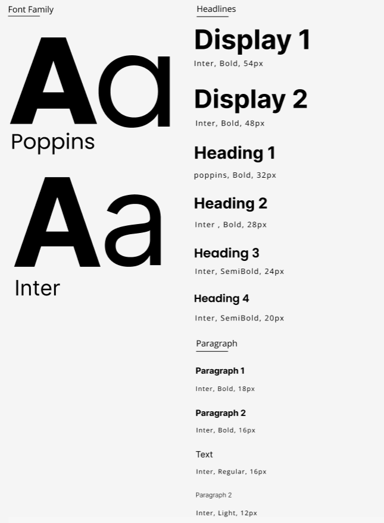

#### Colors

Elegimos los siguientes colores buscando plasmar una paleta que influya seguridad y profesionalismo:

<p align="center">
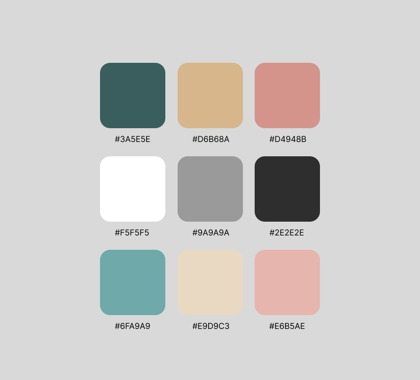
</p>

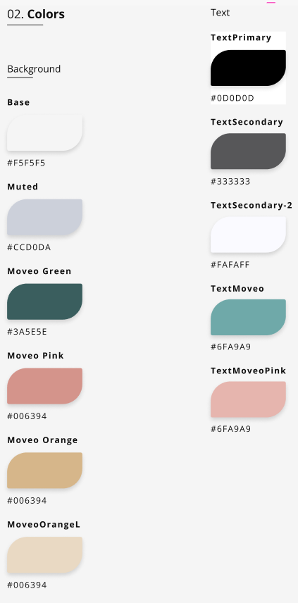


#### Spacing

En este proyecto el espaciado cumple un papel clave para mantener la legibilidad y la accesibilidad. Por ello:

* Párrafos: Se añade un espacio equivalente a una línea completa entre cada uno, lo que facilita distinguir las ideas.

* Elementos interactivos: Se deja entre 8 y 12 píxeles de separación en botones, enlaces u otros componentes, reduciendo posibles errores en dispositivos táctiles.

* Márgenes y padding: Se aplican márgenes de 16 a 24 píxeles alrededor del contenido, evitando que la interfaz se vea saturada.
  
#### Communication Tone

| Dimensión              | Nivel Adoptado    |
|------------------------|-------------------|
| Divertido/Serio        | Medio-Serio       |
| Formal/Casual          | Semi-Formal       |
| Respetuoso/Irreverente | Muy Respetuoso    |
| Entusiasta/Sereno      | Sereno y Empático |

Decidimos mantener una comunicación clara, cálida y profesional, porque este enfoque nos permite conectar de manera efectiva con el público, especialmente en un contexto tan sensible como la seguridad del usuario. 

### 4.1.2. Web Style Guidelines.

Para garantizar que la página se adapte a diferentes tamaños de pantalla y mantenga una presentación clara y atractiva, se empleará CSS con el apoyo de media queries. De esta manera, será posible definir estilos específicos según la resolución del dispositivo. Elementos clave como la barra de navegación y el pie de página se ajustarán automáticamente, ofreciendo una experiencia consistente en cualquier dispositivo. Los puntos de quiebre definidos son los siguientes:

| Dispositivo     | Ancho mínimo | Ejemplo de uso            |
|-----------------|--------------|----------------------------|
| Mobile          | ≥ 320px      | Teléfonos                  |
| Tablet          | ≥ 768px      | iPad / tablets genéricas   |
| Laptop  | ≥ 1024px     | Monitores y laptops        |
| Wide Screen     | ≥ 1440px     | Pantallas grandes o TV     |

## 4.2. Information Architecture.

### 4.2.1. Organization Systems.

Nuestro propósito es garantizar una experiencia de usuario coherente y sin fricciones en la plataforma web, tanto en la versión de sobremesa como la versión móvil. La estructura visual que presentamos ha sido diseñada estratégicamente para responder a las necesidades de nuestros dos segmentos principales.

Si bien ambos acceden a las mismas secciones, la diferencia radica en los niveles de permiso. Los dueños pueden prestar el transporte, ofrecer rutas de aventuras y prestar servicios adicionales, mientras que los inquilinos cuentan únicamente con acceso a la visualización de autos, aventuras y servicios disponibles, además de la posibilidad de filtrar por locación, fecha y/o cantidad de personas.

<p align="center">

</p>

Como se ve en el diagrama, se sigue un proceso estructurado para facilitar la gestión de la salud de los pacientes, permitiendo la interacción entre médicos y familiares. Aquí explicamos cada etapa del proceso y las funciones disponibles:

1. **Landing Page**: Es la página de inicio donde los usuarios pueden explorar la aplicación y conocer sus beneficios.

2. **Inicio**: Los usuarios pueden iniciar sesión si ya tienen una cuenta o registrarse como nuevos usuarios.

3. **Registro**:
   - **Crear Cuenta**: Los nuevos usuarios ingresan sus datos manualmente.
   - **Registrarse con Google**: Opción para facilitar el acceso mediante una cuenta de Google.
   - **Llenar Datos**: Se completa un formulario con información personal.

4. **Inicio de Sesión**: Los usuarios existentes ingresan sus credenciales para acceder a la plataforma.

5. **Página Principal**: Una vez dentro, los usuarios pueden acceder a diversas funcionalidades.

6. **Autos**: Los usuarios pueden ver autos disponibles.

7. **Aventuras**: Rutas por auto creadas por personas hacia diversos destinos con alguna temática.

8. **Servicios**: Servicios brinda.

9. **Conviertete en dueño**: Complementa la experiencia de alquiler, ofreciendo beneficios adicionales que mejoran la seguridad, comodidad y confianza del usuario.

10. **Perfil**: Configuración de la cuenta, donde los usuarios pueden actualizar su información personal.

Este flujo de trabajo permite que los médicos tomen decisiones informadas sobre la salud del paciente y que los familiares estén al tanto de su evolución.

### 4.2.2. Labeling Systems.

Los sistemas de etiquetado seguirán la misma estructura presentada en Organization Systems. El usuario podrá seleccionar el encabezado de su interés y, al hacer clic, será dirigido automáticamente a la sección correspondiente dentro de la plataforma.

| **Sección**  | **Contenido** |
|-------------|--------------|
| **Página Principal** | Es el primer punto de contacto con Moveo. Aquí se introduce la aplicación, explicando su propósito, misión y visión, además de resaltar esta manera de alquilar automóviles. |
| **About** | Proporciona una descripción detallada de las herramientas y funcionalidades que ofrece Moveo. Se explican los módulos principales, cómo interactúa el dueño de automóvil y el arrendador, y los beneficios del uso de la aplicación. |
| **Contacto** | Espacio donde los usuarios pueden encontrar los canales de comunicación con el equipo de soporte. Se incluyen redes sociales, un correo de asistencia técnica y un correo para consultas de negocios o colaboraciones. |

##### Secciones y contenido de Moveo

| **Sección**  | **Contenido** |
|-------------|--------------|
| **Autos** | Esta es la página principal en la que tambipen contiene la selección de autos disponibles para alquilar. |
| **Aventuras** | Sección donde los usuarios pueden publicar rutas personalizadas con actividades planeadas y destinos diferentes. |
| **Servicios** | Espacio dedicado a multiples servicios automovilisticos seleccionables . |
| **Conviertete en dueño** | Permite al usuario poner su auto en alquiler, publicar una aventura o publicar un servicio. |
| **Perfil** | Sección para la administración del perfil del usuario, permitiendo la actualización de datos personales, preferencias y configuración de accesibilidad. |

### 4.2.3. SEO Tags and Meta Tags

La **Landing Page** está diseñada para atraer nuevos usuarios, informar sobre la propuesta de valor y generar confianza en la marca.  Las etiquetas meta se centran en captar tráfico orgánico de personas interesadas en alquilar un auto, ir de viaje manejando o buscando un servicio automovilístico.


**Título de la página (Title)**

El título resume de forma directa el propósito del sitio, incluyendo las palabras clave **"autos"**, **"alquilar"** y **"seguro"**, que son términos con alta relevancia SEO para nuestro público objetivo.

```html
<title>Moveo – Alquilar autos de manera segura</title>
```

**Meta descripción (Meta Description)**

La meta descripción ofrece una vista clara del valor que ofrece la plataforma, motivando al clic desde los resultados de búsqueda.

```html
<meta name="description" content="Moveo es una plataforma digital que mejora la seguridad al alquilar autos, brindadndo viajes y servicios automovilísticos.">
```

**Palabras clave (Meta Keywords)**

Los términos elegidos cubren conceptos clave relacionados con el contexto de uso de Moveo, permitiendo un mayor alcance en búsquedas asociadas.

```html
<meta name="keywords" content="autos, alquiler, viajes, actividades, plataforma digital, aventuras, servicios automovilísticos">
```


**Autor del sitio (Meta Author)**

La etiqueta autor identifica al equipo creador, útil para fines de propiedad y referencia en motores de búsqueda.

```html
<meta name="author" content="Moveo Team">
```


### 4.2.4. Searching Systems.

La plataforma Moveo incorpora un sistema de búsqueda global que permite a los usuarios encontrar rápidamente lo que necesitan sin importar en qué sección se encuentren.

#### **Busqueda Global**

* Disponible en la barra superior de navegación en todas las páginas.
* El usuario puede escribir palabras clave como “SUV Lima”, “aventura playa” o “servicio mantenimiento”.
* El motor de búsqueda devuelve resultados clasificados por secciones:
  * Autos disponibles
  * Aventuras creadas por otros usuarios
  * Servicios automovilísticos
  * Usuarios/Dueños (en caso de búsqueda por nombre o alias)

#### **Filtrado de información**

* En cada sección principal (Autos, Aventuras, Servicios), los usuarios disponen de filtros específicos:
  * **Autos**: por ubicación, tipo de vehículo (sedán, SUV, deportivo), precio por día, transmisión (manual/automática), y valoraciones de otros usuarios.
  * **Aventuras**: por destino, temática (playa, montaña, ciudad), duración y popularidad.
  * **Servicios**: por tipo (lavado, mantenimiento, chofer privado, asistencia en carretera) y disponibilidad.
* Los filtros se combinan con la búsqueda global para entregar resultados personalizados y relevantes.

### 4.2.5. Navigation Systems.

Organizamos las secciones, permitiendo a los usuarios desplazarse sin dificultad entre distintas funcionalidades. La navegación está basada en una barra de menú principal, accesos rápidos y una estructura jerárquica clara que guía al usuario en su recorrido.

#### **Estructura de Navegación en la Landing Page**
 La landing page consta de las siguientes secciones principales:

 | **Sección**  | **Contenido** |
|-------------|--------------|
| **Página Principal** | Introduce Moveo, su propósito, misión y visión. Desde aquí, los usuarios pueden acceder rápidamente a las funciones clave. |
| **About** | Explica las herramientas principales de Moveo, cómo funcionan y cómo beneficia a los usuarios. |
| **Contacto** | Incluye enlaces a redes sociales, un correo de asistencia técnica y otro para consultas de negocio. |

#### **Estructura de Navegación en Moveo**
 La aplicación consta de las siguientes secciones principales:

 | **Sección**  | **Contenido** |
|-------------|--------------|
| **Autos** | Muestra de manera simple los carros disponibles y a la vez divididos por categorías. |
| **Aventuras** | Proporciona rutas personalizadas con actividades planeadas y destinos diferentes. |
| **Servicios** | Sección enfocada en brindar una variedad de opciones de servicios automotrices disponibles para selección. |
| **Conviertete en dueño** | Espacio donde el usuario puede publicar su automóvil para alquiler, proponer rutas personalizadas o agregar servicios complementarios. |
| **Perfil** | Área dedicada al control del perfil del usuario, con herramientas para mantener actualizados los datos, preferencias y accesos personalizados. |


### 4.3.1. Landing Page Wireframe

> ** Enlace al prototipo interactivo en Figma:**  
> https://www.figma.com/proto/c6kJu6j0YZv51u6Ml2kypY/Moveo-Landing-Mockup?node-id=1-2&p=f&t=oOjM7PCRDBGHla3t-1&scaling=scale-down&content-scaling=fixed&page-id=0%3A1&starting-point-node-id=4006%3A1560

Los wireframes representan la estructura básica y funcional de la landing page de **Moveo**, sin elementos visuales finales. Su objetivo es definir la jerarquía de contenido, los flujos de navegación y la disposición de componentes clave antes de pasar al diseño visual.

---

#### Header y Hero
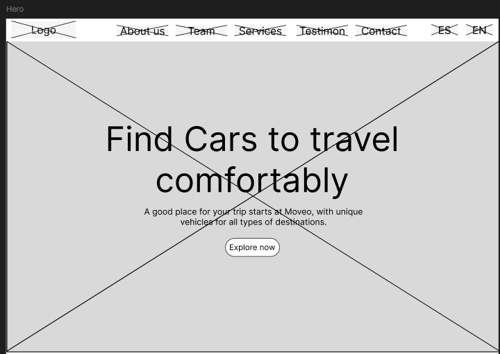  
*Define la primera impresión del usuario: logo, menú de navegación, llamado a acción principal (“Alquila tu auto” o “Encuentra tu viaje”) y espacio para imagen/video hero. Diseñado para captar atención en menos de 3 segundos.*

---

#### What is Moveo
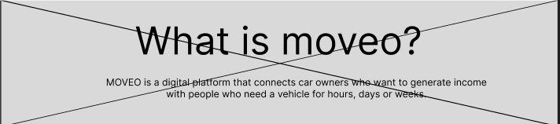  
*Sección explicativa que comunica el valor central de Moveo: conectar propietarios e inquilinos con confianza, transparencia y tecnología. Incluye iconografía simple y bullets de beneficios.*

---

#### Team Members
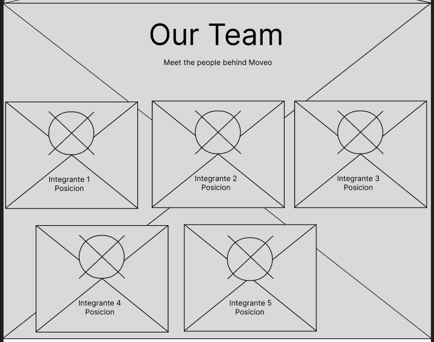  
*Muestra al equipo fundador o clave. Construye confianza y humaniza la marca. Cada tarjeta incluye foto, nombre, rol y redes sociales.*

---

#### Services
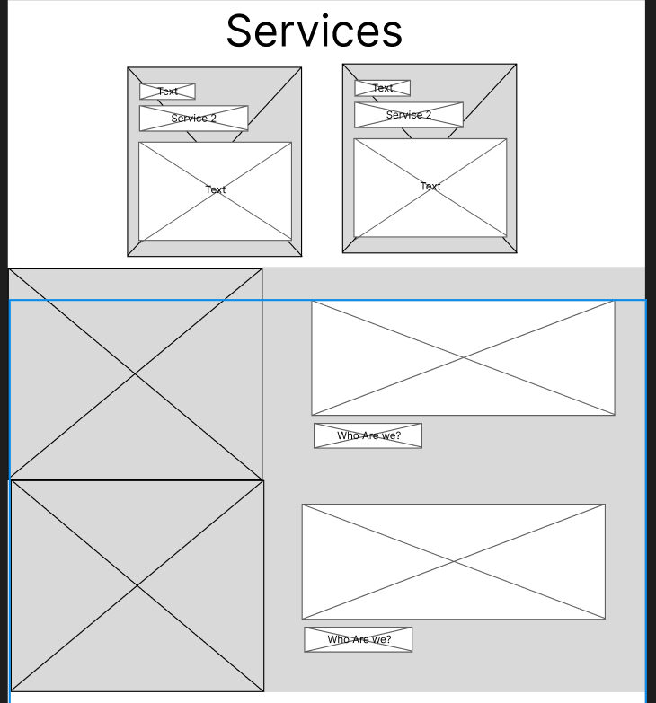  
*Presenta los servicios principales: alquiler de autos, aventuras guiadas, seguros integrados. Usa tarjetas modulares con ícono, título y descripción corta.*

---

#### Moveo Services — Learn More
  
*Sección de profundización: explica cómo funciona la plataforma, pasos para alquilar o listar un auto, y garantías de seguridad. Incluye botones de CTA secundarios.*

---

#### Impacto de Moveo
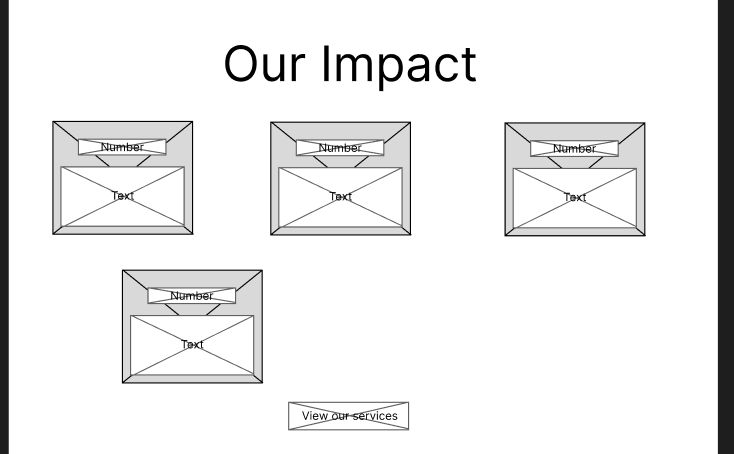  
*Visualiza métricas de impacto: “+500 autos listados”, “+2000 viajes realizados”, “98% de satisfacción”. Refuerza credibilidad y escala.*

---

#### Footer
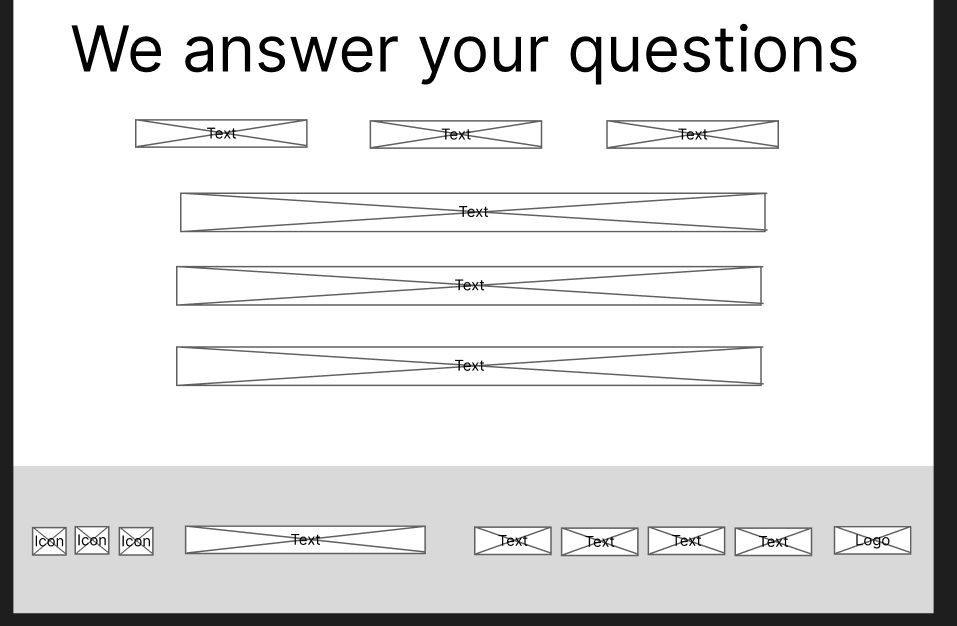  
*Contiene enlaces legales, contacto, redes sociales, newsletter y logos de partners o certificaciones. Es la base de confianza y cierre de la página.*

---

### 4.3.2. Landing Page Mock-up

> ** Enlace al diseño final en Figma:**  
> https://www.figma.com/design/JCgS0FsRQH1cDtJ1FkeWuZ/MOVEO?node-id=0-1&t=4ws5TAukXrjL9hsQ-1

Los mock-ups son la versión visual final de la landing page, con colores, tipografías, imágenes reales y microinteracciones definidas. Representan la identidad de marca y la experiencia estética que el usuario final verá.

---

#### Header y Hero
  
*Hero impactante con fondo dinámico (auto en movimiento), tipografía bold, botón principal con sombra y hover effect. Transmite energía, libertad y confianza.*

---

#### What is Moveo
  
*Diseño limpio con ilustraciones vectoriales, gradientes suaves y cards con sombras sutiles. Comunica profesionalismo y cercanía.*

---


#### Moveo Services — Learn More
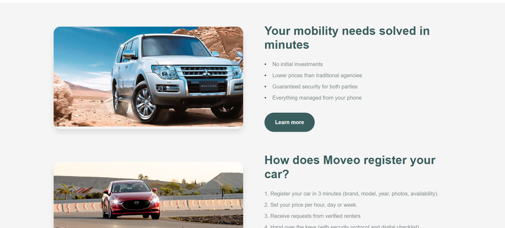  
*Sección con fondo dividido, ilustración a la izquierda y texto a la derecha. Botones con estados hover y focus definidos. Microcopy persuasivo y claro.*

---

#### Impacto de Moveo
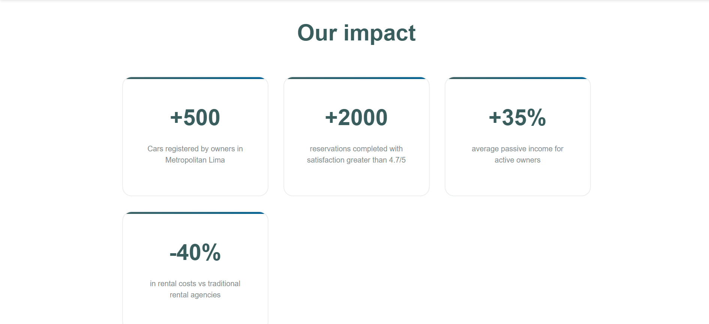  
*Números grandes en negrita, íconos animados al scroll, fondo con textura sutil. Diseñado para generar asombro y validación social.*

---

#### Footer
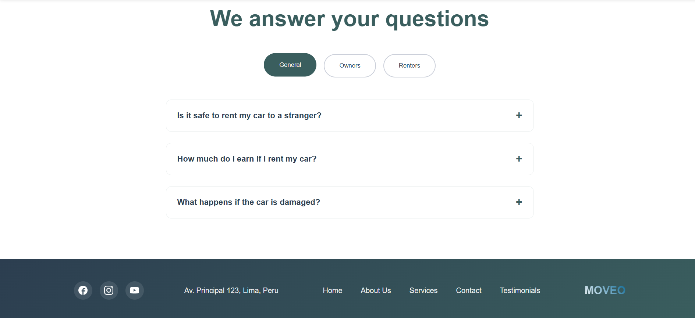  
*Fondo oscuro, texto claro, separadores sutiles. Incluye logo pequeño, links organizados en columnas, formulario de newsletter con validación visual y redes con íconos hover.*

---

## 4.4. Web Applications UX/UI Design

### 4.4.1. Web Applications Wireframes

<p align="center">
  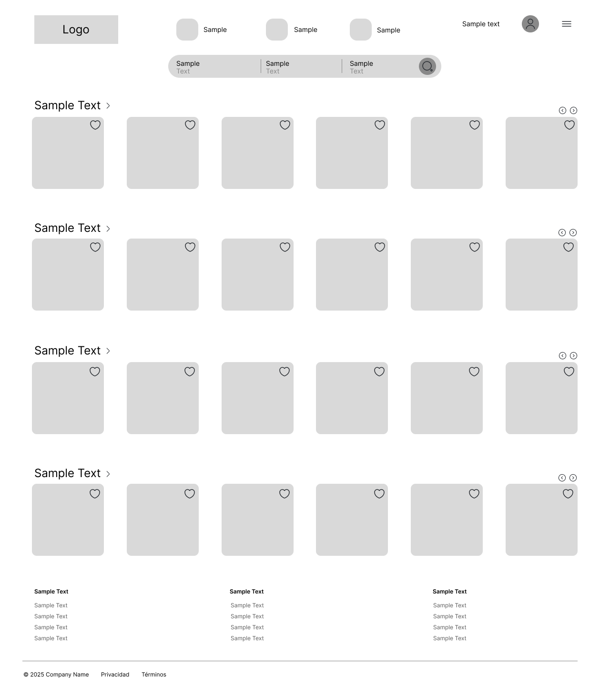
</p>
*Wireframe de la pantalla principal de la app: feed de autos disponibles, filtros superiores (ubicación, fechas, tipo de auto), barra de navegación inferior. Enfoque en funcionalidad y flujo de búsqueda.*

<p align="center">
  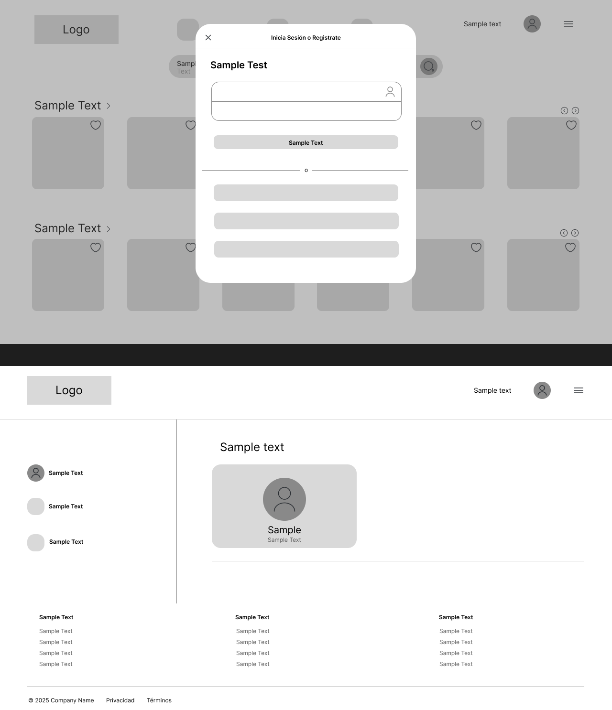
</p>
*Wireframe del perfil de usuario y detalle de auto: información del dueño, fotos, reseñas, botón de reserva, sección de preguntas frecuentes. Define la estructura de toma de decisión.*

---

### 4.4.2. Web Applications Wireflow Diagrams

<p align="center">
  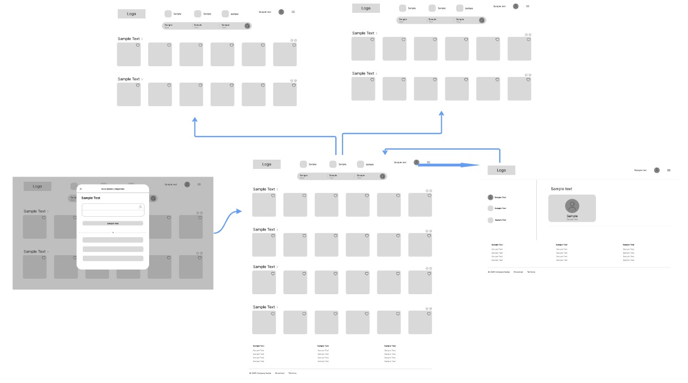
</p>
*Mapa visual del flujo completo del usuario: desde el onboarding → búsqueda → reserva → pago → entrega → calificación. Identifica puntos críticos y oportunidades de mejora en la experiencia.*

---

### 4.4.3. Web Applications Mock-ups

<p align="center">
  
</p>
*Diseño visual final de la aplicación móvil. Paleta de colores vibrante pero profesional, tipografía legible, componentes con estados interactivos (presionado, cargando, error). Refleja la identidad de marca en cada pantalla.*

---

### 4.4.4. Web Applications User Flow Diagrams

<p align="center">
  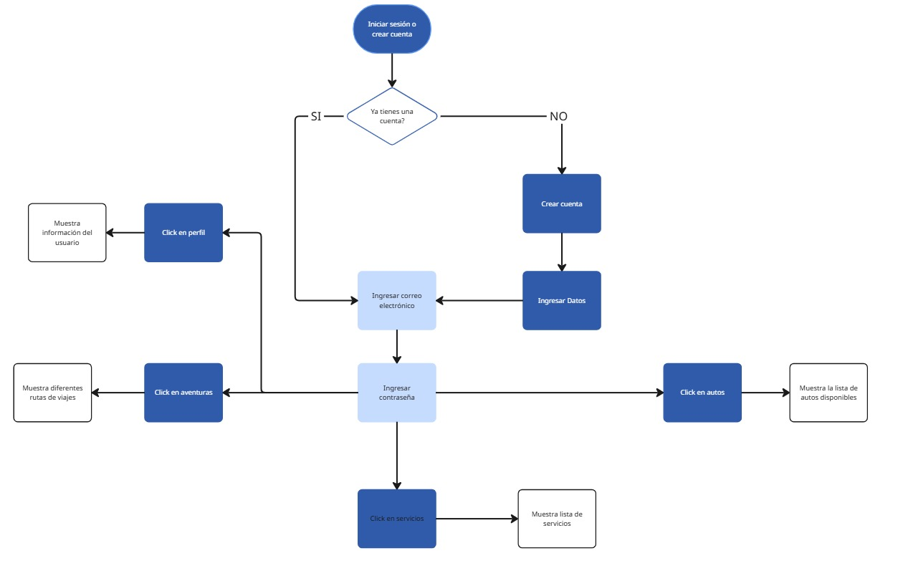
</p>
*Diagrama detallado de los caminos que sigue un usuario para completar tareas clave: “Reservar un auto en 3 clics”, “Publicar mi auto en 5 pasos”, “Dejar una reseña”. Sirve para validar usabilidad y eliminar fricciones.*

---

## 4.5. Web Applications Prototyping

<p align="center">
  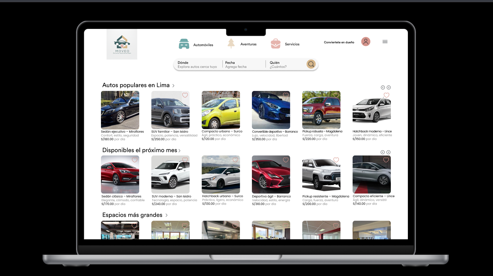
</p>
*Prototipo interactivo de alta fidelidad. Permite simular la navegación real entre pantallas, probar transiciones, microinteracciones y flujos completos. Herramienta esencial para pruebas de usabilidad con usuarios reales antes del desarrollo.*

> **Enlace al prototipo interactivo en Figma:**  
> https://www.figma.com/proto/c6kJu6j0YZv51u6Ml2kypY/Moveo-Landing-Mockup?node-id=1-2&p=f&t=oOjM7PCRDBGHla3t-1&scaling=scale-down&content-scaling=fixed&page-id=0%3A1&starting-point-node-id=4006%3A1560

---

## 4.6. Domain-Driven Software Architecture

### 4.6.1. Software Architecture Context Diagram

<p align="center">
  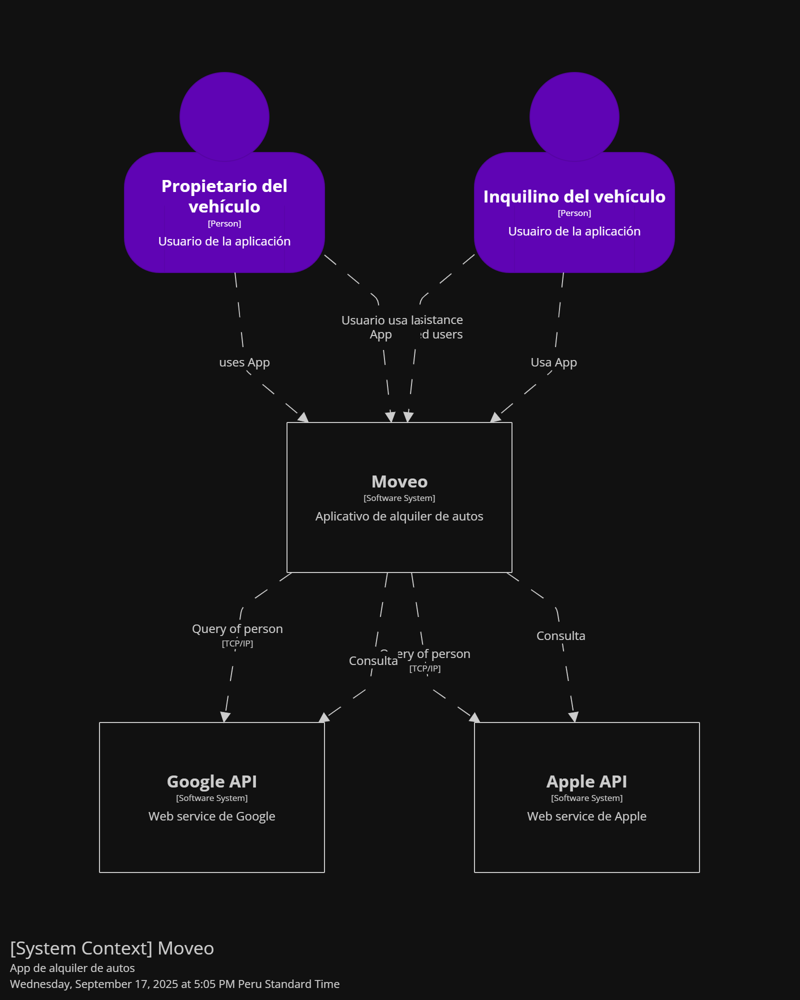
</p>
*Diagrama de contexto que muestra cómo Moveo se relaciona con actores externos: usuarios (propietarios e inquilinos), sistemas de pago (Yape, Plin), servicios de geolocalización, y notificaciones push. Define los límites del sistema.*

---

### 4.6.2. Software Architecture Container Diagrams

<p align="center">
  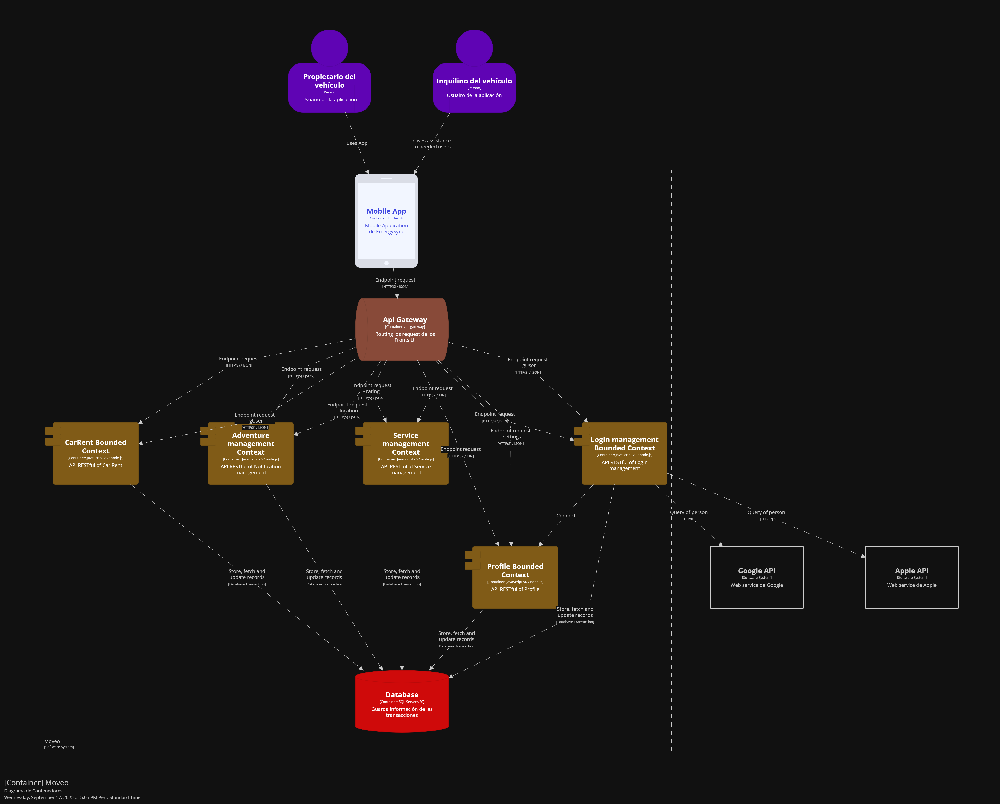
</p>
*Desglosa la arquitectura en contenedores: frontend (React), backend (.net), base de datos (PostgreSQL), almacenamiento de archivos (AWS S3), y servicios externos (Firebase Auth, Cloudinary). Muestra cómo se comunican entre sí.*

---

### 4.6.3. Software Architecture Components Diagrams

**UserBC (User Bounded Context):**
<p align="center">
  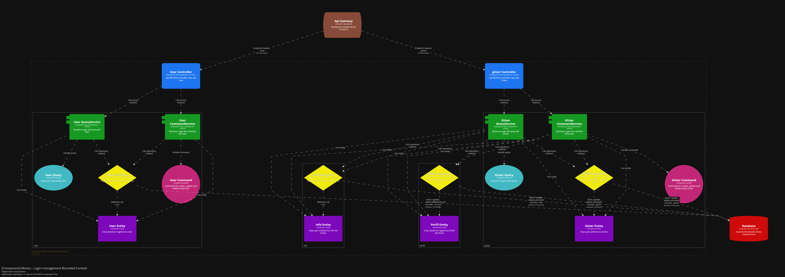
</p>
*Gestiona autenticación, autorización y perfiles de usuario. Componentes clave: AuthService, UserService, RoleManager.*

**ProfileBC (Profile Bounded Context):**
<p align="center">
  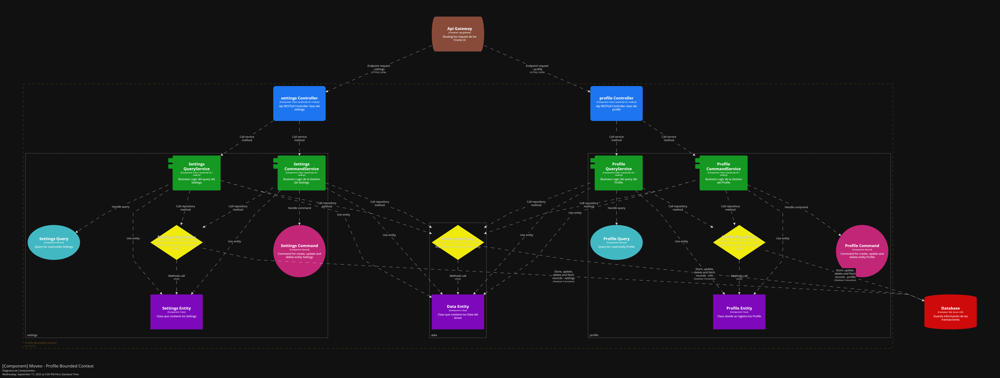
</p>
*Maneja la información detallada del usuario: documentos subidos, historial de alquileres, reputación, preferencias. Componentes: ProfileService, DocumentValidator, ReputationEngine.*

**CarRentBC (Car Rental Bounded Context):**
<p align="center">
  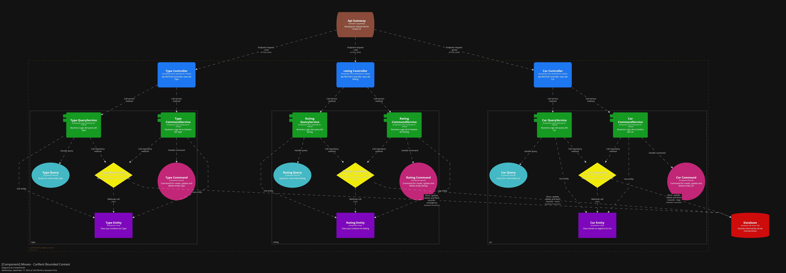
</p>
*Core del negocio: listado de autos, reservas, pagos, contratos digitales. Componentes: CarListingService, BookingManager, PaymentGateway, ContractGenerator.*

**AdventureBC (Adventure Bounded Context):**
<p align="center">
  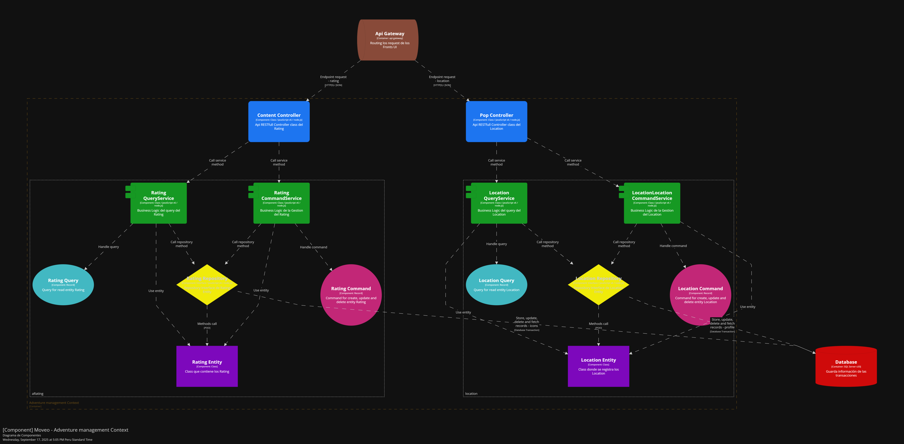
</p>
*Opcional: gestiona paquetes de “aventuras” (rutas turísticas, guías, seguros especiales). Componentes: AdventureCatalog, RoutePlanner, GuideMatcher.*

**ServiceBC (Service Bounded Context):**
<p align="center">
  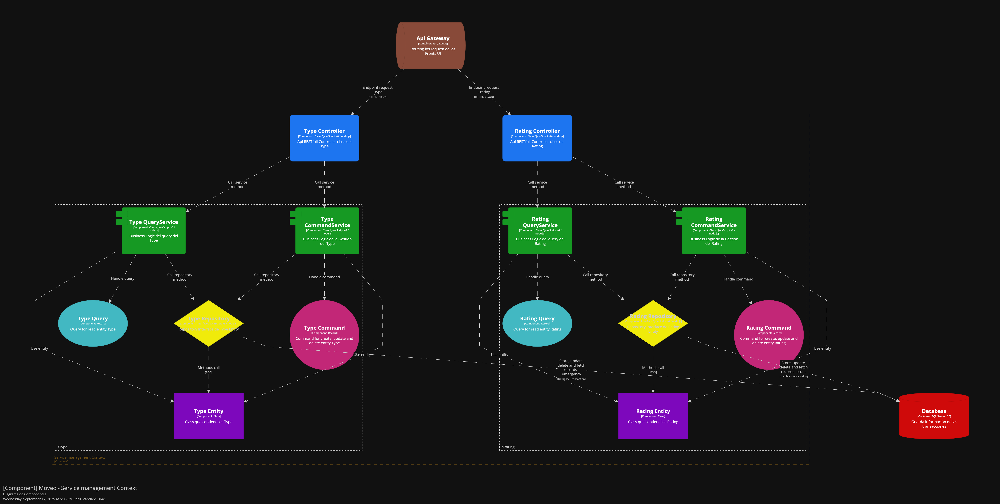
</p>
*Maneja servicios transversales: notificaciones, alertas, soporte, reportes. Componentes: NotificationService, AlertEngine, SupportTicketSystem.*

---

## 4.7. Software Object-Oriented Design

### 4.7.1. Class Diagrams

<p align="center">
  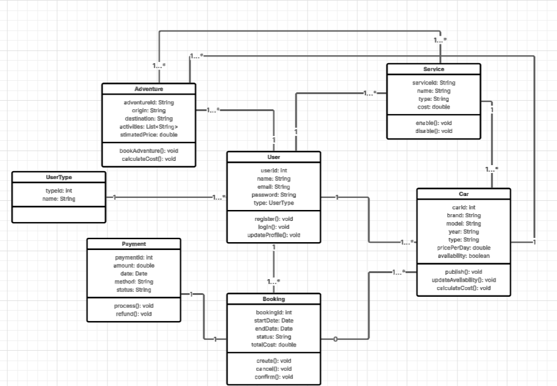
</p>
*Diagrama UML que modela las clases principales del sistema: User, Car, Booking, Payment, Review, Document, etc. Muestra atributos, métodos, relaciones (herencia, asociación, agregación) y responsabilidades. Base para el desarrollo orientado a objetos.*

---

## 4.8. Database Design

### 4.8.1. Database Diagram

<p align="center">
  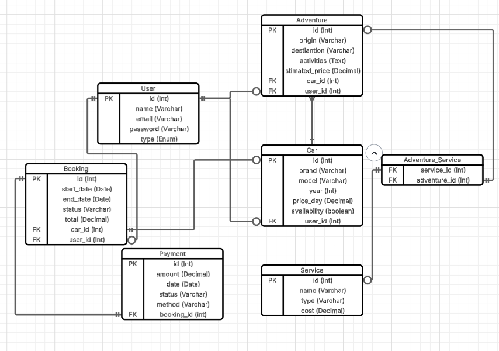
</p>
*Modelo entidad-relación (ERD) de la base de datos. Tablas principales: users, cars, bookings, payments, reviews, documents, notifications. Muestra claves primarias, foráneas, índices y relaciones (1:1, 1:N, N:M). Optimizado para consultas de reserva, reputación y reportes.*

## Capítulo V: Product Implementation

### 5.1. Software Configuration Management

A lo largo del desarrollo del proyecto, aplicaremos las siguientes normas o convenciones con el fin de garantizar la coherencia y uniformidad en todas las etapas:

| Contexto | Convención |
|----------|------------|
| El nombre de archivos creados en el proyecto | Todos los archivos se nombrarán en minúsculas, utilizando guiones bajos o puntos para separar componentes (ej. `user-service.cs`, `config.json`). |
| Convención de nomenclatura | Las propiedades de un objeto se nombrarán en `PascalCase`, las funciones y variables en `lowerCamelCase`, y las clases también en `PascalCase`. |
| Convención de estructura de código | Se organizará el proyecto en carpetas lógicas por módulos (ej. `Models/`, `Services/`) para facilitar la navegación y el mantenimiento. |
| Convención de estilos de codificación | Seguir las convenciones de codificación de Microsoft C#, es decir usar espacios en blanco para mejorar legibilidad, convenciones de nombre para clases, funciones, constantes; y también usar nombres claros o lógicos para variables. |
| Convención de documentación | Todo el código relevante —especialmente funciones complejas, clases y APIs— debe estar documentado con comentarios claros, concisos y actualizados. Los comentarios deben explicar el “por qué”, no solo el “qué”. |
| Convención de control de versiones | Se utilizará el flujo de trabajo **Git Flow** junto con las convenciones de **Conventional Commits**. Todos los mensajes de commit estarán en inglés y seguirán el formato: `<type>(<scope>): <description>`. Ejemplos: <ul><li>`feat(auth): add email validation`</li><li>`fix(login): resolve session timeout bug`</li><li>`chore(deps): update Newtonsoft.Json to v13.0.3`</li></ul> Las ramas se organizarán como: `main` (estable), `develop` (integración), y ramas de características (`feature/`), correcciones (`bugfix/`) o hotfixes (`hotfix/`). Cada cambio se desarrolla en una rama independiente y se fusiona mediante pull request revisado por al menos un compañero. |
| Convención de gestión de dependencias | En el caso de C# usaremos el administrador de paquetes NuGet |
| Convención de pruebas | Utilizar comentarios descriptivos y claros para explicar el propósito del test y codigo. |
| Convención de seguridad |Encriptar las contraseñas de los usuarios con distintos algoritmos. Implementar sistema de autenticación seguro para proteger el acceso al sistema. Instalar librerías para validar la información ingresada por el usuario en los formularios. |
| Convención de colaboración y comunicación | <ul><li>Se utilizará **Discord** como plataforma principal  para llamadas o reuniones.</li><li>Se realizarán reuniones semanales sincrónicas para revisar avances, resolver bloqueos y compartir aprendizajes.</li><li>Se fomentará una cultura de retroalimentación constructiva, colaboración activa y aprendizaje mutuo a partir de errores y mejores prácticas.</li></ul> |
#### 5.1.1. Software Development Environment Configuration

En esta sección, se explican los softwares utilziados para el desarrollo de nuestra solución.


|Nombre de Producto|Descripción|Propósito de Uso|Categoría|Ruta Descarga o Link|
|---|---|---|---|---|
| Vue 3                   | Framework progresivo de JavaScript para construir interfaces de usuario modernas y reactivas. Vue 3 introduce mejoras significativas en rendimiento, tamaño del bundle y reactividad con el sistema de reactividad basado en Proxy. Ideal para SPAs y aplicaciones escalables.                           | Nuestro propósito de uso es desarrollar interfaces frontend dinámicas, modulares y altamente interactivas, aprovechando la simplicidad de Vue, su ecosistema robusto (Vue Router, Pinia, Vite) y su integración fluida con herramientas modernas de desarrollo, permitiendo un ciclo de desarrollo ágil y mantenible. | Software Development    | https://vuejs.org/                            |
| Microsoft .NET          | Plataforma de desarrollo gratuita, multiplataforma y de código abierto para construir aplicaciones web, móviles, de escritorio, microservicios y APIs. Compatible con Windows, Linux y macOS. Incluye bibliotecas, lenguajes y herramientas para todo el ciclo de vida del desarrollo.                  | Nuestro propósito de uso es construir servicios backend robustos, escalables y de alto rendimiento utilizando .NET 8 (o superior), aprovechando su soporte para APIs REST, gRPC, Entity Framework Core y su integración nativa con Azure, garantizando productividad y estabilidad en entornos empresariales.      | Software Development    | https://dotnet.microsoft.com/download         |
| C#                      | Lenguaje de programación moderno, orientado a objetos y de tipado estático, desarrollado por Microsoft como parte de la plataforma .NET. Es conocido por su claridad, seguridad y potencia para construir desde aplicaciones simples hasta sistemas empresariales complejos.                            | Nuestro propósito de uso es implementar la lógica de negocio de nuestros servicios backend con C# 12 (o superior), aprovechando sus características avanzadas (record types, pattern matching, async/await) para escribir código limpio, mantenible y eficiente dentro del ecosistema .NET.                         | Software Development    | Incluido en .NET SDK: https://dotnet.microsoft.com/download |
| JetBrains WebStorm      | IDE especializado en desarrollo web moderno, con soporte integral para JavaScript, TypeScript, Vue, HTML/CSS y herramientas de depuración, linting y refactorización inteligente.                                                                                                        | Nuestro propósito de uso es desarrollar interfaces frontend complejas con Vue 3 y TypeScript, aprovechando su autocompletado avanzado, navegación rápida, integración con terminal y debugging en tiempo real, sin necesidad de plugins adicionales.                                                              | Software Development    | https://www.jetbrains.com/webstorm/           |
| Postman                 | Plataforma colaborativa para diseñar, probar, documentar y monitorear APIs. Ofrece colecciones, entornos, pruebas automáticas, mocks, documentación dinámica y soporte para MCP (Model Context Protocol) para IA.                                                                                          | Nuestro propósito de uso es validar endpoints de nuestros servicios .NET, crear y mantener documentación actualizada, compartir colecciones con el equipo, y automatizar pruebas de integración y regresión, eliminando la dependencia de herramientas externas.                                                  | Software Development    | https://www.postman.com/downloads/ \| https://identity.getpostman.com/login — Disponible como app de escritorio y SaaS. |
| UXPressia               | Plataforma visual para crear mapas de experiencia del usuario (journey maps), personas y servicios, con plantillas profesionales, exportación a PDF/PPTX y vinculación con datos en tiempo real.                                                                                                           | Nuestro propósito de uso es comprender y comunicar de forma visual el recorrido del usuario, identificar puntos de dolor, alinear equipos no técnicos y fundamentar decisiones de diseño con evidencia centrada en el cliente.                                                                                       | Product UX/UI Design    | https://uxpressia.com/                        |
| Lucidchart              | Plataforma de diagramación visual con soporte para IA, diagramas C4, arquitectura de sistemas, flujos de proceso, ERD, org charts y más. Permite colaboración en tiempo real e integración con Jira, Confluence, Notion, etc.                                                                                 | Nuestro propósito de uso es documentar y comunicar la arquitectura del sistema mediante diagramas claros, visuales y actualizables, facilitando la comprensión entre desarrolladores, testers y stakeholders no técnicos.                                                                                            | Product UX/UI Design    | https://www.lucidchart.com/                   |
| Structurizr             | Herramienta basada en "diagramas como código" (Diagrams as Code) para modelar arquitecturas de software según el modelo C4. Usa DSL para definir elementos, relaciones y vistas, generando diagramas interactivos automáticamente.                                                                           | Nuestro propósito de uso es documentar nuestra arquitectura de manera sistemática, reproducible y mantenible, siguiendo el modelo C4, y generar automáticamente diagramas de contexto, contenedores, componentes y código, integrados con nuestro repositorio.                                                       | Software Documentation  | https://structurizr.com/                      |
| JetBrains Toolbox App   | Aplicación centralizada para gestionar, actualizar y ejecutar múltiples IDEs de JetBrains (Rider, WebStorm, IntelliJ, etc.) en paralelo, con soporte para EAP, Canary, actualizaciones automáticas y apertura rápida de proyectos.                                                                          | Nuestro propósito de uso es administrar de forma unificada nuestras herramientas de desarrollo (Rider para .NET, WebStorm para frontend), mantener versiones estables y experimentales simultáneamente, y evitar instalaciones manuales o conflictos entre versiones.                                              | Software Development    | https://www.jetbrains.com/es-es/toolbox-app/ — Instala y gestiona Rider, WebStorm y otros IDEs de JetBrains. |
| Git                     | Sistema de control de versiones distribuido creado por Linus Torvalds, fundamental para el seguimiento de cambios, colaboración en equipo y gestión de ramas en proyectos de software.                                                                                                                    | Nuestro propósito de uso es llevar un historial confiable de todos los cambios en el código, facilitar la colaboración entre desarrolladores, gestionar ramas de característica y corrección, y permitir el rollback seguro ante errores.                                                                          | Software Development    | https://git-scm.com/downloads — Se instala localmente; se usa junto con GitHub para colaboración remota. |
| GitHub                  | Plataforma de desarrollo colaborativo basada en Git, que permite gestionar repositorios, realizar pull requests, revisiones de código, seguimiento de issues y alojar documentación. Esencial para workflows ágiles y CI/CD.                                                                               | Nuestro propósito de uso es centralizar el código, facilitar la revisión colaborativa, gestionar ramas de desarrollo y correción, y actuar como fuente única de verdad para el ciclo de vida del producto digital, sin usar GitHub Desktop.                                                                       | Software Development    | https://github.com/ — Plataforma SaaS. No se instala; se accede exclusivamente por web. |
| MySQL                   | Sistema de gestión de bases de datos relacional (RDBMS) de código abierto, ampliamente utilizado en producción. Ofrece alta disponibilidad, seguridad y rendimiento para aplicaciones empresariales.                                                                                                       | Nuestro propósito de uso es almacenar, consultar y gestionar datos estructurados de forma confiable, escalable y segura, utilizando MySQL Server 8.0 como base de datos principal para servicios backend.                                                                                                            | Software Development    | https://www.mysql.com/ \| https://dev.mysql.com/downloads/installer/ — Se puede usar localmente (installer) o en la nube (MySQL HeatWave). |
| MySQL Installer         | Asistente gráfico para instalar MySQL Server, MySQL Workbench y otros componentes en Windows. Único instalador oficial para MySQL 8.0 y versiones anteriores. A partir de MySQL 8.1, se recomienda usar MSI o Zip directamente.                                                                            | Nuestro propósito de uso es facilitar la instalación y configuración inicial de MySQL Server y herramientas asociadas (como Workbench) en entornos locales de desarrollo, garantizando una configuración correcta y consistente entre miembros del equipo.                                                              | Software Development    | https://dev.mysql.com/downloads/installer/ — Solo para MySQL 8.0 y versiones anteriores. Para nuevas versiones, usar MSI/ZIP. |
| MySQL Workbench         | Herramienta visual de diseño, desarrollo y administración de bases de datos MySQL. Permite crear modelos E/R, ejecutar consultas SQL, gestionar usuarios y sincronizar esquemas.                                                                                                                          | Nuestro propósito de uso es diseñar y modificar el esquema de la base de datos de forma visual, generar scripts SQL, y ejecutar consultas de prueba y validación durante el desarrollo de servicios backend.                                                                                                        | Software Development    | Incluido en: https://dev.mysql.com/downloads/installer/ — No se instala por separado si ya se usa el instalador completo. |
| Postman CLI / Newman    | Herramientas de línea de comandos para ejecutar colecciones de Postman en entornos de CI/CD. Newman es compatible con Jenkins, GitHub Actions, etc. El CLI de Postman permite validar APIs, hacer lints y autenticación programática.                                                                     | Nuestro propósito de uso es integrar pruebas de API en pipelines de integración continua (CI), asegurar calidad automática en cada commit, y validar contratos de API sin intervención manual.                                                                                                                       | Software Deployment     | https://learning.postman.com/docs/developer/postman-cli/ \| https://github.com/postmanlabs/newman — Se instalan vía npm (`npm install -g newman postman`) |


#### 5.1.2. Source Code Management

En esta sección se describe el esquema de control de versiones adoptado para el seguimiento y gestión del código  fuente del proyecto, utilizando GitHub como plataforma centralizada de colaboración.
Los repositorios del proyecto se encuentran en la organización de GitHub del equipo:

Además, se han definido repositorios independientes para cada componente del sistema, según su funcionalidad:

- Reporte: https://github.com/UPC-1ASI0732-2610-17821-PointFlavor/MOVEO-Report.git 

- Landing Page: https://github.com/UPC-1ASI0732-2610-17821-PointFlavor/MOVEO-Landing-Page.git 

- Frontend Web Application (Vue + Vite): https://github.com/UPC-1ASI0732-2610-17821-PointFlavor/MOVEO-Frontend.git 

- Backend Web Service (RESTful API - .NET): https://github.com/UPC-1ASI0732-2610-17821-PointFlavor/MOVEO-Backend.git 


#### Estructura de Ramas (GitFlow)
Se implementa el siguiente modelo de ramas:

- **main**: Rama estable y productiva. Contiene solo código desplegable y verificado. Solo se actualiza mediante merge desde develop tras revisión y pruebas completas.
- **develop**: Rama de integración principal. Todas las funcionalidades se fusionan aquí antes de ser liberadas a main. Es la base desde la cual se crean todas las ramas de característica.

- **feature/**: Ramas temporales para el desarrollo de nuevas funcionalidades. Cada capítulo del proyecto se desarrolla en una rama independiente, siguiendo la convención:

- hotfix/: Ramas para corregir errores críticos en producci


#### 5.1.3. Source Code Style Guide & Conventions

El equipo de Moveo adopta estrictamente las convenciones de codificación estandarizadas por la industria para garantizar coherencia, legibilidad y mantenibilidad en todos los lenguajes utilizados en el proyecto. Todas las identificaciones —variables, funciones, clases, archivos, rutas y comentarios— se realizan en **inglés**, siguiendo las guías oficiales de cada tecnología. A continuación, se detallan las convenciones aplicadas por lenguaje, junto con las referencias adoptadas:

| Lenguaje | Referencia Adoptada | Convenciones Aplicadas |
|----------|---------------------|------------------------|
| **HTML** | HTML Style Guide and Coding Conventions: https://google.github.io/styleguide/htmlcssguide.html   | Uso de minúsculas, indentación de 2 espacios, atributos entre comillas dobles, elementos semánticos (`<header>`, `<main>`, `<section>`, `<article>`, `<nav>`), nombres de clases e IDs en `kebab-case` (ej. `patient-card`, `login-button`). Se prioriza accesibilidad mediante atributos `alt`, `aria-*` y estructura lógica. |
| **CSS** | Google HTML/CSS Style Guide: https://google.github.io/styleguide/htmlcssguide.html   | Nombres de clases en `kebab-case` (ej. `btn-primary`, `card-vertical`), uso de BEM-like naming para modularidad (`block__element--modifier`), orden alfabético de propiedades, comentarios en inglés para estilos complejos, evitación de selectores profundos o anidados. |
| **JavaScript / TypeScript** | Google TypeScript Style Guide: https://google.github.io/styleguide/jsguide.html   | Uso de `const` y `let` en lugar de `var`, funciones flecha (`() => {}`), desestructuración, módulos ES6 (`import/export`), nombres en `lowerCamelCase` (ej. `getPatientById`, `validateEmail`), tipado explícito, y programación funcional inmutable. Estructura por capas: `components/`, `services/`, `models/`, `utils/`. |
| **Vue 3** | Vue 3 Style Guide: https://vuejs.org/style-guide/   | Uso de componentes en `PascalCase` (ej. `PatientCard.vue`), archivos en `kebab-case` (ej. `patient-card.vue`), Single File Components (SFC) con secciones `<script setup>`, `<template>`, `<style scoped>`. Uso de Composition API, nombres de props y emits en `kebab-case`, variables reactivas con `ref()` o `reactive()`, y funciones en `lowerCamelCase`. Evitar `v-if` con `v-for`, usar `key` en listas, y mantener componentes pequeños y reutilizables. |
| **C#** | Microsoft C# Coding Conventions: https://learn.microsoft.com/en-us/dotnet/csharp/fundamentals/coding-style/coding-conventions   | Nombres de clases, interfaces y métodos en `PascalCase` (ej. `PatientService`, `GetMedicalRecordAsync`), variables locales y parámetros en `lowerCamelCase` (ej. `patientId`, `emailAddress`), constantes en `PascalCase` (ej. `MaxPatientAge`), uso de `async/await` para operaciones asíncronas, anotaciones de nulabilidad (`string?`, `int value = 0`), y comentarios XML para documentación pública (`/// <summary>...</summary>`). Evitar `var` cuando el tipo no es obvio. |
| **Microsoft .NET** | .NET Coding Conventions: https://learn.microsoft.com/en-us/dotnet/fundamentals/code-analysis/style-rules/   | Estructura de proyecto por capas: `Controllers/`, `Services/`, `Repositories/`, `Models/`, `DTOs/`. Uso de Dependency Injection nativo, configuración en `appsettings.json`, validación con `FluentValidation` o atributos de Data Annotations (`[Required]`, `[EmailAddress]`), manejo de errores con `ProblemDetails` y middleware centralizado. Uso de Entity Framework Core con convenciones de nombres de tablas en plural y propiedades en `PascalCase`. |

Además, se aplica **Conventional Commits** para los mensajes de Git, en inglés, con formato:  
`<tipo>(<alcance>): <descripción breve>`  
Ejemplo:  
- `docs(Chapter-2): update user stories diagram in README`

Todas las convenciones son validadas automáticamente mediante herramientas integradas en el pipeline de CI/CD: **Prettier** (frontend), **Spotless** (backend), **ESLint** y **Checkstyle**, asegurando consistencia en cada commit. La adopción del **inglés como idioma oficial** en todo el código, documentación y comunicación técnica garantiza claridad global, reutilización de bibliotecas y preparación para entornos profesionales internacionales.

#### 5.1.4. Software Deployment Configuration

##### Landing Page y Frontend Web Application — Vercel 
- Conectar el repositorio de GitHub (Frontend/Landing Page) a un nuevo proyecto en Vercel. 
- Vercel detectará automáticamente que es un proyecto de Vite/Vue. 
- El comando de build se configura como npm run build o vite build. 
- El directorio de salida (Output Directory) se establece en dist. 
- Se configuran las variables de entorno necesarias (ej. VITE_API_BASE_URL). 
- Cualquier push a la rama main disparará automáticamente un nuevo build y despliegue en Vercel, generando una URL pública segura (HTTPS). 
##### Backend / RESTful API — Railway 
- Crear un nuevo servicio en Railway y conectarlo al repositorio del backend (C# .NET) en GitHub. 
- Railway detectará automáticamente el archivo .csproj o Dockerfile para la construcción. 
- Se configuran las variables de entorno necesarias en el panel de Railway (ej. ConnectionStrings DefaultConnection, ASPNETCORE_ENVIRONMENT=Production). 
- Se expone el puerto público y se genera un dominio proporcionado por Railway. 
- El Swagger se habilita para el entorno de producción (o staging) para permitir la visualización interactiva de la documentación de los endpoints desplegados. 


### 5.2. Product Implementation & Deployment

#### 5.2.1. Sprint Backlogs

| Id | Title | Id | Title | Description | Estimation (Hours) | Assigned To | Status (To-do / In-Process / To-Review / Done) |
| --- | --- | --- | --- |--- | --- | ---| ---|
| HU22 | Ver propuesta de valor clara en la página principal | T01 | Diseñar wireframe de Hero Section | Crear estructura básica del header y hero con CTA, imagen y texto principal. | 4 | UX/UI | Done |
|  |  | T02 | Desarrollar mock-up de Hero Section | Implementar diseño final con tipografía, colores y animaciones. | 6 | UX/UI | Done |
|  |  | T03 | Codificar Hero Section en HTML/CSS | Implementar el componente en el frontend con responsividad. | 8 | Frontend | Done |
|  |  | T04 | Validar diseño en diferentes dispositivos | Probar en móvil, tablet y desktop. | 2 | QA | Done |
| HU01 | Ver beneficios del alquiler entre particulares | T05 | Diseñar wireframe de sección "Beneficios" | Definir estructura de cards con iconos y texto. | 3 | UX/UI | Done |
|  |  | T06 | Desarrollar mock-up de sección "Beneficios" | Ajustar diseño visual y jerarquía. | 4 | UX/UI | Done |
|  |  | T07 | Codificar sección "Beneficios" | Implementar en frontend con grid y hover effects. | 6 | Frontend | Done |
|  |  | T08 | Validar funcionalidad y accesibilidad | Revisar contraste, etiquetas y navegación por teclado. | 2 | QA | Done |
| HU02 | Leer testimonios de usuarios reales | T09 | Diseñar wireframe de sección "Testimonios" | Estructurar tarjetas con foto, nombre, rol y texto. | 3 | UX/UI | Done |
|  |  | T10 | Desarrollar mock-up de sección "Testimonios" | Ajustar espaciado, tipografía y efectos visuales. | 4 | UX/UI | Done |
|  |  | T11 | Codificar sección "Testimonios" | Implementar con JavaScript para carrusel automático. | 7 | Frontend | Done |
|  |  | T12 | Validar interacción del carrusel | Probar en móviles y navegadores. | 2 | QA | Done |
| HU24 | Entender el proceso de alquiler paso a paso | T13 | Diseñar wireframe de sección "Cómo funciona" | Crear flujo visual de 4 pasos (propietario e inquilino). | 3 | UX/UI | Done |
|  |  | T14 | Desarrollar mock-up de sección "Cómo funciona" | Integrar ilustraciones y texto claro. | 4 | UX/UI | Done |
|  |  | T15 | Codificar sección "Cómo funciona" | Implementar con SVGs y animaciones suaves. | 6 | Frontend | Done |
|  |  | T16 | Validar legibilidad y claridad del flujo | Revisar con usuarios de prueba. | 2 | QA | Done |
| HU25 | Resolver dudas comunes sin contactar soporte | T17 | Diseñar wireframe de sección "FAQ" | Organizar preguntas por categorías (registro, pagos, seguros). | 3 | UX/UI | Done |
|  |  | T18 | Desarrollar mock-up de sección "FAQ" | Ajustar diseño con acordeones y espacio. | 4 | UX/UI | Done |
|  |  | T19 | Codificar sección "FAQ" | Implementar acordeones con JavaScript. | 6 | Frontend | Done |
|  |  | T20 | Validar funcionalidad de acordeones | Probar en todos los dispositivos. | 2 | QA | Done |
| HU23 | Conocer quiénes están detrás de MOVEO | T21 | Diseñar wireframe de sección "Equipo" | Estructurar tarjetas de perfil con foto, nombre y rol. | 3 | UX/UI | Done |
|  |  | T22 | Desarrollar mock-up de sección "Equipo" | Ajustar diseño visual y hover effects. | 4 | UX/UI | Done |
|  |  | T23 | Codificar sección "Equipo" | Implementar con responsive grid. | 6 | Frontend | Done |
|  |  | T24 | Validar carga de imágenes y rendimiento | Optimizar tamaño de fotos. | 2 | QA | Done |
| HU26 | Comprender cómo se manejan mis datos | T25 | Diseñar wireframe de sección "Privacidad" | Estructurar texto claro sobre políticas. | 2 | UX/UI | Done |
|  |  | T26 | Desarrollar mock-up de sección "Privacidad" | Ajustar tipografía y jerarquía. | 3 | UX/UI | Done |
|  |  | T27 | Codificar sección "Privacidad" | Implementar con HTML y CSS. | 4 | Frontend | Done |
|  |  | T28 | Validar contenido legal y acceso | Revisar con equipo jurídico. | 2 | QA | Done |
| HU27 | Navegar entre secciones sin perderme | T29 | Diseñar wireframe de navegación principal | Definir menú de top navigation y footer. | 2 | UX/UI | Done |
|  |  | T30 | Desarrollar mock-up de navegación | Ajustar colores, íconos y hover. | 3 | UX/UI | Done |
|  |  | T31 | Codificar navegación y footer | Implementar en todo el sitio. | 6 | Frontend | Done |
|  |  | T32 | Validar funcionalidad de enlaces | Probar todos los links internos. | 2 | QA | Done |
| HU04 | Contactar al soporte desde la web | T33 | Diseñar wireframe de formulario de contacto | Definir campos: nombre, correo, mensaje. | 2 | UX/UI | Done |
|  |  | T34 | Desarrollar mock-up de formulario | Ajustar diseño y estados (hover, focus). | 3 | UX/UI | Done |
|  |  | T35 | Codificar formulario de contacto | Implementar con validación en frontend. | 5 | Frontend | Done |
|  |  | T36 | Validar envío de formulario | Probar con correo real. | 2 | QA | Done |

#### 5.2.2. Implemented Landing Page Evidence

La implementación y despliegue de la landing page es un paso crucial para hacerla accesible a los usuarios finales. En esta sección, se detallan los procesos y herramientas utilizados para asegurar que la página estuviera correctamente desplegada y funcional en el entorno de producción. 
- URL de Despliegue (Landing Page): 
- Pasos para realizar deploy en Vercel.

**URL de Despliegue (Frontend):** 

- **Paso 1:** Vinculación del repositorio Frontend a la plataforma de Vercel. 
- **Paso 2:** Vercel detecta automáticamente el framework (Vite/Vue) y configura el directorio raíz. 
- **Paso 3:** Configuración de los comandos de compilación (npm run build) y el directorio de salida (dist). 
- **Paso 4:** Ejecución del despliegue (Deploy) donde Vercel comienza a construir la aplicación. 
- **Paso 5:** Esperar a que el proceso termine, obteniendo la confirmación visual de éxito y la asignación del dominio. 
- **Paso 6:** Acceder al enlace generado por Vercel para visualizar la aplicación Frontend web ya desplegada. 

#### 5.2.3. Implemented Frontend-Web Application Evidence

Durante este sprint, se sentaron las bases de la aplicación Frontend utilizando **Vue 3** y **Vite**. La elección de Vite permite tiempos de carga y reemplazo de módulos en caliente (HMR) casi instantáneos, mejorando la experiencia de desarrollo.

**URL de Despliegue (Frontend):** https://moveo-frontend.vercel.app  

- **Paso 1:** Vinculación del repositorio Frontend a la plataforma de Vercel. 
- **Paso 2:** Vercel detecta automáticamente el framework (Vite/Vue) y configura el directorio raíz. 
- **Paso 3:** Configuración de los comandos de compilación (npm run build) y el directorio de salida (dist). 
- **Paso 4:** Ejecución del despliegue (Deploy) donde Vercel comienza a construir la aplicación. 
- **Paso 5:** Esperar a que el proceso termine, obteniendo la confirmación visual de éxito y la asignación del dominio. 
- **Paso 6:** Acceder al enlace generado por Vercel para visualizar la aplicación Frontend web ya desplegada. 


#### 5.2.4. Acuerdo de Servicio - SaaS

El presente Acuerdo de Servicio establece los términos y condiciones bajo los cuales Moveo ofrece su plataforma como servicio (SaaS) a los usuarios finales.

**1. Descripción del Servicio**
Moveo es una plataforma web enfocada al alquiler de vehículos entre particulares. Su propósito es conectar a personas que poseen un vehículo disponible con usuarios que necesitan alquilar uno por un tiempo determinado, ofreciendo una alternativa más accesible, flexible y segura frente a los servicios tradicionales de alquiler de autos.
El servicio incluye funcionalidades como registro de usuarios, publicación de vehículos, búsqueda y filtrado de autos disponibles, reservas, pagos seguros, verificación de identidad, generación de contratos digitales, reseñas y gestión de perfiles.


**2. Derechos y Obligaciones del Usuario**
- El usuario se compromete a proporcionar información veraz, actualizada y completa durante el proceso de registro y uso de la plataforma.
- Los propietarios son responsables de publicar información real sobre sus vehículos, incluyendo disponibilidad, estado, características, precio y condiciones de alquiler.
- Los arrendatarios se comprometen a utilizar los vehículos alquilados de manera responsable, respetando las condiciones acordadas con el propietario y las políticas establecidas por Moveo.
- Queda prohibido el uso de la plataforma para publicar información falsa, realizar reservas fraudulentas, suplantar identidades, incumplir pagos o afectar la seguridad de otros usuarios.
- El usuario es responsable de mantener la confidencialidad de sus credenciales de acceso.
- Este acuerdo estará disponible públicamente en el footer de la Landing Page y de la aplicación web bajo la sección “Términos y Condiciones”.


**3. Derechos y Obligaciones de Moveo**
- Moveo se compromete a brindar una plataforma digital segura, accesible y funcional que facilite la conexión entre propietarios y arrendatarios.
- La app buscará mantener el servicio disponible con una disponibilidad objetivo del 99% mensual, salvo interrupciones por mantenimiento, fallas externas o causas de fuerza mayor.
- La plataforma podrá realizar mantenimientos programados, notificando a los usuarios con al menos 24 horas de anticipación cuando sea posible.
- Moveo no es propietario de los vehículos publicados en la plataforma, por lo que no se hace responsable por información falsa proporcionada por los usuarios, daños ocasionados por mal uso del vehículo o incumplimientos directos entre propietario y arrendatario.
- Sin embargo, la app web podrá implementar mecanismos de verificación, reputación, reseñas y reportes para promover la confianza y reducir riesgos dentro de la comunidad.


**4. Planes de Membresía**

Moveo contará con un modelo de acceso gratuito para los usuarios registrados. Los propietarios podrán publicar sus vehículos sin pagar una membresía fija mensual, y los arrendatarios podrán explorar la oferta disponible sin costo de suscripción.
El modelo de ingresos de Moveo se basará en el cobro de comisiones por cada alquiler concretado dentro de la plataforma. Es decir, la aplicación solo obtendrá ingresos cuando se realice una transacción exitosa entre el propietario del vehículo y el arrendatario.
Por ejemplo, si un arrendatario alquila un vehículo por S/ 120, el propietario recibirá S/ 115 y Moveo retendrá S/ 5 como comisión por el uso de la plataforma, gestión de la operación y mantenimiento del servicio.
Los pagos realizados dentro de la plataforma estarán sujetos a las condiciones informadas al usuario antes de confirmar la operación. Las comisiones aplicadas serán comunicadas de forma clara y transparente para evitar confusiones entre las partes.


**5. Privacidad y Protección de Datos**
- Moveo recopila y procesa datos personales conforme a su Política de Privacidad, disponible en el footer de la plataforma.
- La información del usuario podrá incluir datos de identificación, contacto, documentos de verificación, información del vehículo, historial de reservas, pagos y reseñas.
- Los datos personales no serán vendidos ni compartidos con terceros sin consentimiento explícito del usuario, salvo obligación legal o necesidad operativa para prestar el servicio.
- Nuestra app implementará medidas de seguridad razonables para proteger la información personal y reducir riesgos de acceso no autorizado.


**6. Modificaciones al Servicio**
- Moveo se reserva el derecho de modificar, suspender o descontinuar funcionalidades del servicio, notificando a los usuarios con anticipación razonable cuando dichos cambios afecten significativamente la experiencia de uso.
- Asimismo, Moveo podrá actualizar este Acuerdo de Servicio para adaptarlo a cambios legales, técnicos, comerciales o funcionales de la plataforma.

**7. Ley Aplicable**
Este acuerdo se rige por las leyes vigentes de la República del Perú.

> Este acuerdo está disponible públicamente en el footer de la Landing Page y de la aplicación web bajo la sección "Términos y Condiciones".


#### 5.2.5. Implemented RESTful API and/or Serverless Backend Evidence

La arquitectura de la solución backend se fundamentó en **C# y .NET Core**. Se estructuró siguiendo el patrón de diseño Domain-Driven Design (DDD) con separación de responsabilidades. Para su despliegue se utilizó Railway.

**URL de Documentación (Swagger API):** [https://moveo-backend-production.up.railway.app/swagger/index.html](https://moveo-backend-production.up.railway.app/swagger/index.html)

- **Paso 1:** Conectar el repositorio de GitHub que contiene el backend en .NET a un nuevo proyecto en Railway.

- **Paso 2:** Railway detecta el tipo de proyecto y comienza a crear el servicio.

- **Paso 3:** Esperar a que Railway finalice el proceso de construcción y levante el contenedor (Deploying).

- **Paso 4:** Generar y configurar un dominio público gratuito en la sección de Settings de Railway para acceder a la API.


<p align="center">
  
</p>

<p align="center">
  
</p>

<p align="center">
  
</p>


<p align="center">
  
</p>

<p align="center">
  
</p>


- Swagger Link: https://moveo-backend-production.up.railway.app/swagger/index.html


#### 5.2.6. RESTful API documentation

La plataforma MOVEO proporciona una RESTful API que permite la comunicación entre el frontend y el backend mediante solicitudes HTTP. La API fue implementada siguiendo los principios de arquitectura REST y documentada utilizando Swagger/OpenAPI. Esta documentación permite a los desarrolladores visualizar, probar y validar todos los endpoints disponibles de manera interactiva.

La API soporta operaciones CRUD (Crear, Leer, Actualizar y Eliminar) para distintos módulos del sistema como usuarios, vehículos, alquileres, pagos, reseñas, notificaciones, tickets de soporte y rutas de aventura.

---

**Endpoints de Autenticación**

| Método | Endpoint | Descripción |
|---|---|---|
| POST | `/api/v1/auth/login` | Autentica a un usuario en el sistema |
| POST | `/api/v1/auth/register` | Registra un nuevo usuario |
| POST | `/api/v1/auth/logout` | Cierra sesión del usuario autenticado |
| GET | `/api/v1/auth/me` | Obtiene información del usuario autenticado |
| POST | `/api/v1/auth/change-password` | Cambia la contraseña del usuario |

---

**Endpoints de Usuarios**

| Método | Endpoint | Descripción |
|---|---|---|
| GET | `/api/v1/users` | Obtiene todos los usuarios |
| GET | `/api/v1/users/{userId}` | Obtiene un usuario por ID |
| POST | `/api/v1/users` | Crea un nuevo usuario |
| PUT | `/api/v1/users/{userId}` | Actualiza toda la información del usuario |
| PATCH | `/api/v1/users/{userId}` | Actualiza parcialmente la información del usuario |
| DELETE | `/api/v1/users/{userId}` | Elimina un usuario |

---

**7.3 Endpoints de Vehículos**

| Método | Endpoint | Descripción |
|---|---|---|
| GET | `/api/v1/vehicles` | Obtiene todos los vehículos |
| GET | `/api/v1/vehicles/{id}` | Obtiene un vehículo por ID |
| POST | `/api/v1/vehicles` | Registra un nuevo vehículo |
| PUT | `/api/v1/vehicles/{id}` | Actualiza la información del vehículo |
| PATCH | `/api/v1/vehicles/{id}` | Actualiza parcialmente la información del vehículo |
| DELETE | `/api/v1/vehicles/{id}` | Elimina un vehículo |

---

**7.4 Endpoints de Alquileres**

| Método | Endpoint | Descripción |
|---|---|---|
| GET | `/api/v1/rentals` | Obtiene todos los alquileres |
| GET | `/api/v1/rentals/{id}` | Obtiene un alquiler por ID |
| POST | `/api/v1/rentals` | Crea un nuevo alquiler |
| PUT | `/api/v1/rentals/{id}` | Actualiza la información del alquiler |
| PATCH | `/api/v1/rentals/{id}` | Actualiza el estado o detalles del alquiler |
| DELETE | `/api/v1/rentals/{id}` | Elimina un alquiler |
| GET | `/api/v1/rentals/user/{userId}` | Obtiene alquileres por usuario |
| GET | `/api/v1/rentals/active` | Obtiene alquileres activos |

---

**Endpoints de Pagos**

| Método | Endpoint | Descripción |
|---|---|---|
| GET | `/api/v1/Payments` | Obtiene todos los pagos |
| GET | `/api/v1/Payments/{id}` | Obtiene un pago por ID |
| POST | `/api/v1/Payments` | Registra un nuevo pago |
| PUT | `/api/v1/Payments/{id}` | Actualiza la información del pago |
| PATCH | `/api/v1/Payments/{id}` | Actualiza el estado del pago |
| DELETE | `/api/v1/Payments/{id}` | Elimina un pago |
| GET | `/api/v1/Payments/payer/{payerId}` | Obtiene pagos realizados por un pagador |
| GET | `/api/v1/Payments/recipient/{recipientId}` | Obtiene pagos recibidos por un destinatario |
| GET | `/api/v1/Payments/rental/{rentalId}` | Obtiene pagos relacionados con un alquiler |

---

**Endpoints de Notificaciones**

| Método | Endpoint | Descripción |
|---|---|---|
| GET | `/api/v1/Notifications` | Obtiene notificaciones |
| GET | `/api/v1/Notifications/{id}` | Obtiene una notificación por ID |
| POST | `/api/v1/Notifications` | Crea una notificación |
| PATCH | `/api/v1/Notifications/{id}` | Actualiza el estado de una notificación |
| DELETE | `/api/v1/Notifications/{id}` | Elimina una notificación |
| GET | `/api/v1/Notifications/user/{userId}` | Obtiene notificaciones por usuario |
| GET | `/api/v1/Notifications/user/{userId}/unread` | Obtiene notificaciones no leídas |
| PUT | `/api/v1/Notifications/{id}/read` | Marca una notificación como leída |
| PUT | `/api/v1/Notifications/user/{userId}/read-all` | Marca todas las notificaciones como leídas |

---

**Endpoints de Reseñas**

| Método | Endpoint | Descripción |
|---|---|---|
| GET | `/api/v1/Reviews` | Obtiene reseñas |
| GET | `/api/v1/Reviews/{id}` | Obtiene una reseña por ID |
| POST | `/api/v1/Reviews` | Crea una reseña |
| PUT | `/api/v1/Reviews/{id}` | Actualiza la información de una reseña |
| DELETE | `/api/v1/Reviews/{id}` | Elimina una reseña |
| GET | `/api/v1/Reviews/rental/{rentalId}` | Obtiene reseñas por alquiler |
| GET | `/api/v1/Reviews/reviewer/{reviewerId}` | Obtiene reseñas realizadas por un usuario |
| GET | `/api/v1/Reviews/reviewee/{revieweeId}` | Obtiene reseñas recibidas por un usuario |

---

**Endpoints de User Reviews**

| Método | Endpoint | Descripción |
|---|---|---|
| GET | `/api/v1/user-reviews` | Obtiene reseñas de usuarios |
| GET | `/api/v1/user-reviews/{id}` | Obtiene una reseña de usuario por ID |
| POST | `/api/v1/user-reviews` | Crea una reseña de usuario |
| PUT | `/api/v1/user-reviews/{id}` | Actualiza una reseña de usuario |
| DELETE | `/api/v1/user-reviews/{id}` | Elimina una reseña de usuario |

---

**Endpoints de Rutas de Aventura**

| Método | Endpoint | Descripción |
|---|---|---|
| GET | `/api/v1/adventure-routes` | Obtiene rutas de aventura |
| GET | `/api/v1/adventure-routes/{routeId}` | Obtiene una ruta de aventura por ID |
| POST | `/api/v1/adventure-routes` | Crea una nueva ruta de aventura |
| PUT | `/api/v1/adventure-routes/{routeId}` | Actualiza información de la ruta |
| DELETE | `/api/v1/adventure-routes/{routeId}` | Elimina una ruta de aventura |

---

**Endpoints de Tickets de Soporte**

| Método | Endpoint | Descripción |
|---|---|---|
| GET | `/api/v1/support-tickets` | Obtiene tickets de soporte |
| GET | `/api/v1/support-tickets/{id}` | Obtiene un ticket por ID |
| POST | `/api/v1/support-tickets` | Crea un ticket de soporte |
| PUT | `/api/v1/support-tickets/{id}` | Actualiza información del ticket |
| PATCH | `/api/v1/support-tickets/{id}` | Actualiza el estado del ticket |
| DELETE | `/api/v1/support-tickets/{id}` | Elimina un ticket |
| GET | `/api/v1/support-tickets/user/{userId}` | Obtiene tickets por usuario |
| GET | `/api/v1/support-tickets/status/{status}` | Obtiene tickets por estado |
| PATCH | `/api/v1/support-tickets/{id}/close` | Cierra un ticket de soporte |
| GET | `/api/v1/support-tickets/{ticketId}/messages` | Obtiene mensajes del ticket |
| POST | `/api/v1/support-tickets/{ticketId}/messages` | Envía un mensaje en un ticket |

---

La documentación del backend fue implementada utilizando Swagger/OpenAPI, permitiendo probar interactivamente los endpoints y visualizar las estructuras de request y response directamente desde el navegador. La documentación incluye parámetros, cuerpos de solicitud, códigos de respuesta y esquemas para todos los recursos del sistema.

**URL de Swagger:**  
https://moveo-backend-production.up.railway.app/swagger/index.html

  
#### 5.2.7. Team Collaboration Insights

Durante el presente Sprint, las actividades de implementación se llevaron a cabo utilizando un enfoque colaborativo y ágil. El equipo se organizó distribuyendo las tareas del Product Backlog de manera equitativa, asegurando que todos los integrantes tuvieran participación activa en el desarrollo de los distintos componentes del proyecto: Landing Page, Web Application (Frontend) y el Web Service (RESTful API). Utilizamos GitHub como nuestra plataforma principal de control de versiones, aplicando buenas prácticas de ramificación (branching) y revisiones de código antes de integrar los cambios a la rama principal.

A continuación, se presentan las capturas de los analíticos de colaboración y el registro de commits extraídos de GitHub:

<br><br>
<br><br>


### 5.3. Video About-the-Product

En esta sección, se presenta una introducción de la plataforma PointFlavor, destacando sus características clave y cómo la app web conecta a los usuarios con huariques locales, ofreciendo una experiencia única para descubrir y apoyar pequeños negocios de comida tradicional. A través de este video, se busca mostrar de manera visual y atractiva cómo la aplicación facilita tanto a usuarios como a dueños de huariques la interacción y gestión de este valioso ecosistema gastronómico.

<p align="center">
  
</p>

Duración: 1:05 <br>
Enlace a Microsoft Stream: [VIDEO ABOUT THE PRODUCT.mp4 ](https://upcedupe-my.sharepoint.com/:v:/g/personal/u202224602_upc_edu_pe/IQDsa8mQseqyS5hASHUOF2etATteMgp7d6JY2BW7lKFNwJQ?nav=eyJyZWZlcnJhbEluZm8iOnsicmVmZXJyYWxBcHAiOiJPbmVEcml2ZUZvckJ1c2luZXNzIiwicmVmZXJyYWxBcHBQbGF0Zm9ybSI6IldlYiIsInJlZmVycmFsTW9kZSI6InZpZXciLCJyZWZlcnJhbFZpZXciOiJNeUZpbGVzTGlua0NvcHkifX0&e=in1oh2) <br>
Enlace a YouTube: https://youtu.be/-X0c1uzO5KU 


## Capítulo VI: Product Verification & Validation

### 6.1. Testing Suites & Validation

#### 6.1.1. Core Entities Unit Tests.

Validan la lógica de negocio de cada servicio de forma aislada, sin base de datos real ni llamadas HTTP. Se usan **mocks** (objetos simulados) para reemplazar los repositorios y verificar que el servicio se comporta correctamente.

### IAM

`Moveo_backend.Tests/IAM/Application/Internal/AuthServiceTests.cs` 
<br>

Prueba el servicio de autenticación `AuthService`:

* Registro exitoso con email nuevo → retorna el usuario creado
* Registro con email duplicado → retorna `null`
* Login con credenciales válidas → retorna el usuario
* Login con email inexistente → retorna `null`
* Login con contraseña incorrecta → retorna `null`
* Cambio de contraseña correcto → retorna `true`
* Cambio de contraseña con contraseña actual incorrecta → retorna `false`


### UserManagement

`Moveo_backend.Tests/UserManagement/Application/Internal/CommandServices/UserCommandServiceTests.cs` 
<br>

Prueba el servicio `UserCommandService`:

* Crear usuario con email nuevo → se guarda correctamente
* Crear usuario con email duplicado → lanza excepción
* Crear usuario con rol owner → se asigna el rol correcto
* Actualizar usuario existente → retorna usuario actualizado
* Actualizar usuario inexistente → lanza excepción
* Eliminar usuario existente → se elimina correctamente
* Eliminar usuario inexistente → lanza excepción


`Moveo_backend.Tests/UserManagement/Domain/Model/Aggregates/UserTests.cs`
<br>

Prueba el aggregate `User` directamente:

* Constructor asigna datos personales correctamente
* Verificación de email, DNI, teléfono y licencia
* Incremento de rentas activas y totales
* Cálculo de ganancias como propietario y gasto como inquilino
* Cancelación de renta decrementa contadores


### Rental

`Moveo_backend.Tests/Rental/Application/Internal/CommandServices/RentalCommandServiceTests.cs`
<br>

Prueba el servicio `RentalCommandService`:

* Crear renta → llama al servicio y retorna la renta
* Actualizar renta parcialmente → retorna renta actualizada
* Eliminar renta existente → retorna `true`
* Eliminar renta inexistente → retorna `false`
* Eliminar renta llama al delete exactamente una vez


`Moveo_backend.Tests/Rental/Domain/Model/Aggregates/RentalTests.cs`
<br>

Prueba el aggregate `Rental`:

* Constructor inicializa estado en `pending`
* `Accept()` desde pending → cambia a `accepted`
* `Accept()` desde otro estado → lanza excepción
* `Activate()` desde accepted → cambia a `active`
* `Complete()` desde active → cambia a `completed`
* `Cancel()` desde pending → cambia a `cancelled`
* `Cancel()` desde completed → lanza excepción
* Calificar vehículo con rating válido (1-5) → guarda calificación
* Calificar con rating inválido (0, -1, 6) → lanza excepción


`Moveo_backend.Tests/Rental/Domain/Model/Aggregates/VehicleTests.cs`
<br>

Prueba el aggregate `Vehicle`:

* Constructor asigna todas las propiedades correctamente
* Estado inicial es `active`
* Actualización completa reemplaza todos los campos
* Actualización parcial con valores nulos no modifica propiedades
* Actualización de precio diario solo modifica ese campo
* Lista de features se serializa correctamente como JSON


`Moveo_backend.Tests/Rental/Domain/Model/ValueObjects/MoneyTests.cs` +
<br>

Prueba el value object `Money`:

* Constructor con monto positivo asigna el valor
* Constructor con monto negativo → lanza excepción
* Sumar dos `Money` de la misma moneda → retorna la suma
* Restar dos `Money` de la misma moneda → retorna la diferencia
* Sumar `Money` de distinta moneda → lanza excepción
* `Zero()` retorna un `Money` con monto 0


### Payment

`Moveo_backend.Tests/Payment/Application/Internal/CommandServices/PaymentCommandServiceTests.cs` 
<br>

Prueba el servicio `PaymentCommandService`:

* Crear pago → retorna pago con estado `pending`
* Actualizar pago existente → cambia el estado
* Actualizar pago inexistente → retorna `null`
* Eliminar pago existente → retorna `true`
* Eliminar pago inexistente → retorna `false`


`Moveo_backend.Tests/Payment/Domain/Model/Aggregate/PaymentTests.cs`
<br>

Prueba el aggregate `Payment`:

* Constructor asigna todas las propiedades correctamente
* Moneda por defecto es `PEN`
* `Complete()` → cambia estado a `completed` y guarda transaction ID
* `Complete()` con transaction ID nulo → sigue funcionando
* `Fail()` → cambia estado a `failed` y guarda motivo
* `Refund()` → cambia estado a `refunded`
* Actualización parcial con nuevo estado → solo modifica el estado


### Adventure

`Moveo_backend.Tests/Adventure/Application/Internal/CommandServices/AdventureRouteCommandServiceTests.cs`
<br>

Prueba el servicio `AdventureRouteCommandService`:

* Crear ruta con nombre nuevo → retorna la ruta creada
* Crear ruta con nombre duplicado → lanza excepción
* Actualizar ruta inexistente → retorna `null`
* Eliminar ruta existente → retorna `true` y llama al repositorio
* Eliminar ruta inexistente → retorna `false`


### Notification

`Moveo_backend.Tests/Notification/Application/Internal/CommandServices/NotificationCommandServiceTests.cs`
<br>

Prueba el servicio `NotificationCommandService`:

* Crear notificación → retorna con título correcto e `IsRead = false`
* Marcar notificación existente como leída → `IsRead` cambia a `true`
* Marcar notificación inexistente como leída → retorna `null`
* Eliminar notificación existente → retorna `true`
* Eliminar notificación inexistente → retorna `false`


### Support

`Moveo_backend.Tests/Support/Application/Internal/CommandServices/SupportTicketCommandServiceTests.cs` 
<br>

Prueba el servicio `SupportTicketCommandService`:

* Crear ticket → retorna con estado `open`
* Cerrar ticket existente → estado cambia a `closed`
* Cerrar ticket inexistente → retorna `null`
* Eliminar ticket existente → retorna `true`
* Eliminar ticket inexistente → retorna `false`


### UserReview

`Moveo_backend.Tests/UserReview/Application/Internal/CommandServices/UserReviewCommandServiceTests.cs` 
<br>

Prueba el servicio `UserReviewCommandService`:

* Crear reseña → retorna con rating y tipo correctos
* Actualizar reseña existente → rating se actualiza
* Actualizar reseña inexistente → retorna `null`
* Eliminar reseña existente → retorna `true`
* Eliminar reseña inexistente → retorna `false`


#### 6.1.2. Core Integration Tests.

Levantan la aplicación completa con una base de datos en memoria (InMemoryDatabase) usando WebApplicationFactory. Ejecutan llamadas HTTP reales a los controladores y verifican que respondan con los status codes correctos. `Moveo_backend.Tests/Integration/MoveoWebApplicationFactory.cs` — configura el entorno de prueba reemplazando MySQL por InMemory.


### IAM

`Moveo_backend.Tests/Integration/IAM/AuthControllerTests.cs`

* `POST /api/v1/auth/register` con datos válidos → responde `201 Created`
* `POST /api/v1/auth/register` con email ya registrado → responde `409 Conflict`
* `POST /api/v1/auth/login` con email inexistente → responde `401 Unauthorized`


### Rental

`Moveo_backend.Tests/Integration/Rental/VehicleControllerTests.cs`

* `GET /api/v1/vehicles` con base vacía → responde `200 OK` con lista vacía
* `GET /api/v1/vehicles/9999` con ID inexistente → responde `404 Not Found`
* `DELETE /api/v1/vehicles/9999` con ID inexistente → responde `404 Not Found`


### Payment

`Moveo_backend.Tests/Integration/Payment/PaymentControllerTests.cs`

* `GET /api/v1/payments` con base vacía → responde `200 OK` con lista vacía
* `GET /api/v1/payments/9999` con ID inexistente → responde `404 Not Found`
* `POST /api/v1/payments` con datos válidos → responde `201 Created`


#### 6.1.3. Core Behavior-Driven Development

**BDD Feature File: IAM (Autenticación y Registro)**


**BDD Feature File: Payment (Pagos)**


**BDD Feature File: User Management (Gestión de Usuarios)**


**BDD Feature File: Rental (Alquiler)**


#### 6.1.4. Core System Tests.

**Flujo de reserva**

<table>
  <thead>
    <tr>
      <th>ID</th>
      <th>Nombre</th>
      <th>Historia de Usuario</th>
    </tr>
  </thead>
  <tbody>
    <tr>
      <td>HU11</td>
      <td>Reservar un auto con pago seguro</td>
      <td>Como inquilino, quiero reservar un auto y realizar el pago de forma segura.</td>
    </tr>
  </tbody>
</table>


---

**Flujo de publicación**

<table>
  <thead>
    <tr>
      <th>ID</th>
      <th>Nombre</th>
      <th>Historia de Usuario</th>
    </tr>
  </thead>
  <tbody>
    <tr>
      <td>HU07</td>
      <td>Publicar un vehículo</td>
      <td>Como propietario, quiero publicar mi auto para que los inquilinos puedan alquilarlo.</td>
    </tr>
  </tbody>
</table>


### 6.2. Static testing & Verification

Esta sección se centra en los métodos de prueba estática y verificación aplicados sobre el código fuente de MOVEO, tanto en el frontend (Vue 3 + Vite) como en el backend (.NET 9 / ASP.NET Core), con el objetivo de asegurar que el software cumpla con los estándares de calidad y seguridad antes de su ejecución. A diferencia de las pruebas dinámicas, que requieren ejecutar la aplicación, las pruebas estáticas se basan en la revisión del código fuente mediante herramientas automatizadas y revisiones manuales por parte del equipo. Este enfoque permite identificar defectos, vulnerabilidades de seguridad y oportunidades de mejora en una fase temprana del ciclo de vida del desarrollo, reduciendo el costo de las correcciones en etapas posteriores.

#### 6.2.1. Static Code Analysis

El análisis de código estático en MOVEO consiste en la revisión del código fuente del repositorio frontend (MOVEO-Frontend) y del repositorio backend (MOVEO-Backend) sin necesidad de ejecutarlos, combinando herramientas de análisis automatizado integradas en el IDE con revisiones manuales del equipo. Este enfoque ayuda a detectar errores de codificación, vulnerabilidades de seguridad e incumplimientos de las convenciones acordadas, contribuyendo a aumentar la calidad general del software y a mantener la coherencia entre ambos repositorios, que comparten una misma organización modular por bounded contexts (IAM, Rental, Payment, UserManagement, Adventure, Notification, Support, entre otros).

##### 6.2.1.1. Coding standard & Code conventions.

Las normas de codificación y convenciones son directrices que todo el equipo de MOVEO sigue para garantizar un código legible, mantenible y coherente entre el frontend y el backend. A continuación, se describen los principios aplicados y cómo se reflejan concretamente en nuestros repositorios:

**Clean Code:** Se utilizan nombres claros y descriptivos para variables, funciones, clases y archivos. Las funciones se mantienen cortas y enfocadas en una sola responsabilidad, evitando código muerto y comentarios innecesarios. Esto se observa, por ejemplo, en la nomenclatura explícita de los servicios y entidades del backend (AuthService, BcryptHashingService, AdventureRouteCommandService) y en la del frontend (rental.store.js, Rental.entity.js, rental-api.js, rental.assembler.js).

**Domain-Driven Design (DDD):** Ambos repositorios emplean un lenguaje ubicuo que refleja los términos del negocio (Rental, Vehicle, Payment, AdventureRoute) y se dividen en bounded contexts independientes. Cada contexto está organizado en capas bien definidas:

En el backend (.NET 9) se aplica la separación clásica de DDD por capas: Domain (Model con Aggregates, Commands, Queries; Repositories y Services), Application (CommandServices y QueryServices, siguiendo CQRS con el patrón Mediator vía Cortex.Mediator), Infrastructure (persistencia con Entity Framework Core sobre MySQL, hashing, etc.) e Interfaces (controladores REST y Resources). Por ejemplo, el contexto IAM contiene Domain/Services/IAuthService.cs, Application/Internal/AuthService.cs, Infrastructure/Hashing/BcryptHashingService.cs e Interfaces/REST/AuthController.cs.


En el frontend (Vue 3) se replica esa misma estructura por bounded context dentro de src/app/, separando domain (modelos de entidad como Vehicle.entity.js), application (stores de Pinia como rental.store.js), infrastructure (clientes API y assemblers) y presentation (componentes, vistas y routers). Esto promueve una arquitectura organizada, alineada con el negocio y consistente entre ambas capas del sistema.


**Convenciones por lenguaje:** En el backend se siguen las convenciones idiomáticas de C#/.NET (PascalCase para clases, métodos y propiedades; interfaces con prefijo I; nullable reference types habilitados con Nullable enable e implicit usings). En el frontend se siguen las convenciones de Vue 3 con Composition API y el ecosistema Vite (componentes .vue, stores de Pinia, enrutamiento con Vue Router e internacionalización con Vue I18n y archivos de locales en.json / es.json).

##### 6.2.1.2. Code Quality & Code Security.

La calidad y la seguridad del código son esenciales para el desarrollo de un software confiable en MOVEO. Se abordan en dos dimensiones complementarias:

**Calidad del Código:** La calidad se mide mediante métricas como la cobertura de pruebas, apoyada en las suites de pruebas unitarias e integración del proyecto (xUnit en el backend y Vitest en el frontend), y la consistencia del estilo de código. En el frontend se adopta ESLint, con la configuración recomendada de eslint-plugin-vue, para el análisis estático del código JavaScript y Vue, detectando errores potenciales, variables sin uso, malas prácticas y desviaciones de las convenciones de Vue 3; y Prettier como formateador automático que garantiza un estilo uniforme (comillas, indentación, longitud de línea) en todos los archivos .js, .vue, .css y .json. Ambas herramientas se ejecutan mediante los scripts npm run lint y npm run format. En el backend (.NET 9) se aprovechan los analizadores de Roslyn integrados en el SDK junto con dotnet format, que aplican reglas de estilo y calidad sobre el código C# de forma análoga.


**Seguridad del Código:** Es crucial identificar y mitigar vulnerabilidades comunes (como inyecciones SQL y XSS) mediante la revisión del código. En MOVEO esto se refuerza con prácticas de codificación segura ya presentes en el proyecto, como el almacenamiento de contraseñas mediante hashing con BCrypt (BcryptHashingService en el contexto IAM del backend) en lugar de texto plano, el uso de Entity Framework Core con consultas parametrizadas que mitigan la inyección SQL, y la validación adecuada de las entradas del usuario tanto en los Resources/Requests del backend como en los formularios del frontend.


ESLint y Prettier se integran con los IDEs utilizados por el equipo (Visual Studio / Rider para el backend en .NET y Visual Studio Code / WebStorm para el frontend en Vue), permitiendo análisis y formateo en tiempo real mientras se desarrolla. Esto ayuda a los desarrolladores a detectar problemas de calidad y estilo a medida que escriben código, con recomendaciones inmediatas para resolverlos, fomentando una cultura de calidad y mejora continua desde el inicio del desarrollo y asegurando que los problemas se aborden antes de llegar a las etapas de revisión y prueba.

#### 6.2.2. Reviews

Las revisiones de código son un proceso fundamental para garantizar la calidad de MOVEO y su conformidad con las normas establecidas. En el proyecto se combinan dos enfoques complementarios: la revisión manual entre los integrantes del equipo y la revisión automática mediante herramientas de análisis estático.

La revisión manual se realiza de forma colaborativa entre los integrantes del equipo. Antes de integrar un cambio relevante a la rama principal, otro integrante revisa el código para verificar que respete las convenciones de Clean Code y la arquitectura por capas de DDD, que sea comprensible y que mantenga la coherencia entre el frontend y el backend. El trabajo se organiza mediante ramas de funcionalidad (por ejemplo, feature/frontend-initial-implementation) y se registra a través de un historial de commits que sigue la convención de Conventional Commits (feat, fix, feat(test), entre otros), lo que facilita la trazabilidad de los cambios, la identificación de su autor y la comprensión del propósito de cada modificación a lo largo del desarrollo.

La revisión automática se realiza directamente en el entorno de desarrollo: ESLint y Prettier en el frontend, y los analizadores de Roslyn junto con dotnet format en el backend, detectan errores, malas prácticas e inconsistencias de estilo de manera temprana, antes de que el código se integre. De esta forma, cada desarrollador recibe retroalimentación inmediata mientras escribe, lo que reduce los defectos y mantiene un estándar uniforme en todo el código base.


Como criterios de aceptación, el equipo verifica que el código cumpla con los estándares de calidad y no introduzca vulnerabilidades de seguridad, y que las nuevas funcionalidades cuenten con una cobertura de pruebas adecuada. Estas revisiones se realizan de forma regular, preferiblemente al final de cada sprint, para evitar la acumulación de cambios y mantener la calidad de forma sostenida a lo largo del proyecto.

## 6.3. Validation Interviews

En esta sección, el equipo documenta las actividades de validación realizadas con usuarios reales durante el desarrollo del proyecto Moveo. El objetivo es evaluar la usabilidad, claridad y utilidad de la aplicación web a través de entrevistas estructuradas, observación directa de flujos de usuario y análisis heurístico. Todas las sesiones se ejecutaron en entorno web (navegador de escritorio), comenzando desde la **Landing Page** y avanzando por funcionalidades clave del sistema. Los hallazgos obtenidos guían las mejoras del producto y validan las decisiones de diseño. 


### 6.3.1. Diseño de Entrevistas.

Esta sección detalla el diseño metodológico de las entrevistas de validación realizadas durante el proyecto **Moveo**. El enfoque se centró exclusivamente en la **versión web** de la aplicación. Cada sesión inició en la Landing Page, replicando el flujo real de un usuario nuevo, y se evaluaron tareas esenciales del sistema. 

El proceso se estructuró en tres fases:

1. **Recolección inicial:** Aplicación de formularios digitales (Google Forms) para identificar perfiles y necesidades.  
2. **Entrevista cualitativa:** Sesión guiada en la que el participante interactuó con la app web, realizando tareas específicas.  
3. **Evaluación heurística:** Análisis posterior basado en principios de usabilidad, arquitectura de información y diseño inclusivo.

Se siguieron buenas prácticas de diseño de entrevistas:

- Preguntas abiertas y no sugestivas.  
- Secuencia lógica: de lo general a lo específico.  
- Enfoque en comportamientos reales, no hipotéticos.

**Flujos de Usuario Evaluados (User Flows \- Web)**

Durante las entrevistas, se solicitó a los participantes interactuar con los siguientes flujos clave del sistema, iniciando siempre desde la Landing Page:

| **Tarea** | **Descripción** |
| :---- | :---- |
| 1\. **Navegación desde el Landing Page** | Acceder al sitio, comprender el valor propuesto, identificar CTA claros ("Regístrate", "Ver autos"). |
| 2\. **Registro como inquilino o propietario** | Hacer clic en "Regístrate", completar formulario con datos básicos, recibir confirmación. |
| 3\. **Búsqueda de vehículos disponibles** | Usar filtros (ubicación, fechas, precio) en la vista principal para encontrar autos disponibles. |
| 4\. **Reserva de un vehículo** | Seleccionar auto, elegir fechas, revisar resumen, simular pago, generar contrato. |
| 5\. **Apertura de un ticket por incidencia** | Reportar un problema con un vehículo tras la devolución: describir el daño, adjuntar fotos y enviar el ticket para revisión del equipo Moveo. |
| 6\. **Publicación de un vehículo (propietario)** | Completar formulario con modelo, fotos, precio, disponibilidad. |
| 7\. **Cancelación de una reserva** | Acceder al historial de reservas, seleccionar una reserva activa y cancelarla antes del inicio del alquiler. |

Estos flujos fueron evaluados en una versión funcional del frontend desplegado en staging, accesible únicamente desde navegador web (Chrome, Safari, Firefox).


### 6.3.2. Registro de Entrevistas.

Se realizaron un total de **6 entrevistas de validación**, cumpliendo con el rango requerido de 3 a 5 por segmento (3 propietarios, 3 inquilinos). Cada sesión fue grabada en video, almacenada en Microsoft Stream y referenciada con tiempo exacto de inicio y duración. Todas las pruebas se realizaron en entorno web, iniciando desde la Landing Page.

**Video completo de todas las entrevistas:**  
[https://acortar.link/4jIxfQ](https://acortar.link/4jIxfQ)

**Segmento 1: Propietarios**

**Entrevistado 1: Alisa Goicochea**

- **Edad:** 22 años  
- **Ocupación**: Estudiante de Marketing Digital \+ Alquiladora de autos  
- **Distrito**: Miraflores  
- **Dispositivos utilizados:** Laptop (MacBook Air), navegador Chrome  
- **Instante en el que inicia:** 0:00  
- **Duración de la entrevista:** 2:42 min

**Resumen:**
Alisa comenzó en el Landing Page y destacó la claridad del mensaje principal: "Alquila tu auto fácil y seguro". Hizo clic en "Regístrate" sin dudar. Valoró positivamente el formulario de registro y publicación, completando ambos flujos en menos de 5 minutos. Evaluó la apertura de un ticket como "clara y útil", especialmente al poder adjuntar fotos del daño. No intentó cancelar una reserva (no aplica a su rol), pero expresó que debería ser posible hacerlo sin penalidad si es con anticipación.


**Entrevistado 2: Mathías Peña**

- **Edad:** 24 años  
- **Ocupación:** Estudiante de Administración (UNI) \+ Emprendedor de alquiler de autos (3 vehículos)  
- **Distrito:** Surco  
- **Dispositivos utilizados:** Laptop (MacBook Pro), navegador Safari  
- **Instante en el que inicia:** 2:43  
- **Fin de la entrevista:** 5:31 min

**Resumen:**
Mathías navegó desde el Landing Page, interesándose por la sección "¿Cómo funciona?". Publicó un vehículo rápidamente. Al probar la apertura de un ticket, sugirió permitir adjuntar videos cortos además de fotos. Consideró que el sistema de cancelación debería incluir un resumen de condiciones (¿se devuelve el depósito?) antes de confirmar.


**Entrevistado 3: Mauricio Salas**

- **Edad:** 22 años  
- **Ocupación:** Estudiante de Administración (UPC) \+ Freelancer en redes sociales \+ Alquiler de auto  
- **Distrito:** Miraflores  
- **Dispositivos utilizados:** Laptop (Lenovo), navegador Chrome  
- **Instante en el que inicia:** 7:15  
- **Duración de la entrevista:** 3:37 min

**Resumen:**
Mauricio completó el flujo de publicación y apertura de ticket. Valoró que el ticket quede vinculado a la reserva específica. Sugirió que al cancelar una reserva, el sistema muestre claramente si hay penalidades o devolución parcial de fondos.


**Segmento 2: Inquilinos**

**Entrevistado 4: Claudia Sifuentes**

- **Edad:** 21 años  
- **Ocupación:** Estudiante de Psicología \+ Trabajo media jornada en cafetería  
- **Distrito:** San Juan de Lurigancho  
- **Dispositivos utilizados:** Laptop (HP Pavilion), navegador Chrome  
- **Instante en el que inicia:** 10:53  
- **Duración de la entrevista:** 3:42 min

**Resumen:**
Claudia reservó un auto desde el Landing Page. Posteriormente, canceló una reserva simulada y consideró el proceso "simple y transparente". También abrió un ticket por "asiento roto" y valoró que el formulario sea claro. Criticó que no haya un chat integrado para aclarar dudas antes de abrir un ticket.


**Entrevistado 5: Jackelin Peña Pariona**

- **Edad:** 38 años  
- **Ocupación:** Ingenieria  
- **Distrito:** Lima (no especificado)  
- **Dispositivos utilizados:** Laptop (Dell), navegador Chrome  
- **Instante en el que inicia:** 13:35  
- **Duración de la entrevista:** 9:28 min

**Resumen:**
Gabriel completó la reserva y luego la canceló. Notó que el sistema no muestra un mensaje de confirmación de cancelación por correo. Al abrir un ticket, sugirió incluir categorías predefinidas de incidencias (mecánicas, limpieza, documentación) para agilizar el reporte.


**Entrevistado 6: Angie Leyva**

- **Edad:** 21 años  
- **Ocupación**: Estudiante de Comunicación \+ Community Manager freelance  
- **Distrito:** San Miguel  
- **Dispositivos utilizados:** Laptop (MacBook Air), navegador Safari  
- **Instante en el que inicia:** 22:07  
- **Duración de la entrevista:** 4:40 min

**Resumen:**
Angie navegó desde el Landing Page y reservó un auto. Al cancelar, solicitó que el sistema muestre un resumen del reembolso esperado. Al abrir un ticket, criticó que no haya un número de seguimiento visible en la interfaz ("¿cómo sé que lo recibieron?"). Recomendó añadir un sistema de notificaciones que confirme la recepción del ticket y cualquier actualización posterior. 


### 6.3.3. Evaluacones según heurísticas.

**UX Heuristics & Principles Evaluation**

**Usability – Inclusive Design – Information Architecture**

**CARRERA:** Ingeniería de Software  
**CURSO:** Diseño de experimentos de Ingeniería de Software  
**SECCIÓN:** 17821  
**PROFESORES:** Todos  
**AUDITOR:** Equipo Moveo  
**CLIENTES:** Alisa Goicochea, Mathías Peña, Mauricio Salas, Claudia Sifuentes, Jackelin Peña, Angie Leyva  
**SITE o APP A EVALUAR:** Moveo Web App (Staging)

**TAREAS A EVALUAR:**

El alcance de esta evaluación incluye la revisión de la usabilidad de las siguientes tareas:

1. Navegación desde el Landing Page  
2. Registro de un usuario nuevo (inquilino/propietario)  
3. Búsqueda de un auto por ubicación y fechas  
4. Reserva de un vehículo con pago simulado  
5. Apertura de un ticket por incidencia  
6. Publicación de un vehículo (propietario)  
7. Cancelación de una reserva

No están incluidas en esta versión de la evaluación las siguientes tareas:

- Versión móvil  
- Chat en tiempo real  
- Integración con pasarelas de pago reales  
- Sistema de notificaciones push  
- Gestión de flota múltiple

**ESCALA DE SEVERIDAD:**

| **Nivel** | **Descripción** |
| ----- | ----- |
| 1 | Problema superficial: puede ser fácilmente superado por el usuario ó ocurre con muy poco frecuencia. |
| 2 | Problema menor: puede ocurrir un poco más frecuentemente o es un poco más difícil de superar para el usuario. |
| 3 | Problema mayor: ocurre frecuentemente o los usuarios no son capaces de resolverlos. |
| 4 | Problema muy grave: impide al usuario continuar con el uso de la herramienta. |

**TABLA RESUMEN:**

| \# | **Problema** | **Escala de severidad** | **Heurística/Principio violada** |
| ----- | ----- | ----- | ----- |
| 1 | El botón de "Reservar" no permanece visible al hacer scroll en web | 2 | Usability: Libertad y control del usuario |
| 2 | Falta notificación al cancelar una reserva (email o en app) | 2 | Usability: Visibilidad del estado del sistema |
| 3 | No existe número de seguimiento visible para tickets | 3 | Usability: Visibilidad del estado del sistema |
| 4 | Formulario de tickets no incluye categorías predefinidas | 2 | Information Architecture: Is it usable? |
| 5 | Imágenes de autos no tienen atributo "alt" | 2 | Inclusive Design: Proporciona experiencias comparables |
| 6 | No hay resumen de condiciones de cancelación antes de confirmar | 2 | Usability: Prevención de errores |

**DESCRIPCIÓN DE PROBLEMAS**

**PROBLEMA \#1: El botón de "Reservar" no permanece visible al hacer scroll en web**

* **Severidad:** 2  
* **Heurística violada:** Usabilidad \- Libertad y control del usuario  
* **Problema:** El botón de acción principal se pierde al hacer scroll en páginas largas de detalles del vehículo.  
* **Recomendación:** Implementar un botón fijo en la parte inferior de la ventana del navegador durante el flujo de reserva.

**PROBLEMA \#2: Falta notificación al cancelar una reserva**

* **Severidad:** 2  
* **Heurística violada:** Usabilidad \- Visibilidad del estado del sistema  
* **Problema:** El usuario no recibe confirmación inmediata (ni en la app ni por email) de que su cancelación fue procesada.  
* **Recomendación:** Mostrar un mensaje en pantalla y enviar un correo de confirmación con detalles de la cancelación.

**PROBLEMA \#3: No existe número de seguimiento visible para tickets**

* **Severidad:** 3  
* **Heurística violada:** Usabilidad \- Visibilidad del estado del sistema  
* **Problema:** Tras abrir un ticket, el usuario no ve un número de caso ni actualizaciones, lo que genera incertidumbre.  
* **Recomendación:** Mostrar inmediatamente un número de ticket (ej: \#MOV-2025-001) y permitir su seguimiento desde el historial.

**PROBLEMA \#4: Formulario de tickets no incluye categorías predefinidas**

* **Severidad:** 2  
* **Heurística violada:** Information Architecture \- Is it usable?  
* **Problema:** El usuario debe describir todo el problema desde cero, sin guía.  
* **Recomendación:** Añadir un dropdown con categorías (Limpieza, Daño mecánico, Daño estético, Documentación, Otro).

**PROBLEMA \#5: Imágenes de autos no tienen atributo "alt"**

* **Severidad:** 2  
* **Heurística violada:** Inclusive Design \- Proporciona experiencias comparables  
* **Problema:** Accesibilidad reducida para usuarios con discapacidad visual.  
* **Recomendación:** Agregar atributos alt descriptivos a todas las imágenes.

**PROBLEMA \#6: No hay resumen de condiciones de cancelación antes de confirmar**

* **Severidad:** 2  
* **Heurística violada:** Usabilidad \- Prevención de errores  
* **Problema:** El usuario confirma la cancelación sin saber si habrá penalidades o reembolsos.  
* **Recomendación:** Mostrar un resumen claro antes del botón de confirmación: "Se devolverá el 80% del pago. ¿Confirmar cancelación?".


## **6.4. Auditoría de Experiencias de Usuario.**

### **6.4.1. Auditoría realizada.**

#### **6.4.1.1. Información del grupo auditado.**

| Nombre Startup Auditado: SoftFocus |
| :---: |

| Nombres y Apellidos | Código de alumno |
| :---- | :---- |
| Gutierrez Condo,Mayhly Olinda | 202311220 |
| Roca Tineo,Steven Mathew | 202311361 |
| Gomez Flores,Daniela Araceli | 202311184 |
| Luyo Correa,Sandra Paula | 202311361 |
| Solis Santa Cruz,Giancarlo Rafael | 202318615 |

#### **6.4.1.2. Cronograma de auditoría realizada.**

| Actividad de auditoría recibida | Fecha | Hora | Realizado por |
| :---- | :---: | :---: | :---- |
| Recepción de solicitud de información y artefactos (APK) | 11/06/2026 |  | Manuel (Evaluador) |
| Instalación del APK en emulador Android Studio | 14/06/2026 |  | Manuel (Evaluador) |
| Ejecución de la auditoría — Rol Usuario | 15/06/2026 |  | Manuel (Evaluador) |
| Ejecución de la auditoría — Rol Psicólogo | 15/06/2026 |  | Manuel (Evaluador) |
| Recepción del informe de auditoría | 16/06/2026 |  | Manuel (Evaluador) |

#### **6.4.1.3. Contenido de auditoría realizada.**

Los errores serán puntuados tomando en cuenta la siguiente escala de severidad

| Nivel | Descripción |
| :---: | :---- |
| 1 | Problema superficial: puede ser fácilmente superado por el usuario o ocurre con muy poca frecuencia. No necesita ser arreglado a no ser que exista disponibilidad de tiempo. |
| 2 | Problema menor: puede ocurrir un poco más frecuentemente o es un poco más difícil de superar para el usuario. Se le debería asignar una prioridad baja resolverlo de cara al siguiente release. |
| 3 | Problema mayor: ocurre frecuentemente o los usuarios no son capaces de resolverlos. Es importante que sean corregidos y se les debe asignar una prioridad alta. |
| 4 | Problema muy grave: un error de gran impacto que impide al usuario continuar con el uso de la herramienta. Es imperativo que sea corregido antes del lanzamiento. |

| \# | Problema | Escala de Severidad | Heurística / Principio violado |
| :---: | :---- | :---: | :---- |
| 1 | El sistema muestra mensajes de error técnicos incomprensibles en el login | 4 | Usabilidad – Lenguaje del usuario |
| 2 | El perfil del psicólogo muestra múltiples campos con "No especificado" | 3 | Usabilidad – Visibilidad del estado del sistema |
| 3 | La pantalla de inicio no facilita el acceso rápido a las funciones principales | 2 | Usabilidad – Eficiencia de uso |
| 4 | La pestaña "Clima" en la Biblioteca está desvinculada del propósito de la app | 2 | Usabilidad – Consistencia y estándares |
| 5 | Los documentos cargados por el psicólogo no son verificados por la plataforma | 4 | Usabilidad – Prevención de errores |
| 6 | El saludo en la pantalla de inicio del psicólogo aparece incompleto | 3 | Usabilidad – Visibilidad del estado del sistema |
| 7 | Los mensajes de estado vacío en Alertas son genéricos e imprecisos | 2 | Usabilidad – Lenguaje del usuario |
| 8 | La solicitud de permisos se realiza de forma agrupada sin opción granular | 3 | Usabilidad – Control y libertad del usuario |
| 9 | Mensaje en inglés en una aplicación completamente en español | 2 | Usabilidad – Consistencia y estándares |
| 10 | La biblioteca del psicólogo no ofrece contenido diferenciado ni recursos profesionales | 2 | Usabilidad – Adecuación al usuario |
| 11 | El toggle para elegir tipo de cuenta en el registro tiene baja visibilidad | 2 | Usabilidad – Reconocimiento antes que recuerdo |
| 12 | Error HTTP 400 también aparece en el formulario de registro del psicólogo | 4 | Usabilidad – Lenguaje del usuario |

**PROBLEMA \#1: El sistema muestra mensajes de error técnicos incomprensibles en el login**

**Severidad:** 4

**Heurística violada:** Usabilidad – Lenguaje del usuario

**Problema:** Al intentar iniciar sesión con credenciales incorrectas, la aplicación muestra directamente el mensaje "HTTP 400 Bad Request" debajo del botón de login. Este mensaje corresponde al protocolo HTTP y carece de significado para un usuario sin conocimientos técnicos, generando confusión e inseguridad sobre qué acción correctiva tomar. Adicionalmente, el botón "Iniciar Sesión" aparece deshabilitado y en gris cuando los campos están vacíos, sin comunicar visualmente el motivo.

**Capturas de referencia:**

![][image1]

![][image2]

**Recomendación:** Reemplazar los mensajes de error técnicos por mensajes en lenguaje natural y empático, tales como "El usuario o contraseña son incorrectos. Por favor, inténtalo de nuevo." Implementar un sistema centralizado de manejo de errores que traduzca todos los códigos HTTP a mensajes comprensibles para el usuario final.

**PROBLEMA \#2: El perfil del psicólogo muestra múltiples campos con "No especificado"**

**Severidad:** 3

**Heurística violada:** Usabilidad – Visibilidad del estado del sistema

**Problema:** Al ingresar al detalle de un psicólogo desde la búsqueda, campos relevantes como Universidad, Grado, Año de graduación, Número de colegiatura y Registro aparecen con el texto "No especificado". En una aplicación de salud mental donde la credibilidad del profesional es fundamental, mostrar información vacía reduce significativamente la confianza y la percepción de profesionalismo de la plataforma.

**Capturas de referencia:**

![][image3]

![][image4]

**Recomendación:** Implementar validación obligatoria de campos clave (universidad, grado, número de colegiatura) antes de que el perfil del psicólogo sea visible para los usuarios. Alternativamente, ocultar los campos vacíos en la vista del usuario. Añadir un indicador de porcentaje de completitud del perfil visible solo para el psicólogo.

**PROBLEMA \#3: La pantalla de inicio no facilita el acceso rápido a las funciones principales**

**Severidad:** 2

**Heurística violada:** Usabilidad – Eficiencia de uso

**Problema:** La pantalla de inicio presenta únicamente el saludo personalizado, un widget para registrar el estado de ánimo y una sección de recomendaciones. Cuando no hay recomendaciones disponibles (caso del usuario nuevo), esta sección aparece vacía con el texto "No hay recomendaciones disponibles", dejando un área visualmente desaprovechada. Las funciones de mayor valor como el chat con IA, el diario emocional o la búsqueda de psicólogos solo son accesibles desde la barra de navegación inferior.

**Capturas de referencia:**

![][image5]

**Recomendación:** Añadir una sección de accesos rápidos en la pantalla de inicio o reemplazar el espacio de recomendaciones vacías con tarjetas de onboarding que guíen al nuevo usuario hacia las funciones principales de la app, como "Hablar con Focus", "Buscar psicólogo" y "Ver mi diario".

**PROBLEMA \#4: La pestaña "Clima" en la Biblioteca está desvinculada del propósito de la app**

**Severidad:** 2

**Heurística violada:** Usabilidad – Consistencia y estándares

**Problema:** La sección Biblioteca agrupa contenido relacionado con el bienestar emocional (películas, música, videos de meditación). Sin embargo, incluye una pestaña "Clima" que muestra el estado del tiempo actual con una sugerencia de actividad física. Su inclusión dentro de la Biblioteca resulta inesperada y fuera del contexto de una biblioteca de contenido terapéutico, generando inconsistencia en la arquitectura de información.

**Capturas de referencia:**

![][image6]

**Recomendación:** Reubicar la información climática en la pantalla de inicio como un elemento contextual del estado de ánimo diario, o integrarla como factor ambiental opcional dentro del flujo de registro emocional. Esto mantiene la coherencia temática de la Biblioteca y hace un uso más significativo de los datos del clima.

**PROBLEMA \#5: Los documentos cargados por el psicólogo no son verificados por la plataforma**

**Severidad:** 4

**Heurística violada:** Usabilidad – Prevención de errores

**Problema:** Al registrarse como psicólogo, la aplicación solicita cargar cuatro documentos: Licencia, Diploma, DNI y Certificaciones. Sin embargo, el sistema acepta cualquier archivo sin realizar ningún tipo de validación sobre su contenido o autenticidad. No existe un estado de "pendiente de revisión" ni un proceso de aprobación antes de que el perfil del psicólogo quede activo y visible para los usuarios. Esto representa un riesgo crítico de seguridad en una aplicación de salud mental, ya que cualquier persona podría registrarse como psicólogo sin serlo, exponiendo a usuarios vulnerables.

**Capturas de referencia:**

![][image7]

**Recomendación:** Implementar un flujo de aprobación donde los documentos sean revisados por el equipo de SoftFocus antes de activar el perfil. Mostrar al psicólogo un estado "En revisión tu perfil estará activo en 24-48 horas" mientras se verifica. Mostrar un badge "✓ Verificado por SoftFocus" en los perfiles aprobados para generar confianza en los usuarios.

**PROBLEMA \#6: El saludo en la pantalla de inicio del psicólogo aparece incompleto**

**Severidad:** 3

**Heurística violada:** Usabilidad – Visibilidad del estado del sistema

**Problema:** La pantalla de inicio del rol psicólogo muestra el saludo "Hola Dra. ," con una coma al final y sin nombre. Esto indica que el campo de nombre del psicólogo no está siendo recuperado correctamente desde el perfil post-registro, generando un mensaje incompleto y poco profesional en la pantalla principal de la aplicación.

**Capturas de referencia:**

![][image8]

**Recomendación:** Verificar que el campo de nombre del psicólogo se recupere correctamente tras completar el registro. Añadir un valor de fallback como "Hola, Doctora" en caso de que el nombre no esté disponible temporalmente. Implementar pruebas de integración que validen la correcta carga del perfil en el home tras el registro.

**PROBLEMA \#7: Los mensajes de estado vacío en Alertas son genéricos e imprecisos**

**Severidad:** 2

**Heurística violada:** Usabilidad – Lenguaje del usuario

**Problema:** La sección de Alertas muestra el mismo mensaje "No hay alertas de crisis" acompañado de un ícono de advertencia en todas las pestañas (Todas, Críticas, Altas, Moderadas) cuando no hay alertas. En las pestañas "Altas" y "Moderadas", este mensaje es semánticamente incorrecto pues no todas esas categorías corresponden a "crisis". Adicionalmente, el ícono de alerta genera innecesariamente una sensación de urgencia cuando la situación es positiva.

**Capturas de referencia:**

![][image9]

![][image10]

![][image11]

**Recomendación:** Personalizar el mensaje de estado vacío por pestaña: "No hay alertas críticas" en Críticas, "No hay alertas altas" en Altas, y así sucesivamente. Reemplazar el ícono de advertencia por uno neutral o positivo cuando no hay alertas activas, para comunicar claramente que la situación es normal.

**PROBLEMA \#8: La solicitud de permisos se realiza de forma agrupada sin opción granular**

**Severidad:** 3

**Heurística violada:** Usabilidad – Control y libertad del usuario

**Problema:** Tras el registro, la aplicación presenta una pantalla que solicita acceso a Ubicación, Cámara y Fotos/Medios de forma conjunta con un único botón "Permitir acceso". No existe la opción de conceder permisos de forma individual. Esta práctica va en contra de las recomendaciones de privacidad de Android y puede generar desconfianza en usuarios preocupados por su privacidad, especialmente en una app de salud mental que maneja datos sensibles.

**Capturas de referencia:**

![][image12]

**Recomendación:** Solicitar cada permiso de forma individual y en el momento en que la funcionalidad lo requiera. Por ejemplo, solicitar acceso a cámara solo cuando el usuario intente usar el análisis facial de emociones. Esto sigue las guías de privacidad de Android y aumenta la confianza del usuario.

**PROBLEMA \#9: Mensaje en inglés en una aplicación completamente en español**

**Severidad:** 2

**Heurística violada:** Usabilidad – Consistencia y estándares

**Problema:** En la pantalla de inicio, dentro de la tarjeta de recomendaciones emocionales, aparece el mensaje "Your emotional levels have been lower than usual. Consider reaching out for support." en inglés, mientras que toda la interfaz de SoftFocus está en español. Esta mezcla de idiomas rompe la consistencia del lenguaje de la aplicación y puede generar confusión en usuarios que no manejen el inglés.

**Capturas de referencia:**

![][image13]

**Recomendación:** Traducir todos los mensajes de la aplicación al español, incluyendo los generados dinámicamente por el sistema de recomendaciones. Implementar un sistema de internacionalización (i18n) que garantice consistencia de idioma en toda la app y permita agregar otros idiomas en el futuro.

**PROBLEMA \#10: La biblioteca del psicólogo no ofrece contenido diferenciado ni recursos profesionales**

**Severidad:** 2

**Heurística violada:** Usabilidad – Adecuación al usuario

**Problema:** La Biblioteca del rol psicólogo muestra el mismo contenido que la del paciente (películas, música, videos), sin recursos profesionales diferenciados. El contenido incluye películas como "Hiroshima" o documentales de tragedias históricas etiquetados como "Calmado", lo cual resulta cuestionable como recomendación dentro de una plataforma de salud mental. Un psicólogo necesita recursos distintos a los de un paciente para llevar a cabo su práctica profesional.

**Capturas de referencia:**

![][image14]

**Recomendación:** Diferenciar la Biblioteca según el rol del usuario. Para el psicólogo, incluir recursos profesionales como artículos académicos, guías de técnicas terapéuticas o materiales asignables a pacientes. Revisar el etiquetado emocional del contenido para garantizar su pertinencia terapéutica.

**PROBLEMA \#11: El toggle para elegir tipo de cuenta en el registro tiene baja visibilidad**

**Severidad:** 2

**Heurística violada:** Usabilidad – Reconocimiento antes que recuerdo

**Problema:** El formulario de registro incluye un toggle para seleccionar entre cuenta "General" y "Psicólogo". Este control de tipo switch puede pasar desapercibido fácilmente entre los demás campos del formulario, y su estado por defecto no comunica claramente la distinción entre ambos tipos de cuenta. Usuarios que deseen registrarse como psicólogos podrían completar el proceso con el tipo incorrecto sin darse cuenta.

**Capturas de referencia:**

![][image15]

**Recomendación:** Reemplazar el toggle por dos botones o tarjetas claramente diferenciados visualmente (ej. "Soy Paciente" / "Soy Psicólogo") con íconos representativos. Esto hace la selección más evidente y reduce el riesgo de error en el registro.

**PROBLEMA \#12: Error HTTP 400 también aparece en el formulario de registro del psicólogo**

**Severidad:** 4

**Heurística violada:** Usabilidad – Lenguaje del usuario

**Problema:** Al igual que en el login del usuario general, el formulario de registro del psicólogo muestra "HTTP 400 Bad Request" directamente en la interfaz cuando el registro falla. Este comportamiento confirma que el manejo de errores HTTP es un problema transversal de toda la aplicación que afecta tanto al flujo del usuario como al del psicólogo. El psicólogo no comprende qué campo está incorrecto ni qué acción debe tomar para completar el registro exitosamente.

**Capturas de referencia:**

![][image16]

**Recomendación:** Implementar un sistema centralizado de manejo de errores que traduzca los códigos HTTP a mensajes comprensibles y específicos por campo (ej. "El número de colegiatura ya está registrado" o "El correo electrónico ingresado ya tiene una cuenta"). Este sistema debe aplicarse de forma consistente en todos los flujos de la aplicación.

### **6.4.2. Auditoría recibida.**

#### **6.4.2.1. Información del grupo auditor**

| Nombre Startup Auditor: *Softfocus* |
| :---- |

| Nombres y Apellidos | Código de alumno |
| :---- | :---- |
| Gutierrez Condo,Mayhly Olinda | 202311220 |
| Roca Tineo,Steven Mathew | 202311361 |
| Gomez Flores,Daniela Araceli | 202311184 |
| Luyo Correa,Sandra Paula | 202311361 |
| Solis Santa Cruz,Giancarlo Rafael | 202318615 |

#### **6.4.2.2. Cronograma de auditoría recibida.** 

| Actividad de auditoría recibida  | Fecha | Hora  | Realizado por  |
| :---- | :---- | :---- | ----- |
| Recepción de solicitud de información y artefactos  | 14/06/2026  |  | Gómez Flores, Daniela Araceli |
| Envío de información y artefactos  | 15/06/2026  |  | Gómez Flores, Daniela Araceli |
| Ejecución de la auditoría heurística  | 16/06/2026  |  | Gómez Flores, Daniela Araceli |
| Recepción del informe de auditoría  | 16/06/2026  |  | Gómez Flores, Daniela Araceli |

#### **6.4.2.3. Contenido de auditoría recibida.**

Los errores serán puntuados tomando en cuenta la siguiente escala de severidad

| Nivel | Descripción |
| :---- | :---- |
| 1 | Problema superficial: puede ser fácilmente superado por el usuario o ocurre con muy poca frecuencia. No necesita ser arreglado a no ser que exista disponibilidad de tiempo. |
| 2 | Problema menor: puede ocurrir un poco más frecuentemente o es un poco más difícil de superar para el usuario. Se le debería asignar una prioridad baja resolverlo de cara al siguiente reléase |
| 3 |  Problema mayor: ocurre frecuentemente o los usuarios no son capaces de resolverlos. Es importante que sean corregidos y se les debe asignar una prioridad alta |
| 4 | Problema muy grave: un error de gran impacto que impide al usuario continuar con el uso de la herramienta. Es imperativo que sea corregido antes del lanzamiento. |

| \# | Problema | Escala de Severidad | Heurística / Principio violado |
| ----- | ----- | ----- | ----- |
| 1 | La tarjeta de vehículo no muestra imagen real, solo un ícono genérico | 2 | Usabilidad – Visibilidad del estado del sistema |
| 2 | El contador muestra "1 vehículos encontrados" con error gramatical | 1 | Usabilidad – Diseño estético y minimalista |
| 3 | Las opciones del filtro "Tipo de Ruta" no muestran etiquetas de texto, solo íconos | 3 | Usabilidad – Reconocimiento antes que recuerdo |
| 4 | El campo "Fecha de inicio" en el modal de selección de fechas tiene un fondo negro que dificulta la lectura | 2 | Usabilidad – Diseño estético y minimalista |
| 5 | En "Mis Alquileres" la imagen del vehículo muestra el texto roto "alt toyota" en lugar de la imagen | 3 | Usabilidad – Visibilidad del estado del sistema |
| 6 | El dato con ícono de ubicación en la tarjeta de alquiler muestra un número (3213213) en lugar de una dirección | 2 | Usabilidad – Correspondencia entre el sistema y el mundo real |
| 7 | El texto "2 Fechas de alquiler" en la tarjeta de alquiler es ambiguo | 2 | Usabilidad – Correspondencia entre el sistema y el mundo real |
| 8 | Los campos del formulario "Agregar Vehículo" tienen fondo negro que genera bajo contraste con el placeholder  | 3 | Usabilidad – Diseño estético y minimalista  |
| 9 | En el paso de "Fotografías", el botón "Choose" está en inglés mientras toda la app está en español  | 2 | Usabilidad – Consistencia y estándares  |
| 10 | La pantalla de Notificaciones del propietario tiene un header verde oscuro inconsistente con el resto  | 2 | Usabilidad – Consistencia y estándares  |
| 11 | La sección "Fotos del Vehículo" muestra un ícono de imagen roto (blanco sin forma definida)  | 3 | Usabilidad – Visibilidad del estado del sistema  |
| 12 | La pantalla de Soporte tiene un área de filtros con fondo negro que rompe la paleta visual  | 2 | Usabilidad – Consistencia y estándares  |
| 13 | El dashboard del propietario muestra "Mejor Mes: Ene \- $0.00" con signo de dólar en lugar de soles  | 2 | Usabilidad – Correspondencia entre el sistema y el mundo real |

PROBLEMA \#1: La tarjeta de vehículo no muestra imagen real, solo un ícono genérico

Severidad: 2  
 Heurística violada: Usabilidad – Visibilidad del estado del sistema

Problema: En la vista "Explorar Vehículos" y también dentro del modal de selección de fechas, la tarjeta del vehículo muestra únicamente un ícono genérico de auto en blanco sobre fondo naranja, en lugar de una fotografía real del vehículo. En una plataforma de alquiler de autos, la imagen es un elemento crítico para que el usuario evalúe el estado y la apariencia del vehículo antes de decidir alquilarlo. La ausencia de imagen real genera desconfianza.

![][image17]

Captura de referencia: Capturas del set anterior – Imagen 1 (Explorar Vehículos) / Imágenes 3 y 4 del set nuevo (Modal de selección de fechas)

Recomendación: Si no hay imagen cargada, mostrar un placeholder con el texto "Sin imagen disponible" para que el usuario entienda que es una limitación del registro y no un error del sistema

PROBLEMA \#2: El contador muestra "1 vehículos encontrados" con error gramatical

Severidad: 1  
 Heurística violada: Usabilidad – Diseño estético y minimalista

Problema: En la sección "Explorar Vehículos", cuando el resultado de búsqueda es un solo vehículo, el sistema muestra el texto "1 vehículos encontrados" en plural, lo cual es gramaticalmente incorrecto. Este tipo de error, aunque menor, afecta la percepción de calidad y profesionalismo del producto.

![][image18]

Recomendación: Implementar lógica condicional que adapte el texto al número de resultados: "1 vehículo encontrado" para resultados singulares y "N vehículos encontrados" para múltiples resultados.

PROBLEMA \#3: Las opciones del filtro "Tipo de Ruta" no muestran etiquetas de texto, solo íconos

Severidad: 3  
 Heurística violada: Usabilidad – Reconocimiento antes que recuerdo

Problema: En la sección "Aventuras", al desplegar el filtro "Tipo de Ruta", las opciones del menú se muestran únicamente como íconos sin ninguna etiqueta de texto visible que las identifique. Solo la primera opción ("Rutas Playeras") tiene texto visible porque está seleccionada y resaltada en azul. El resto de opciones aparece como íconos en blanco sin descripción, obligando al usuario a adivinar qué representa cada ícono. Esto viola el principio de "reconocimiento antes que recuerdo", ya que el usuario no debería tener que memorizar o inferir el significado de cada ícono.

![][image19]

Recomendación: Mostrar el nombre de cada tipo de ruta junto a su ícono en el menú desplegable, de modo que todas las opciones sean claramente identificables sin necesidad de interactuar con ellas.

PROBLEMA \#4: El campo "Fecha de inicio" tiene un fondo negro que dificulta la lectura

Severidad: 2  
 Heurística violada: Usabilidad – Diseño estético y minimalista

Problema: En el modal de selección de fechas, el campo "Fecha de inicio" presenta un fondo de color negro oscuro que contrasta con el campo "Fecha de fin" que tiene un fondo blanco estándar. Esta inconsistencia visual entre los dos campos del mismo formulario genera confusión sobre el estado de cada campo y rompe la coherencia del diseño del formulario.

![][image20]

Recomendación: Unificar el estilo visual de ambos campos de fecha para que tengan el mismo fondo y comportamiento, diferenciando el estado activo (con foco) mediante un borde o sombra destacada, no mediante un cambio de color de fondo tan drástico.

PROBLEMA \#5: En "Mis Alquileres" la imagen del vehículo muestra texto roto en lugar de la foto

Severidad: 3  
 Heurística violada: Usabilidad – Visibilidad del estado del sistema

Problema: En la vista de "Mis Alquileres", después de confirmar un alquiler, la tarjeta del vehículo debería mostrar una imagen del auto, pero en su lugar aparece el texto roto "alt toyota", que corresponde al atributo alternativo de una etiqueta de imagen HTML que no cargó correctamente. Esto indica que la URL de la imagen no es válida o que la imagen no fue cargada en el sistema, exponiendo al usuario un error técnico interno que daña la percepción de calidad de la plataforma.

![][image21]

Recomendación: Implementar un manejo de errores adecuado para las imágenes: cuando una imagen no cargue correctamente, mostrar automáticamente un ícono o imagen de reemplazo (fallback) en lugar de mostrar el texto del atributo alt. Adicionalmente, asegurarse de que todas las imágenes de vehículos sean cargadas correctamente al momento del registro.

PROBLEMA \#6: El campo de ubicación en la tarjeta de alquiler muestra un número en lugar de una dirección

Severidad: 2  
 Heurística violada: Usabilidad – Correspondencia entre el sistema y el mundo real

Problema: En la tarjeta de alquiler dentro de "Mis Alquileres", uno de los datos mostrados junto a un ícono de ubicación es el número "3213213", que parece ser un ID interno del sistema en lugar de una dirección legible para el usuario. El ícono de ubicación genera la expectativa de que ese campo mostrará un distrito o dirección, pero en su lugar aparece un código sin significado para el usuario final.

![][image22]

Recomendación: Reemplazar el ID interno por la información legible correspondiente, como el nombre del distrito o la dirección de recojo del vehículo. Los IDs internos nunca deben ser expuestos directamente al usuario en la interfaz.

PROBLEMA \#7: El texto "2 Fechas de alquiler" en la tarjeta de alquiler es ambiguo

Severidad: 2  
 Heurística violada: Usabilidad – Correspondencia entre el sistema y el mundo real

Problema: En la tarjeta de alquiler dentro de "Mis Alquileres", aparece el texto "2 Fechas de alquiler" acompañado de un ícono de reloj. Este texto es confuso porque no comunica claramente qué significa ese número en ese contexto. El usuario podría interpretarlo como que tiene 2 fechas registradas, 2 días de alquiler, o 2 reservas distintas. La ambigüedad puede generar confusión sobre el estado real del alquiler.

![][image23]

Recomendación: Reemplazar el texto "2 Fechas de alquiler" por una etiqueta más clara como "Duración: 2 días" o mostrar directamente el rango de fechas con formato "18 jun – 20 jun 2026", tal como ya se hace en otras partes del sistema como el panel de Resumen lateral.

PROBLEMA \#8: Los campos del formulario "Agregar Vehículo" tienen fondo negro que genera bajo contraste

Severidad: 3  
 Heurística violada: Usabilidad – Diseño estético y minimalista

Problema: En el formulario de "Agregar Vehículo", todos los campos de entrada (Marca, Modelo, Año, Color, Transmisión, Combustible, Número de Asientos, Placa, Descripción) tienen un fondo de color negro con texto de placeholder en gris claro. Este contraste extremo entre el fondo negro y el resto de la interfaz de fondo blanco genera una experiencia visual pesada y discontinua. Adicionalmente, el fondo negro de los campos puede dificultar la lectura del texto ingresado por el usuario dependiendo del color de fuente usado al escribir.

![][image24]

Recomendación: Reemplazar el fondo negro de los campos de entrada por un fondo blanco o gris muy claro, con borde sutil, siguiendo las convenciones estándar de formularios web. Esto mejorará la legibilidad, reducirá la carga visual y mantendrá la coherencia con el resto de la aplicación.

PROBLEMA \#9: El botón "Choose" en el paso de Fotografías está en inglés

Severidad: 2  
 Heurística violada: Usabilidad – Consistencia y estándares

Problema: En el paso 4 del formulario de agregar vehículo, correspondiente a la sección de "Fotos del Vehículo", el botón para seleccionar archivos aparece con la etiqueta "Choose" en inglés, mientras que toda la interfaz de MOVEO está en español. Esta mezcla de idiomas rompe la consistencia del lenguaje de la aplicación y puede generar confusión en usuarios que no manejen inglés.

![][image25]

Recomendación: Traducir el botón al español como "Seleccionar" o "Elegir archivo", asegurando que todos los elementos de la interfaz mantengan el mismo idioma. Verificar si este botón es generado automáticamente por el navegador (input type="file"), en cuyo caso puede ser personalizado mediante CSS o reemplazado por un botón personalizado con el texto correcto.

PROBLEMA \#10: La sección "Fotos del Vehículo" muestra un ícono de imagen roto

Severidad: 3  
 Heurística violada: Usabilidad – Visibilidad del estado del sistema

Problema: En el área de carga de fotografías del vehículo, el ícono de previsualización que debería guiar al usuario sobre qué se espera cargar aparece como un recuadro blanco sin forma definida, lo que parece ser un ícono que no cargó correctamente. Esta imagen rota genera confusión sobre si la sección está funcionando correctamente o si hay un problema técnico, especialmente considerando que es el paso más importante del registro del vehículo ya que las fotos son clave para atraer clientes.

![][image26]

Recomendación: Asegurarse de que el ícono de la sección de carga de fotos cargue correctamente en todos los navegadores. Usar un ícono SVG embebido en lugar de una imagen externa para evitar errores de carga. Idealmente mostrar un ejemplo visual de cómo debería verse una foto del vehículo como referencia para el propietario.

PROBLEMA \#11: La pantalla de Notificaciones del propietario tiene un header verde oscuro inconsistente

Severidad: 2  
 Heurística violada: Usabilidad – Consistencia y estándares

Problema: En la vista de Notificaciones del propietario, el encabezado de la sección muestra el título "Notificaciones" sobre un fondo verde oscuro, mientras que el resto de las pantallas del propietario utilizan el color naranja como color de encabezado. Esta inconsistencia en el header rompe la identidad visual del sistema y puede hacer que el usuario sienta que está en una sección desconectada del resto de la aplicación.

![][image27]

Recomendación: Unificar el color del encabezado de la sección de Notificaciones con el color naranja utilizado en el resto de pantallas del sistema. Si el equipo decidió diferenciar secciones por color, debe establecer y documentar una paleta de colores clara y aplicarla de forma consistente en toda la aplicación.

PROBLEMA \#12: La pantalla de Soporte tiene un área de filtros con fondo negro que rompe la paleta visual

Severidad: 2  
 Heurística violada: Usabilidad – Consistencia y estándares

Problema: En la pantalla de "Tickets de Soporte", la sección de filtros ("Filtrar por Estado" y "Filtrar por Tipo") tiene un fondo negro que contrasta fuertemente con el resto de la página de fondo blanco. Al igual que el problema detectado en el formulario de agregar vehículo, este fondo negro genera una ruptura visual abrupta y no corresponde al estilo general de la aplicación. Los dropdowns con fondo negro sobre la página blanca hacen que la sección de filtros parezca un elemento ajeno al diseño del sistema.

![][image28]

Recomendación: Reemplazar el fondo negro del área de filtros y de los dropdowns por un fondo blanco o gris claro, con bordes sutiles, manteniendo coherencia con el resto del sistema. El fondo negro debería reservarse únicamente si forma parte de un modo oscuro oficial y aplicarse de forma global, no en secciones aisladas.

PROBLEMA \#13: El dashboard muestra montos con signo de dólar ($) en lugar de soles (S/)

Severidad: 2  
 Heurística violada: Usabilidad – Correspondencia entre el sistema y el mundo real

Problema: En el dashboard del propietario, los valores del gráfico de "Ganancias Mensuales" y los resúmenes de "Total Ganado" y "Promedio Mensual" utilizan el símbolo "$" (dólar) en lugar de "S/" (sol peruano), que es la moneda utilizada en el resto de la aplicación. Por ejemplo, en la tarjeta de resumen superior se muestra "S/ 0.00" correctamente, pero en el gráfico inferior aparece "$0.00". Esta inconsistencia puede generar confusión sobre en qué moneda se expresan las ganancias.

![][image29]

Recomendación: Unificar el símbolo de moneda en toda la aplicación utilizando "S/" para soles peruanos, que es la moneda local y la que se usa en el resto del sistema. Revisar todos los componentes que muestren valores monetarios para asegurar consistencia.

#### **6.4.2.4. Resumen de modificaciones para subsanar hallazgos.**

A continuación se presenta el resumen de las modificaciones planificadas por el equipo de NextMobility para subsanar cada uno de los hallazgos identificados durante la auditoría heurística recibida. Las modificaciones han sido priorizadas según la severidad del hallazgo y su impacto en la experiencia del usuario.

| \# | Hallazgo identificado | Componente afectado | Modificación planificada | Prioridad | Estado |
| :---: | ----- | ----- | ----- | :---: | :---: |
| 1 | La tarjeta de vehículo no muestra imagen real, solo un ícono genérico | Explorar Vehículos / Modal de selección de fechas | Corregir la carga de imágenes en la tarjeta de vehículo para que muestre la fotografía real registrada. Cuando no exista imagen cargada, mostrar un placeholder con el texto 'Sin imagen disponible' en lugar del ícono genérico. | Media | Planificado |
| 2 | El contador muestra '1 vehículos encontrados' con error gramatical | Sección Explorar Vehículos | Implementar lógica condicional en el texto del contador de resultados: mostrar '1 vehículo encontrado' cuando el resultado sea singular y 'N vehículos encontrados' para múltiples resultados. | Baja | Planificado |
| 3 | Las opciones del filtro 'Tipo de Ruta' no muestran etiquetas de texto, solo íconos | Sección Aventuras — Filtro Tipo de Ruta | Agregar etiquetas de texto junto a cada ícono del filtro 'Tipo de Ruta' en el menú desplegable, de modo que todas las opciones sean identificables sin necesidad de inferir su significado. | Alta | Planificado |
| 4 | El campo 'Fecha de inicio' en el modal de selección de fechas tiene un fondo negro que dificulta la lectura | Modal de selección de fechas | Unificar el estilo visual de los campos 'Fecha de inicio' y 'Fecha de fin' para que ambos tengan el mismo fondo blanco. Diferenciar el campo activo únicamente mediante borde o sombra destacada, sin cambio de color de fondo. | Media | Planificado |
| 5 | En 'Mis Alquileres' la imagen del vehículo muestra el texto roto 'alt toyota' en lugar de la imagen | Vista Mis Alquileres | Implementar manejo de errores para imágenes: cuando una imagen no cargue correctamente, mostrar automáticamente una imagen de reemplazo (fallback) en lugar del texto del atributo alt. Verificar que las URLs de imágenes de vehículos sean válidas al momento del registro. | Alta | Planificado |
| 6 | El campo de ubicación en la tarjeta de alquiler muestra un número (ID interno) en lugar de una dirección | Tarjeta de alquiler — Mis Alquileres | Reemplazar el ID interno del sistema por la información legible correspondiente: nombre del distrito o dirección de recojo del vehículo. Los IDs internos no deben ser expuestos en la interfaz del usuario. | Alta | Planificado |
| 7 | El texto '2 Fechas de alquiler' en la tarjeta de alquiler es ambiguo | Tarjeta de alquiler — Mis Alquileres | Reemplazar el texto ambiguo '2 Fechas de alquiler' por una etiqueta clara como 'Duración: 2 días' o mostrar directamente el rango de fechas con formato '18 jun – 20 jun 2026', consistente con el panel de Resumen lateral. | Media | Planificado |
| 8 | Los campos del formulario 'Agregar Vehículo' tienen fondo negro que genera bajo contraste | Formulario Agregar Vehículo | Reemplazar el fondo negro de todos los campos de entrada (Marca, Modelo, Año, Color, Transmisión, Combustible, N° de Asientos, Placa, Descripción) por fondo blanco o gris claro con borde sutil, siguiendo las convenciones estándar de formularios. | Alta | Planificado |
| 9 | El botón 'Choose' en el paso de Fotografías está en inglés | Formulario Agregar Vehículo — Paso Fotografías | Traducir el botón al español ('Seleccionar' o 'Elegir archivo'). Si el botón es generado automáticamente por el navegador (input type='file'), reemplazarlo por un botón personalizado con el texto correcto en español. | Media | Planificado |
| 10 | La sección 'Fotos del Vehículo' muestra un ícono de imagen roto | Formulario Agregar Vehículo — Sección Fotos | Reemplazar la imagen de previsualización rota por un ícono SVG embebido que cargue correctamente en todos los navegadores. Incluir un ejemplo visual de referencia sobre cómo debería verse la fotografía del vehículo. | Alta | Planificado |
| 11 | La pantalla de Notificaciones del propietario tiene un header verde oscuro inconsistente con el resto | Pantalla de Notificaciones — Propietario | Unificar el color del encabezado de la sección Notificaciones con el color naranja utilizado en el resto de pantallas del propietario, manteniendo consistencia visual en toda la aplicación. | Media | Planificado |
| 12 | La pantalla de Soporte tiene un área de filtros con fondo negro que rompe la paleta visual | Pantalla Tickets de Soporte | Reemplazar el fondo negro del área de filtros ('Filtrar por Estado' y 'Filtrar por Tipo') y de los dropdowns por fondo blanco o gris claro con bordes sutiles, manteniendo coherencia con el estilo general de la aplicación. | Media | Planificado |
| 13 | El dashboard del propietario muestra montos con signo de dólar ($) en lugar de soles (S/) | Dashboard del Propietario — Gráfico de Ganancias | Unificar el símbolo de moneda en toda la aplicación usando 'S/' para soles peruanos. Revisar todos los componentes que muestren valores monetarios (gráfico de Ganancias Mensuales, Total Ganado, Promedio Mensual) para garantizar consistencia. | Media | Planificado |

**Nota:** Los hallazgos con prioridad **Alta** serán atendidos en el siguiente sprint de desarrollo. Los de prioridad **Media** y **Baja** serán incorporados en los releases subsiguientes según disponibilidad del equipo.

[image1]: assets/Chapter-6/image1.png

[image2]: assets/Chapter-6/image2.png

[image3]: assets/Chapter-6/image3.png

[image4]: assets/Chapter-6/image4.png

[image5]: assets/Chapter-6/image5.png

[image6]: assets/Chapter-6/image6.png

[image7]: assets/Chapter-6/image7.png

[image8]: assets/Chapter-6/image8.png

[image9]: assets/Chapter-6/image9.png

[image10]: assets/Chapter-6/image10.png

[image11]: assets/Chapter-6/image11.png

[image12]: assets/Chapter-6/image12.png

[image13]: assets/Chapter-6/image13.png

[image14]: assets/Chapter-6/image14.png

[image15]: assets/Chapter-6/image15.png

[image16]: assets/Chapter-6/image16.png

[image17]: assets/Chapter-6/image17.png

[image18]: assets/Chapter-6/image18.png

[image19]: assets/Chapter-6/image19.png

[image20]: assets/Chapter-6/image20.png

[image21]: assets/Chapter-6/image21.png

[image22]: assets/Chapter-6/image22.png

[image23]: assets/Chapter-6/image23.png

[image24]: assets/Chapter-6/image24.png

[image25]: assets/Chapter-6/image25.png

[image26]: assets/Chapter-6/image26.png

[image27]: assets/Chapter-6/image27.png

[image28]: assets/Chapter-6/image28.png

[image29]: assets/Chapter-6/image29.png

## Capítulo VII: DevOps Practices

### 7.1. Continuous Integration

La Integración Continua (CI) en MOVEO tiene como objetivo que cada cambio que los desarrolladores integran al repositorio sea construido y validado de forma automática, detectando errores lo antes posible. Cada vez que se realiza un push o se fusiona una rama de funcionalidad, el código se compila y se ejecutan las suites de pruebas, garantizando que la base de código se mantenga siempre en un estado estable y desplegable. Este enfoque reduce los conflictos de integración, mantiene la calidad del código y permite que el equipo trabaje de forma ágil sobre los repositorios MOVEO-Frontend y MOVEO-Backend.

#### 7.1.1. Tools and Practices.

En el proceso de desarrollo y pruebas de MOVEO se emplea un conjunto de herramientas que aseguran tanto la calidad del código como la productividad del equipo. Estas herramientas abarcan distintas fases del ciclo de vida del software, desde la escritura del código hasta la ejecución automatizada de pruebas. El equipo sigue las metodologías de Desarrollo Orientado por Pruebas (TDD) y Desarrollo Orientado por Comportamiento (BDD), de modo que las soluciones no solo cumplan con los requerimientos del cliente, sino que también mantengan altos niveles de calidad técnica. Las principales herramientas utilizadas son:

| Herramienta | Tipo | Descripción | Propósito |
| :---- | :---- | :---- | :---- |
| Git / GitHub | Control de versiones | Sistema de control de versiones distribuido y plataforma de alojamiento del código fuente. | Centralizar el código, gestionar ramas de funcionalidad y servir como punto de integración del trabajo de todo el equipo. |
| GitHub Actions | Automatización CI/CD | Servicio de automatización que ejecuta workflows definidos en `.github/workflows/`. | Construir y probar automáticamente el código en cada push o integración, asegurando que el proyecto compile y pase las pruebas. |
| Vitest | Pruebas (TDD) | Framework de pruebas unitarias y funcionales para el frontend, integrado con Vite. | Probar componentes Vue, stores de Pinia y lógica de dominio del frontend de forma rápida y aislada. |
| @vue/test-utils | Pruebas de componentes | Librería oficial para montar y probar componentes Vue en aislamiento. | Verificar el render y el comportamiento de los componentes de la interfaz. |
| xUnit | Pruebas (TDD) | Framework de pruebas unitarias e integración para el backend en C# / .NET. | Validar la lógica de dominio y los servicios de aplicación de cada bounded context. |
| WebApplicationFactory | Pruebas de integración | Utilidad de ASP.NET Core para levantar la API en memoria durante las pruebas. | Probar los endpoints REST del backend de extremo a extremo contra una instancia real de la aplicación. |
| Selenium WebDriver / Sauce Labs | Pruebas E2E | Herramienta de automatización de navegador para pruebas end-to-end del frontend. | Validar los flujos críticos de usuario (login, checkout) en un navegador real. |
| Gherkin (BDD) | Pruebas (BDD) | Lenguaje natural estructurado para describir el comportamiento esperado mediante feature files. | Alinear el desarrollo con el comportamiento del negocio y servir de base para las pruebas de aceptación. |
| ESLint + Prettier | Análisis estático | Linter y formateador del código frontend. | Detectar errores y mantener un estilo de código uniforme antes de cada integración. |
| Docker | Contenerización | Empaqueta el backend con todas sus dependencias en un contenedor. | Asegurar consistencia entre los entornos de desarrollo, integración y producción. |

**Prácticas (Practices):**

- **Feature Branching (GitFlow):** Cada funcionalidad se desarrolla en una rama `feature/` independiente que luego se integra a la rama de trabajo mediante revisión, evitando conflictos sobre la rama principal.
- **TDD y BDD:** Las pruebas se escriben junto con el código (Vitest y xUnit) y el comportamiento esperado se documenta con feature files en Gherkin.
- **Conventional Commits:** Los mensajes de commit siguen una convención (feat, fix, test, etc.) que facilita la trazabilidad de los cambios integrados.
- **Integración frecuente:** Los cambios se integran de forma regular para que la suite de pruebas se ejecute y detecte problemas de manera temprana.

#### 7.1.2. Build & Test Suite Pipeline Components.

El pipeline de integración continua de MOVEO se compone de una serie de etapas que se ejecutan de forma encadenada cada vez que se integra código. Estas etapas garantizan que el resultado sea siempre una versión construida y probada de la aplicación. Los componentes del pipeline son:

**Frontend (Vue 3 + Vite):**

1. **Checkout e instalación de dependencias:** Se obtiene el código del repositorio y se instalan las dependencias con `npm install`.
2. **Análisis estático:** Se ejecuta `npm run lint` (ESLint) y la verificación de formato con Prettier para validar las convenciones de código.
3. **Ejecución de pruebas:** Se ejecutan las pruebas unitarias y funcionales con Vitest (`npm run test:unit` y `npm run test:functional`), validando componentes, stores y lógica de dominio.
4. **Construcción del bundle:** Se genera el build de producción con `npm run build`, produciendo el bundle optimizado en la carpeta `dist/`.


**Backend (C# / .NET 9):**

1. **Restauración:** Se restauran las dependencias del proyecto con `dotnet restore`.
2. **Compilación:** Se compila la solución con `dotnet build` en configuración Release, verificando que el proyecto compile sin errores.
3. **Contenerización:** Se construye la imagen Docker del backend a partir del `Dockerfile` (build multi-stage de .NET 9), dejando el artefacto listo para su despliegue.


### 7.2. Continuous Delivery

La Entrega Continua (Continuous Delivery) en MOVEO tiene como objetivo automatizar la integración y las pruebas del código, manteniendo en todo momento una versión lista para ser desplegada. A diferencia del despliegue continuo, en la entrega continua el código se mantiene siempre en un estado "desplegable", pero el paso final a producción puede requerir una validación previa en un entorno intermedio y/o una aprobación del equipo, lo que aporta mayor control sobre lo que finalmente llega a los usuarios.

#### 7.2.1. Tools and Practices.

**Tools (Herramientas):**

- **GitHub Actions:** Automatiza todo el pipeline de CI/CD. Para la entrega continua se configura una etapa en la que el software queda construido y probado, listo para desplegar, pero el paso a producción puede condicionarse a una aprobación.
- **Docker:** Conteneriza el backend de MOVEO para asegurar que el entorno de desarrollo, el de validación (staging) y el de producción sean consistentes, facilitando la validación en entornos intermedios.
- **Vercel:** Genera preview deployments automáticos del frontend por cada rama o cambio, lo que permite validar la aplicación en un entorno similar a producción antes de la liberación definitiva.
- **Railway:** Permite gestionar entornos del backend y la base de datos MySQL, sirviendo como entorno de validación previo al de producción.
- **GitHub Projects / Trello:** Se utiliza para gestionar el proceso de aprobación del despliegue, donde un responsable revisa y aprueba antes de liberar a producción.

**Practices (Prácticas):**

- **Feature Branching y Merge Requests:** Las nuevas funcionalidades se desarrollan en ramas `feature/` y se fusionan a una rama estable (develop) tras pasar las pruebas automáticas; el despliegue a producción puede requerir aprobación manual.
- **Pipeline de Validación en Staging:** Antes de desplegar a producción, los cambios pasan por un entorno de staging (preview de Vercel / entorno de Railway), donde se valida el código en condiciones similares a las reales y se puede recibir retroalimentación de usuarios clave.
- **Despliegue Semiautomático:** El pipeline deja la aplicación lista para desplegar, pero la liberación final se confirma cuando un responsable lo aprueba.
- **Aprobación Manual:** Un responsable del proyecto revisa los resultados de las pruebas antes de autorizar el despliegue, reduciendo el riesgo de liberar código no deseado.
- **Rollback Manual:** Si se detecta un fallo, el equipo puede revertir a la versión anterior de forma controlada desde los dashboards de Vercel (frontend) y Railway (backend).

#### 7.2.2. Stages Deployment Pipeline Components.

Este apartado describe las etapas que componen el pipeline de entrega continua de MOVEO y cómo se encadenan para mantener el código siempre listo para producción:

1. **Integración Continua (CI):** Al hacer un commit o fusionar una rama de funcionalidad, el pipeline ejecuta automáticamente la construcción y las pruebas (Vitest en el frontend y la compilación con .NET en el backend), garantizando que la aplicación esté en un estado desplegable.
2. **Validación previa al despliegue:** Antes de liberar, el código se valida en condiciones similares a producción. En el frontend, Vercel construye la aplicación Vue 3 + Vite (preset Vite) a partir de la rama main; en el backend, Railway construye el servicio .NET junto con su base de datos MySQL.
3. **Aprobación y Despliegue:** Una vez validada la construcción, el despliegue se realiza hacia los entornos de producción. Vercel publica el frontend distribuyéndolo por su CDN global con una URL pública segura, y Railway publica el backend exponiendo la API.
4. **Despliegue exitoso:** Ambos servicios quedan en estado activo y en línea, confirmando que la nueva versión fue entregada correctamente.
5. **Monitoreo y Feedback:** Después de la liberación, se observa el comportamiento de la nueva versión (estado de los servicios, rendimiento y disponibilidad) para confirmar el éxito del despliegue y, de ser necesario, ejecutar un rollback controlado desde los dashboards de Vercel y Railway.


### 7.3. Continuous deployment

El objetivo de Continuous Deployment (CD) en Moveo es que los cambios aprobados en el código pasen automáticamente desde el desarrollo hasta la producción, garantizando que cada nueva versión sea entregada sin intervención manual, siempre y cuando pase todas las etapas de validación del pipeline. Esto asegura que el equipo pueda desplegar con confianza y frecuencia, manteniendo la plataforma actualizada para propietarios e inquilinos de vehículos.

#### 7.3.1. Tools and Practices.

En este apartado se detallan las herramientas y prácticas que aseguran un despliegue automatizado y confiable en producción para el proyecto Moveo.

**Tools (Herramientas):**

- **GitHub Actions:** Para automatizar el pipeline de CI/CD. Permite configurar workflows definidos en archivos .github/workflows/ que incluyen la ejecución de pruebas y el despliegue automático a los entornos de staging y producción ante cada push en las ramas develop o main.
- **Railway:** Plataforma utilizada para el despliegue del backend en C# .NET y para la gestión de la base de datos MySQL. Railway detecta automáticamente el archivo .csproj del proyecto, construye el contenedor del servicio y gestiona las variables de entorno de producción, incluyendo la cadena de conexión a la base de datos y el entorno de ejecución. También ofrece soporte para migraciones automáticas mediante Entity Framework Core y generación de backups periódicos.
- **Vercel:** Plataforma encargada del despliegue automático del frontend en Vue 3 + Vite. Cada push a la rama main activa un nuevo deployment de producción, distribuyendo la aplicación a través de la CDN global de Vercel y generando una URL pública segura con HTTPS de forma inmediata.

**Feature Branching:**

- El equipo utiliza una estrategia de ramas basada en GitFlow, donde los desarrolladores trabajan en nuevas funcionalidades dentro de ramas feature/. Una vez completadas y revisadas mediante pull request, estas ramas se fusionan a la rama develop, que centraliza los cambios validados antes de ser liberados a producción.
- Commit-based deployment (Despliegue basado en commits): Cada vez que se realiza un push en la rama main, el pipeline de CI/CD se activa automáticamente para ejecutar los procesos de construcción, pruebas y despliegue, tanto en Vercel para el frontend como en Railway para el backend. Esta rama es la fuente de verdad para el entorno de producción, manteniendo el flujo de trabajo ágil y automatizado.
- Rollback automático: En caso de detectar fallos durante el despliegue, Railway permite revertir instantáneamente a la versión anterior del servicio backend, restaurando el estado estable de la API y notificando al equipo sobre el incidente. Vercel aplica el mismo mecanismo para el frontend, permitiendo reactivar el deployment anterior con un solo clic desde el dashboard.

#### 7.3.2. Production Deployment Pipeline Components.

Este apartado describe los componentes que forman parte del pipeline de despliegue a producción de Moveo y cómo se integran para automatizar todo el proceso.

**Componentes del Pipeline de la Base de Datos (Railway — MySQL):**

1. Gestión de Migraciones Automáticas: Al desplegar una nueva versión del backend, Entity Framework Core aplica automáticamente las migraciones pendientes sobre la base de datos MySQL gestionada en Railway. Cuando se modifican las entidades del dominio, el backend sincroniza el esquema de la base de datos con los cambios en el código, sin necesidad de intervención manual.
2. Backup Automático: Railway genera copias de seguridad automáticas de la base de datos de forma periódica. Esto asegura que, en caso de que algo falle durante una migración crítica, sea posible restaurar la base de datos a su estado anterior sin pérdida de datos.
3. Monitoreo de la Base de Datos: Railway proporciona métricas en tiempo real sobre el estado del servicio de base de datos, incluyendo uso de memoria y estado de las conexiones activas. Si se detectan anomalías en el rendimiento, el equipo recibe notificaciones para tomar las medidas necesarias.
4. Validación de Esquema: Después de aplicar las migraciones, los integration tests del backend ejecutados con WebApplicationFactory validan que las entidades, relaciones y endpoints del dominio funcionen correctamente con el nuevo esquema de la base de datos.
5. Despliegue Continuo: Una vez aplicadas y validadas las migraciones, los cambios se reflejan automáticamente en el entorno de producción, permitiendo un flujo de trabajo continuo y ágil para el equipo de Moveo.


**Componentes del Pipeline del Backend (Railway — C# .NET):**

1. Integración continua: Al fusionarse código en la rama main, Railway toma el código actualizado del repositorio del backend en C# .NET y lo construye utilizando el SDK de .NET 8, verificando que el proyecto compile correctamente.
2. Construcción del contenedor: Railway construye internamente un contenedor con el backend, asegurando que todas las dependencias del proyecto estén incluidas y que el entorno de ejecución sea consistente con el de desarrollo.
3. Aplicación de migraciones: Al iniciarse el contenedor en producción, la aplicación aplica automáticamente las migraciones de Entity Framework Core pendientes sobre la base de datos MySQL en Railway.
4. Despliegue: Railway reemplaza la versión anterior del servicio con la nueva versión desplegada y expone el dominio público de la API, incluyendo la interfaz de Swagger para la verificación interactiva de los endpoints.
5. Monitoreo y alerta: Después del despliegue, Railway monitorea el estado del contenedor y envía alertas al equipo si el servicio se reinicia de forma inesperada o si el proceso de construcción falla durante el deployment.


**Componentes del Pipeline del Frontend (Vercel — Vue 3 + Vite):**

1. Compilación del frontend: Al detectar un nuevo push en la rama main, Vercel inicia automáticamente el proceso de construcción de la aplicación Vue 3 en modo producción, ejecutando npm run build con Vite y generando el bundle optimizado en la carpeta dist/.
2. Validación previa al despliegue: ESLint y Prettier verifican que el código del frontend cumpla con las convenciones del equipo antes de proceder con el deployment, bloqueando el proceso si se detectan errores de estilo o calidad de código.
3. Despliegue en Vercel: Si la construcción es exitosa, Vercel implementa automáticamente la nueva versión de la aplicación web en producción, distribuyéndola a través de su CDN global para garantizar tiempos de carga óptimos desde cualquier ubicación.
4. Invalidación de caché: Vercel invalida automáticamente la caché del CDN tras cada deployment, asegurando que los usuarios de Moveo siempre reciban la versión más reciente de la aplicación sin necesidad de limpiar manualmente el caché desde el navegador.

### 7.4. Continuous Monitoring

El objetivo del Monitoreo Continuo en Moveo es detectar de forma proactiva problemas de rendimiento, disponibilidad y calidad en el frontend y el backend, asegurando que la plataforma mantenga una experiencia óptima para propietarios e inquilinos de vehículos incluso ante cambios frecuentes en el código o picos de demanda.

#### 7.4.1. Tools and Practices

Algunas herramientas y prácticas que se emplearán para llevar a cabo un monitoreo continuo y eficaz en la aplicación Moveo son las siguientes:

- **Pruebas de Carga y Estrés:** JMeter permite simular cargas de usuarios concurrentes y condiciones extremas sobre los endpoints de la API REST del backend, asegurando que el servicio desplegado en Railway mantenga un rendimiento aceptable bajo alta demanda, especialmente en flujos críticos como la búsqueda de vehículos, la creación de reservas y el procesamiento de pagos.
- **Monitoreo de Experiencia del Usuario:** Vercel Analytics recopila datos de rendimiento basados en visitas reales al frontend de Moveo, incluyendo métricas de Core Web Vitals como LCP (Largest Contentful Paint), FID (First Input Delay) y CLS (Cumulative Layout Shift). Esto proporciona al equipo una perspectiva directa sobre cómo el rendimiento de la aplicación Vue 3 impacta la experiencia de los usuarios finales en producción.
- **Supervisión de APIs:** Postman Monitor permite configurar ejecuciones programadas de las colecciones de prueba de la API de Moveo, verificando de forma periódica la disponibilidad y el tiempo de respuesta de los endpoints en producción. Esto permite al equipo detectar caídas o degradaciones del servicio sin depender de reportes manuales.
- **Auditorías de Calidad Web:** Google Lighthouse permite auditar periódicamente el frontend de Moveo desplegado en Vercel, analizando métricas de rendimiento, accesibilidad, buenas prácticas y SEO. Estas auditorías permiten identificar cuellos de botella en la carga de la aplicación y oportunidades de mejora en la experiencia del usuario antes de que se conviertan en problemas perceptibles para los usuarios finales.

#### 7.4.2. Monitoring Pipeline Components

Un pipeline de monitoreo constante integra diversas etapas que ayudan a mantener la calidad y el rendimiento de la plataforma Moveo. Estas etapas incluyen la recopilación de datos, el análisis y la visualización de métricas tanto del frontend como del backend.

Google Lighthouse es ideal para realizar auditorías de calidad periódicas sobre el frontend de Moveo en Vercel, proporcionando análisis detallados de accesibilidad, buenas prácticas, SEO y rendimiento. Esta herramienta permite al equipo identificar problemas que impactan la experiencia del usuario, tales como tiempos de carga elevados, recursos no optimizados y cambios de diseño inesperados (layout shifts).

Vercel Analytics complementa el monitoreo de Lighthouse al ofrecer datos de rendimiento basados en el tráfico real de la plataforma, permitiendo entender cómo los usuarios interactúan con la aplicación Vue 3 desde diferentes dispositivos y conexiones. A diferencia de las auditorías sintéticas, estos datos reflejan la experiencia real de los propietarios e inquilinos que acceden a Moveo en producción.

Railway, por su parte, expone métricas en tiempo real del backend desplegado en C# .NET, incluyendo uso de CPU y memoria del contenedor, logs de ejecución y estado de las conexiones a la base de datos MySQL. Esta visibilidad permite al equipo detectar y resolver problemas de rendimiento del servidor antes de que impacten a los usuarios finales de la plataforma.

#### 7.4.3. Alerting Pipeline Components

El componente de alertas en el pipeline de monitoreo de Moveo es fundamental para la detección y respuesta rápida ante problemas de rendimiento o disponibilidad. Este sistema permite que el equipo sea notificado de forma inmediata cuando ocurren eventos críticos o anomalías que requieren atención.

- **Railway — Alertas de Reinicio y Fallo de Deployment:** Railway notifica automáticamente al equipo cuando el contenedor del backend se reinicia de forma inesperada o cuando el proceso de construcción falla durante un deployment. Estas alertas permiten al equipo identificar regresiones introducidas por un cambio en el código y actuar de inmediato para restaurar la estabilidad del servicio en producción.
- **GitHub Actions — Status Checks:** Cada ejecución del pipeline de CI/CD en GitHub Actions reporta su estado directamente en los pull requests y en el historial de commits. Si alguna etapa falla, ya sea la compilación, las pruebas unitarias de NUnit, los integration tests o la construcción del bundle de Vue 3, el equipo recibe una notificación en GitHub y el merge hacia main queda bloqueado hasta resolver el problema, previniendo despliegues defectuosos a producción.
- **Postman Monitor — Alertas de API:** Los monitores de Postman están configurados para notificar al equipo por correo electrónico cuando un endpoint de la API de Moveo responde con un status code inesperado o supera el umbral de tiempo de respuesta definido. Esto actúa como una capa de alerta continua sobre la disponibilidad de los servicios de autenticación, vehículos, reservas y pagos en producción.
- **Vercel — Deployment Notifications:** Vercel envía notificaciones automáticas al equipo cuando un deployment del frontend falla o cuando el proceso de build presenta errores, permitiendo identificar rápidamente si un cambio en el código rompió la construcción de la aplicación Vue 3 antes de que llegue a los usuarios finales.

La integración de estas herramientas de alerta permite al equipo de Moveo mantener una respuesta proactiva ante incidentes, reduciendo el tiempo de detección y resolución de problemas en producción y minimizando el impacto sobre la experiencia de propietarios e inquilinos.

#### 7.4.4. Notification Pipeline Components.

El pipeline de notificaciones de Moveo es esencial para comunicar de forma automática los resultados de las pruebas y el estado del pipeline a todos los integrantes del equipo. GitHub Actions juega un papel central en este proceso, ya que permite configurar notificaciones detalladas sobre el progreso y los resultados de cada fase del pipeline de CI/CD.

Con GitHub Actions, las notificaciones se generan automáticamente al finalizar cada workflow, informando sobre el éxito o fallo de la compilación, las pruebas unitarias con NUnit, los integration tests con WebApplicationFactory y la construcción del frontend con Vite. Esto permite que el equipo reciba alertas en tiempo real sobre cualquier incidente o fallo introducido por un cambio en el código, facilitando una respuesta inmediata sin necesidad de revisar manualmente los logs.

Railway y Vercel complementan este sistema de notificaciones con alertas específicas sobre el estado de los servicios desplegados en producción, mientras que Postman Monitor añade una capa de visibilidad continua sobre la salud de la API REST de Moveo. En conjunto, estas herramientas conforman un sistema de notificaciones en múltiples capas que cubre desde la etapa de integración del código hasta la verificación continua del servicio en producción, proporcionando al equipo una visión completa del estado de calidad del software en cada ciclo de desarrollo y asegurando que la plataforma Moveo se mantenga estable, disponible y funcional para sus usuarios.

## Capítulo VIII: Experiment-Driven Development

### 8.1. Experiment Planning

#### 8.1.1. As-Is Summary.

Actualmente, Moveo cuenta con una aplicación web orientada al alquiler de vehículos entre particulares, donde los propietarios pueden publicar sus autos y los inquilinos pueden buscar, revisar, reservar y gestionar alquileres de manera digital. En el estado actual del producto se observan funcionalidades importantes como registro de usuarios, exploración de vehículos, publicación de autos, reservas, pagos, soporte mediante tickets y gestión de información relacionada con el alquiler.

A partir de lo analizado en la aplicación, se identificó que la sección de exploración de vehículos presenta información relevante como marca, modelo, año, ubicación, precio y características básicas. Sin embargo, algunas “cards” no muestran un botón de acción suficientemente visible, como “Ver detalles” o “Reservar”, lo que puede dificultar que el usuario comprenda cómo continuar. Además, algunas imágenes no se aprecian correctamente o no cuentan con información alternativa descriptiva, lo cual puede afectar la percepción de calidad, confianza y accesibilidad de la plataforma.

En los procesos de reserva, publicación y cancelación también se encontraron oportunidades de mejora. En la vista de detalle del vehículo, el botón principal de “Reservar” puede perder visibilidad al hacer scroll, generando fricción en una acción clave del negocio. En la publicación de vehículos, aunque el formulario por pasos está bien planteado, algunos campos se perciben muy juntos o con contraste irregular, por lo que sería útil mejorar la distribución visual y reforzar los botones de avance o guardado. En la cancelación de reservas, el usuario no recibe una confirmación inmediata suficientemente clara ni visualiza previamente un resumen de condiciones, penalidades o reembolso estimado.

En el módulo de soporte, el formulario de creación de ticket resulta útil, pero puede sentirse cargado por la cantidad de campos. Además, no se aprecia un número de seguimiento visible después de abrir un ticket ni categorías predefinidas que orienten el reporte del problema, lo que puede generar incertidumbre en el usuario. Por ello, esta etapa de experimentación se enfocará en validar mejoras simples de experiencia de usuario, usabilidad, accesibilidad y claridad del sistema, buscando hacer más visible la acción de reservar, reducir dudas en cancelaciones, mejorar el seguimiento de tickets, guiar mejor el reporte de incidencias, reforzar la accesibilidad de imágenes y aumentar la confianza general en Moveo.

#### 8.1.2. Raw Material: Assumptions, Knowledge Gaps, Ideas, Claims.

**Assumptions**

- **Botón fijo de Reservar:** Se asume que los usuarios tendrán mayor facilidad para avanzar en el flujo de alquiler si el botón de “Reservar” permanece visible durante el scroll en la vista de detalle del vehículo.
- **Acción visible en cards de vehículos:** Se asume que las cards de vehículos serán más comprensibles si incluyen una acción visible como “Ver detalles” o “Reservar”, evitando que el usuario tenga que deducir que toda la tarjeta es seleccionable.
- **Formulario de publicación más claro:** Se asume que los propietarios podrán completar con mayor facilidad la publicación de un vehículo si los botones de avance y guardado son más visibles, y si los campos del formulario presentan una mejor separación visual.
- **Confirmación de cancelación:** Se asume que los usuarios sentirán mayor seguridad al cancelar una reserva si reciben una notificación inmediata en pantalla y un correo de confirmación con los detalles de la cancelación.
- **Resumen previo de cancelación:** Se asume que mostrar un resumen de condiciones antes de cancelar una reserva reducirá errores y dudas, ya que el usuario conocerá el porcentaje de reembolso, posibles penalidades o consecuencias de la acción.
- **Seguimiento de tickets:** Se asume que los usuarios confiarán más en el soporte de Moveo si después de crear un ticket reciben un número de seguimiento visible, por ejemplo “#MOV-2025-001”, junto con el estado inicial del caso.
- **Categorías en tickets:** Se asume que incluir categorías predefinidas en el formulario de tickets facilitará el reporte de incidencias, ya que el usuario no tendrá que describir todo el problema desde cero.
- **Accesibilidad en imágenes:** Se asume que agregar atributos alt descriptivos a las imágenes de autos mejorará la accesibilidad de la plataforma y permitirá una experiencia más comparable para usuarios con discapacidad visual.

**Knowledge Gaps**

- **Visibilidad de acción en cards:** No se conoce si la falta de un botón visible en las cards de vehículos reduce la cantidad de usuarios que ingresan al detalle o inician una reserva.
- **Permanencia del botón Reservar:** No se sabe si mantener fijo el botón de “Reservar” durante el scroll aumentará la intención de continuar con el proceso de alquiler.
- **Comprensión de cancelaciones:** No se conoce si los usuarios comprenden completamente las consecuencias de cancelar una reserva cuando no se muestra previamente un resumen de condiciones, penalidades o reembolso.
- **Confirmación posterior a la cancelación:** No se sabe si una notificación inmediata después de cancelar una reserva será suficiente para que el usuario perciba que la acción fue procesada correctamente.
- **Número de seguimiento de ticket:** No se conoce si la ausencia de número de ticket genera incertidumbre significativa en los usuarios que reportan una incidencia.
- **Categorías más útiles para soporte:** No se sabe qué categorías de tickets son más útiles para los usuarios al reportar problemas relacionados con limpieza, daños mecánicos, daños estéticos, documentación u otros casos.
- **Impacto de atributos alt:** No se conoce en qué medida la falta de atributos alt en imágenes afecta la experiencia de accesibilidad de usuarios que utilizan lectores de pantalla.
- **Claridad en publicación de vehículos:** No se sabe si los propietarios encuentran claramente los botones para avanzar o guardar durante la publicación de vehículos.

**Ideas**

- **Botón visible en cards:** Agregar un botón visible en cada card de vehículo con una acción clara como “Ver detalles” o “Reservar”, sin crear nuevas pantallas.
- **Botón fijo de Reservar:** Implementar un botón de “Reservar” fijo en la parte inferior de la ventana durante el scroll dentro del detalle del vehículo.
- **Mejora visual del formulario de publicación:** Mejorar la distribución visual del formulario de publicación de vehículos, separando mejor los campos y reforzando la visibilidad de los botones de avance o guardado.
- **Notificación de cancelación:** Mostrar una notificación inmediata después de cancelar una reserva, indicando que la cancelación fue procesada correctamente.
- **Correo de confirmación:** Enviar un correo de confirmación con los datos básicos de la cancelación, como vehículo, fecha, monto y estado del reembolso.
- **Resumen antes de cancelar:** Agregar un resumen antes de confirmar la cancelación, por ejemplo: “Se devolverá el 80% del pago. ¿Confirmar cancelación?”.
- **Número de ticket visible:** Mostrar un número de ticket visible después de crear una incidencia, acompañado de un estado inicial como “Recibido” o “En revisión”.
- **Categorías predefinidas en tickets:** Agregar un dropdown de categorías en el formulario de tickets con opciones como Limpieza, Daño mecánico, Daño estético, Documentación y Otro.
- **Atributos alt descriptivos:** Agregar atributos alt descriptivos a las imágenes de autos, por ejemplo: “Toyota Corolla blanco 2021 disponible para alquiler en Lima”.
- **Mejora de imágenes de vehículos:** Reemplazar imágenes genéricas o mal cargadas por recursos visuales más consistentes con la identidad de Moveo.

**Claims**

- **Alternativa de alquiler segura:** Moveo afirma que ofrece una alternativa más segura, flexible y accesible frente al alquiler tradicional de vehículos.
- **Conexión entre propietarios e inquilinos:** Se sostiene que puede conectar eficientemente a propietarios que desean generar ingresos con usuarios que necesitan alquilar un vehículo.
- **Confianza como valor central:** Se afirma que la confianza es un elemento central de su propuesta de valor, especialmente porque el alquiler ocurre entre particulares.
- **Facilidad en acciones críticas:** Se sostiene que la plataforma debe facilitar acciones críticas como explorar vehículos, reservar, publicar autos, cancelar reservas y reportar incidencias.
- **Soporte y seguimiento:** Moveo afirma que los mecanismos de soporte, seguimiento, verificación y comunicación clara ayudan a reducir la incertidumbre del usuario.
- **Experiencia clara y accesible:** Se sostiene que una experiencia digital clara y accesible puede mejorar la adopción de la plataforma tanto para propietarios como para inquilinos.

#### 8.1.3. Experiment-Ready Questions.

- **Cambio de Visibilidad del Botón Reservar en Detalle de Vehículo:** ¿Mantener fijo el botón de “Reservar” durante el scroll aumentaría la tasa de inicio y finalización del flujo de alquiler por parte de los usuarios?
- **Cambio de Acción Visible en Cards de Vehículos:** ¿Agregar un botón visible de “Ver detalles” o “Reservar” en las cards aumentaría la cantidad de usuarios que ingresan al detalle del vehículo?
- **Mejora de Botones de Avance en Publicación de Vehículo:** ¿Hacer más visibles los botones de avance y guardado en el formulario de publicación aumentaría la tasa de vehículos publicados correctamente?
- **Confirmación Inmediata de Cancelación de Reserva:** ¿Mostrar una notificación en pantalla y enviar un correo después de cancelar una reserva aumentaría la percepción de control del usuario?
- **Resumen de Condiciones Antes de Cancelar:** ¿Mostrar un resumen claro de penalidades, condiciones y reembolso estimado antes de confirmar una cancelación reduciría la incertidumbre del usuario?
- **Seguimiento Visible de Tickets:** ¿Mostrar un número de ticket y un estado inicial después de registrar una incidencia aumentaría la confianza del usuario en el soporte de Moveo?
- **Categorías Predefinidas en Formulario de Tickets:** ¿Agregar categorías como Limpieza, Daño mecánico, Daño estético, Documentación y Otro reduciría el esfuerzo del usuario al reportar incidencias?
- **Atributos Alt en Imágenes de Autos:** ¿Agregar atributos alt descriptivos a las imágenes de vehículos mejoraría la accesibilidad y comprensión del contenido visual en la plataforma?

#### 8.1.4. Question Backlog.

- **Impacto del Botón Fijo de Reservar:** ¿En qué medida mantener visible el botón de “Reservar” durante el scroll aumentaría la tasa de inicio y finalización del flujo de alquiler?
- **Seguimiento de Tickets con Número de Caso:** ¿Cuánto aumentaría la confianza del usuario si, después de abrir un ticket, se muestra un número de seguimiento y un estado inicial del caso?
- **Resumen de Condiciones de Cancelación:** ¿En qué medida mostrar penalidades, condiciones y reembolso estimado antes de cancelar reduciría dudas y errores del usuario?
- **Confirmación Inmediata de Cancelación:** ¿Qué impacto tendría mostrar una notificación en pantalla y enviar un correo de confirmación en la percepción de control del usuario?
- **Botón Visible en Cards de Vehículos:** ¿Cuánto aumentaría el ingreso al detalle del vehículo si las cards incluyen una acción clara como “Ver detalles” o “Reservar”?
- **Categorías Predefinidas en Tickets:** ¿En qué medida agregar categorías de incidencia reduciría el tiempo y esfuerzo necesario para crear un ticket?
- **Mejora Visual del Formulario de Publicación:** ¿Qué impacto tendría reforzar los botones de avance y guardado en la tasa de publicación de vehículos por parte de propietarios?
- **Accesibilidad en Imágenes de Vehículos:** ¿Cuánto mejoraría la experiencia accesible si todas las imágenes de autos tuvieran atributos alt descriptivos?

#### 8.1.5. Experiment Cards.

**Experiment Card 1**

<table>
  <tbody>
    <tr>
      <td><strong>Question</strong></td>
      <td>¿Cómo afecta a la experiencia del usuario mantener visible el botón de “Reservar” durante el scroll en el detalle del vehículo?</td>
    </tr>
    <tr>
      <td><strong>Why</strong></td>
      <td>Queremos entender si la acción principal de reserva se pierde visualmente cuando el usuario revisa páginas largas de detalle. Esto es importante porque la reserva es el flujo principal de conversión dentro de Moveo.</td>
    </tr>
    <tr>
      <td><strong>What</strong></td>
      <td>Se implementará un botón fijo inferior de “Reservar” en la vista de detalle del vehículo y se medirá si los usuarios identifican más rápido la acción y avanzan al flujo de alquiler.</td>
    </tr>
    <tr>
      <td><strong>Hypothesis</strong></td>
      <td>Mantener visible el botón de “Reservar” aumentará el inicio del flujo de alquiler y reducirá el tiempo necesario para encontrar la acción principal.</td>
    </tr>
  </tbody>
</table>

**Experiment Card 2**

<table>
  <tbody>
    <tr>
      <td><strong>Question</strong></td>
      <td>¿Cómo afecta a la experiencia del usuario agregar un número de seguimiento visible después de crear un ticket?</td>
    </tr>
    <tr>
      <td><strong>Why</strong></td>
      <td>Queremos comprender si la ausencia de un número de casos genera incertidumbre después de reportar una incidencia. Esto es importante porque el soporte influye directamente en la confianza del usuario.</td>
    </tr>
    <tr>
      <td><strong>What</strong></td>
      <td>Se mostrará una confirmación con número de ticket, por ejemplo “#MOV-2025-001”, junto con un estado inicial como “Recibido” o “En revisión”.</td>
    </tr>
    <tr>
      <td><strong>Hypothesis</strong></td>
      <td>Mostrar un número de seguimiento y estado inicial aumentará la confianza del usuario y mejorará la comprensión del estado del reclamo.</td>
    </tr>
  </tbody>
</table>

**Experiment Card 3**

<table>
  <tbody>
    <tr>
      <td><strong>Question</strong></td>
      <td>¿Cómo afecta a la experiencia del usuario mostrar un resumen de condiciones antes de cancelar una reserva?</td>
    </tr>
    <tr>
      <td><strong>Why</strong></td>
      <td>Queremos saber si el usuario comprende las consecuencias de cancelar una reserva antes de confirmar la acción. Esto es importante porque puede haber penalidades o reembolsos parciales.</td>
    </tr>
    <tr>
      <td><strong>What</strong></td>
      <td>Se agregará un mensaje breve antes de confirmar la cancelación, por ejemplo: “Se devolverá el 80% del pago. ¿Confirmar cancelación?”.</td>
    </tr>
    <tr>
      <td><strong>Hypothesis</strong></td>
      <td>Mostrar un resumen previo de condiciones reducirá la incertidumbre del usuario y disminuirá errores durante la cancelación.</td>
    </tr>
  </tbody>
</table>

**Experiment Card 4**

<table>
  <tbody>
    <tr>
      <td><strong>Question</strong></td>
      <td>¿Cómo afecta a la experiencia del usuario recibir una confirmación inmediata después de cancelar una reserva?</td>
    </tr>
    <tr>
      <td><strong>Why</strong></td>
      <td>Queremos evaluar si una notificación en pantalla y un correo de confirmación permiten que el usuario perciba que la cancelación fue procesada correctamente.</td>
    </tr>
    <tr>
      <td><strong>What</strong></td>
      <td>Se mostrará un mensaje en pantalla indicando “Reserva cancelada correctamente” y se enviará un correo con los detalles básicos de la cancelación.</td>
    </tr>
    <tr>
      <td><strong>Hypothesis</strong></td>
      <td>La confirmación inmediata aumentará la percepción de control del usuario y reducirá dudas sobre el estado de su reserva.</td>
    </tr>
  </tbody>
</table>

**Experiment Card 5**

<table>
  <tbody>
    <tr>
      <td><strong>Question</strong></td>
      <td>¿Cómo afecta a la experiencia del usuario agregar categorías predefinidas en el formulario de tickets?</td>
    </tr>
    <tr>
      <td><strong>Why</strong></td>
      <td>Queremos identificar si el usuario reporta incidencias con menor esfuerzo cuando no tiene que describir todo el problema desde cero.</td>
    </tr>
    <tr>
      <td><strong>What</strong></td>
      <td>Se agregará un dropdown con categorías como Limpieza, Daño mecánico, Daño estético, Documentación y Otro.</td>
    </tr>
    <tr>
      <td><strong>Hypothesis</strong></td>
      <td>Las categorías predefinidas reducirán el tiempo de creación del ticket y mejorarán la claridad del reporte enviado.</td>
    </tr>
  </tbody>
</table>

**Experiment Card 6**

<table>
  <tbody>
    <tr>
      <td><strong>Question</strong></td>
      <td>¿Cómo afecta a la experiencia del usuario agregar un botón visible en las cards de vehículos?</td>
    </tr>
    <tr>
      <td><strong>Why</strong></td>
      <td>Queremos entender si los usuarios reconocen más rápido cómo avanzar desde la exploración hacia el detalle del vehículo o la reserva.</td>
    </tr>
    <tr>
      <td><strong>What</strong></td>
      <td>Se añadirá un botón visible dentro de cada card con el texto “Ver detalles” o “Reservar”, sin crear una nueva pantalla.</td>
    </tr>
    <tr>
      <td><strong>Hypothesis</strong></td>
      <td>Agregar un botón visible en las cards aumentará la cantidad de usuarios que ingresan al detalle del vehículo.</td>
    </tr>
  </tbody>
</table>

**Experiment Card 7**

<table>
  <tbody>
    <tr>
      <td><strong>Question</strong></td>
      <td>¿Cómo afecta a la experiencia accesible del usuario agregar atributos alt descriptivos en imágenes de vehículos?</td>
    </tr>
    <tr>
      <td><strong>Why</strong></td>
      <td>Queremos asegurar que las imágenes de autos puedan ser comprendidas también por usuarios que utilizan lectores de pantalla.</td>
    </tr>
    <tr>
      <td><strong>What</strong></td>
      <td>Se agregarán descripciones alt a las imágenes principales de autos, como “Nissan Versa gris 2020 disponible para alquiler en Lima”.</td>
    </tr>
    <tr>
      <td><strong>Hypothesis</strong></td>
      <td>Los atributos alt descriptivos mejorarán la accesibilidad y la comprensión del contenido visual de la plataforma.</td>
    </tr>
  </tbody>
</table>

### 8.2. Experiment Design

#### 8.2.1. Hypotheses.

<table>
  <thead>
    <tr>
      <th>Hipótesis 1</th>
      <th>Botón fijo de “Reservar” en detalle de vehículo</th>
    </tr>
  </thead>
  <tbody>
    <tr>
      <td><strong>Question</strong></td>
      <td>¿Mantener visible el botón de “Reservar” durante el scroll aumenta el inicio y finalización del flujo de alquiler?</td>
    </tr>
    <tr>
      <td><strong>Data Analyze</strong></td>
      <td>Para este análisis se utilizará Google Analytics para medir eventos de clic en “Reservar”, Vercel Analytics para observar comportamiento general y rendimiento de la página, Hotjar Heatmaps para analizar zonas de atención visual y Google Lighthouse para revisar si el cambio no afecta rendimiento ni accesibilidad. Se comparará la versión actual con una versión donde el botón permanece fijo en la parte inferior de la ventana.</td>
    </tr>
    <tr>
      <td><strong>Hypothesis</strong></td>
      <td>Mantener visible el botón de “Reservar” aumentará la tasa de clic en la acción principal y reducirá el tiempo que tarda el usuario en iniciar el flujo de alquiler.</td>
    </tr>
  </tbody>
</table>

<table>
  <thead>
    <tr>
      <th>Hipótesis 2</th>
      <th>Número de seguimiento visible para tickets</th>
    </tr>
  </thead>
  <tbody>
    <tr>
      <td><strong>Question</strong></td>
      <td>¿Mostrar un número de seguimiento y estado inicial después de abrir un ticket aumenta la confianza del usuario en el soporte?</td>
    </tr>
    <tr>
      <td><strong>Data Analyze</strong></td>
      <td>Se utilizará Google Analytics para medir la finalización del flujo de creación de tickets, Postman Monitor para verificar disponibilidad y tiempo de respuesta del endpoint de tickets, y encuestas post-tarea para medir confianza percibida. También se revisará si el usuario identifica correctamente el código y estado del ticket después de enviarlo.</td>
    </tr>
    <tr>
      <td><strong>Hypothesis</strong></td>
      <td>Mostrar un número de ticket y un estado inicial aumentará la confianza del usuario y reducirá la incertidumbre después de reportar una incidencia.</td>
    </tr>
  </tbody>
</table>

<table>
  <thead>
    <tr>
      <th>Hipótesis 3</th>
      <th>Resumen de condiciones antes de cancelar</th>
    </tr>
  </thead>
  <tbody>
    <tr>
      <td><strong>Question</strong></td>
      <td>¿Mostrar un resumen de penalidades, condiciones y reembolso estimado antes de cancelar reduce la incertidumbre del usuario?</td>
    </tr>
    <tr>
      <td><strong>Data Analyze</strong></td>
      <td>Se utilizará Google Analytics para medir eventos de cancelación iniciada y cancelación confirmada, Hotjar Heatmaps para observar si los usuarios revisan el resumen antes de confirmar, y encuestas post-tarea para medir comprensión de condiciones. Postman Monitor se usará para verificar que el endpoint de cancelación responda correctamente.</td>
    </tr>
    <tr>
      <td><strong>Hypothesis</strong></td>
      <td>Mostrar un resumen previo a la cancelación reducirá dudas del usuario y aumentará la comprensión de las consecuencias antes de confirmar la acción.</td>
    </tr>
  </tbody>
</table>

<table>
  <thead>
    <tr>
      <th>Hipótesis 4</th>
      <th>Confirmación inmediata después de cancelar</th>
    </tr>
  </thead>
  <tbody>
    <tr>
      <td><strong>Question</strong></td>
      <td>¿Mostrar una notificación en pantalla y enviar un correo después de cancelar aumenta la percepción de control del usuario?</td>
    </tr>
    <tr>
      <td><strong>Data Analyze</strong></td>
      <td>Se utilizará Google Analytics para medir la finalización del flujo de cancelación, Postman Monitor para verificar la respuesta del endpoint asociado a la cancelación y el envío de confirmación, y encuestas post-tarea para medir si el usuario entiende que la acción fue procesada.</td>
    </tr>
    <tr>
      <td><strong>Hypothesis</strong></td>
      <td>La confirmación inmediata después de cancelar aumentará la percepción de control y reducirá dudas sobre el estado de la reserva.</td>
    </tr>
  </tbody>
</table>

<table>
  <thead>
    <tr>
      <th>Hipótesis 5</th>
      <th>Categorías predefinidas en formulario de tickets</th>
    </tr>
  </thead>
  <tbody>
    <tr>
      <td><strong>Question</strong></td>
      <td>¿Agregar categorías predefinidas en el formulario de tickets reduce el esfuerzo del usuario al reportar incidencias?</td>
    </tr>
    <tr>
      <td><strong>Data Analyze</strong></td>
      <td>Se utilizará Google Analytics para medir eventos de selección de categoría y envío de ticket, Postman Monitor para verificar estabilidad del endpoint de tickets, y Hotjar Heatmaps para analizar interacción con el dropdown. Se comparará el tiempo promedio de creación de tickets antes y después del cambio.</td>
    </tr>
    <tr>
      <td><strong>Hypothesis</strong></td>
      <td>Agregar categorías predefinidas reducirá el tiempo de creación del ticket y mejorará la claridad del reporte enviado.</td>
    </tr>
  </tbody>
</table>

<table>
  <thead>
    <tr>
      <th>Hipótesis 6</th>
      <th>Botón visible en cards de vehículos</th>
    </tr>
  </thead>
  <tbody>
    <tr>
      <td><strong>Question</strong></td>
      <td>¿Agregar un botón visible en las cards aumenta la cantidad de usuarios que ingresan al detalle del vehículo?</td>
    </tr>
    <tr>
      <td><strong>Data Analyze</strong></td>
      <td>Se utilizará Google Analytics para medir clics en cards y clics en el botón “Ver detalles” o “Reservar”. También se usará Hotjar Heatmaps para analizar si el botón concentra más atención visual y Vercel Analytics para observar el comportamiento general de navegación en la sección de exploración.</td>
    </tr>
    <tr>
      <td><strong>Hypothesis</strong></td>
      <td>Agregar un botón visible en las cards aumentará el ingreso al detalle del vehículo y reducirá el tiempo que tarda el usuario en seleccionar un auto.</td>
    </tr>
  </tbody>
</table>

<table>
  <thead>
    <tr>
      <th>Hipótesis 7</th>
      <th>Atributos alt en imágenes de vehículos</th>
    </tr>
  </thead>
  <tbody>
    <tr>
      <td><strong>Question</strong></td>
      <td>¿Agregar atributos alt descriptivos a las imágenes de autos mejora la accesibilidad de la plataforma?</td>
    </tr>
    <tr>
      <td><strong>Data Analyze</strong></td>
      <td>Se utilizará Google Lighthouse para auditar accesibilidad antes y después del cambio. Además, se verificará manualmente que las imágenes principales tengan atributos alt descriptivos y se podrá complementar con una prueba usando lector de pantalla.</td>
    </tr>
    <tr>
      <td><strong>Hypothesis</strong></td>
      <td>Agregar atributos alt descriptivos mejorará la puntuación de accesibilidad y permitirá una experiencia más comprensible para usuarios que dependen de lectores de pantalla.</td>
    </tr>
  </tbody>
</table>

#### 8.2.2. Domain Business Metrics

Esta sección define las métricas de negocio que serán utilizadas para evaluar los experimentos propuestos de nuestra plataforma Moveo. El objetivo es asegurar que cada hipótesis se vincule directamente con indicadores concretos, medibles y útiles para la toma de decisiones del producto. De esta manera, se evita el uso de vanity metrics o datos aislados que no reflejen el impacto real de las mejoras en la experiencia del usuario, la confianza, la reserva de vehículos, la cancelación y el soporte. Cabe aclarar que las métricas seleccionadas se enfocan en los flujos críticos de Moveo como la exploración de vehículos, inicio de reserva, publicación de autos, cancelación de reservas, creación de tickets, seguimiento de incidencias, accesibilidad y satisfacción del usuario.

<table>
  <thead>
    <tr>
      <th>Métrica de negocio</th>
      <th>Descripción</th>
      <th>Fórmula de cálculo</th>
      <th>Técnica de recolección</th>
      <th>Herramienta</th>
      <th>Objetivo de Mejora</th>
    </tr>
  </thead>
  <tbody>
    <tr>
      <td>Tasa de Clic en Reservar</td>
      <td>Mide cuántos usuarios presionan el botón principal de reserva dentro del detalle del vehículo.</td>
      <td>Clics en “Reservar” / visitas al detalle del vehículo × 100</td>
      <td>Registro de eventos de clic.</td>
      <td>Google Analytics, Vercel Analytics</td>
      <td>Incrementar la interacción con la acción principal del flujo de alquiler.</td>
    </tr>
    <tr>
      <td>Tasa de Inicio de Reserva</td>
      <td>Mide cuántos usuarios comienzan el flujo de alquiler después de revisar un vehículo.</td>
      <td>Reservas iniciadas / visitas al detalle del vehículo × 100</td>
      <td>Tracking de eventos dentro del flujo de reserva.</td>
      <td>Google Analytics</td>
      <td>Aumentar el avance desde la exploración hacia la reserva.</td>
    </tr>
    <tr>
      <td>Tasa de Reserva Completada</td>
      <td>Mide cuántos usuarios finalizan correctamente el proceso de alquiler.</td>
      <td>Reservas confirmadas / reservas iniciadas × 100</td>
      <td>Registro de eventos de confirmación de reserva.</td>
      <td>Google Analytics, Backend Logs</td>
      <td>Incrementar la conversión del flujo principal de negocio.</td>
    </tr>
    <tr>
      <td>Tasa de Ingreso al Detalle del Vehículo</td>
      <td>Mide cuántos usuarios pasan desde una card hacia la vista de detalle.</td>
      <td>Ingresos al detalle / visualizaciones de cards × 100</td>
      <td>Tracking de clics en cards y botones.</td>
      <td>Google Analytics, Hotjar Heatmaps</td>
      <td>Validar si el botón visible en cards mejora la navegación.</td>
    </tr>
    <tr>
      <td>Tiempo para Encontrar la Acción Principal</td>
      <td>Mide cuánto tarda el usuario en ubicar el botón de “Reservar”.</td>
      <td>Tiempo promedio desde ingreso al detalle hasta clic en “Reservar”.</td>
      <td>Prueba de usabilidad y análisis de comportamiento.</td>
      <td>Hotjar Heatmaps, Google Analytics</td>
      <td>Reducir el esfuerzo de navegación en la vista de detalle.</td>
    </tr>
    <tr>
      <td>Tasa de Publicación de Vehículos</td>
      <td>Mide cuántos propietarios logran publicar un vehículo.</td>
      <td>Vehículos publicados / propietarios registrados × 100</td>
      <td>Registro de publicaciones completadas.</td>
      <td>Google Analytics, Backend Logs</td>
      <td>Incrementar la oferta disponible de vehículos en Moveo.</td>
    </tr>
    <tr>
      <td>Tiempo Promedio de Publicación</td>
      <td>Mide cuánto tarda un propietario en completar el registro de un vehículo.</td>
      <td>Suma del tiempo de publicación / número de publicaciones completadas.</td>
      <td>Medición del tiempo de tarea.</td>
      <td>Google Analytics, Vercel Analytics</td>
      <td>Reducir fricción en el formulario de publicación.</td>
    </tr>
    <tr>
      <td>Tasa de Cancelaciones Confirmadas Correctamente</td>
      <td>Mide cuántos usuarios reconocen que su cancelación fue procesada.</td>
      <td>Usuarios que reconocen la confirmación / usuarios que cancelaron × 100</td>
      <td>Encuesta post-tarea y validación de evento de cancelación.</td>
      <td>Google Analytics, Encuesta post-tarea</td>
      <td>Mejorar la visibilidad del estado del sistema después de cancelar.</td>
    </tr>
    <tr>
      <td>Comprensión de Condiciones de Cancelación</td>
      <td>Mide si el usuario entiende penalidades, reembolso y consecuencias antes de cancelar.</td>
      <td>Usuarios que responden correctamente / usuarios evaluados × 100</td>
      <td>Preguntas post-tarea sobre el resumen de cancelación.</td>
      <td>Encuesta post-tarea</td>
      <td>Prevenir errores mediante un resumen claro antes de confirmar.</td>
    </tr>
    <tr>
      <td>Tasa de Tickets Enviados Correctamente</td>
      <td>Mide cuántos usuarios logran registrar una incidencia sin ayuda.</td>
      <td>Tickets enviados correctamente / intentos de creación de ticket × 100</td>
      <td>Registro de creación de tickets.</td>
      <td>Google Analytics, Postman Monitor, Backend Logs</td>
      <td>Mejorar la usabilidad del módulo de soporte.</td>
    </tr>
    <tr>
      <td>Tiempo de Creación de Ticket</td>
      <td>Mide cuánto tarda el usuario en completar y enviar un ticket.</td>
      <td>Suma del tiempo de creación de tickets / número de tickets enviados.</td>
      <td>Medición del tiempo de tarea.</td>
      <td>Google Analytics, Hotjar Heatmaps</td>
      <td>Reducir el esfuerzo mediante categorías predefinidas.</td>
    </tr>
    <tr>
      <td>Comprensión del Estado del Ticket</td>
      <td>Mide si el usuario identifica correctamente el código y estado de su caso.</td>
      <td>Usuarios que identifican código y estado / usuarios evaluados × 100</td>
      <td>Encuesta post-tarea y observación del flujo.</td>
      <td>Encuesta post-tarea, Google Analytics</td>
      <td>Aumentar confianza mediante seguimiento visible.</td>
    </tr>
    <tr>
      <td>Tasa de Clasificación Correcta de Tickets</td>
      <td>Mide si el usuario selecciona una categoría adecuada para su incidencia.</td>
      <td>Tickets correctamente categorizados / tickets enviados × 100</td>
      <td>Revisión de tickets enviados y categoría seleccionada.</td>
      <td>Backend Logs, Google Analytics</td>
      <td>Organizar mejor el soporte y reducir ambigüedad en reportes.</td>
    </tr>
    <tr>
      <td>Cobertura de Atributos Alt</td>
      <td>Mide cuántas imágenes principales de vehículos cuentan con descripción accesible.</td>
      <td>Imágenes con alt descriptivo / imágenes totales × 100</td>
      <td>Auditoría de accesibilidad.</td>
      <td>Google Lighthouse</td>
      <td>Mejorar accesibilidad en contenido visual.</td>
    </tr>
    <tr>
      <td>Puntuación de Accesibilidad</td>
      <td>Mide el nivel de accesibilidad del frontend.</td>
      <td>Puntaje obtenido en auditoría de accesibilidad.</td>
      <td>Auditoría web antes y después del cambio.</td>
      <td>Google Lighthouse</td>
      <td>Elevar la calidad accesible de la plataforma.</td>
    </tr>
    <tr>
      <td>Nivel de Confianza Percibida</td>
      <td>Evalúa qué tan seguro se siente el usuario al usar Moveo.</td>
      <td>Promedio de puntuaciones en escala del 1 al 5.</td>
      <td>Encuesta post-tarea.</td>
      <td>Encuesta post-tarea.</td>
      <td>Aumentar la confianza en reserva, cancelación y soporte.</td>
    </tr>
    <tr>
      <td>Satisfacción del Usuario</td>
      <td>Mide la valoración general después de completar una tarea.</td>
      <td>Promedio CSAT en escala del 1 al 5.</td>
      <td>Encuesta post-tarea.</td>
      <td>Encuesta post-tarea.</td>
      <td>Mejorar la percepción global de usabilidad y claridad.</td>
    </tr>
    <tr>
      <td>Rendimiento de Página</td>
      <td>Mide la carga, interacción y estabilidad visual del frontend.</td>
      <td>LCP, FID/INP y CLS según Core Web Vitals.</td>
      <td>Monitoreo de experiencia real y auditoría web.</td>
      <td>Vercel Analytics, Google Lighthouse</td>
      <td>Evitar que las mejoras visuales afecten negativamente el rendimiento.</td>
    </tr>
    <tr>
      <td>Tiempo de Respuesta de Endpoints Críticos</td>
      <td>Mide la estabilidad de servicios como reserva, cancelación y tickets.</td>
      <td>Tiempo promedio de respuesta de endpoints críticos.</td>
      <td>Monitoreo programado y pruebas de carga.</td>
      <td>Postman Monitor, JMeter</td>
      <td>Asegurar que las mejoras funcionen correctamente bajo demanda.</td>
    </tr>
  </tbody>
</table>

  
#### 8.2.3. Measures

Esta sección define las medidas concretas que se recolectarán para responder cada pregunta principal planteada en 8.1.3 y validar o refutar las hipótesis de 8.2.1. Se seleccionaron únicamente las métricas estrictamente necesarias de las ya definidas en 8.2.2, evitando vanity metrics, y se les añade una meta cuantificada (deseada) que no estaba explícita en la tabla de Domain Business Metrics. Cada medida se recolectará solo durante la ventana de tiempo necesaria para alcanzar el tamaño de muestra calculado en 8.2.5, minimizando costo y riesgo de mantener instrumentación activa de forma indefinida.

| Hipótesis | Métrica(s) Seleccionada(s) | Técnica de Recolección | Meta Deseada |
|---|---|---|---|
| H1 – Botón fijo "Reservar" | Tasa de Clic en Reservar; Tiempo para Encontrar la Acción Principal | Eventos de clic (Google Analytics, Vercel Analytics) | Aumentar la tasa de clic en "Reservar" en al menos 10 puntos porcentuales y reducir el tiempo de localización del botón en 30% |
| H2 – Número de seguimiento de tickets | Comprensión del Estado del Ticket; Nivel de Confianza Percibida (soporte) | Encuesta post-tarea | Que al menos 90% de usuarios evaluados identifiquen correctamente código y estado; subir el puntaje promedio de confianza en soporte en al menos 1 punto (escala 1-5) |
| H3 – Resumen antes de cancelar | Comprensión de Condiciones de Cancelación | Encuesta post-tarea | Que al menos 85% de usuarios respondan correctamente sobre penalidad/reembolso tras ver el resumen |
| H4 – Confirmación inmediata al cancelar | Tasa de Cancelaciones Confirmadas Correctamente | Encuesta post-tarea + evento de cancelación | Incrementar a 90%+ los usuarios que reconocen que la cancelación fue procesada |
| H5 – Categorías predefinidas en tickets | Tasa de Tickets Enviados Correctamente; Tiempo de Creación de Ticket; Tasa de Clasificación Correcta | Registro de eventos (Backend Logs, Google Analytics) | Reducir el tiempo promedio de creación de ticket en 25% y subir la clasificación correcta a 90%+ |
| H6 – Botón visible en cards | Tasa de Ingreso al Detalle del Vehículo | Eventos de clic (Google Analytics, Hotjar Heatmaps) | Incrementar en al menos 20% el ingreso al detalle desde las cards |
| H7 – Atributos alt en imágenes | Cobertura de Atributos Alt; Puntuación de Accesibilidad | Auditoría web (Google Lighthouse) | Alcanzar 100% de cobertura alt en imágenes principales y subir el puntaje de accesibilidad en al menos 5 puntos |

---

#### 8.2.4. Conditions

Las siete hipótesis de Moveo corresponden a preguntas basadas en creencias (¿el cambio propuesto mejora el comportamiento/percepción del usuario?), por lo que cada experimento define una condición experimental (favorece la hipótesis alternativa) y una condición de control (supone que no habrá cambio, hipótesis nula).

| Hipótesis | Condición Experimental | Condición de Control |
|---|---|---|
| H1 | Botón "Reservar" fijo en la parte inferior de la pantalla durante el scroll | Botón "Reservar" en su posición actual, sin fijar (versión AS-IS) |
| H2 | El sistema muestra número de seguimiento (ej. "#MOV-2025-001") y estado inicial tras crear un ticket | El sistema confirma la creación sin mostrar número ni estado visible (versión AS-IS) |
| H3 | Se muestra un resumen de condiciones, penalidad y reembolso antes de confirmar la cancelación | Se confirma la cancelación directamente sin resumen previo (versión AS-IS) |
| H4 | Tras cancelar, se muestra notificación en pantalla y se envía correo de confirmación | Tras cancelar, no hay notificación adicional ni correo (versión AS-IS) |
| H5 | El formulario de ticket incluye un dropdown con categorías predefinidas | El formulario de ticket solo tiene campo de descripción libre (versión AS-IS) |
| H6 | Las cards de vehículos muestran un botón visible "Ver detalles"/"Reservar" | Las cards son clicleables en su totalidad sin botón visible (versión AS-IS) |
| H7 | Las imágenes principales de vehículos cuentan con atributo alt descriptivo | Las imágenes no cuentan con atributo alt o usan uno genérico (versión AS-IS) |


---

#### 8.2.5. Scale Calculations and Decisions

Para determinar el tamaño de muestra necesario por experimento se usó la fórmula estándar de comparación de dos proporciones, con un Poder Estadístico del 80% (Zβ = 0.84) y un Nivel de Significación del 5% a dos colas (Zα/2 = 1.96), valores típicos para reducir errores Tipo II y Tipo I respectivamente:

```
n = 2 × (Zα/2 + Zβ)² × p̄(1-p̄) / d²
```

Donde **p̄** es el promedio entre la tasa base asumida (p1) y la meta deseada (p2), y **d** es el Efecto Mínimo Detectable (MDE), es decir la diferencia mínima que se busca identificar.

Como Moveo aún no cuenta con tráfico histórico real suficiente (producto académico en etapa MVP), las tasas base (p1) son estimaciones razonables a partir de los hallazgos de entrevistas y deberán recalibrarse una vez el Tracking Plan (8.2.8) recolecte datos reales.

| Hipótesis | Métrica Principal | Baseline Asumido (p1) | MDE (d) | Meta (p2) | n por grupo (aprox.) | n total (aprox.) |
|---|---|---|---|---|---|---|
| H1 | Tasa de Clic en Reservar | 20% | 10 pp | 30% | ≈294 | ≈588 |
| H6 | Tasa de Ingreso al Detalle | 30% | 8 pp | 38% | ≈550 | ≈1100 |
| H3 | Comprensión de Condiciones de Cancelación | 50% | 20 pp | 70% | ≈95 | ≈190 |
| H4 | Tasa de Cancelaciones Confirmadas Correctamente | 55% | 20 pp | 75% | ≈90 | ≈180 |
| H2 | Comprensión del Estado del Ticket | 45% | 25 pp | 70% | ≈62 | ≈124 |
| H5 | Tasa de Clasificación Correcta de Tickets | 50% | 20 pp | 70% | ≈95 | ≈190 |
| H7 | Cobertura de Atributos Alt | — | — | 100% | No aplica cálculo estadístico (es una verificación de cumplimiento, no una prueba de comportamiento) | — |

**Decisiones de escala:** dado el tráfico aún limitado de Moveo, se seguirá un enfoque progresivo:

1. **Piloto cualitativo:** antes de buscar el tamaño de muestra estadístico completo, se evaluará cada cambio con un grupo pequeño (5 a 8 usuarios, siguiendo la heurística de Nielsen para pruebas de usabilidad), priorizando a los mismos perfiles ya entrevistados (Miraflores, Surco, San Juan de Lurigancho, San Miguel).
2. **Expansión progresiva:** una vez validado cualitativamente, se expone el experimento al resto de usuarios registrados hasta alcanzar el n calculado por grupo.
3. **Ajuste por disponibilidad de tráfico:** si el tráfico real no permite alcanzar el n calculado en un plazo razonable (2-3 semanas), se documentará como limitación y se priorizará la evidencia cualitativa complementaria (encuestas post-tarea) sobre la significancia estadística estricta.

---

#### 8.2.6. Methods Selection

Siguiendo el principio de "Simplest Useful Thing" (la cosa más simple y útil que permita alcanzar las condiciones y el tamaño de muestra calculados), se seleccionaron los siguientes métodos:

| Hipótesis | Método Seleccionado | Justificación |
|---|---|---|
| H1, H6 | A/B Test mediante feature flag / renderizado condicional en Vue (split 50/50) | No requiere cambios de backend; es el método más simple capaz de aislar el efecto del cambio de UI |
| H3, H4 | A/B Test sobre el flujo de cancelación + micro-encuesta post-tarea (1 pregunta) | El comportamiento se mide con evento, pero la comprensión/percepción de control requiere una pregunta directa al usuario |
| H2, H5 | A/B Test sobre el formulario de tickets + encuesta post-tarea | Igual razón que H3/H4: comportamiento medible por evento, comprensión medible por encuesta |
| H7 | Auditoría antes/después (Google Lighthouse) + prueba cualitativa con usuarios de lector de pantalla | No es una preferencia de comportamiento sino un cumplimiento técnico; un A/B test no aporta valor adicional sobre una auditoría directa |

**Regla ética y de diseño — no solapar experimentos:** Moveo no ejecutará dos experimentos simultáneos que expongan a un mismo usuario a ambos tratamientos dentro del mismo flujo, ya que esto impediría atribuir el resultado a una sola causa. Para cumplir esta regla, los experimentos se agrupan y secuencian así:

| Grupo de Flujo | Hipótesis Involucradas | Tratamiento |
|---|---|---|
| Exploración y Reserva | H1, H6 | Se ejecutan en secuencia (no en paralelo), ya que ambas afectan el mismo embudo card → detalle → reserva |
| Cancelación | H3, H4 | Se ejecutan en secuencia, ya que ambas afectan el mismo flujo de cancelación |
| Soporte / Tickets | H2, H5 | Se ejecutan en secuencia, ya que ambas afectan el mismo formulario |
| Accesibilidad | H7 | Independiente; puede ejecutarse en paralelo a los demás grupos porque no interfiere con las métricas de conversión medidas en los otros flujos |

**Secuencia propuesta:** Sprint 1: H6 + H7 (en paralelo, sin solapamiento de flujo) → Sprint 2: H1 → Sprint 3: H4 → Sprint 4: H3 → Sprint 5: H5 → Sprint 6: H2.

---

#### 8.2.7. Data Analytics: Goals, KPIs and Metrics Selection

Se consolida aquí la selección final de KPIs por hipótesis, asegurando economía de tracking (solo lo necesario de la lista completa de 8.2.2) y vinculando cada KPI al objetivo de negocio SMART ya definido en el Impact Map (sección 3.4: alcanzar 500 usuarios en 6 meses).

| Hipótesis | KPI Final Seleccionado | Vínculo con el Objetivo de Negocio |
|---|---|---|
| H1 | Tasa de Clic en Reservar | Aumenta conversión del flujo principal → más reservas completadas → crecimiento de usuarios activos |
| H6 | Tasa de Ingreso al Detalle del Vehículo | Mejora la entrada al embudo de reserva, primer paso para alcanzar la meta de 500 usuarios |
| H3 | Comprensión de Condiciones de Cancelación | Reduce fricción y desconfianza, factor clave identificado en entrevistas como barrera de adopción |
| H4 | Tasa de Cancelaciones Confirmadas Correctamente | Aumenta percepción de control, favoreciendo la retención de usuarios |
| H2 | Comprensión del Estado del Ticket | Aumenta confianza en el soporte, reduciendo abandono tras una mala experiencia |
| H5 | Tasa de Clasificación Correcta de Tickets | Mejora la calidad del soporte y reduce tiempos de resolución, lo que retiene usuarios |
| H7 | Cobertura de Atributos Alt / Puntuación de Accesibilidad | Amplía el alcance de mercado a usuarios con discapacidad visual, alineado con la visión de Moveo de ser una plataforma inclusiva |

---

#### 8.2.8. Web and Mobile Tracking Plan

A continuación se define el plan de instrumentación de eventos necesario para recolectar las medidas seleccionadas. Los nombres de evento siguen `snake_case` en inglés, consistente con la convención de código en inglés ya adoptada por el equipo (sección 5.1.3).

| Evento | Disparador (Trigger) | Plataforma | Propiedades | Herramienta | Hipótesis Relacionada |
|---|---|---|---|---|---|
| `view_vehicle_card` | El usuario visualiza una card en la sección de exploración | Web | `vehicle_id`, `has_visible_button` | Google Analytics | H6 |
| `click_vehicle_card_button` | El usuario hace clic en el botón "Ver detalles"/"Reservar" de la card | Web | `vehicle_id` | Google Analytics, Hotjar Heatmaps | H6 |
| `view_vehicle_detail` | El usuario ingresa a la vista de detalle del vehículo | Web | `vehicle_id`, `entry_point` | Google Analytics | H1, H6 |
| `click_reserve_button` | El usuario hace clic en el botón "Reservar" | Web | `vehicle_id`, `button_position` (`sticky` / `static`) | Google Analytics, Vercel Analytics | H1 |
| `start_reservation` | Se inicia el flujo de reserva | Web | `vehicle_id` | Google Analytics, Backend Logs | H1, H6 |
| `complete_reservation` | Se confirma la reserva exitosamente | Web | `vehicle_id`, `rental_id` | Google Analytics, Backend Logs | H1, H6 |
| `start_cancellation` | El usuario inicia el proceso de cancelación | Web | `rental_id` | Google Analytics | H3, H4 |
| `view_cancellation_summary` | Se muestra el resumen de condiciones de cancelación | Web | `rental_id`, `summary_shown` (`true`/`false`) | Hotjar Heatmaps, Google Analytics | H3 |
| `confirm_cancellation` | El usuario confirma la cancelación | Web | `rental_id` | Google Analytics, Backend Logs | H3, H4 |
| `cancellation_email_sent` | El backend envía el correo de confirmación | Backend | `rental_id`, `sent_at` | Backend Logs | H4 |
| `start_ticket_creation` | El usuario abre el formulario de creación de ticket | Web | `user_id` | Google Analytics | H2, H5 |
| `select_ticket_category` | El usuario selecciona una categoría predefinida | Web | `category` | Google Analytics, Hotjar Heatmaps | H5 |
| `submit_ticket` | El usuario envía el ticket | Web | `ticket_id`, `category` | Google Analytics, Backend Logs | H5 |
| `view_ticket_confirmation` | Se muestra el número de seguimiento y estado inicial | Web | `ticket_id`, `status` | Google Analytics | H2 |
| `accessibility_audit_run` | Se ejecuta una auditoría de accesibilidad | Backend / CI | `score`, `alt_coverage` | Google Lighthouse | H7 |

**Responsables de implementación:** el equipo Frontend instrumenta los eventos web mediante el SDK de Google Analytics/Vercel Analytics; el equipo Backend registra los eventos críticos (cancelación, ticket, pago) en Backend Logs; QA valida que cada evento se dispare correctamente antes de iniciar cada experimento de la secuencia definida en 8.2.6.

---

### 8.3. Experimentation

#### 8.3.1. To-Be User Stories

Las siguientes historias de usuario traducen las ideas validadas en 8.1.2 y las condiciones experimentales de 8.2.4 en requerimientos concretos a implementar. Siguen el mismo formato usado en el resto del proyecto: "Como `<rol>`, quiero `<acción>` para `<beneficio>`", con criterios de aceptación en Gherkin (Given-When-Then).

| ID | Título | Descripción | Criterios de Aceptación | Relacionado con (Epic ID) |
|---|---|---|---|---|
| EP11 | Mejorar experiencia, confianza y accesibilidad mediante experimentos validados | Como plataforma, debo implementar mejoras de UX basadas en evidencia de experimentos para aumentar conversión, confianza y accesibilidad. | **Escenario 1:** Given un experimento validado, When se libera la mejora a producción, Then se mide el impacto con los KPIs definidos en 8.2.7<br><br>**Escenario 2:** Given un experimento no concluyente, When se evalúan los resultados, Then se descarta o ajusta la mejora antes de implementarla a todos los usuarios | - |
| HU33 | Mantener visible el botón de reservar durante el scroll | Como inquilino, quiero que el botón "Reservar" permanezca visible mientras reviso el detalle del vehículo para iniciar la reserva sin perder de vista la acción principal. | **Escenario 1:** Given el inquilino está en la vista de detalle de un vehículo, When realiza scroll hacia abajo, Then el botón "Reservar" permanece visible en la parte inferior de la pantalla<br><br>**Escenario 2:** Given el botón "Reservar" está visible de forma fija, When el inquilino hace clic en él, Then el sistema inicia el flujo de reserva sin necesidad de volver al inicio de la página | EP11 |
| HU34 | Ver una acción clara en las cards de vehículos | Como inquilino, quiero ver un botón visible de "Ver detalles" o "Reservar" en cada card para saber cómo continuar sin tener que adivinar si la tarjeta completa es clickeable. | **Escenario 1:** Given el inquilino está en la sección de exploración, When visualiza una card de vehículo, Then observa un botón visible dentro de la tarjeta<br><br>**Escenario 2:** Given la card muestra el botón de acción, When el inquilino hace clic en él, Then es redirigido a la vista de detalle del vehículo correspondiente | EP11 |
| HU35 | Ver un resumen de condiciones antes de cancelar | Como usuario, quiero ver un resumen de penalidades y reembolso antes de confirmar la cancelación para tomar una decisión informada. | **Escenario 1:** Given el usuario inicia el proceso de cancelación, When el sistema muestra el resumen de condiciones, Then el usuario visualiza el porcentaje de reembolso y posibles penalidades antes de confirmar<br><br>**Escenario 2:** Given el usuario revisó el resumen, When confirma la cancelación, Then el sistema procesa la cancelación según las condiciones mostradas | EP11 |
| HU36 | Recibir confirmación inmediata tras cancelar una reserva | Como usuario, quiero recibir una notificación en pantalla y un correo tras cancelar mi reserva para confirmar que la acción se procesó correctamente. | **Escenario 1:** Given el usuario confirma la cancelación, When el sistema procesa la solicitud, Then se muestra un mensaje en pantalla indicando "Reserva cancelada correctamente"<br><br>**Escenario 2:** Given la cancelación fue procesada, When el sistema genera la confirmación, Then el usuario recibe un correo con los detalles básicos en menos de 5 minutos | EP11 |
| HU37 | Ver número de seguimiento al crear un ticket | Como usuario, quiero recibir un número de seguimiento y estado inicial al crear un ticket de soporte para confiar en que mi caso fue registrado. | **Escenario 1:** Given el usuario completa el formulario de ticket, When envía el reporte, Then el sistema genera y muestra un número de seguimiento (ej. "#MOV-2025-001") junto con el estado inicial "Recibido"<br><br>**Escenario 2:** Given el usuario tiene un número de seguimiento asignado, When ingresa a su historial de tickets, Then puede visualizar el código y el estado actualizado de su caso | EP11 |
| HU38 | Seleccionar una categoría predefinida al reportar una incidencia | Como usuario, quiero elegir una categoría predefinida al crear un ticket para reportar mi problema sin redactarlo desde cero. | **Escenario 1:** Given el usuario accede al formulario de ticket, When despliega el campo de categoría, Then puede elegir entre opciones predefinidas (Limpieza, Daño mecánico, Daño estético, Documentación, Otro)<br><br>**Escenario 2:** Given el usuario seleccionó una categoría, When envía el ticket, Then el sistema registra la incidencia clasificada correctamente bajo dicha categoría | EP11 |
| HU39 | Ver descripciones accesibles en las imágenes de vehículos | Como usuario que utiliza un lector de pantalla, quiero que las imágenes de los vehículos tengan una descripción alternativa para comprender el contenido visual de la plataforma. | **Escenario 1:** Given un usuario utiliza un lector de pantalla, When navega por la exploración o detalle de un vehículo, Then el lector anuncia una descripción del vehículo (ej. "Toyota Corolla blanco 2021 disponible para alquiler en Lima")<br><br>**Escenario 2:** Given el equipo de QA ejecuta una auditoría de accesibilidad, When revisa las imágenes principales publicadas, Then todas cuentan con un atributo alt descriptivo | EP11 |
| TS05 | Instrumentar eventos de analítica para los experimentos | Como Developer, necesito registrar los eventos definidos en el Tracking Plan para poder medir el impacto de cada experimento. | **Escenario 1:** Given el frontend define los eventos del Tracking Plan, When un usuario interactúa con un elemento instrumentado, Then el evento correspondiente se registra en la herramienta de analítica configurada<br><br>**Escenario 2:** Given los eventos fueron implementados, When el equipo de QA ejecuta pruebas de instrumentación, Then confirma que cada evento se dispara con los parámetros esperados antes del lanzamiento del experimento | EP11 |

---

#### 8.3.2. To-Be Product Backlog

El backlog se ordena priorizando primero la instrumentación (necesaria para medir cualquier otro experimento) y luego según el orden de ejecución definido en la secuencia de 8.2.6, para evitar solapamiento de flujos.

| # Orden | User Story ID | Título | Descripción | Story Points |
|---|---|---|---|---|
| 1 | TS05 | Instrumentar eventos de analítica para los experimentos | Como Developer, necesito registrar los eventos del Tracking Plan para medir el impacto de cada experimento. | 5 |
| 2 | HU34 | Ver una acción clara en las cards de vehículos | Como inquilino, quiero ver un botón visible de "Ver detalles" o "Reservar" en cada card. | 3 |
| 3 | HU39 | Ver descripciones accesibles en las imágenes de vehículos | Como usuario que utiliza un lector de pantalla, quiero que las imágenes tengan descripción alternativa. | 2 |
| 4 | HU33 | Mantener visible el botón de reservar durante el scroll | Como inquilino, quiero que el botón "Reservar" permanezca visible durante el scroll. | 3 |
| 5 | HU36 | Recibir confirmación inmediata tras cancelar una reserva | Como usuario, quiero recibir notificación y correo tras cancelar mi reserva. | 3 |
| 6 | HU35 | Ver un resumen de condiciones antes de cancelar | Como usuario, quiero ver un resumen de penalidades y reembolso antes de cancelar. | 3 |
| 7 | HU38 | Seleccionar una categoría predefinida al reportar una incidencia | Como usuario, quiero elegir una categoría predefinida al crear un ticket. | 2 |
| 8 | HU37 | Ver número de seguimiento al crear un ticket | Como usuario, quiero recibir un número de seguimiento y estado inicial al crear un ticket. | 3 |

> **URL del Product Backlog público**: https://trello.com/b/VJ8IEYK1/moveo (las tarjetas HU33-HU39 y TS05 se incorporan a este mismo tablero).

#### 8.3.3. Pipeline-supported, Experiment-Driven To-Be Software Platform Lifecycle

La implementación de los experimentos se apoya en el pipeline de CI/CD ya configurado para Moveo: los cambios se integran mediante Pull Requests en GitHub, se validan automáticamente con GitHub Actions (build, pruebas unitarias con NUnit, integration tests y build del frontend con Vite) y se despliegan de forma continua (Landing Page y Frontend en Vercel; Backend/RESTful API en Railway). Cada mejora experimental (HU33–HU39, TS05) atraviesa este pipeline y, una vez en producción, se mide con los eventos del Tracking Plan (8.2.8) y los KPIs definidos en 8.2.7, lo que permite tomar decisiones basadas en evidencia sobre mantener, ajustar o descartar cada experimento.

##### 8.3.3.1. To-Be Sprint Backlog

Los experimentos se planificaron y ejecutaron en el **Sprint 4**, priorizando primero la instrumentación de analítica (TS05), necesaria para medir el impacto de las demás mejoras. La siguiente tabla detalla las historias, sus tareas técnicas (WorkItems), la estimación en Story Points, el responsable y el estado.

| Sprint # | Sprint 4 |  |  |  |  |  |  |
| --- | --- | --- | --- | --- | --- | --- | --- |
| **User Story Id** | **User Story Title** | **WorkItem/Task Id** | **Task Title** | **Description** | **Estimation (Story Points)** | **Assigned To** | **Status** |
| TS05 | Instrumentar eventos de analítica para los experimentos | TK01 | Definir e implementar el Tracking Plan | Instrumentar en el frontend los eventos definidos en 8.2.8 (vistas, clics y conversiones). | 3 | Manuel Tumi | Done |
|  |  | TK02 | Validar la instrumentación de eventos | Verificar con QA que cada evento se dispara con los parámetros esperados. | 2 | Keyner Hancco | Done |
| HU34 | Ver una acción clara en las cards de vehículos | TK03 | Añadir botón de acción en la card | Incorporar un botón visible "Ver detalles" / "Reservar" en cada card de vehículo. | 2 | Abigail Goñe | Done |
|  |  | TK04 | Enlazar botón con la vista de detalle | Redirigir al detalle del vehículo correspondiente al hacer clic. | 1 | Abigail Goñe | Done |
| HU39 | Ver descripciones accesibles en las imágenes de vehículos | TK05 | Añadir atributos alt descriptivos | Generar y aplicar textos alternativos descriptivos a las imágenes de vehículos. | 1 | Keyner Hancco | Done |
|  |  | TK06 | Auditar accesibilidad de imágenes | Revisar con QA que todas las imágenes principales cuenten con alt descriptivo. | 1 | Keyner Hancco | Done |
| HU33 | Mantener visible el botón de reservar durante el scroll | TK07 | Fijar el botón "Reservar" (sticky) | Mantener el botón "Reservar" fijo en la parte inferior durante el scroll del detalle. | 2 | Manuel Tumi | Done |
|  |  | TK08 | Instrumentar el flujo de reserva | Registrar el evento de inicio de reserva desde el botón fijo. | 1 | Manuel Tumi | Done |
| HU36 | Recibir confirmación inmediata tras cancelar una reserva | TK09 | Mostrar notificación de cancelación | Mostrar mensaje en pantalla "Reserva cancelada correctamente". | 1 | Melisa Sulca | Done |
|  |  | TK10 | Enviar correo de confirmación | Generar y enviar el correo con los detalles de la cancelación. | 2 | Melisa Sulca | Done |
| HU35 | Ver un resumen de condiciones antes de cancelar | TK11 | Mostrar resumen previo a cancelar | Desplegar un modal con porcentaje de reembolso y penalidades antes de confirmar. | 3 | Melisa Sulca | Done |
| HU38 | Seleccionar una categoría predefinida al reportar una incidencia | TK12 | Añadir dropdown de categorías | Incorporar categorías (Limpieza, Daño mecánico, Daño estético, Documentación, Otro) al formulario de ticket. | 2 | Andreow Santiago | Done |
| HU37 | Ver número de seguimiento al crear un ticket | TK13 | Generar número de ticket y estado | Generar el código de seguimiento (ej. "#MOV-2025-001") y estado inicial "Recibido". | 2 | Andreow Santiago | Done |
|  |  | TK14 | Mostrar seguimiento en el historial | Visualizar el código y estado del ticket en el historial del usuario. | 1 | Andreow Santiago | Done |

##### 8.3.3.2. Implemented To-Be Landing Page Evidence

En la Landing Page (`index.html` + `main.js` + `styles.css`), los experimentos con impacto directo fueron la mejora de accesibilidad (HU39: agregar atributos `alt` descriptivos a las imágenes, que actualmente no los tienen) y la instrumentación de analítica (TS05: eventos de clic en la navegación `.wp-navlink` y en los CTA `.wp-btn-accent` "Start now" / `.wp-btn-ghost` "Log in" que enlazan a la aplicación). El despliegue se mantiene en Vercel a partir del pipeline de CI/CD.

**URL de Despliegue (Landing Page):** https://upc-1asi0732-2610-17821-pointflavor.github.io/MOVEO-Landing-Page/

<p align="center">
  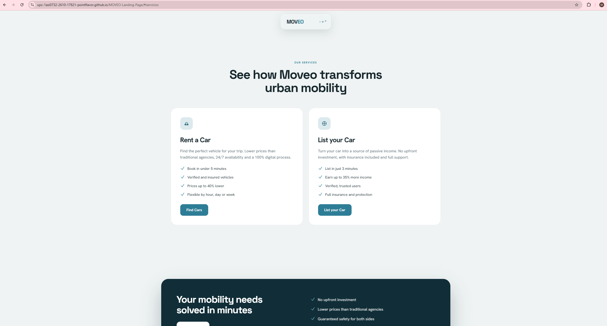<br><br>
  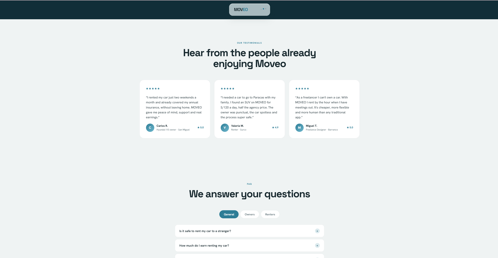
</p>

##### 8.3.3.3. Implemented To-Be Frontend-Web Application Evidence

Las mejoras experimentales se implementaron sobre la aplicación web (Vue 3 / Vite, estructura por bounded contexts en `src/app/`) y se desplegaron mediante el pipeline en Vercel. A continuación se presentan las evidencias por cada historia de usuario, indicando la ruta y el componente involucrado.

**URL de Despliegue (Frontend):** https://moveo-frontend.vercel.app

**HU33 – Botón "Reservar" fijo durante el scroll**
Ruta: `/rental/vehicles/:id` · Componentes: `vehicle-detail-page.vue`, `vehicle-detail-content.vue`
<p align="center">
  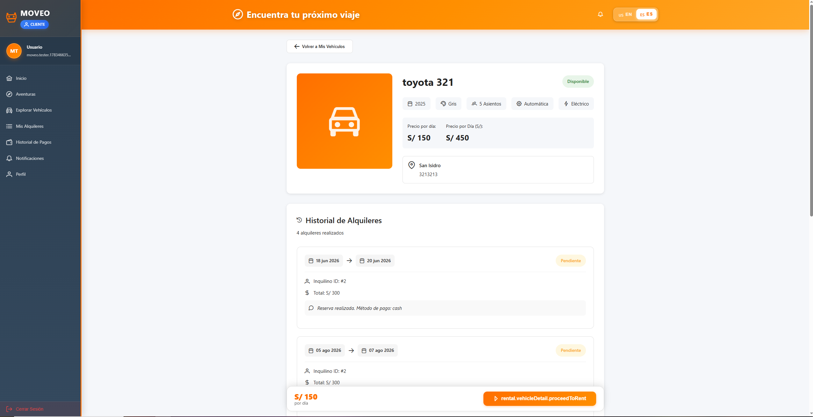<br><br>
</p>

**HU34 – Acción visible en las cards de vehículos**
Ruta: `/rental/browse` · Componentes: `vehicle-item.vue` (card) dentro de `vehicle-list.vue`
<p align="center">
  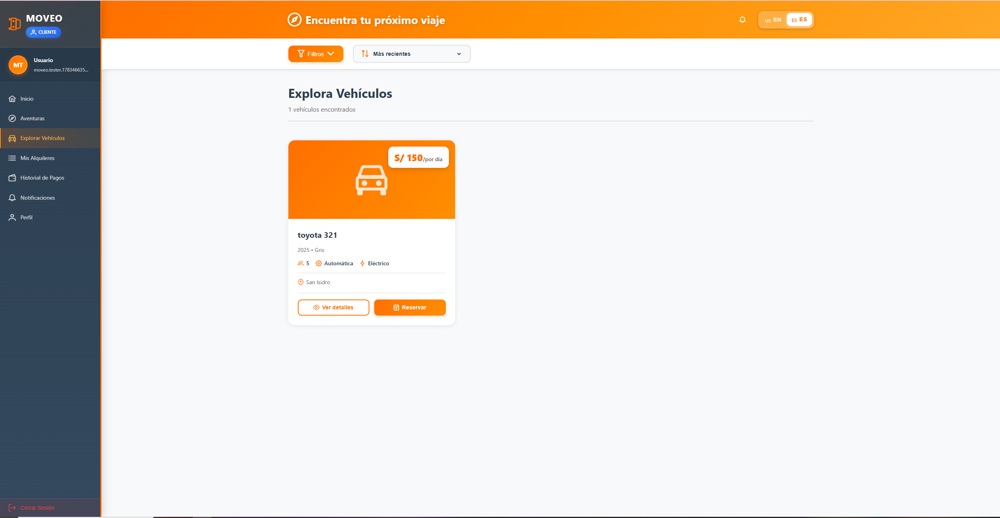<br><br>
</p>

**HU35 – Resumen de condiciones antes de cancelar**
Ruta: `/rental/my-rentals` → `/rental/details/:id` · Componentes: `my-rentals-page.vue`, `rental-details-page.vue`
<p align="center">
  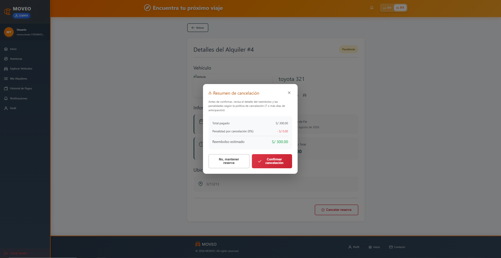<br><br>
</p>

**HU36 – Confirmación inmediata tras cancelar**
Ruta: `/rental/details/:id` (+ `/notifications`) · Store: `rental.store.js`
<p align="center">
  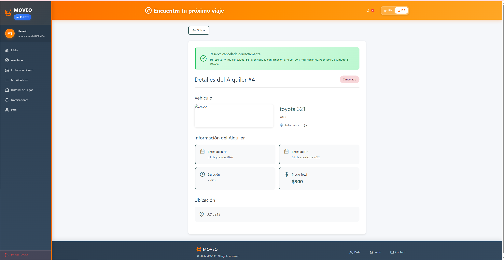<br><br>
</p>

**HU37 – Número de seguimiento al crear un ticket**
Ruta: `/support/tickets` → `/support/tickets/:id` · Componentes: `support-ticket-form.vue`, `support-ticket-detail.vue`
<p align="center">
  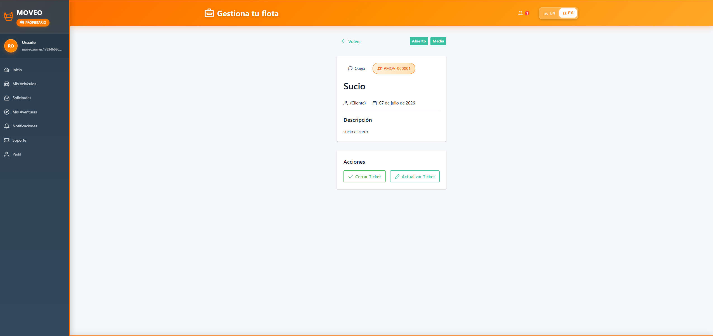<br><br>
</p>

**HU38 – Categoría predefinida al reportar una incidencia**
Ruta: `/support/tickets` · Componente: `support-ticket-form.vue` (campo <code>Category</code>: technical, billing, general, rental_issue, damage)
<p align="center">
  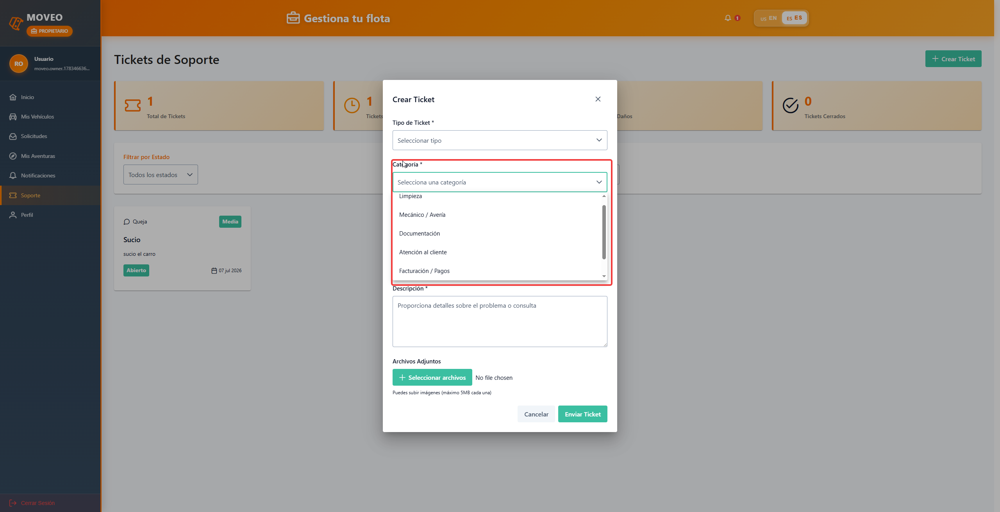<br><br>
</p>

**HU39 – Descripciones accesibles en imágenes de vehículos**
Ruta: `/rental/browse` y `/rental/vehicles/:id` · Componentes: `vehicle-item.vue`, `vehicle-detail-content.vue`
<p align="center">
  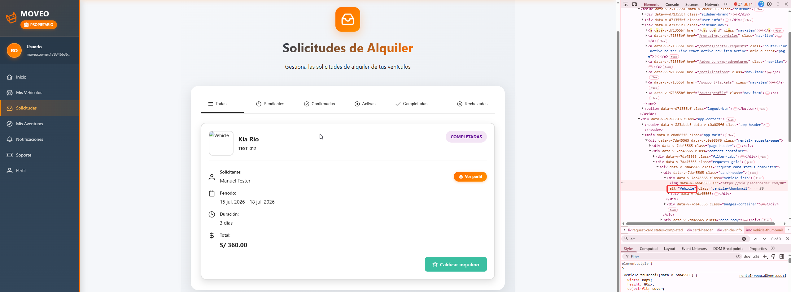<br><br>
</p>


##### 8.3.3.4. Implemented To-Be Native-Mobile Application Evidence

Para la fase de experimentación, el equipo priorizó una estrategia **mobile-first mediante web responsive (PWA)** en lugar de una aplicación nativa independiente. Esta decisión responde a los hallazgos de las entrevistas del producto As-Is, donde los usuarios —especialmente los propietarios— gestionan su actividad casi por completo desde el celular y valoran no instalar aplicaciones adicionales. De este modo, las mejoras experimentales (botón fijo de reservar, acción visible en cards, resumen de cancelación, seguimiento de tickets, etc.) se validaron directamente en dispositivos móviles a través del navegador, sobre el mismo despliegue del Frontend.

<p align="center">
  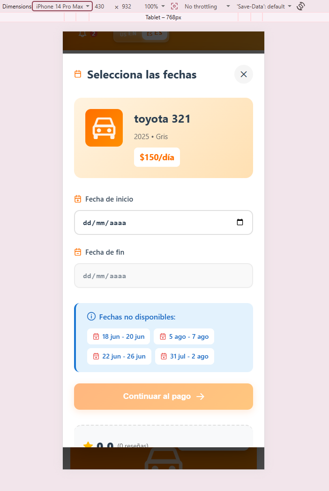<br><br>
  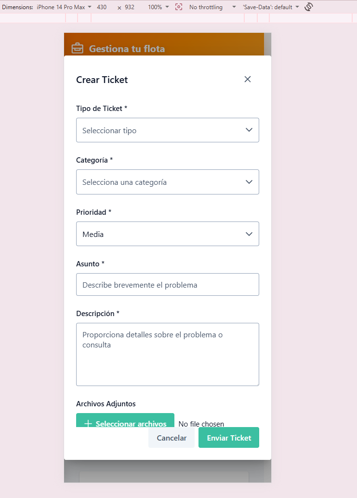<br><br>
</p>

##### 8.3.3.5. Implemented To-Be RESTful API and/or Serverless Backend Evidence

Las mejoras se apoyan en la RESTful API (C# / .NET Core, arquitectura DDD por bounded contexts) desplegada en Railway, con documentación en Swagger. Los experimentos puramente de frontend (HU33, HU34, HU39) no requirieron cambios en el backend, mientras que las mejoras de cancelación y soporte se apoyan en los endpoints y campos ya existentes de los controllers `RentalController` y `SupportTicketsController`.

**URL de Documentación (Swagger API):** [https://moveo-backend-production.up.railway.app/swagger/index.html](https://moveo-backend-production.up.railway.app/swagger/index.html)

Principales endpoints y campos usados para la experimentación:

| Bounded Context | Método | Endpoint | Historia | Descripción |
|---|---|---|---|---|
| Rental | GET | `/api/v1/rentals/{id}` | HU35 | Provee los datos de la reserva (fechas, monto, estado) con los que el frontend calcula el resumen de penalidades y reembolso antes de cancelar. |
| Rental | PATCH | `/api/v1/rentals/{id}` | HU36 | Cambia el estado de la reserva a cancelada; dispara la notificación en pantalla y el correo de confirmación. |
| Support | POST | `/api/v1/support-tickets` | HU37 · HU38 | Crea el ticket con el campo `Category` (technical, billing, general, rental_issue, damage) y devuelve su `Id` (número de seguimiento) y `Status` inicial "open". |
| Support | GET | `/api/v1/support-tickets/{id}` | HU37 | Devuelve el ticket con su número de seguimiento y estado actualizado para el historial del usuario. |

A continuación se presentan las evidencias de la ejecución y prueba de los endpoints:

<p align="center">
  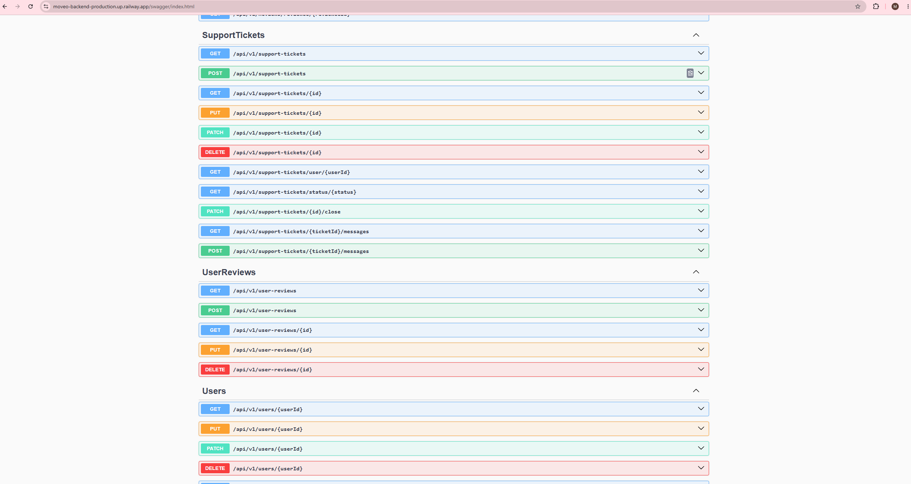<br><br>
  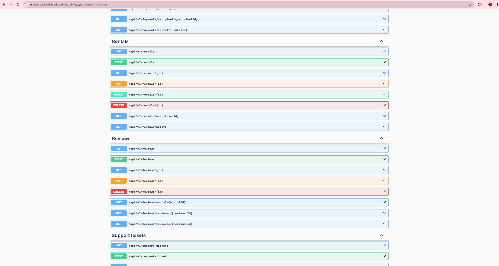
  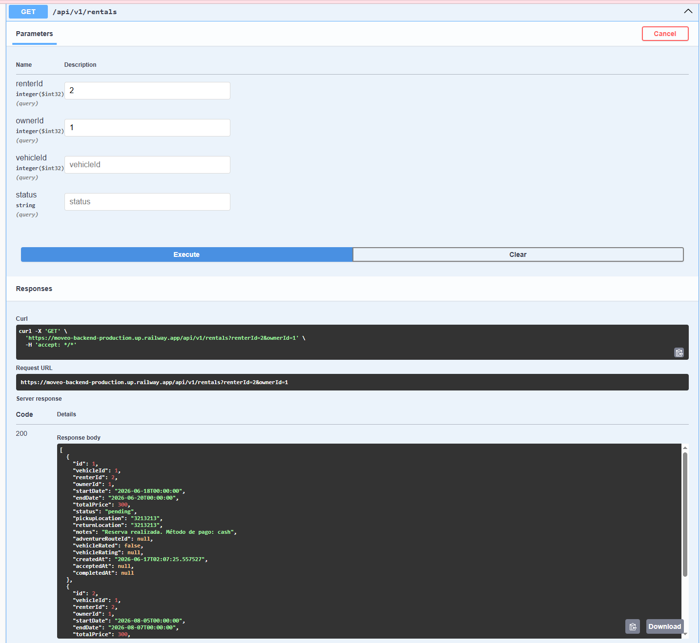
</p>


##### 8.3.3.6. Team Collaboration Insights

Durante el Sprint 4 de experimentación, el equipo mantuvo el enfoque colaborativo y ágil de los sprints anteriores. Las historias se distribuyeron equitativamente, asegurando que cada integrante liderara al menos un experimento de extremo a extremo (frontend, backend y validación). Se continuó utilizando GitHub con la estrategia GitFlow y revisiones de código (Pull Requests) antes de integrar a la rama principal, aprovechando el pipeline de CI/CD para desplegar cada mejora de forma incremental y medir su impacto.

| Integrante | Historias lideradas |
|---|---|
| Goñe Araccata, Esther Abigail | HU34 (Acción visible en cards) |
| Hancco Poma, Keyner Iván | HU39 (Accesibilidad en imágenes), validación de TS05 |
| Santiago Peña, Andreow Jomark | HU37 (Seguimiento de tickets), HU38 (Categorías de tickets) |
| Sulca Silva, Melisa Geraldine | HU35 (Resumen de cancelación), HU36 (Confirmación de cancelación) |
| Tumi Oliden, Manuel Ignacio | HU33 (Botón fijo de reservar), TS05 (Instrumentación de analítica) |

A continuación, se presentan las capturas de los analíticos de colaboración y el registro de commits extraídos de GitHub para el Sprint de experimentación:

<p align="center">
  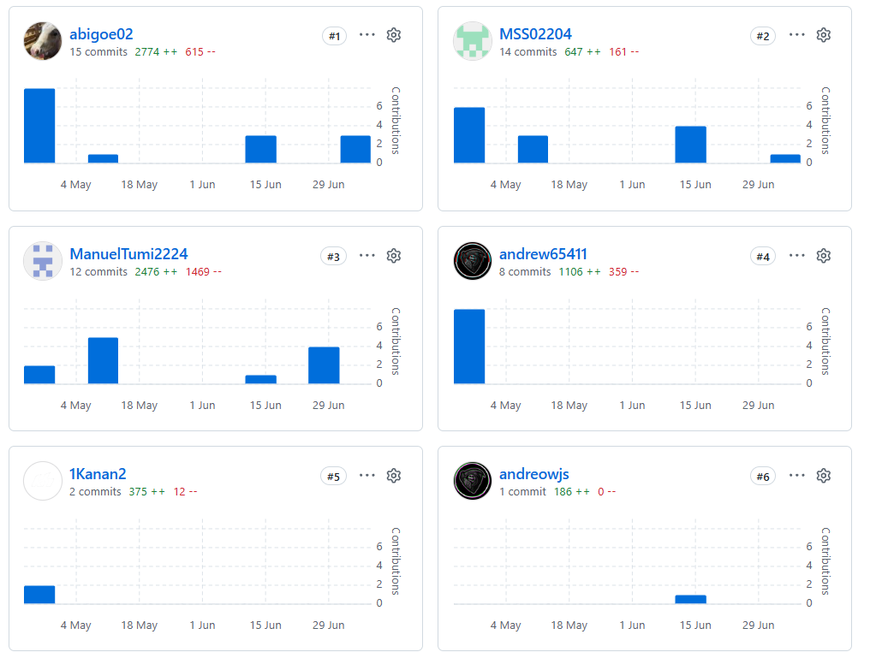<br><br>
</p>

#### 8.3.4. To-Be Validation Interviews

Para validar las mejoras experimentales, se realizaron entrevistas con usuarios de los dos segmentos objetivo de Moveo: **propietarios** e **inquilinos** de vehículos. El objetivo fue evaluar la claridad, utilidad y valor percibido de cada mejora de UX, usabilidad y accesibilidad, y decidir cuáles mantener, ajustar o descartar.

##### 8.3.4.1. Diseño de Entrevistas

Se diseñó un guion de preguntas orientadas a los experimentos implementados (HU33–HU39):

1. Al revisar el detalle de un vehículo, ¿te resultó más fácil reservar al mantener el botón "Reservar" siempre visible durante el scroll?
2. En la lista de vehículos, ¿el botón visible de "Ver detalles" / "Reservar" en cada card te ayudó a saber cómo continuar?
3. Antes de cancelar una reserva, ¿el resumen de penalidades y reembolso te dio la información suficiente para decidir con seguridad?
4. Después de cancelar una reserva, ¿la notificación en pantalla y el correo de confirmación te dieron la certeza de que la acción se procesó correctamente?
5. Al crear un ticket de soporte, ¿el número de seguimiento y el estado inicial te generaron mayor confianza en el soporte de Moveo?
6. ¿Las categorías predefinidas en el formulario de tickets te facilitaron reportar tu incidencia sin describirla desde cero?
7. Si utilizas lector de pantalla o revisas la accesibilidad, ¿las descripciones de las imágenes de vehículos te resultaron claras y útiles?
8. En general, ¿la experiencia te pareció más clara y confiable con estas mejoras?
9. ¿Qué mejora te resultó más valiosa y por qué?
10. ¿Qué otra mejora de usabilidad o accesibilidad te gustaría ver en Moveo?

##### 8.3.4.2. Registro de Entrevistas

**Video completo de todas las entrevistas:**  
[https://acortar.link/FPs37x](https://acortar.link/FPs37x)

**Segmento 1: Propietarios**

**Entrevistado 1: Alisa Goicochea**

- **Edad:** 22 años  
- **Ocupación**: Estudiante de Marketing Digital \+ Alquiladora de autos  
- **Distrito**: Miraflores  
- **Dispositivos utilizados:** Laptop (MacBook Air), navegador Chrome  
- **Instante en el que inicia:** 0:00  
- **Duración de la entrevista:** 2:42 min

**Resumen:**
Alisa comenzó en el Landing Page y destacó la claridad del mensaje principal: "Alquila tu auto fácil y seguro". Hizo clic en "Regístrate" sin dudar. Valoró positivamente el formulario de registro y publicación, completando ambos flujos en menos de 5 minutos. Evaluó la apertura de un ticket como "clara y útil", especialmente al poder adjuntar fotos del daño. No intentó cancelar una reserva (no aplica a su rol), pero expresó que debería ser posible hacerlo sin penalidad si es con anticipación.


**Entrevistado 2: Mathías Peña**

- **Edad:** 24 años  
- **Ocupación:** Estudiante de Administración (UNI) \+ Emprendedor de alquiler de autos (3 vehículos)  
- **Distrito:** Surco  
- **Dispositivos utilizados:** Laptop (MacBook Pro), navegador Safari  
- **Instante en el que inicia:** 2:43  
- **Fin de la entrevista:** 5:31 min

**Resumen:**
Mathías navegó desde el Landing Page, interesándose por la sección "¿Cómo funciona?". Publicó un vehículo rápidamente. Al probar la apertura de un ticket, sugirió permitir adjuntar videos cortos además de fotos. Consideró que el sistema de cancelación debería incluir un resumen de condiciones (¿se devuelve el depósito?) antes de confirmar.


**Entrevistado 3: Mauricio Salas**

- **Edad:** 22 años  
- **Ocupación:** Estudiante de Administración (UPC) \+ Freelancer en redes sociales \+ Alquiler de auto  
- **Distrito:** Miraflores  
- **Dispositivos utilizados:** Laptop (Lenovo), navegador Chrome  
- **Instante en el que inicia:** 7:15  
- **Duración de la entrevista:** 3:37 min

**Resumen:**
Mauricio completó el flujo de publicación y apertura de ticket. Valoró que el ticket quede vinculado a la reserva específica. Sugirió que al cancelar una reserva, el sistema muestre claramente si hay penalidades o devolución parcial de fondos.


**Segmento 2: Inquilinos**

**Entrevistado 4: Claudia Sifuentes**

- **Edad:** 21 años  
- **Ocupación:** Estudiante de Psicología \+ Trabajo media jornada en cafetería  
- **Distrito:** San Juan de Lurigancho  
- **Dispositivos utilizados:** Laptop (HP Pavilion), navegador Chrome  
- **Instante en el que inicia:** 10:53  
- **Duración de la entrevista:** 3:42 min

**Resumen:**
Claudia reservó un auto desde el Landing Page. Posteriormente, canceló una reserva simulada y consideró el proceso "simple y transparente". También abrió un ticket por "asiento roto" y valoró que el formulario sea claro. Criticó que no haya un chat integrado para aclarar dudas antes de abrir un ticket.


**Entrevistado 5: Jackelin Peña Pariona**

- **Edad:** 38 años  
- **Ocupación:** Ingenieria  
- **Distrito:** Lima (no especificado)  
- **Dispositivos utilizados:** Laptop (Dell), navegador Chrome  
- **Instante en el que inicia:** 13:35  
- **Duración de la entrevista:** 9:28 min

**Resumen:**
Gabriel completó la reserva y luego la canceló. Notó que el sistema no muestra un mensaje de confirmación de cancelación por correo. Al abrir un ticket, sugirió incluir categorías predefinidas de incidencias (mecánicas, limpieza, documentación) para agilizar el reporte.


**Entrevistado 6: Angie Leyva**

- **Edad:** 21 años  
- **Ocupación**: Estudiante de Comunicación \+ Community Manager freelance  
- **Distrito:** San Miguel  
- **Dispositivos utilizados:** Laptop (MacBook Air), navegador Safari  
- **Instante en el que inicia:** 22:07  
- **Duración de la entrevista:** 4:40 min

**Resumen:**
Angie navegó desde el Landing Page y reservó un auto. Al cancelar, solicitó que el sistema muestre un resumen del reembolso esperado. Al abrir un ticket, criticó que no haya un número de seguimiento visible en la interfaz ("¿cómo sé que lo recibieron?"). Recomendó añadir un sistema de notificaciones que confirme la recepción del ticket y cualquier actualización posterior. 


## 8.4. Experimentation

### 8.4.1. Analysis and Interpretation of Results

Una vez desplegadas las mejoras del Sprint 4, el equipo reformuló las preguntas de las entrevistas iniciales y las estructuró en una encuesta orientada a captar percepciones claras sobre la experiencia de uso. Este enfoque permitió identificar con mayor precisión las preferencias y necesidades de los participantes respecto a las funcionalidades trabajadas en la plataforma. La encuesta se aplicó a los dos segmentos objetivo de Moveo, es decir, a los propietarios que publican su vehículo y a los inquilinos que lo alquilan.

**Preguntas formuladas**

Para evaluar la experiencia de los usuarios con el producto se aplicaron las siguientes afirmaciones, valoradas en una escala de 1 a 5, donde 1 significa "totalmente en desacuerdo" y 5 "totalmente de acuerdo":

1. Mantener el botón Reservar visible durante el scroll me facilitó iniciar la reserva.
2. El botón visible dentro de cada card me ayudó a saber cómo continuar hacia el detalle del vehículo.
3. El resumen de penalidades y reembolso me dio información suficiente para decidir antes de cancelar.
4. La notificación en pantalla y el correo me confirmaron con certeza que la cancelación se procesó.
5. El número de seguimiento y el estado inicial del ticket aumentaron mi confianza en el soporte.
6. Las categorías predefinidas me facilitaron reportar la incidencia sin describirla desde cero.
7. Las descripciones de las imágenes de vehículos me resultaron claras y accesibles.

La encuesta se complementó con dos preguntas abiertas sobre la mejora más valiosa y sobre otras mejoras deseadas. Estas preguntas se presentaron a una muestra de 10 participantes, quienes respondieron a partir de su experiencia con las funcionalidades del producto. A continuación se explican los resultados obtenidos.

**Análisis de datos demográficos**

Distribución por segmento. El 60% de los participantes correspondió a inquilinos y el 40% a propietarios. Esta proporción asegura que la retroalimentación cubre los dos flujos críticos de la plataforma, el de quienes reservan y el de quienes publican un vehículo.

<p align="center">
  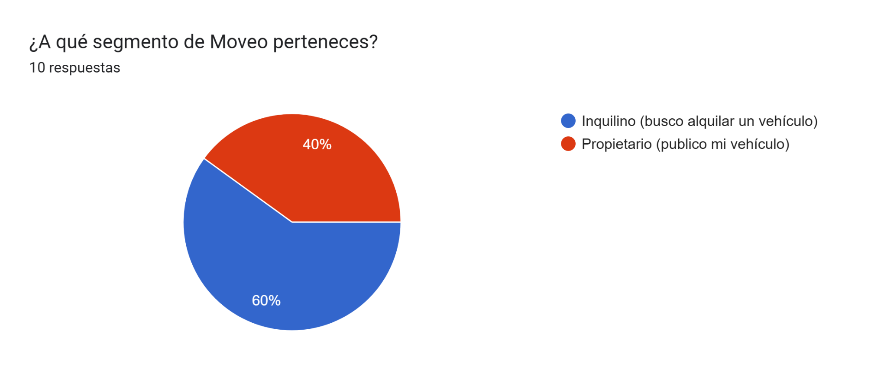
</p>

Distribución de edades. Las edades se repartieron de forma equilibrada entre los rangos de 18 a 49 años, con un 30% en el grupo de 26 a 33 años y otro 30% en el de 34 a 41 años. Esto indica que Moveo resulta atractivo para un público adulto joven y de mediana edad, lo cual orienta las prioridades de las funcionalidades a mejorar.

<p align="center">
  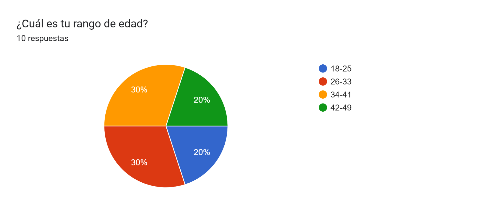
</p>

Frecuencia de uso. La mayoría de los participantes utiliza Moveo de manera recurrente. El 44.4% lo hace una vez por semana y el 33.3% varias veces por semana, mientras que solo el 22.2% lo utiliza un par de veces al mes. Este nivel de uso sugiere un compromiso constante y confirma que las valoraciones provienen de personas familiarizadas con los flujos evaluados.

<p align="center">
  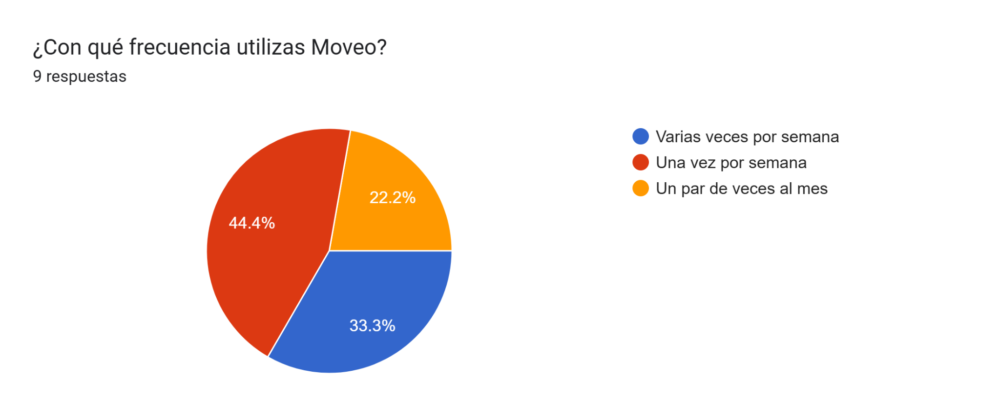
</p>

**Evaluación de las mejoras**

Botón Reservar fijo durante el scroll. El 90% de los participantes se mostró de acuerdo o muy de acuerdo con que mantener el botón visible facilitó iniciar la reserva, y solo una persona se mantuvo neutral. Este resultado confirma que la acción principal deja de perderse cuando el usuario revisa las fotos del vehículo, lo que favorece el inicio del flujo de alquiler.

<p align="center">
  
</p>

Acción visible en las cards de vehículos. La totalidad de los participantes valoró positivamente el botón dentro de cada card, con un 60% de acuerdo y un 40% muy de acuerdo. Los usuarios dejaron de dudar sobre cómo avanzar hacia el detalle del vehículo, lo que la convierte en la mejora con mayor aceptación.

<p align="center">
  
</p>

Resumen de condiciones antes de cancelar. El 77.8% de los participantes consideró que el resumen de penalidades y reembolso le dio información suficiente para decidir, mientras que el 22.2% se mantuvo neutral. Algunos usuarios sugirieron mostrar además la fecha límite de reembolso, un ajuste que se incorpora al backlog para reforzar la claridad de esta pantalla.

<p align="center">
  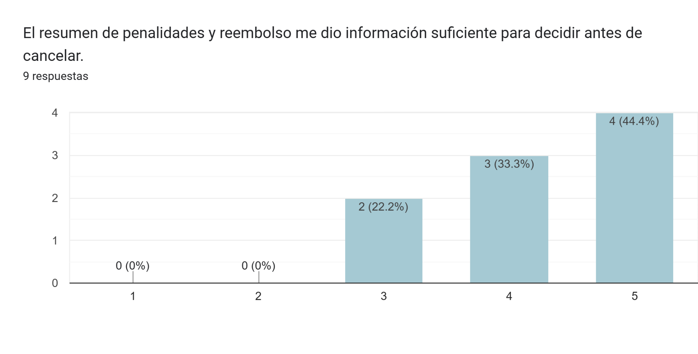
</p>

Confirmación inmediata tras cancelar. El 90% de los participantes estuvo de acuerdo o muy de acuerdo con que la notificación en pantalla y el correo confirmaron el procesamiento de la cancelación. La combinación de ambos avisos aumenta la percepción de control del usuario sobre el estado de su reserva.

<p align="center">
  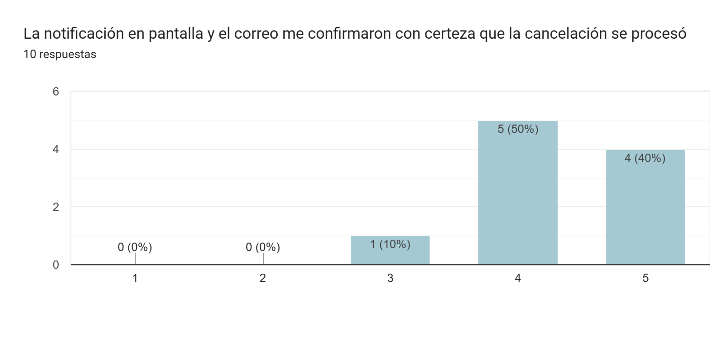
</p>

Número de seguimiento del ticket. La totalidad de los participantes valoró positivamente el código de seguimiento y el estado inicial del ticket, con un 60% de acuerdo y un 40% muy de acuerdo. Esta mejora se asoció de forma recurrente con la confianza en el soporte de Moveo.

<p align="center">
  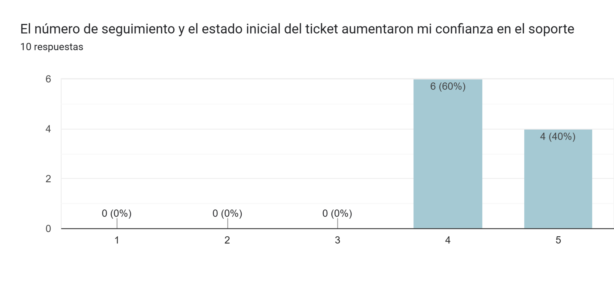
</p>

Categorías predefinidas en el formulario de tickets. El 90% de los participantes consideró que las categorías predefinidas facilitaron reportar la incidencia sin describirla desde cero, y solo una persona se mantuvo neutral. Este resultado confirma que las categorías reducen el esfuerzo de redacción al momento de crear un ticket.

<p align="center">
  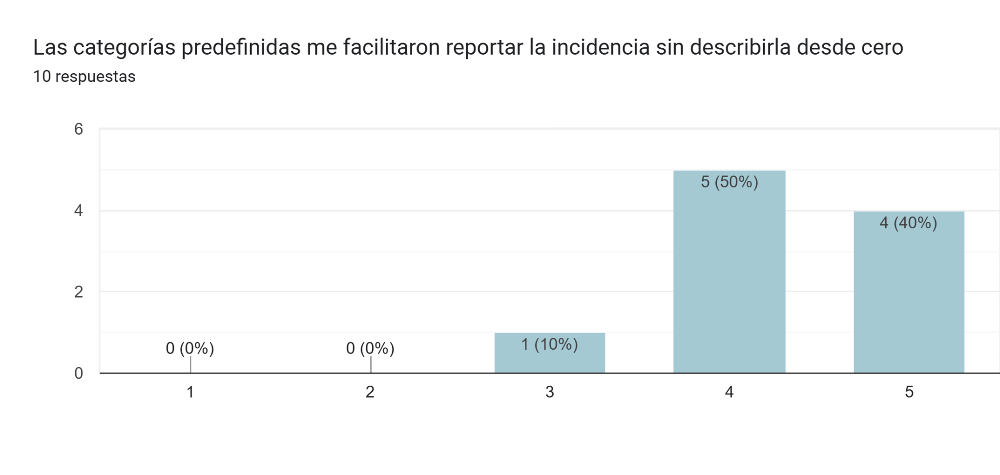
</p>

Accesibilidad en las imágenes de vehículos. El 80% de los participantes consideró claras y accesibles las descripciones de las imágenes, mientras que el 20% se mantuvo neutral. La aceptación fue algo más moderada porque varios usuarios pidieron extender las descripciones a todas las imágenes de la plataforma y no solo a las principales.

<p align="center">
  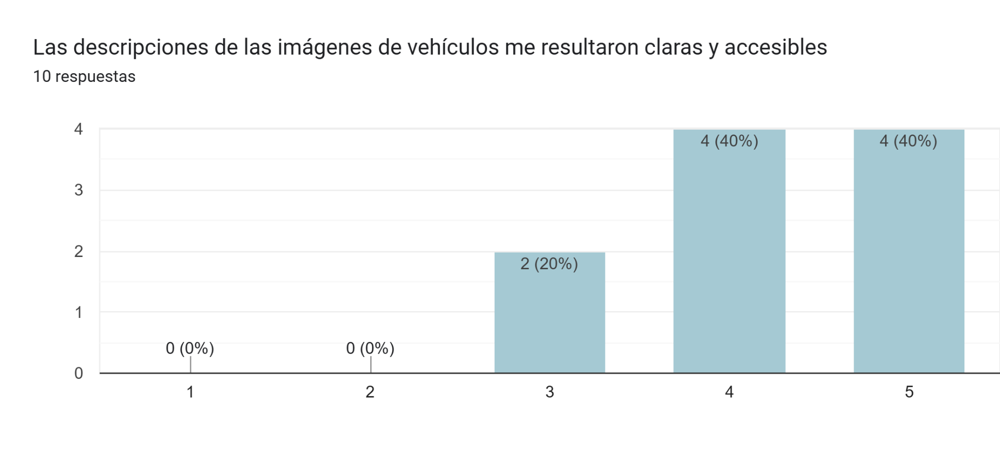
</p>

**Recomendaciones de los usuarios**

Entre las mejoras que los usuarios consideraron más valiosas destacaron la acción visible en las cards, el botón fijo de reservar y el número de seguimiento del ticket, tres funcionalidades ligadas directamente a los flujos de reserva y soporte. En cuanto a nuevas mejoras, los participantes propusieron poder guardar vehículos como favoritos, filtrar por tipo de caja, mostrar la fecha límite de reembolso antes de cancelar, incorporar un modo oscuro, ampliar las descripciones accesibles a todas las imágenes y habilitar notificaciones sobre el estado del ticket. Estas ideas alimentan el backlog de las siguientes iteraciones.

<p align="center">
  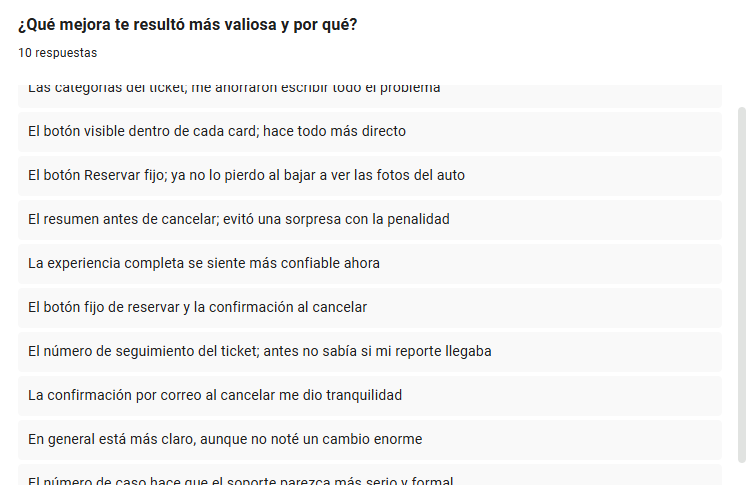<br><br>
  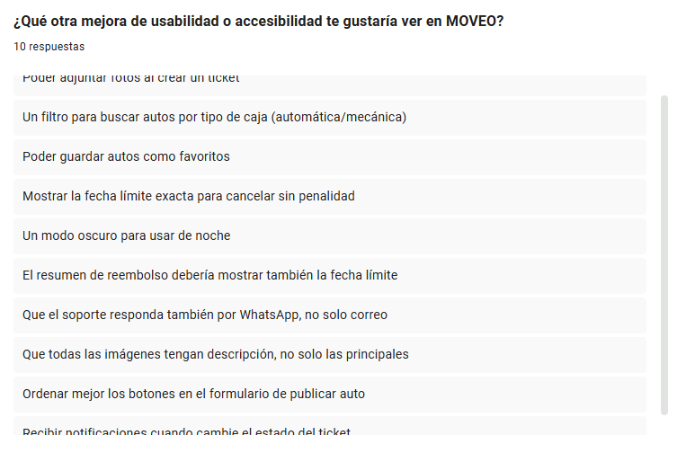
</p>

**Conclusión**

Los resultados de la encuesta muestran un alto nivel de satisfacción con las mejoras implementadas. Todas las funcionalidades superaron el umbral de aceptación definido por el equipo, por lo que se decide conservarlas en producción. Las observaciones recogidas señalan áreas concretas de optimización, como la fecha límite de reembolso y la accesibilidad total de las imágenes, que servirán como base para las próximas mejoras del producto y para la re-priorización del backlog.

### 8.4.2. Re-Scored and Re-Prioritized Question Backlog

A partir de la evidencia recogida, el equipo volvió a revisar el Question Backlog original y ajustó su orden de prioridad. Las preguntas cuyos experimentos demostraron mayor impacto en los flujos de reserva y soporte ascienden en prioridad, mientras que las mejoras aún no construidas o de alcance más contenido descienden. La escala Fibonacci (1, 2, 3, 5, 8) expresa esa urgencia relativa, donde el valor 1 corresponde a la máxima prioridad para la siguiente iteración:

| Prioridad (1,2,3,5,8) | Pregunta re-evaluada | Justificación del re-score |
|:---:|---|---|
| 1 | ¿En qué medida mantener visible el botón de "Reservar" durante el scroll aumenta el inicio y finalización del flujo de alquiler? | Es el flujo de conversión central; obtuvo alta aceptación y afecta el ingreso del negocio. |
| 2 | ¿Cuánto aumenta el ingreso al detalle del vehículo si las cards incluyen una acción visible? | La mejor valoración de todas; refuerza el inicio del embudo de reserva. |
| 2 | ¿Cuánto aumenta la confianza del usuario al mostrar un número de seguimiento y estado inicial del ticket? | Empatada en valoración; la confianza en soporte es un diferenciador clave de Moveo. |
| 3 | ¿En qué medida mostrar penalidades, condiciones y reembolso estimado antes de cancelar reduce dudas del usuario? | Validada, con un ajuste pendiente (mostrar fecha límite de reembolso). |
| 3 | ¿Qué impacto tiene la notificación en pantalla y el correo de confirmación en la percepción de control tras cancelar? | Respaldada; consolida el cierre seguro del flujo de cancelación. |
| 3 | ¿En qué medida las categorías predefinidas reducen el tiempo y esfuerzo para crear un ticket? | Validada; reduce fricción de entrada al soporte. |
| 5 | ¿Cuánto mejora la experiencia accesible si todas las imágenes de autos tuvieran atributos alt descriptivos? | Bien recibida, pero los usuarios piden ampliar el alcance a toda la plataforma. |
| 8 | ¿Qué impacto tendría reforzar los botones de avance y guardado en el formulario de publicación de vehículos? | Experimento aún no implementado; candidato principal del próximo sprint. |

## 8.5. Continuous Learning

### 8.5.1. Shareback Session Artifacts: Learning Workflow

**Figma (Prototipo):** El prototipo interactivo desarrollado en Figma refleja las interfaces y soluciones propuestas para Moveo, diseñadas con base en las necesidades y expectativas de los usuarios. Este artefacto muestra cómo el equipo iteró y ajustó los elementos visuales y funcionales durante el proceso de diseño, desde el inicio de sesión y la exploración de vehículos hasta el detalle con el botón de reserva y la gestión de alquileres.

Enlace Figma: https://www.figma.com/design/JCgS0FsRQH1cDtJ1FkeWuZ/MOVEO?node-id=0-1&t=4ws5TAukXrjL9hsQ-1

<p align="center">
  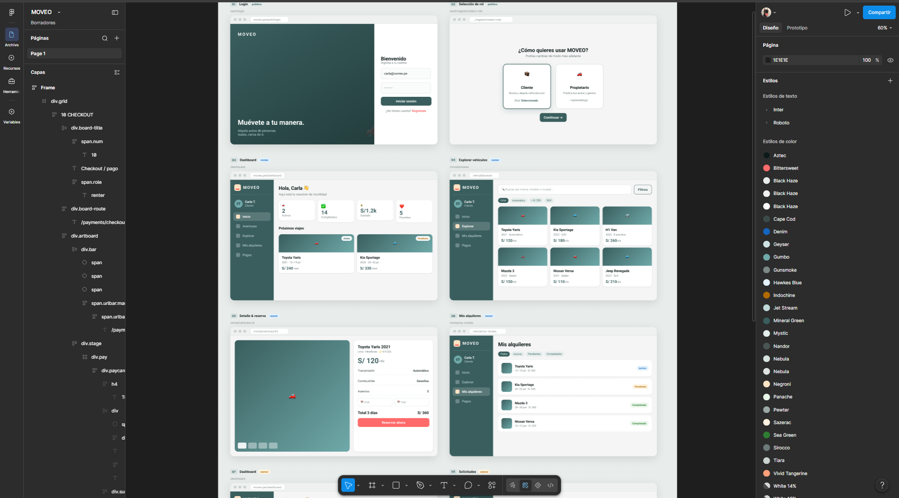
</p>

**Encuesta de Google Forms:** Se utilizó una encuesta creada en Google Forms para recopilar el feedback de los usuarios y validar las mejoras implementadas durante la experimentación. Esta encuesta permitió evaluar la experiencia del usuario y recopilar los datos que respaldan las decisiones tomadas sobre cada mejora de la aplicación.

Enlace encuesta: https://docs.google.com/forms/d/e/1FAIpQLSflrC7ERxr2JTRtT2nr2ZGu-e2Lrd9_4WItOXWjiSh1AI-6bg/viewform

<p align="center">
  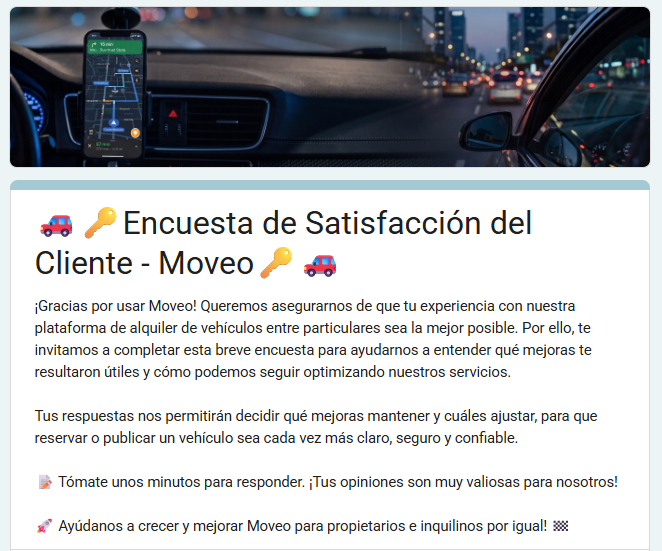
</p>

# Conclusiones y recomendaciones

- Moveo  propone una solución digital para conectar propietarios de vehículos con personas que necesitan alquilar uno de forma temporal. Además, responde a una necesidad real, la de ofrecer una alternativa más flexible, segura y accesible frente al alquiler tradicional de autos. El modelo de negocio es colaborativo, ya que no depende de una flota propia, sino de vehículos registrados por los mismos usuarios.

- El análisis del proyecto permitió identificar que los usuarios valoran principalmente la seguridad, confianza, rapidez, transparencia y facilidad de uso. Cabe señalar que las funcionalidades más importantes se enfocan en registro de usuarios, publicación de vehículos, búsqueda, reservas, pagos, reseñas y verificación de identidad.

- El uso de Vue.js para frontend y .NET con C# para backend permite construir una aplicación ordenada, mantenible y escalable. Se realizaron pruebas unitarias con NUnit, permitiendo validar la lógica principal del backend y asegurar que los métodos y reglas de negocio funcionen correctamente.

- También se aplicaron pruebas de comportamiento usando Gherkin, definiendo escenarios bajo la estructura Given, When, Then para validar los flujos esperados del sistema. También, se realizaron pruebas end-to-end con Selenium, verificando que los principales flujos de la aplicación web funcionen correctamente desde la perspectiva del usuario final.

- El proceso de testeo permitió identificar errores, validar funcionalidades críticas y mejorar la confiabilidad general de la aplicación.

- La implementación de GitFlow acoplada a pipelines automatizados en GitHub Actions, Vercel y Railway demostró ser altamente eficiente para mitigar conflictos de integración de código. El enfoque de despliegue basado en commits redujo a cero la intervención manual en los despliegues de producción, manteniendo la consistencia de los entornos y aislando de forma segura las variables técnicas.   
    
- El proceso de auditoría heurística recibida por SoftFocus y las entrevistas de validación cualitativa permitieron identificar brechas críticas de correspondencia visual, consistencia lingüística y visibilidad en los flujos de soporte y cancelaciones de Moveo. Este ejercicio cualitativo demostró que exponer errores HTTP crudos (como el error 400\) o descuidar el contraste visual daña directamente la confianza del cliente.  
    
- El diseño experimental estructurado implementado en esta entrega permitió abandonar la ideación empírica reactiva en favor de una metodología rigurosa basada en el testeo de hipótesis falsificables. El uso de métricas de dominio específicas previene el sesgo de las métricas de vanidad y justifica la inversión de tiempo de desarrollo con base en el retorno de inversión y la retención real de inquilinos.  
    
- Se aconseja complementar el monitoreo sintético del frontend (Vercel Analytics) mediante la inyección de agentes de observabilidad de infraestructura (como Prometheus o Datadog) en el backend alojado en Railway. Definir umbrales estrictos de latencia de red y errores de conexión a la base de datos MySQL permitirá recibir notificaciones proactivas antes de que afecten la experiencia transaccional de los usuarios. 

# Bibliografía

* Gothelf, J. (2022, 29 de agosto). FAQ: WHAT DOES A COMPLETE LEAN UX CANVAS LOOK LIKE?. jeff Gothelf. Recuperado el 24 de abril del 2024 de URL https://jeffgothelf.com/blog/faq-what-does-a-complete-lean-ux-canvas-look-like/

* Gothelf, J. Seiden, J. (2021). Lean UX, 3rd Edition. O'Reilly Media, inc. https://www.oreilly.com/library/view/lean-ux-3rd/9781098116293/.

* Buenas prácticas para el desarrollo de grandes proyectos con Vue.js. (s/f). Solucionex. Recuperado el 29 de abril de 2024. https://www.solucionex.com/blog/buenas-practicas-para-el-desarrollo-de-grandes-proyectos-con-vuejs

* Eseme, S. (2021, agosto 12). 10 cosas que debes saber sobre Vue.js Frontend Framework. Kinsta®; Kinsta. https://kinsta.com/es/blog/vue-js/

* de Javier, V. M. C. (s/f). DDD y arquitectura Onion, todo lo que necesitas saber. Paradigmadigital.com. Recuperado el 29 de abril de 2024 de https://www.paradigmadigital.com/techbiz/domain-driven-design-y-arquitectura-onion/


* Arquitectura DDD(Domain Driven Design). (2021, junio 21). Sergio Tapia. https://sergiotapia.net/arquitectura-ddddomain-driven-design/


# Anexos

## Enlace Organización: https://github.com/UPC-1ASI0732-2610-17821-PointFlavor


## Repositorios Github

- **Enlace Repositorio Project Report:**  https://github.com/UPC-1ASI0732-2610-17821-PointFlavor/MOVEO-Report/tree/develop <br>

- **Enlace Repositorio Landing Page:** https://github.com/UPC-1ASI0732-2610-17821-PointFlavor/MOVEO-Landing-Page <br>

- **Enlace Repositorio Frontend Web Application (Vue + Vite):** https://github.com/UPC-1ASI0732-2610-17821-PointFlavor/MOVEO-Frontend <br>

- **Enlace Repositorio Backend Web Service (RESTful API - .NET):** https://github.com/UPC-1ASI0732-2610-17821-PointFlavor/MOVEO-Backend <br>

- **URL de Despliegue (Landing Page):** https://upc-1asi0732-2610-17821-pointflavor.github.io/MOVEO-Landing-Page/ <br>

- **URL de Despliegue (Frontend Web Application):** https://moveo-frontend.vercel.app <br>

- **URL de Documentación (Swagger API):** https://moveo-backend-production.up.railway.app/swagger/index.html <br>

- Link del formulario segmento propietarios: https://forms.gle/uyVSkqSiuiKx1nb69 <br>

- Link del formulario segmento Inquilinos: https://forms.gle/kz3BdxPoZHKNgqUg9 <br>

- Link del To-Be Scenario Mapping: https://miro.com/app/board/uXjVJHk66ZY=/?share_link_id=390494907497 <br>

- Link del diseño final en figma: https://www.figma.com/design/JCgS0FsRQH1cDtJ1FkeWuZ/MOVEO?node-id=0-1&t=4ws5TAukXrjL9hsQ-1 <br>

- Link del prototipo interactivo en figma: https://www.figma.com/proto/c6kJu6j0YZv51u6Ml2kypY/Moveo-Landing-Mockup?node-id=1-2&p=f&t=oOjM7PCRDBGHla3t-1&scaling=scale-down&content-scaling=fixed&page-id=0%3A1&starting-point-node-id=4006%3A1560 <br>


---

